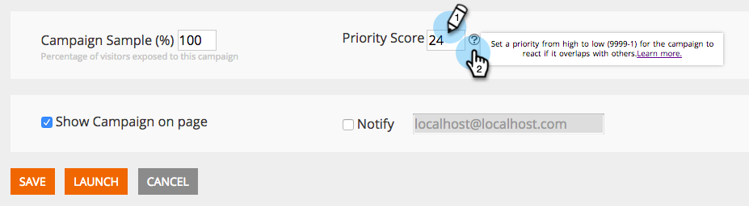
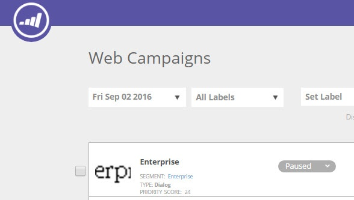

# Priorizar campanhas da web {#prioritizing-web-campaigns}

Priorize suas campanhas da Web quando duas ou mais campanhas se sobrepuserem, definindo uma Pontuação de prioridade.

>[!NOTE]
>
>**Campanhas sobrepostas**
>
>Uma sobreposição de campanha da Web ocorre quando:
>
>* Duas ou mais campanhas de Widgets e/ou diálogo reagem ao mesmo tempo na mesma página
>* Dois ou mais Em regiões com a mesma ID de zona reagem ao mesmo tempo na mesma página da Web
>
>Uma campanha Na zona e uma campanha (Widget ou Caixa de diálogo) podem reagir na mesma página.

1. Vá para **[!UICONTROL Campanhas da Web]**.

   

   >[!NOTE]
   >
   >Para facilitar a localização da campanha da Web desejada, use o [recurso de filtro](/help/marketo/product-docs/web-personalization/working-with-web-campaigns/filter-web-campaigns.md).

1. Na página Editar campanha, defina a [!UICONTROL Pontuação de prioridade] (9999 = Prioridade mais alta 1 = Prioridade mais baixa).

   

   >[!TIP]
   >
   >Recomendamos que você use a campanha [!UICONTROL Pontuação de prioridade] somente se houver uma possível sobreposição de campanha, com uma importância maior de uma das campanhas. Você não precisa definir uma prioridade para cada campanha.

1. Salvar ou iniciar a campanha.

1. Consulte a [!UICONTROL Pontuação de Prioridade] exibida na página [!UICONTROL Campanhas da Web].

