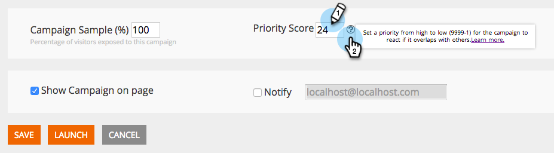

# Priorização de campanhas da Web {#prioritizing-web-campaigns}

Priorize suas campanhas da Web quando duas ou mais campanhas da Web se sobrepuserem, definindo uma Pontuação de prioridade.

>[!NOTE]
>
>**Sobreposição de campanhas**
>
>Uma sobreposição de campanha da Web ocorre quando:
>
>* Duas ou mais campanhas de widgets e/ou caixa de diálogo reagem ao mesmo tempo na mesma página
>* Duas ou mais Em regiões com a mesma id de zona reagem ao mesmo tempo na mesma página da Web
>
>Uma campanha Na zona e uma campanha (Widget ou caixa de diálogo) podem reagir na mesma página.

1. Acesse Campanhas da Web.

   

   >[!NOTE]
   >
   >Para facilitar a localização da campanha da Web desejada, use o [recurso de filtro](/help/marketo/product-docs/web-personalization/working-with-web-campaigns/filter-web-campaigns.md).

1. Na Página Editar Campanha, defina a Pontuação de Prioridade (9999 = Prioridade Mais Alta 1 = Prioridade Mais Baixa).

   

   >[!TIP]
   >
   >Recomendamos que você use a Pontuação de prioridade da campanha somente se houver uma sobreposição de campanha potencial, com uma importância maior de uma das campanhas. Você não precisa definir uma prioridade para cada campanha.

1. Salve ou inicie a campanha.

1. Consulte a Pontuação de prioridade exibida na página Campanhas da Web .

