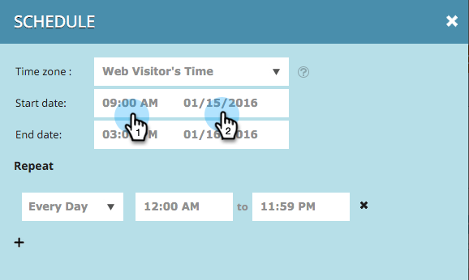

# Agendar uma campanha da web {#schedule-a-web-campaign}

Se você souber quando deseja que sua campanha da Web seja executada, é possível programá-la com antecedência. É fácil configurar datas de início e término, repetições e vários dias.

Você pode agendar a campanha da Web com base na hora do visitante da Web ou em um fuso horário selecionado.

>[!NOTE]
>
>**Exemplo**
>
>A programação de datas de início e término é ideal para um evento agendado, como um Webinar, que é executado por um período específico. As repetições são perfeitas para uma oferta especial que é executada a cada semana somente em um dia específico.

1. Vá para **[!UICONTROL Campanhas da Web]**.

   

   >[!NOTE]
   >
   >Para facilitar a localização da campanha desejada, use o [recurso de filtro](/help/marketo/product-docs/web-personalization/working-with-web-campaigns/filter-web-campaigns.md).

1. Abra o menu Status da campanha e selecione **[!UICONTROL Agendar]**.

   

1. Na caixa de diálogo Agendar recorrência, selecione o fuso horário da campanha

   

   >[!TIP]
   >
   >A configuração padrão executa campanhas no fuso horário do visitante da Web.

1. Selecione uma data e hora iniciais e uma data e hora finais.

   

   >[!NOTE]
   >
   >Você pode selecionar a data e a hora no menu suspenso e no calendário ou inseri-las manualmente. Os horários são em 12 horas AM/PM.

1. Por padrão, a campanha será executada todos os dias entre as datas de início e término. Se você quiser executar a campanha somente em dias ou horários específicos, use as configurações de **[!UICONTROL Repetir]**. Selecione o dia e a hora de início e término para exibir a campanha. Use o sinal de mais + para adicionar dias.

   

1. Clique em **[!UICONTROL Agendamento]**.

   

1. O status da campanha na página Campanhas muda para **[!UICONTROL Agendado]** e o ícone de relógio/calendário é exibido. Clique nesse ícone para editar o cronograma da campanha.

   

   >[!NOTE]
   >
   >O status da campanha permanece como **[!UICONTROL Agendada]** mesmo quando a campanha está em execução durante os horários agendados selecionados. Quando uma data de término agendada é ultrapassada, o status da campanha muda para **[!UICONTROL Paused]**.
