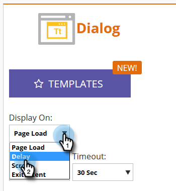

# Definir como a campanha da web será exibida {#set-how-your-web-campaign-displays}

Há vários métodos para utilizar quando/como sua campanha da Web é exibida.

## Carregar página {#page-load}

Selecionada por padrão, essa opção simplesmente exibe a campanha no carregamento da página.

## Atraso {#delay}

Especifique um atraso (em total de segundos) para que as campanhas da Web reajam no site.

1. Clique no menu suspenso **[!UICONTROL Exibir em]** e selecione **[!UICONTROL Atraso]**.

   

1. Clique no menu suspenso **[!UICONTROL Aguardar]** e selecione o tempo desejado.

   

## Rolar {#scroll}

1. Clique no menu suspenso **[!UICONTROL Exibir em]** e selecione **[!UICONTROL Rolar]**.

   

1. Clique na lista suspensa **[!UICONTROL Quando]** e selecione quando deseja que sua campanha da Web seja exibida.

   

<table>
 <tbody>
  <tr>
   <td><strong>[!UICONTROL Pasta abaixo]</strong></td>
   <td>Exibe a campanha quando o visitante rola abaixo da dobra. A campanha desaparece quando o visitante rola de volta acima da dobra.</td>
  </tr>
  <tr>
   <td><strong>[!UICONTROL Porcentagem]</strong></td>
   <td>Exibe a campanha quando o visitante rola para a porcentagem predeterminada da página.</td>
  </tr>
  <tr>
   <td><strong>[!UICONTROL Pixel]</strong></td>
   <td>
Exibe a campanha quando o visitante rola para o pixel superior pré-designado na página.
</td>
  </tr>
 </tbody>
</table>

## Intenção de sair {#exit-intent}

A intenção de saída exibirá a campanha da Web ao sair do navegador com o cursor do mouse.

1. Clique no menu suspenso **[!UICONTROL Exibir em]** e selecione **[!UICONTROL Propósito de saída]**.

   

1. Aparece uma mensagem lembrando que a [!UICONTROL Intenção de saída] não é compatível com dispositivos móveis.

   

>[!TIP]
>
>Quer ver como seus efeitos escolhidos serão antecipados? Confira através de uma [Visualização do Web Campaign](/help/marketo/product-docs/web-personalization/working-with-web-campaigns/preview-and-test-a-web-campaign.md).
