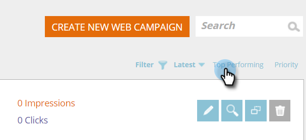

# Classifique as campanhas da Web pelo desempenho mais recente ou superior {#sort-web-campaigns-by-latest-or-top-performing}

Você pode classificar suas campanhas da Web de várias maneiras diferentes.

1. Vá para **[!UICONTROL Campanhas da Web]**.

   

1. Selecione um tipo de classificação.

   >[!NOTE]
   >
   >**Definição**
   >
   >**[!UICONTROL Mais recente]** - classificará com base na data em que a campanha foi criada. A mais nova campanha no topo.
   >
   >**[!UICONTROL Desempenho máximo]** - classificará as campanhas com base na taxa de cliques. Cliques mais altos na parte superior.

   

   Sim, é tão fácil assim.
