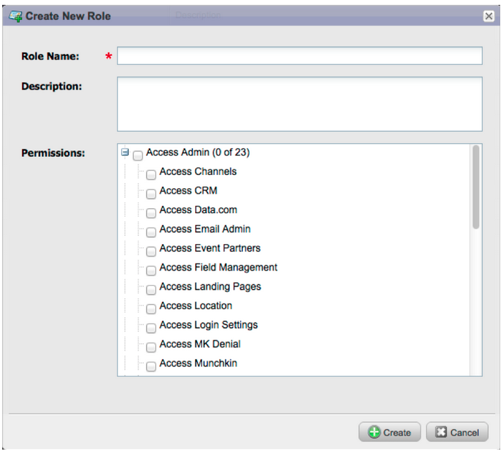

# Notas de versão: Dezembro de 2012 {#release-notes-december}

A versão de dezembro inclui o muito esperado recurso **Encaminhar para o amigo**, bem como vários outros bens! Observe que os recursos marcados com um asterisco (*) estão disponíveis somente na edição Select e na RCA (Revenue Cycle Analytics).

## Encaminhar para o amigo {#forward-to-friend}

Ative o compartilhamento de conteúdo com outras pessoas incluindo um link **Encaminhar para o amigo** em seus emails. A adição de novos filtros e acionadores o ajudará a identificar seus influenciadores, identificando os usuários que encaminharam um email, bem como aqueles que receberam os emails encaminhados.

Para incluir um convite **Encaminhar para o Amigo** no seu email, abra-o no editor e insira o token `{{system.forwardToFriendLink}}`.

Use os acionadores e filtros correspondentes para identificar os usuários que usaram o link **Encaminhar para o amigo** e os que receberam o email.

## Permissões de administrador granular {#granular-admin-permissions}

Nossa versão mais recente oferece maior acesso e controle sobre as funções administrativas, controlando o acesso a diferentes funções na área Administrador de marketing para cada função. Ao criar uma nova função, você pode atribuir funções administrativas específicas que essa função pode acessar.

>[!NOTE]
>
>Por padrão, as funções existentes com permissão de &quot;Administrador de acesso&quot; têm acesso a todas as funções administrativas até e a menos que sejam modificadas.

## Adaptador BrightTALK {#brighttalk-adapter}

O adaptador Marketo BrightTALK permite capturar informações de presença de um webcast ao vivo ou sob demanda, diretamente em um evento Marketo!

## Marketing to Sales Insight for Microsoft Dynamics {#marketo-sales-insight-for-microsoft-dynamics}

O Sales Insight está disponível para clientes do Microsoft Dynamics!

## Dynamics Opportunity Sync {#dynamics-opportunity-sync}

Sincronizar dados de oportunidade entre o Marketing e o Microsoft Dynamics.

## Relatório de oportunidades influenciadas por marketing* {#marketing-influenced-opportunities-report}

Visualização qual porcentagem do pipeline e da receita da sua empresa foi influenciada pelos programas de marketing. Em **Explorador de Receita**, agora você pode criar relatórios personalizados com o novo ponto amarelo &quot;Oportunidade Influenciada de Marketing&quot; na Análise Oportunidade. Você também pode usar os dois relatórios a seguir na pasta Padrão:

* Influência de marketing nas oportunidades criadas
* Influência de marketing em oportunidades vencidas

## Campos de oportunidade personalizados na Análise de oportunidade do Programa* {#custom-opportunity-fields-in-program-opportunity-analysis}

Adicione campos de oportunidade personalizados para aprimorar seus relatórios de Análise de Oportunidade de Programa no Explorador de Receita.

## Inspetor de campanhas {#campaign-inspector}

Você já se perguntou quais campanhas estão usando uma ação de fluxo específica, como Alterar pontuação ou Solicitar Campanha? Ou onde um determinado filtro está sendo usado? O novo Inspetor de Campanhas (disponível no Treasure Chest) permite identificar essas campanhas, assim como campanhas e campanhas ativas com erros.

Vá para **Admin** > **Treasure Chest** para ativar o Inspetor de Campanhas***.

