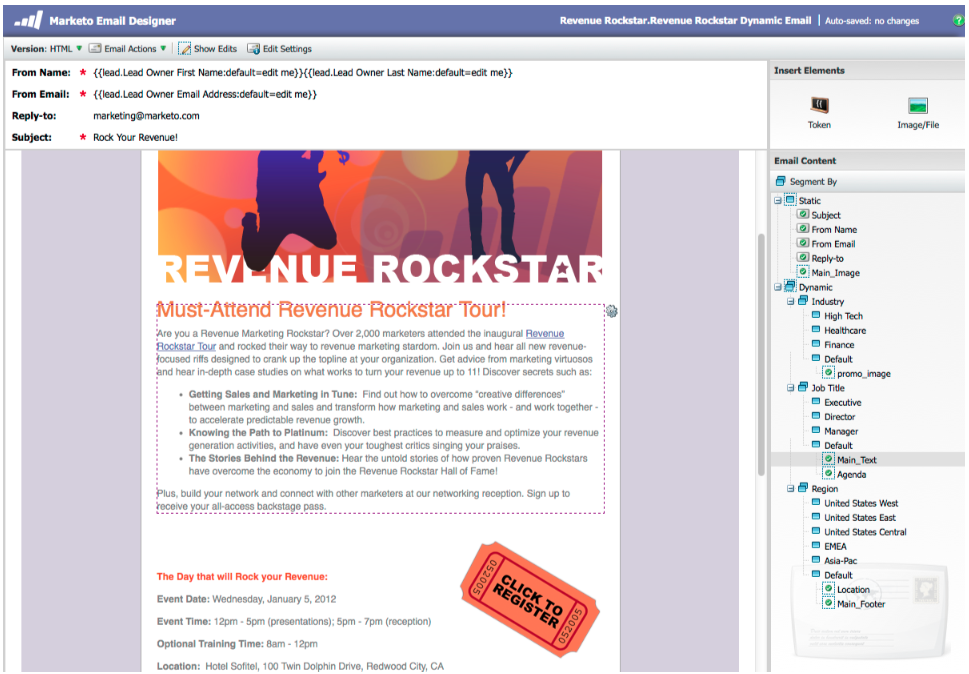

# Notas de versão: Jan/Fev de 2012 {#release-notes-jan-feb}

Os seguintes recursos estão incluídos na versão de janeiro/fevereiro. Verifique sua edição de marketing para ver a disponibilidade de recursos. Volte depois do lançamento para obter links para a documentação detalhada dos recursos.

>[!NOTE]
>
>**Mergulho profundo**
>
>Para outras versões, consulte as [Notas de versão](http://docs.marketo.com/display/docs/release+notes) profundas.

## Conteúdo dinâmico avançado {#advanced-dynamic-content}

*Disponível para versões Pro e Enterprise*

Com conteúdo dinâmico avançado, você pode criar landings page e comunicações de email envolventes relevantes para a sua audiência sem precisar criar vários ativos para a mesma mensagem. Visualizadores atualizados permitem que você visualização cada versão exclusiva em uma única tela.

## Segmentação {#segmentation}

*Disponível para versões Pro e Enterprise*

A segmentação é um grupo de segmentos, que são um grupo direcionado de indivíduos para os quais você comercializa. Os segmentos são definidos por regras orientadas por critérios de filtragem semelhantes às listas inteligentes. Seus segmentos podem se basear em dados demográficos, como cargo ou setor, ou em comportamentos, como páginas da Web visitadas ou links clicados.

## Trechos {#snippets}

*Disponível para versões Pro e Enterprise*

Armazene conteúdo avançado que pode ser usado várias vezes para criar e-mails e landings page estáticos ou dinâmicos.

## PURLs {#purls}

*Disponível para versões Pro e Enterprise*

O uso de URLs personalizados (PURLs) para profissionais de marketing agora pode criar URLs específicos de contato, para impulsionar a personalização, a mensurabilidade e as respostas de incentivo em programas de marketing multitoque para campanhas de email e mala direta.

## Suporte da Diretiva de Privacidade da UE {#eu-privacy-directive-support}

Os novos recursos para respeitar as configurações de &quot;Não rastrear&quot; do navegador incluem a capacidade de desativar o rastreamento para clientes potenciais anônimos; isto facilita o cumprimento das regras mais rigorosas da UE em matéria de controlo da privacidade.

## Logon único {#single-sign-on}

As organizações agora têm a capacidade de oferecer suporte a um logon contínuo no aplicativo Marketo usando o SAML 2.0 para logon único em um portal corporativo.

## Editores de e-mail e Landing page atualizados {#updated-email-and-landing-page-editors}

Os editores de e-mail e Landing page foram reprojetados com uma interface mais convidativa, navegação intuitiva e uma experiência do usuário consideravelmente melhorada, o que inclui:

Uma visualização de texto e HTML lado a lado

O Nome - De, Email, Responder (NOVO) e Assunto são exibidos no editor. Todas as outras configurações podem ser acessadas pelo botão Editar configurações.

## Suporte a navegador {#browser-support}

* Mozilla Firefox 9.0
* Google Chrome 16
* Microsoft Internet Explorer 8 e 9
* **Observação**: não oferecemos mais suporte ao Internet Explorer 7

## Gerenciamento de programas {#program-management}

O gerenciamento simplificado de programas melhora a praticidade com a exclusão de token e a exclusão mais fácil de Programas.

## Cancelar inscrição no Relatório de Subscrição {#unsubscribe-from-subscription-report}

Agora você pode cancelar a inscrição da subscrição diretamente do relatório!

## Atualizações Munchkin {#munchkin-updates}

As novas chamadas Munchkin reduzem o tempo de carregamento da página da Web e proporcionam um desempenho mais consistente para eventos de link de cliques.

## Análise de oportunidade do programa (somente RCA) {#program-opportunity-analysis-rca-only}

Compreender a contribuição de marketing para a receita de oportunidade individual

## Análise de Estágio de Receita do programa {#program-revenue-stage-analysis}

Saiba mais sobre a velocidade de chumbo do programa, entendendo quais programas adquiriram os motores rápidos

