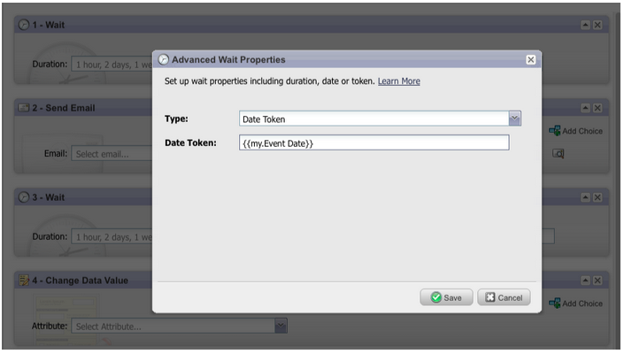

# Notas de versão: Junho de 2012 {#release-notes-june}

>[!NOTE]
>
>**Mergulho profundo**
>
>Para outras versões, consulte as [Notas de versão](http://docs.marketo.com/display/docs/release+notes) profundas.

## Melhorias no gerenciamento líder de marketing {#marketo-lead-management-enhancements}

### Renomear {#rename}

Você pode renomear suas Listas inteligentes, listas estáticas e campanhas. Se você estiver usando esses ativos em filtros, acionadores ou fluxos, o nome também será automaticamente atualizado lá. Você sempre foi capaz de renomear seus emails, formulários e pastas.

E, como bônus, melhoramos a inserção e exibição de texto descritivo para ativos.

## Importar mapeamento de campo {#import-field-mapping}

Tornamos muito mais fácil importar uma lista para o Marketo! Durante o processo de importação, é possível mapear o nome do campo Marketo para o nome do cabeçalho da coluna no arquivo de importação. Além disso, em Admin, você pode configurar nomes de alias que são mapeados para o nome do campo no Marketo, garantindo que os usuários selecionem o campo correto sempre.

À medida que você continua importando e mapeando campos, o Marketo lembrará e exibirá os mapeamentos durante a importação, para facilitar o uso. E para tornar a vida ainda mais fácil, você pode clicar no cabeçalho Valor de amostra para ver os diferentes valores que seriam preenchidos no campo. Isso ajuda a garantir que você mapeie o campo correto sempre!

## Página de resumo de Listas inteligentes e Listas estáticas {#summary-page-for-smart-lists-and-static-lists}

Você já se perguntou onde suas listas estão sendo usadas? Ou quem criou a lista, ou a modificou pela última vez? A nova página de resumo disponível nas Listas inteligentes e listas estáticas fornecerá esses detalhes importantes.

Nas páginas de resumo de Programas e Campanhas existentes, adicionamos as informações Data de criação/usuário e Data da última modificação/Usuário também!

## Usado por para ativos {#used-by-for-assets}

Adicionamos uma nova guia às nossas Páginas de resumo de ativos, chamadas Usadas por!

Exemplo: Usado por para Listas estáticas

## Linhas de Grade de landing page {#landing-page-gridlines}

A adição de linhas de grade landings page facilita muito o alinhamento de textos, gráficos e formulários na sua landing page. Ligue e desligue para qualquer landing page específica e ajuste a largura entre as linhas!

## Clientes potenciais bloqueados nas correspondências {#leads-blocked-from-mailings}

Ao agendar uma campanha, você pode clicar no link para ver a lista de clientes potenciais bloqueados de sua correspondência.

## Etapa de espera - Token principal e Meu token {#wait-step-lead-token-and-my-token}

Na nossa versão de maio, adicionamos opções avançadas à etapa de fluxo de espera. Com essas alterações, você pode especificar um dia útil, uma data e uma hora. Nesta versão, adicionamos a capacidade de usar um token na etapa de espera. Por exemplo, você pode usar `{{lead.Birthday}}` para enviar um email no aniversário ou usar `{{my.Event Date}}` para enviar um lembrete de webinar final.

## Visualização como miniaturas no Design Studio {#view-as-thumbnails-in-design-studio}

Mude sua visualização de uma lista de imagens para uma visualização em miniatura!

Observação: A partir desta versão, a classificação anterior nas grades de lista inteligente não se aplicará à próxima lista inteligente que você visualização. Por exemplo, se você classificar uma lista inteligente por Nome da Empresa, não classificaremos automaticamente a próxima lista inteligente exibida por esse mesmo campo.

Lembrete: Atualização do relatório de desempenho de email em andamento!

## Aprimoramentos do Marketing Revenue Cycle Analytics {#marketo-revenue-cycle-analytics-enhancements}

### Novas métricas na Análise de oportunidade do Programa {#new-metrics-in-program-opportunity-analysis}

Agora você pode obter insights sobre o número médio de toques de marketing antes que as oportunidades sejam criadas ou fechadas, bem como sobre o valor médio de um toque de marketing.

## Exibição de vários gráficos {#displaying-multi-charts}

O recurso de vários gráficos permite exibir vários gráficos em um único relatório do Revenue Cycle Explorer. Por exemplo, você pode usar esse recurso quando quiser exibir os mesmos dados em meses diferentes. Esse recurso também evita que você tenha que criar filtros e relatórios separados.

## Tipo de Gráfico de Grade de Calor {#heat-grid-chart-type}

Grades de calor permitem visualizar dados para que você possa identificar padrões de desempenho de Marketing. Esse tipo de visualização codificará os resultados em cores para que você visualização análises comerciais complexas em uma visualização fácil de entender.

## Tipo de Gráfico de Dispersão {#scatter-chart-type}

Gráficos de dispersão ajudam a visualizar dados em várias dimensões em um gráfico. Esse tipo de visualização plotará uma bolha em um gráfico com base nos atributos usados. Em seguida, é possível usar uma medida para codificar a bolha com cores e/ou usar uma medida para especificar o tamanho da bolha.

