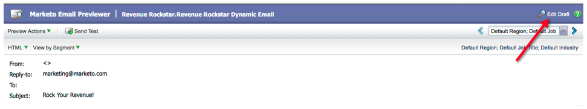

# Notas de versão: Março de 2012 {#release-notes-march}

>[!NOTE]
>
>**Mergulho profundo**
>
>Para outras versões, consulte as [Notas de versão](http://docs.marketo.com/display/docs/release+notes) profundas.
>
>## Resolver Meus Tokens {#resolve-my-tokens}>

Meus tokens (Tokens de Programa) serão resolvidos ao visualizar um email, ao enviar um email de teste e ao enviar um email local por meio de uma ação de fluxo único. Não será mais necessário criar uma campanha inteligente dentro do programa para testar seus Tokens!

## Alternar entre Visualizador e Editor em Emails e Landings page {#toggle-between-previewer-and-editor-in-emails-and-landing-pages}

Com um clique, vá facilmente para frente e para trás entre o Editor e o Visualizador.

Editor para Visualizador:

Visualizador para editor:

## Visualizador de fragmento {#snippet-previewer}

Selecionar &quot;Trecho de Pré-visualização&quot; no menu permite que você visualização um trecho, sem torná-lo um rascunho.Além disso, se você tiver acesso somente leitura a um trecho compartilhado (por meio de espaços de trabalho), poderá visualização o trecho com esta ação

## Enviar vários emails de teste {#send-multiple-test-emails}

Com a adição de conteúdo dinâmico, torna-se cada vez mais importante pré-visualização e teste todas as variações de e-mails que podem ser enviados para seus clientes potenciais. Ao visualizar usando Visualização por Detalhe de cliente potencial, você tem a opção de enviar um teste para as variações da lista de cliente potencial (até 100 emails de teste).

## Landings page dinâmicas com base no parâmetro de URL {#dynamic-landing-pages-based-on-url-parameter}

Os clientes potenciais anônimos compõem uma quantidade significativa de suas visitas landings page. Com a adição de conteúdo dinâmico e a capacidade de inserir a segmentação no URL como parâmetro, você pode exibir dinamicamente seu conteúdo de landing page quando um cliente potencial anônimo ou conhecido clicar no link.
