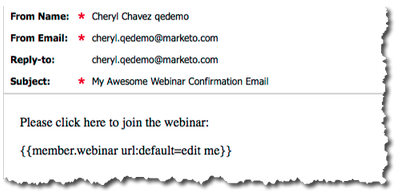

# Notas de versão: Maio de 2012 {#release-notes-may}

>[!NOTE]
>
>**Mergulho profundo**
>
>Para outras versões, consulte as [Notas de versão](http://docs.marketo.com/display/docs/release+notes) profundas.

## Redesign de relatório de desempenho de email {#email-performance-report-redesign}

Observação: esta será uma implementação em etapas, começando com a versão de maio

Fizemos com que os relatórios Desempenho do email e Desempenho do email da Campanha fossem executados mais rapidamente. Também aprimoramos as definições de determinadas métricas e consolidamos as métricas &quot;Mensagens enviadas&quot; e &quot;Informações enviadas&quot; para uma única métrica, &quot;Enviadas&quot;. Unimos &quot;Mensagens entregues&quot; e &quot;Informações fornecidas&quot; em &quot;Entregues&quot;.

## Aprimoramentos da etapa de espera {#wait-step-enhancements}

Usando as novas propriedades de Espera avançada, você pode configurar a etapa de espera em uma ação de Fluxo de Campanha inteligente para &quot;aguardar até&quot; um dia específico da semana, o dia útil seguinte, uma data ou hora específica. Esses aprimoramentos garantem que seus e-mails de criação cheguem à Caixa de entrada durante o horário comercial!

Figura 1. Especificar a Etapa de Espera para terminar em um Dia Útil

## Ativos arquivados ocultos {#archived-assets-hidden}

Os ativos arquivados são filtrados automaticamente da sugestão automática, dos descartes e dos relatórios, facilitando a localização do que você está procurando!

Figura 2. Exemplo do Filtro de Email Arquivado

## Novo aplicativo de check-in de Evento para iPad {#new-event-check-in-app-for-ipad}

Simplifique o processo de check-in do seu evento usando nosso novo aplicativo iPad! O aplicativo de Check-in do Evento sincroniza com o Programa Marketo e permite que você verifique facilmente os inscritos em um evento, além de adicionar novos clientes potenciais dinamicamente.

Requer iOS 5.1 ou posterior; Somente iPad.

Figura 3. Home page de check-in do evento

Figura 4. Check-in do evento: Selecione seu Evento!

Figura 5. Verifique-os

## URL de confirmação de Webinar aprimorado {#enhanced-webinar-confirmation-url}

Agora disponível para ON24 e Adobe Connect! Inclua um link exclusivo no email de confirmação para cada participante registrado usando o novo token `{{member.webinar URL}}`. As melhorias da Adobe Connect também incluem a capacidade de ativar/desativar o e-mail de informações da conta do Adobe que inclui a ID de login e a senha do usuário.

Figura 6. Obter pessoas em seu webinar

## Pré-visualização de modelo {#template-preview}

Procurando por um modelo específico ao criar seu email ou landing page, mas não tem certeza de como ele é? Com o novo recurso de pré-visualização de modelo, você pode verificar o modelo selecionado antes de salvar um novo ativo!

Figura 7. Pré-visualização do modelo escolhido

## Preenchimento de formulário configurável {#configurable-form-prefill}

Controle o pré-preenchimento dos dados do formulário no nível da subscrição e substitua no nível da landing page. Sem pré-população, você pode garantir que o cliente potencial forneça as informações mais atualizadas.

Figura 8. Configuração de preenchimento de formulário no Admin

Figura 9. Editar configuração de preenchimento prévio de formulário em uma Landing page

## Marketo Treasure Chest {#marketo-treasure-chest}

Obtenha acesso aos recursos experimentais desenvolvidos pelos engenheiros de marketing para aprimorar sua experiência de usuário. Esta versão inclui Desfazer por email, além da capacidade de inserir comentários e colaborar com outros usuários em suas landings page.

\

Figura 10. Recursos do tesouro do gerente na administração

## Integração do Microsoft Dynamics® CRM {#microsoft-dynamics-crm-integration}

Sincronize contas, contatos e clientes potenciais entre o Marketo e o Microsoft Dynamics CRM Online usando nossa nova integração pré-criada!

Figura 11. Configuração do Microsoft Dynamics

## Aprimoramentos de informações de vendas de marketing {#marketo-sales-insight-enhancements}

**Opções de Cancelar assinatura do rodapé**

Configure quando e se o rodapé para cancelar a inscrição for exibido para emails enviados por meio do Sales Insight.

Figura 12. Configurações de insight de vendas na Administração

## Pastas para Modelos de Email de Vendas {#folders-for-sales-email-templates}

Agora você pode organizar os modelos de e-mail compartilhados com o Marketing Insight de vendas em pastas especificadas, facilitando aos representantes de vendas encontrar o e-mail certo.

Figura 13. Escolha uma pasta para seus emails

## Analisador de oportunidades de acesso do Sales Insight {#access-opportunity-analyzer-from-sales-insight}

Forneça aos representantes de vendas informações sobre quais atividades de marketing estão liderando o envolvimento, usando o acesso direto ao Analisador de oportunidades do Marketing Insight. Nota. Requer licença do Revenue Cycle Analytics.

## Campo personalizado para Status do Contato {#custom-field-for-contact-status}

Agora é possível mapear um campo personalizado no Salesforce para preencher o campo Status dos Contatos nas Melhores Opções, Melhores Opções da Minha Equipe e visualizações personalizadas.

Figura 14. Mapear um campo personalizado para Contatos

Consulte Páginas visitadas por clientes potenciais anônimos

Detalhe as páginas visualizadas por um cliente potencial anônimo da visualização de Atividade da Web Anônima.

Figura 15. Consulte atividade da Web anônima

## Assinatura de cliente potencial e contato aprimorada {#enhanced-lead-and-contact-subscribe}

Siga um lead ou entre em contato a qualquer momento usando o novo botão Assinar na página de detalhes do registro.

