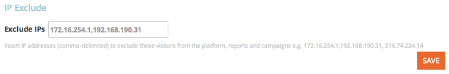

# Notas de versão: Agosto de 2014 {#release-notes-august}

Os seguintes recursos estão incluídos na versão de agosto de 2014. Verifique sua edição de marketing para ver a disponibilidade de recursos. Volte depois do lançamento para obter links para a documentação detalhada dos recursos.

## Licenças do calendário de marketing {#marketing-calendar-licenses}

Após 5 de setembro de 2014, apenas 5 usuários poderão ter acesso gratuito ao calendário de marketing. Certifique-se de [emitir/revogar uma Licença](../../product-docs/core-marketo-concepts/marketing-calendar/understanding-the-calendar/issue-revoke-a-marketing-calendar-license.md) de calendário de marketing para os usuários de sua escolha antes, para acesso ininterrupto.

## Novas permissões de usuário {#new-user-permissions}

As novas permissões de usuário a seguir foram adicionadas:

| Permissão | Descrição |
|---|---|
| Acessar o Explorador de Receita | Se você adquiriu o RCA, agora terá controle sobre quem pode acessá-lo. |
| Importar Lista | Restrinja usuários de importar listas para o banco de dados principal. |
| Importação de lista | Restrinja usuários de importar listas por meio de um programa em atividades de marketing. |
| Ativar Campanha do acionador | Controle quem pode e não pode ativar campanhas de acionamento. |
| Agendar Campanha em lote | Controle quem pode e não pode programar execuções de campanha em lote. |

## Exportar usuários e funções do administrador {#export-users-and-roles-from-admin}

Agora você pode [Exportar uma Lista de usuários e funções](../../product-docs/administration/users-and-roles/export-a-list-of-users-and-roles.md) do Marketing. Você também pode incluir um carimbo de data e hora &quot;Último logon&quot; para ser incluído na exportação.

## Excluir Canais e tags {#delete-channels-and-tags}

Agora é possível excluir canais e status não utilizados. Como sempre, você só pode ocultar um que esteja em uso no momento.

## DKIM automatizado {#automated-dkim}

Para melhorar a entrega, todos os emails enviados serão assinados pelo DKIM (DomainKeys Identified Mail). Por padrão, os emails usarão a assinatura DKIM compartilhada do Marketo. Você terá a opção de personalizar esta assinatura.

>[!NOTE]
>
>O DKIM será lançado lentamente, você pode não vê-lo por algumas semanas.

## Atualizações de personalização em tempo real {#real-time-personalization-updates}

Adicionamos rótulos à página de campanha para que você possa marcar o conteúdo de seus corações.

## Direcionamento móvel {#mobile-targeting}

Você perguntou à comunidade e nós entregamos! Agora você pode incluir, excluir ou definir uma chamada específica para ação para usuários móveis e tablets.

## Segmentação e segmentação 1:1 aprimoradas {#enhanced-segmentation-and-targeting}

Agora você pode usar operadores de filtro avançados para direcionar visitantes conhecidos.

## Compartilhamento de campanhas {#campaign-sharing}

Agora você pode compartilhar de forma rápida e fácil um link de pré-visualização de campanha RTP.

## Relatório de mecanismo de recomendação de conteúdo {#content-recommendation-engine-report}

Adicionamos um novo relatório de mecanismo de recomendação de conteúdo para que você possa ver um bom resumo.

## Administração de usuário aprimorada {#enhanced-user-administration}

Os usuários administradores agora podem bloquear usuários devido a várias tentativas de login com falha. Você também pode desbloquear esses usuários, se desejar.

## Controle de rastreamento {#tracking-control}

Agora é possível excluir IPs específicos de todos os rastreamentos e relatórios na Personalização em tempo real.

