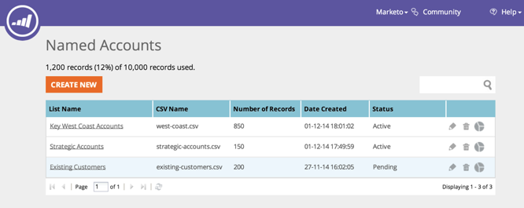

# Notas de versão: Dezembro de 2014 {#release-notes-december}

Os seguintes recursos foram incluídos na versão de dezembro de 2014. Verifique a disponibilidade de recursos do Marketing Edition. Após o lançamento, volte a encontrar links para artigos detalhados para cada recurso!

## Relatórios de insight de vendas {#sales-insight-reports}

O Relatório [de desempenho de email do](../../product-docs/marketo-sales-insight/msi-for-salesforce/features/performance-reports/sales-insight-email-performance-report.md) Sales Insight permite que você visualize métricas de email por email e representante de vendas. Suporta emails enviados pelo Salesforce, Microsoft Dynamics, o plug-in do Outlook e o plug-in Gmail.

## Audiências personalizadas do Facebook {#facebook-custom-audiences}

Depois que seu administrador de marketing tiver adicionado o [Facebook via Admin > Launchpoint](../../product-docs/demand-generation/ad-network-integrations/add-facebook-custom-audiences-as-a-launchpoint-service.md), você poderá criar, atualizar ou [substituir facilmente uma Audiência personalizada do Facebook por clientes potenciais de uma lista](../../product-docs/demand-generation/facebook/create-a-custom-audience-in-facebook.md)estática ou inteligente de marketing. Procure o novo ícone do Facebook na parte inferior da grade principal de qualquer lista estática ou inteligente.

## Clonagem aprimorada entre espaços de trabalho  {#improved-cloning-across-workspaces}

[Clonar um programa](../../product-docs/core-marketo-concepts/programs/working-with-programs/clone-a-program.md) para outro espaço de trabalho nunca foi tão fácil! Ao clicar em clonar, você seleciona a área de trabalho de destino. Não há mais clonagem em uma pasta e depois movendo a pasta!

>[!NOTE]
>
>Este novo recurso de clone só está disponível para programas no momento.

## Lista inteligente de referência {#reference-smart-list}

[Listas inteligentes que são compartilhadas com outro espaço de trabalho podem ser](../../product-docs/core-marketo-concepts/smart-lists-and-static-lists/using-smart-lists/reference-a-list-or-smart-list-across-workspaces.md)referenciadas ao criar uma lista ou fluxo inteligente.

## Melhorias na importação de lista {#list-import-improvements}

[Importe arquivos](../../getting-started/quick-wins/import-a-list-of-people.md) codificados em UTF-16, Shift-JIS ou EUC-JP. Continuamos a oferecer suporte a arquivos codificados UTF-8.

## Rastreamento de link em scripts de email {#link-tracking-in-email-scripting}

Links em scripts de email agora serão rastreados e disponibilizados no relatório Desempenho do link de email.

## Configuração de codificação de token {#token-encoding-setting}

Desenvolvemos um novo recurso de segurança para codificar automaticamente tokens HTML, que será ativado por padrão em março de 2015. Até então, alterne essa funcionalidade no Field Management para testar o comportamento antecipadamente. Todos os tokens de cliente potencial e empresa serão codificados quando inseridos em emails ou landings page. As opções também estarão disponíveis para campos individuais.

## Novas chamadas da API ReST {#new-rest-api-calls}

Três novas chamadas para a API ReST de cliente potencial e Atividade:

・ Obter partições de cliente potencial

・ Associar cliente potencial

・ Intercalar cliente potencial

Os detalhes completos estarão disponíveis após o lançamento em [developers.marketo.com](http://developers.marketo.com/)

## Aprimoramentos de compatibilidade com Javascript Munchkin {#munchkin-javascript-compatibility-enhancements}

Fizemos vários aprimoramentos menores ao Munchkin para garantir que ele continue a carregar rapidamente e a funcionar conforme desejado em casos com outro JavaScript na página.

A implantação será encenada a partir de meados de dezembro e continuará nos próximos meses.

## Aparência e sentimento atualizados do Explorador de Receita {#revenue-explorer-upgraded-look-and-feel}

## RTP: Módulo de Lista de conta nomeado {#rtp-named-account-list-module}

Gerencie e monitore suas principais contas de alto rendimento na nova página Contas Nomeadas. Faça upload de novas listas de contas nomeadas para identificar e público alvo essas organizações. Automatizamos o processo, que oferece mais controle e flexibilidade para implementar planos de marketing baseados em conta e público alvo suas principais contas em diferentes canais (Web e publicidade).

## RTP: Efeito deslizante para Campanhas de zona interna {#rtp-sliding-effect-for-in-zone-campaigns}

Adicionamos um novo efeito Deslizante para campanhas In Zone para permitir que seu conteúdo personalizado deslize para o lugar após o carregamento da página.

