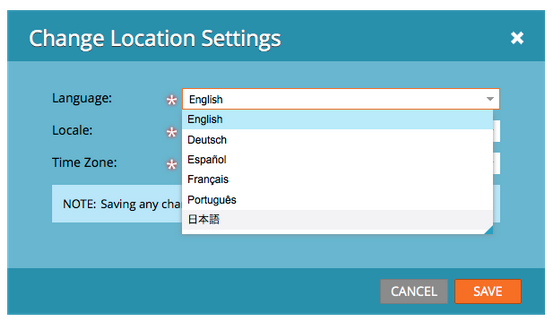

# Notas de versão: Março de 2014 {#release-notes-march}

Os seguintes recursos foram incluídos na versão de março de 2014. Verifique a disponibilidade de recursos do Marketing Edition. Após o lançamento, verifique se você voltou para obter links para artigos da base de conhecimento para cada recurso.

## Botão Atualizar Painel do Programa de email {#email-program-dashboard-refresh-button}

Use o botão [de](/help/marketo/product-docs/email-marketing/email-programs/email-program-data/use-the-email-program-dashboard.md) atualização para obter métricas de e-mail atualizadas sobre o seu e-mail de envio ou o teste AB!

## Desfazer/Refazer no Editor de email e no Editor de fragmentos {#undo-redo-in-the-email-editor-and-snippet-editor}

[Desfazer ou refazer](/help/marketo/product-docs/email-marketing/general/email-editor-2/edit-elements-in-an-email.md) até 50 ações para a sessão atual.

## Colunas de status do programa no relatório de desempenho do Programa {#program-status-columns-in-program-performance-report}

Ao usar o relatório [de desempenho do](/help/marketo/product-docs/core-marketo-concepts/programs/program-performance-report/add-program-status-columns-to-a-program-report.md)programa, agora é possível ver quantas pessoas estão em quais status de programa.

## Programas inclusivos e operacionais para o Analytics {#inclusive-and-operational-programs-for-analytics}

Agora é possível [incluir programas sem custos](/help/marketo/product-docs/reporting/revenue-cycle-analytics/program-analytics/make-a-program-without-a-period-cost-available-in-revenue-explorer-and-analyzers.md) de período no Gerenciador de receita e nos Analisadores, definindo a opção Comportamento do Analytics como &quot;Inclusivo&quot; ao editar Canais de Programas. Também é possível excluir programas operacionais do relatórios ao escolher &quot;Operacional&quot;.

## Opções híbridas e implícitas para conversão de cliente potencial {#hybrid-and-implicit-options-for-lead-conversion}

Você pode alterar a forma como o Marketo vincula contatos e oportunidades para as métricas de conversão de lead na Análise de cliente potencial. É possível [alterar a configuração](/help/marketo/product-docs/administration/settings/change-attribution-settings-for-analytics.md) de atribuição para uma das três opções. Alterar essa configuração não modifica nenhum dado de marketing ou CRM; isso simplesmente altera a forma como seus relatórios são executados e pode ser revertido a qualquer momento.

A configuração Explícita tratará somente contatos com funções em uma oportunidade como clientes potenciais convertidos (comportamento padrão). Implicit tratará todos os contatos associados à conta na oportunidade, independentemente da função, como convertidos. Híbrido tratará contatos com funções como convertidas se disponíveis; se não houver, todos os contatos da conta serão tratados como convertidos.

Como lembrete, essa configuração também altera as métricas de atribuição do programa.

## Idioma adicional do usuário {#additional-user-language}

Selecione o Idioma [do Aplicativo](/help/marketo/product-docs/administration/settings/select-your-language-locale-and-time-zone.md)Marketing. Visualização a interface de gerenciamento líder de marketing em seu idioma preferido — agora compatível com o japonês.

## Blog do desenvolvedor do Marketo {#marketo-developer-blog}

O blog [de desenvolvedores do](http://developers.marketo.com/blog/) Marketo é dedicado aos desenvolvedores de web e engenheiros de software que apóiam as necessidades em rápida evolução do comerciante moderno. Você pode assinar anúncios sobre novas opções de integração, atualizações de versão de API e uma nova série de artigos de procedimentos que incluem exemplos de código e práticas recomendadas de integração com a plataforma Marketo.

O [primeiro artigo](http://developers.marketo.com/blog/retrieving-customer-and-prospect-information-from-marketo-using-the-api/) desta série o guiará para descobrir como recuperar com eficiência as informações sobre as pessoas (clientes/contatos/clientes potenciais) que estão armazenadas no Marketing usando a API.
