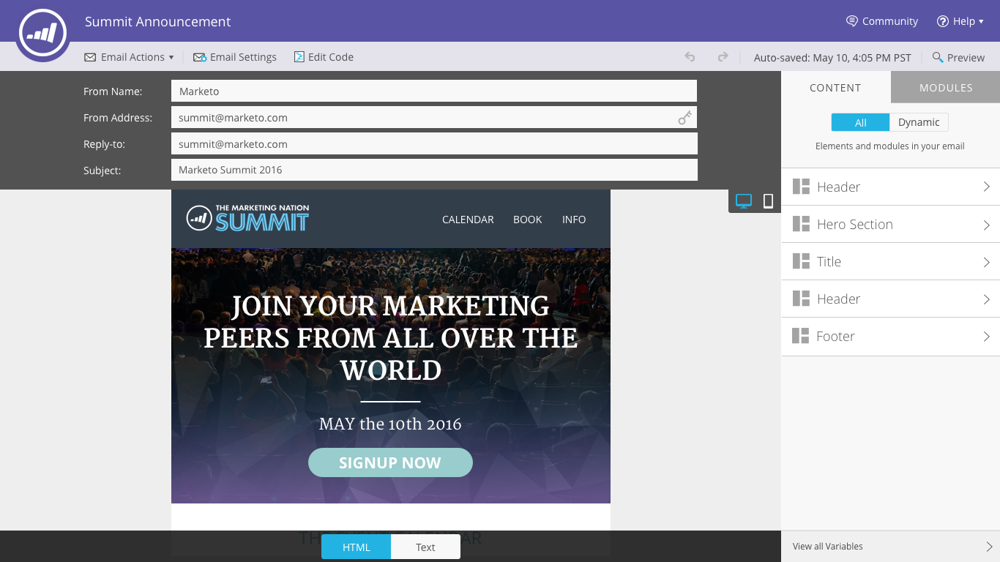

# Notas de versão: Primavera de 16 {#release-notes-spring}

Os seguintes recursos estão incluídos na versão do primeiro trimestre de 2016. Clique nos links de título para artigos detalhados de visualização para cada recurso.

## [Insights de email](http://docs.marketo.com/display/docs/email+insights) {#email-insights}

O Email Insights é uma nova experiência histórica de análise de e-mail de dados de agregação — reprojetado de ponta a ponta para desempenho rápido e relâmpago como parte do Project Orion. Ele apresenta um novo design de interface do usuário otimizado para atender às necessidades e ao fluxo de trabalho dos profissionais de marketing de email.

>[!NOTE]
>
>Estamos lançando o Email Insights para clientes em lotes, a partir de 3 de junho. Nosso objetivo é completar isso nos próximos meses. Você será notificado por email quando estiver habilitado.

## [Seletor de modelo de email](/help/marketo/product-docs/email-marketing/general/email-editor-2/email-template-picker-overview.md) {#email-template-picker}

Crie belos e-mails usando nossos novos modelos iniciais! Além disso, localize rapidamente seus modelos a partir de suas miniaturas ativas.

>[!NOTE]
>
>O Editor de e-mail 2.0 (com o Seletor de modelos) será lançado gradualmente a partir de 3 de junho. Concluiremos o lançamento até 30 de junho. Ao contrário do Email Insights, você não será notificado quando tiver acesso. Para ver se você o faz, siga as etapas [deste artigo](https://docs.marketo.com/pages/viewpage.action?pageId=11373011).

## [Edição de e-mail — recriação](/help/marketo/product-docs/email-marketing/general/email-editor-2/email-editor-v2-0-overview.md) {#email-editing-re-imagined}

É isso mesmo, um novo editor de e-mail! Use a funcionalidade leve de arrastar e soltar para adicionar e reordenar o conteúdo. Novos elementos, incluindo imagens, vídeos, variáveis e módulos, certamente aprimoram sua experiência de edição. Consulte também o editor de código atualizado, o visualizador e o suporte a pré-cabeçalho.

## [Mensagens no aplicativo móvel](/help/marketo/product-docs/mobile-marketing/in-app-messages/understanding-in-app-messages.md) {#mobile-in-app-messages}

Crie mensagens surpreendentes no aplicativo para seu aplicativo diretamente no Marketo. Defina exatamente quem deve vê-la e quando com o programa de mensagem no aplicativo. Monitore facilmente seu desempenho com o painel do programa.

## [Nenhum trecho de rascunho](/help/marketo/product-docs/administration/users-and-roles/managing-user-roles-and-permissions/enable-no-draft-for-snippets.md) {#no-draft-snippets}

Foram-se os dias em que você tem que reaprovar tudo toda vez que um snippet é atualizado! Com a opção Sem rascunho, todos os emails e landings page que usam um snippet obtêm as atualizações de snippet e mantêm seus status anteriores. Cada vez que você aprovar um snippet, terá a opção de executar Sem rascunho e atualizar tudo ou criar rascunhos. Depende de você! O No-Draft estará disponível para todos os clientes e será controlado por uma nova permissão em Administrador.

## [Atividades personalizadas](http://docs.marketo.com/display/docs/marketo+custom+activities) {#custom-activities}

Os administradores de marketing agora podem definir e gerenciar seus tipos de atividade personalizados por meio do modelador Definição de Atividade personalizada de marketing. Semelhante ao (e em conjunto com) o Modelador de objeto personalizado de marketing, os administradores agora podem estender o modelo de dados de acordo com suas necessidades comerciais exatas. Detalhes sobre como usar essa funcionalidade estão disponíveis no site [de documentação do](https://docs.marketo.com/display/public/DOCS/Marketo+Custom+Activities)Marketing.

## [landing page, modelo de Landing page e APIs de formulário](http://developers.marketo.com/blog/spring-2016-updates/) {#landing-page-landing-page-template-and-form-apis}

As APIs REST do Marketo agora oferecem suporte ao controle sobre landings page de marketing, modelos de landing page e formulários. Agora, os usuários podem criar, atualizar conteúdo, aprovar e excluir esses ativos diretamente por meio da API REST de marketing.

## [INCLUIR NA LISTA DE PERMISSÕES IP para acesso à API](/help/marketo/product-docs/administration/additional-integrations/create-an-allowlist-for-ip-based-api-access.md) {#ip-allowlisting-for-api-access}

Semelhante ao recurso de  de IP para logons de usuário do Marketing incluir na lista de permissões, os administradores do Marketo agora podem configurar uma lista de permissões de endereços IP que podem acessar as APIs SOAP e REST do Marketo, bloqueando o acesso de endereços IP não autorizados. Isso fornece uma camada adicional de segurança para a sua instância do Marketo e garante que o acesso à API só possa ocorrer na rede da sua organização. Detalhes sobre como configurar isso estão disponíveis no site [de documentação do](https://docs.marketo.com/display/public/DOCS/Create+a+Whitelist+for+IP-Based+API+Access)Marketing.

## [Novo Microsoft Dynamics Sync Connector de Alta Velocidade](/help/marketo/product-docs/crm-sync/microsoft-dynamics-sync/microsoft-dynamics-sync-details/sync-status.md) {#new-high-speed-microsoft-dynamics-sync-connector}

Construído na arquitetura Orion, o novo conector dinâmico de alta velocidade fornece velocidades até 20 vezes mais rápidas para sincronização inicial e até 5 vezes mais rápido para sincronização incremental. Todos os novos clientes serão integrados a esse conector na data de lançamento, e nós o implantaremos gradualmente aos clientes existentes durante o período de lançamento do verão.

**Atualizar dados para novos campos**: Agora você pode ativar novos campos de sincronização a qualquer momento e todos os valores de dados para esse campo serão atualizados do Dynamics CRM para o Marketing. Não há mais preocupações sobre a necessidade de selecionar todos os campos durante a configuração inicial. Se você desativar um campo de sincronização existente e reativá-lo posteriormente, todos os valores de dados desse campo serão atualizados do Dynamics CRM para o Marketo.

**Sincronizar cliente potencial como contato**: A ação de fluxo Sincronizar cliente potencial com a Microsoft tem uma nova opção para sincronizar como cliente potencial ou contato.

**Guia** Admin de Erros de Sincronização:  Procure, pesquise ou exporte clientes potenciais (e outros objetos) que não tenham sincronizado com detalhes como operação, direção, código de erro e mensagem de erro.

**Microsoft Dynamics 2016**: O conector está totalmente certificado para as versões online e local do Dynamics 2016.

**As atualizações de plug-in agora estão documentadas:** Consulte o artigo [sobre atualizações de](/help/marketo/product-docs/crm-sync/microsoft-dynamics-sync/marketo-plugin-releases-for-microsoft-dynamics.md)plug-in.

## [Nome da instância amigável](/help/marketo/product-docs/administration/settings/edit-subscription-settings.md) {#friendly-instance-name}

Atualmente, é difícil diferenciar entre instâncias de marketing, por exemplo, sandbox e instâncias de produção. Este recurso permite saber em quais instâncias você está trabalhando no momento.

## [Acesso por tempo limitado para Subscrição](/help/marketo/product-docs/administration/users-and-roles/managing-marketo-users.md) {#limited-time-access-for-subscriptions}

Hoje, os usuários são convidados para a subscrição do Marketing por um período indefinido. Esse recurso permite que os administradores convidem usuários para o subscrição por um período limitado, por exemplo, 2 semanas ou 1 mês.

## [Grade de objetos personalizados](/help/marketo/product-docs/administration/marketo-custom-objects/understanding-marketo-custom-objects.md) {#custom-objects-grid}

Agora, você pode visualização o número de registros e campos para todos os objetos personalizados publicados.

