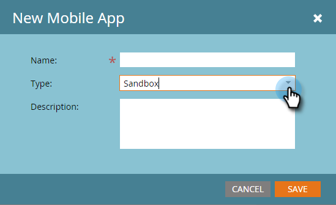
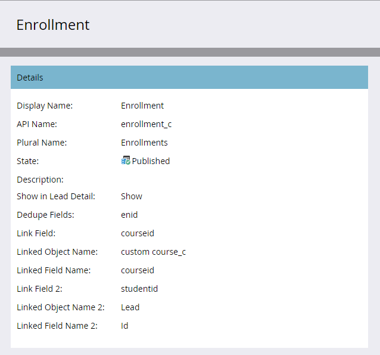

# Notas de versão: Inverno de 16 {#release-notes-winter}

Os seguintes recursos estão incluídos na versão de inverno de 16. Clique nos links de título para artigos detalhados de visualização para cada recurso.

## [É Filtro Anônimo](../../product-docs/administration/additional-integrations/add-munchkin-tracking-code-to-your-website/next-generation-munchkin-tracking-faq.md) {#is-anonymous-filter}

O filtro Is Anonymous foi removido para Listas inteligentes. Consulte o documento de perguntas frequentes [sobre o rastreamento Munchkin da](../../product-docs/administration/additional-integrations/add-munchkin-tracking-code-to-your-website/next-generation-munchkin-tracking-faq.md) próxima geração para obter detalhes. Essa alteração não afeta a Personalização da Web (RTP), que continua a identificar visitantes da Web anônimos e conhecidos e a personalizar o conteúdo em tempo real nesses visitantes.

## [Painel do banco de dados](../../product-docs/core-marketo-concepts/smart-lists-and-static-lists/managing-people-in-smart-lists/database-dashboard.md)  {#database-dashboard}

O banco de dados líder tem um Painel de resumo atualizado que inclui o tamanho total do banco de dados de pessoas, o número de clientes potenciais comercializáveis e um detalhamento de clientes potenciais por cinco principais fontes.

## [Microsoft Edge Browser](../../product-docs/administration/setup-administration/supported-browsers.md) {#microsoft-edge-browser}

Adicionamos o Microsoft Edge à [lista de navegadores](https://docs.marketo.com/display/public/DOCS/Supported+Browsers) suportados pelo Marketo.

## [Microsoft Outlook 2016](../../product-docs/marketo-sales-insight/msi-outlook-plugin/install-the-marketo-email-add-in-for-outlook-with-a-registration-code.md) {#microsoft-outlook}

[O Microsoft Outlook 2016](../../product-docs/marketo-sales-insight/msi-outlook-plugin/install-the-marketo-email-add-in-for-outlook-with-a-registration-code.md) agora é compatível.

## [Start do cabeçalho do Programa de email](../../product-docs/email-marketing/email-programs/email-program-actions/head-start-for-email-programs.md) {#email-program-head-start}

Use o Start de cabeçalho para indicar que o processamento do seu envio deve ocorrer com antecedência. Em vez de se qualificar clientes potenciais e preparar e-mails na hora programada do programa, o Start principal garante que essas tarefas sejam feitas antecipadamente. Dessa forma, sua audiência será start recebendo emails no horário agendado.

Para usar esse recurso, o programa de email deve ser agendado com pelo menos 12 horas de antecedência e a Lista inteligente será bloqueada 12 horas antes do envio.

>[!NOTE]
>
>Este recurso será lançado gradualmente por uma semana após a versão de inverno de 16. Ele não está disponível para uso com campanhas inteligentes ou a API.

## [Aprimoramentos de marketing móvel](/help/marketo/product-docs/mobile-marketing/admin/add-a-mobile-app.md) {#mobile-marketing-enhancements}

**Suporte para PhoneGap:** Agora oferta o suporte do PhoneGap para seu aplicativo móvel. [Saiba mais](http://developers.marketo.com/documentation/mobile/phonegap-plugin/).

**Suporte para aplicativos** Sandbox:

## [API do programa](http://developers.marketo.com/documentation/programs/) {#program-api}

Crie, atualize e clone programas por meio da REST API. Isso não inclui a criação ou atualização de listas inteligentes e campanhas inteligentes em um programa.

## [Aprimoramentos do Microsoft Dynamics](../../product-docs/crm-sync/microsoft-dynamics-sync/microsoft-dynamics-sync-details/sync-status.md) {#microsoft-dynamics-enhancements}

** Status de sincronização:** Mantenha as guias na saída atual e no backlog do processo de sincronização. Detalhe-o pela contagem de inserções e atualizações por objeto.

** [Notificações](../../product-docs/core-marketo-concepts/miscellaneous/understanding-notifications/notification-types.md)**: Receba notificações sobre erros comuns de sincronização, juntamente com uma lista de clientes potenciais que tenham esse erro.

## [Aprimoramentos de objetos personalizados](../../product-docs/administration/marketo-custom-objects/create-marketo-custom-objects.md)  {#custom-objects-enhancements}

Agora você pode criar relações muitas para muitas entre Clientes potenciais/Contas e um objeto personalizado usando um objeto intermediário com vários campos de link.

## [Anúncios de venda do Facebook](../../product-docs/demand-generation/facebook/set-up-facebook-lead-ads.md) {#facebook-lead-ads}

[Anúncios](https://www.facebook.com/business/a/lead-ads) principais do Facebook são uma forma mais direta de uma empresa administrar campanhas de geração de leads no Facebook. As pessoas preenchem um formulário para expressar interesse em um produto ou serviço, para que a empresa possa acompanhá-los. A integração do Marketing com os Anúncios de venda do Facebook captura automaticamente as informações fornecidas pelo cliente potencial no formulário Anúncio de venda. As ações de acompanhamento e notificações podem ser automatizadas usando o novo acionador Preencher Anúncios de venda do Facebook.

## [Scheduler de Campanha da Web (Personalização em tempo real)](../../product-docs/web-personalization/working-with-web-campaigns/schedule-a-web-campaign.md) {#web-real-time-personalization-campaign-scheduler}

Agende sua campanha antecipadamente. Configure um start e uma data de término para conteúdo personalizado da Web e repita campanhas em dias e horários específicos. Personalize o agendamento para exibir a campanha de acordo com a hora do visitante da Web ou um fuso horário selecionado.

