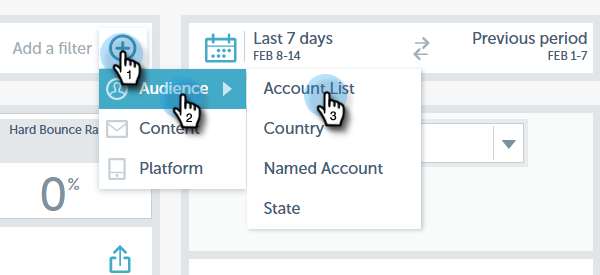

# Notas de versão: Inverno &#39;17 {#release-notes-winter}

Os seguintes recursos estão incluídos na versão de inverno de 17. Verifique sua edição de marketing para ver a disponibilidade de recursos.

Clique nos links de título para artigos detalhados de visualização para cada recurso.

>[!NOTE]
>
>Se um tópico tiver várias sub-rubricas, os links serão colocados lá.

## [Correspondência avançada para Audiências personalizadas do Facebook](/help/marketo/product-docs/demand-generation/ad-network-integrations/add-facebook-custom-audiences-as-a-launchpoint-service.md) {#advanced-matching-for-facebook-custom-audiences}

A Correspondência básica usa somente endereços de email, mas a nova Correspondência avançada usa sete campos adicionais, aumentando a taxa de correspondência para mais conversão.

## [API de importação de objeto personalizado](http://developers.marketo.com/rest-api/lead-database/custom-objects/) {#custom-object-import-api}

Essa API fornece uma interface mais rápida para sincronizar objetos personalizados no Marketo. É possível importar arquivos CSV, TSV ou planilha SSV para o Marketo como objetos personalizados.

## [Campanha Export de personalização da Web](/help/marketo/product-docs/web-personalization/working-with-web-campaigns/export-web-campaign-data.md) {#web-personalization-campaigns-export}

Exporte todos os detalhes e análises de sua Campanha da Web em um formato CSV. Em seguida, você pode visualização seus dados em um layout conveniente.

## [Localização](http://docs.marketo.com/display/docs/web+personalization) {#localization}

Os aplicativos Web Personalization, Predictive Content e Email Insights agora estão disponíveis em japonês, alemão e espanhol. Você [seleciona o idioma e a localidade](/help/marketo/product-docs/administration/settings/select-your-language-locale-and-time-zone.md) para visualização do conteúdo nesses idiomas.

## Aprimoramentos de marketing baseado em conta {#account-based-marketing-enhancements}

**[Importar contas nomeadas](/help/marketo/product-docs/account-based-marketing/target/named-accounts/import-named-accounts.md)**

Com a opção Importação de conta nomeada, crie ou atualize vários registros de uma vez por meio do upload CSV.

**[Suporte a insights de email](/help/marketo/product-docs/reporting/email-insights/filtering-in-email-insights.md)**

Use Conta nomeada ou Lista de conta como dimensões em Insights de email.

## Aprimoramentos de conteúdo preditivo {#predictive-content-enhancements}

**[Filtrar por fonte ativada](/help/marketo/product-docs/predictive-content/working-with-predictive-content/understanding-predictive-content.md)**

Filtrar partes do Conteúdo Preditivo que estão habilitadas para Email, Mídia Avançada ou Barra de Recomendações.

**[Filtrar análises por fonte](/help/marketo/product-docs/predictive-content/working-with-predictive-content/understanding-predictive-content.md)**

Filtrar análise de conteúdo preditivo para fontes específicas — Email, Mídia avançada ou Barra de recomendações.

**[Editor de conteúdo preditivo](http://docs.marketo.com/display/docs/edit+predictive+content)**

Existe uma experiência e um layout de edição melhorados que divide a preparação do conteúdo por fonte. Email, Mídia avançada ou Barra de recomendações.

**[Conteúdo de descoberta automática para previsão](/help/marketo/product-docs/predictive-content/getting-started/enable-content-discovery.md)**

URL da imagem e metadados agora são usados no processo de descoberta automática do conteúdo.

## [Aprimoramentos do SDK](http://developers.marketo.com/mobile/) {#sdk-enhancements}

Os desenvolvedores agora têm controle adicional sobre o delivery das Notificações por push com a adição de uma nova chamada de API SDK que permite que os desenvolvedores removam tokens de push.

## [Integração do Vibes SMS LaunchPoint](/help/marketo/product-docs/mobile-marketing/vibes-sms-messages/use-vibes-sms-messages-in-smart-list-triggers-and-filters.md) {#vibes-sms-launchpoint-integration}

Melhore a definição de metas com uma nova opção de filtro, &quot;Lista de membro de Vibes&quot;.

## [Substituição do Editor de Rich Text e do Editor de Formulários 1.0 herdados](https://nation.marketo.com/docs/DOC-4315) {#legacy-rich-text-editor-and-form-editor-deprecation}

A partir de 1º de agosto de 2017, os clientes que ainda estiverem usando o Editor de Rich Text e o Editor de Formulários 1.0 serão automaticamente transferidos para a nova experiência.

## [APIs de Atividade de marketing](https://developers.marketo.com/blog/important-change-activity-records-marketo-apis/) {#marketo-activity-apis}

Uma mudança importante está vindo para as APIs de atividade do Marketo. Você está preparado?
