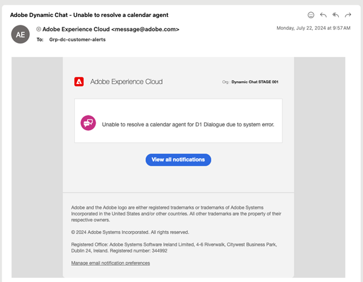
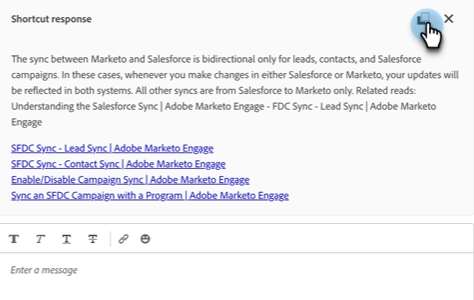
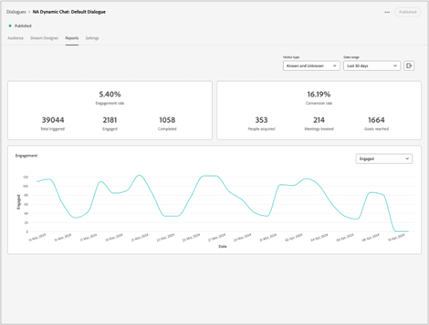

# Notas de versão do Dynamic Chat {#dynamic-chat-release}

As versões do Adobe Dynamic Chat operam em um modelo de entrega contínua que permite uma abordagem mais escalável para a implantação de recursos. Às vezes, há várias versões em um mês, portanto, verifique regularmente para obter as informações mais atualizadas.

A página de Notas de Versão padrão do Marketo Engage [pode ser encontrada aqui](/help/marketo/release-notes/current.md){target="_blank"}.

## Versão de junho de 2025 {#june-2025-release}

**Data de lançamento: terça-feira, 30 de junho de 2025**

### Renovação da Lógica de Roteamento {#routing-logic-revamp}

Renovamos a lógica de roteamento de chat ao vivo no Dynamic Chat para garantir um comportamento de envolvimento mais inteligente e previsível em todos os tipos de roteamento (Conta, Personalizado, Equipe e Round Robin). A nova lógica simplifica os fluxos de roteamento e melhora o tratamento de fallback quando os agentes estão indisponíveis.

#### Principais melhorias no comportamento de roteamento

* **Até duas tentativas de envolvimento por sessão**

   * O sistema tentará se conectar com até dois agentes (no máximo), mas estritamente dentro da regra de roteamento principal.

   * Se um agente estiver disponível, mas não responder (por exemplo, recusar ou perder o bate-papo), o sistema tentará se conectar a um agente diferente do mesmo pool.

   * A lógica de fallback (como Round Robin) só será ativada se nenhum agente elegível for encontrado durante a resolução inicial, para não tentar novamente após uma falha no engajamento.

* **Comportamento Específico da Regra de Roteamento**

##### —Roteamento de conta—

Se o domínio de email de um visitante for mapeado para uma conta conhecida, o agente mapeado sempre será priorizado.

Se o agente estiver disponível, o chat será roteado diretamente para ele.

Se o agente não estiver disponível, o sistema:

* Não tenta outro agente, mesmo se Round Robin estiver habilitado como fallback.

* Em vez disso, ele:

   * Mostra o calendário de reuniões do agente mapeado (se estiver habilitado),
-ou-
   * Retorna a uma mensagem padrão (pior caso).

A regra de roteamento no nível do cartão (por exemplo, Equipe, Personalizado) só será considerada se o Roteamento de conta não for elegível (nenhum domínio ou agente correspondente).

##### —Roteamento personalizado/de equipe—

Essas regras podem retornar vários agentes qualificados.

Se o primeiro agente disponível não interagir, o sistema tentará mais um agente da mesma lista.

O fallback Round Robin não é acionado apenas porque um agente não responde.

Se nenhum dos agentes interagir:

* O sistema mostra o calendário do agente da primeira tentativa (se ativado),
-ou-
* Exibe a mensagem de fallback padrão.

##### —Roteamento Round Robin—

Quando usado como uma regra de roteiro principal, o sistema:

* Tenta engajar o primeiro agente disponível do pool round robin.

* Se o primeiro agente não responder, ele tentará novamente com o próximo melhor agente qualificado.

Se Round Robin for usado como um fallback, ele será ativado somente se nenhum agente for resolvido a partir da regra principal.

##### Fluxo de experiência do visitante

O sistema verifica se o Roteamento de Conta é aplicável.

* Se sim, e o agente estiver disponível, ele se conectará imediatamente.

* Se o agente não for elegível ou não estiver disponível, ele passará para a regra de roteamento no nível do cartão.

A regra de roteamento no nível do cartão (Personalizada, Equipe, Round Robin) é avaliada.

* A disponibilidade dos agentes qualificados é verificada (permissões, status).

* O sistema envolve um agente e, se necessário, tenta um segundo agente da mesma regra.

* Se nenhum engajamento for bem-sucedido, a lógica de fallback será aplicada:

   * Fallback de calendário (se ativado),
-ou-
   * Mensagem padrão.

O fallback de Round Robin só é considerado quando nenhum agente elegível for encontrado na regra de roteamento principal, não quando os agentes individuais não responderem.

##### Casos de uso

_**Roteamento de conta**_

<table><thead>
  <tr>
    <th>Tipo</th>
    <th>Exemplo</th>
    <th>Resultado</th>
  </tr></thead>
<tbody>
  <tr>
    <td>Ideal</td>
    <td>O domínio do visitante mapeia para uma conta; o agente mapeado tem o chat ao vivo ativado e está disponível</td>
    <td>O chat se conecta diretamente ao agente mapeado</td>
  </tr>
  <tr>
    <td>Fallback (Round Robin)</td>
    <td>O agente mapeado não está disponível, o fallback Round Robin está habilitado</td>
    <td>O sistema seleciona um agente disponível por meio do Round Robin e os envolve </td>
  </tr>
  <tr>
    <td>Nenhum agente de fallback</td>
    <td>O agente mapeado está indisponível, sem fallback de Round Robin; a reserva de reunião está habilitada</td>
    <td>O sistema mostra o calendário do agente mapeado ou exibe uma mensagem de fallback padrão</td>
  </tr>
</tbody></table>

_**Roteamento personalizado**_

<table><thead>
  <tr>
    <th>Tipo</th>
    <th>Exemplo</th>
    <th>Resultado</th>
  </tr></thead>
<tbody>
  <tr>
    <td>Ideal</td>
    <td>A lógica personalizada resolve uma lista de agentes; o primeiro agente está disponível e aceita o chat.</td>
    <td>O chat se conecta ao primeiro agente.</td>
  </tr>
  <tr>
    <td>Fallback (Round Robin)</td>
    <td>A regra personalizada não resolve nenhum agente, o fallback Round Robin está habilitado.</td>
    <td>O sistema seleciona um agente disponível por meio do Round Robin e os envolve.</td>
  </tr>
  <tr>
    <td>Nenhum agente de fallback</td>
    <td>Dois agentes resolvidos; nenhum aceita bate-papo, fallback definido como calendário de reuniões.</td>
    <td>O calendário do agente da primeira tentativa é exibido ou a mensagem de fallback padrão é exibida.</td>
  </tr>
</tbody></table>

_**Roteamento de Equipe**_

<table><thead>
  <tr>
    <th>Tipo</th>
    <th>Exemplo</th>
    <th>Resultado</th>
  </tr></thead>
<tbody>
  <tr>
    <td>Ideal</td>
    <td>A equipe inclui agentes com chat ao vivo; o primeiro agente disponível aceita o chat.</td>
    <td>O chat se conecta a esse agente.</td>
  </tr>
  <tr>
    <td>Fallback (Round Robin)</td>
    <td>Nenhum agente de equipe está disponível e o recurso de fallback Round Robin está habilitado.</td>
    <td>O sistema seleciona e se conecta com um agente do pool Round Robin.</td>
  </tr>
  <tr>
    <td>Nenhum agente de fallback</td>
    <td>Dois agentes disponíveis, mas nenhum engajamento; fallback de calendário ativado.</td>
    <td>O calendário do agente da primeira tentativa é exibido ou a mensagem de fallback é acionada.</td>
  </tr>
</tbody></table>

_**Roteamento Round Robin**_

<table><thead>
  <tr>
    <th>Tipo</th>
    <th>Exemplo</th>
    <th>Resultado</th>
  </tr></thead>
<tbody>
  <tr>
    <td>Ideal</td>
    <td>O pool Round Robin tem vários agentes; o segundo agente aceita bate-papo depois que o primeiro não.</td>
    <td>O chat conecta-se ao segundo agente.</td>
  </tr>
  <tr>
    <td>Fallback (Round Robin)</td>
    <td>Não há agentes disponíveis no pool Round Robin; o calendário de reuniões está habilitado.</td>
    <td>O calendário é exibido para o primeiro agente na lista (se configurado) ou mensagem de fallback é exibida.</td>
  </tr>
  <tr>
    <td>Nenhum agente de fallback</td>
    <td>Não há agentes disponíveis; o fallback está desativado.</td>
    <td>A mensagem de fallback estática é exibida para o visitante.</td>
  </tr>
</tbody></table>

### Notificação de Pulso {#pulse-notification}

Sempre que um visitante solicita conexão com um agente, fornecemos ao agente uma notificação no aplicativo e do navegador. Mas, às vezes, os agentes perdem esses bate-papos.

Com esta versão, o agente ativo pode receber um email, Slack, notificação no aplicativo e do navegador quando um novo visitante estiver interessado em conversar.

1. Na página inicial do Adobe Experience Cloud, clique no ícone Conta e selecione **Preferências**.

   

1. Role para baixo até _Notificações_ e faça as seleções de Dynamic Chat desejadas.

   

>[!NOTE]
>
>O conteúdo de uma notificação de Pulse pode ser o mesmo que usamos para notificações no aplicativo e no navegador.

## Versão de abril/maio de 2025 {#apr-may-25-release}

### Som de Notificação de Mensagem {#message-notification-sound}

Agora há a opção de ativar um som para o visitante sempre que o chatbot for acionado em uma sessão. Há vários sons para escolher.

### Habilitar mensagens por push em dispositivos móveis {#enable-poke-messages-on-mobile}

O &quot;Poke&quot;, que exibe a pergunta de abertura ao lado do ícone de chat sem que o visitante precise clicar nele para vê-lo, agora é uma opção para ser habilitada para visitantes que usam um dispositivo móvel.

### Atualização de fallback padrão {#default-fallback-update}

Para quaisquer regras/equipes personalizadas como um cartão de Bate-papo ao vivo, se nenhum agente estiver disponível (ou se o bate-papo não puder se conectar), ele recorrerá ao Round Robin para os agentes disponíveis (todos que estiverem disponíveis nesse momento, independentemente de qual lógica/regra de roteamento foi colocada no fluxo).

### Integração com Demandbase {#demandbase-integration}

Os usuários do Demandbase podem usar atributos de pessoa do Demandbase para direcionamento de diálogo, identidade visual condicional e roteamento personalizado no Dynamic Chat.

## Versão de setembro/outubro de 2024 {#sep-oct-release}

### Análise de chat ao vivo aprimorada {#enhanced-live-chat-analytics}

Vários aprimoramentos foram feitos no Painel do Analytics, incluindo:

* Contagem total solicitada do bate-papo ao vivo: número de visitantes solicitados para um &quot;bate-papo com o agente&quot;

* Total de bate-papos ao vivo conectados: número de visitantes conectados versus total solicitado para um &quot;bate-papo com o agente&quot;

* Total de solicitações de bate-papo em tempo real perdidas: número de visitantes autônomos versus total solicitado para um &quot;bate-papo com o agente&quot;

* Duração média do chat em minutos: analise a &quot;duração média do chat&quot; entre visitantes e seus agentes

* Average Agent Response Time in Seconds: analise o &quot;tempo médio&quot; gasto pelos agentes para responder às perguntas e respostas do bate-papo ao vivo

* Painel diário: solicitações de bate-papo ao vivo conectadas com sucesso, solicitações de bate-papo ao vivo perdidas, classificar e filtrar atividades recentes de bate-papo ao vivo

### Pontuação de conversa {#conversation-scoring}

Quantifique seus leads com base na qualidade da interação de chat e use essa métrica como um Acionador/Filtro nas Campanhas inteligentes da Marketo Engage. Use o novo atributo _pontuação da conversa_ nas seguintes atividades:

* Engajado com um diálogo
* Envolvido com um fluxo de conversa
* Envolvido com um agente

**O que observar:**

* O valor da pontuação será de 0, 1, 2, 3 (o valor padrão é nulo)

* Quando a conversa é concluída ou descartada, o valor de pontuação não pode ser editado

* Definição de uma pontuação:

   * Na caixa de entrada do agente - durante um chat ao vivo, o agente pode atualizar ou definir uma pontuação para a conversa, que é armazenada na atividade de conversa

   * No designer de fluxo - no cartão de meta, o usuário pode atualizar ou definir uma pontuação para a conversa

### Nova lógica de criação de clientes potenciais {#new-lead-creation-logic}

Se um cliente potencial preencher um formulário com o email `abc@test.com` e for cookie como xyz, depois preencher o mesmo formulário com o email `def@test.com`, um novo registro de pessoa será criado, mas o cookie xyz será associado à nova pessoa e removido da pessoa `abc@test.com`.

Assim, quando um visitante com cookie abc chega em uma página e fornece uma ID de email como `abc@test.com`:

<table><thead>
  <tr>
    <th>Visitor</th>
    <th>Cookie</th>
    <th>Email fornecido</th>
    <th>Comportamento esperado</th>
  </tr></thead>
<tbody>
  <tr>
    <td>Anônimo</td>
    <td>abc</td>
    <td>Não existe no banco de dados</td>
    <td>Criar uma nova pessoa</td>
  </tr>
  <tr>
    <td>Anônimo</td>
    <td>abc</td>
    <td>Existe no Banco de Dados</td>
    <td>Mesclar pessoa</td>
  </tr>
  <tr>
    <td>Anônimo</td>
    <td>xyz</td>
    <td>Existe no Banco de Dados</td>
    <td>Mesclar pessoa</td>
  </tr>
  <tr>
    <td>Pessoa conhecida</td>
    <td>abc</td>
    <td>Igual à pessoa existente</td>
    <td>Atualizar pessoa</td>
  </tr>
  <tr>
    <td>Pessoa conhecida</td>
    <td>abc</td>
    <td>Diferente da pessoa existente</td>
    <td>Se já existir uma pessoa conhecida, transfira o cookie e resolva esse perfil. Se não houver nenhuma pessoa com esse email, crie um novo registro de pessoa e transfira o cookie</td>
  </tr>
  <tr>
    <td>Pessoa conhecida</td>
    <td>xyz</td>
    <td>Igual à pessoa existente</td>
    <td>Adicionar novo cookie à mesma pessoa</td>
  </tr>
  <tr>
    <td>Pessoa conhecida</td>
    <td>xyz</td>
    <td>Diferente da pessoa existente</td>
    <td>este cenário não é possível como se fosse um novo cookie de   padrão considerado como novo perfil anônimo</td>
  </tr>
</tbody></table>

### Opção para herdar fonte {#option-to-inherit-font}

Agora você pode ativar o chatbot para herdar diretamente a fonte da página da Web em que ele está sendo hospedado, em vez de gerenciar a fonte da marca no Dynamic Chat. Ao habilitar essa opção, o chatbot utiliza a fonte definida na tag `<body>` da página.

### Integração do Demandbase com o Dynamic Chat {#demandbase-integration-with-dynamic-chat}

Os usuários do Demandbase podem trazer sua própria licença do Demandbase e ativar a integração. Use os atributos de pessoa do Demandbase para direcionamento de caixa de diálogo, identidade visual condicional e roteamento personalizado.

A resolução desses valores de atributo em relação a uma pessoa seria feita em tempo real e são armazenados no respectivo perfil de pessoa.

### Tempo de carregamento do fluxo de conversa otimizado {#optimized-conversation-flow-load-time}

Para melhorar a experiência do usuário, um carregador de brilho agora é exibido em vez de um espaço em branco enquanto o Fluxo de conversa é carregado.

**Antes**

**Depois**

## Versão de agosto de 2024 {#august-release}

**Data de lançamento: sábado, 23 de agosto de 2024**

### Formatar suas mensagens de conversa de maneira personalizada {#custom-format-conversation-messages}

Os designers de fluxo agora oferecem suporte à [inserção de HTML](/help/marketo/product-docs/demand-generation/dynamic-chat/automated-chat/stream-designer.md#create-a-stream){target="_blank"} para personalizar a aparência das suas conversas.

### Rolagem de Chatbot para a parte inferior {#chatbot-scroll-to-bottom}

Um ícone foi adicionado ao chatbot para que os visitantes da Web pulem diretamente para a última mensagem. Isso ajuda os visitantes a rolar pelo texto para voltar à conversa rapidamente.

### Notificações de pulso principais {#core-pulse-notifications}

Agora os usuários recebem uma [notificação por email](/help/marketo/product-docs/demand-generation/dynamic-chat/live-chat/live-chat-overview.md#failed-action-notifications){target="_blank"} quando uma reserva de reunião ou um chat ao vivo falha.

### Suporte para várias conversas {#support-for-multiple-conversations}

O chatbot agora oferece suporte a várias conversas. Os visitantes do site podem participar de conversas diferentes em páginas diferentes ao mesmo tempo, com a capacidade de alternar entre elas.

### Classificação padrão de conteúdo {#default-sorting-for-content}

Por padrão, os logs de conversa, as perguntas não respondidas e as tabelas de geração de perguntas são classificadas por data de criação (da mais recente para a mais antiga).

### Resolução de lead em tempo real {#real-time-lead-resolution}

Durante uma conversa com um cliente potencial anônimo e uma ID de email é fornecida, resolvemos se existe um registro de cliente potencial conhecido com essa ID de email e usamos esse registro para personalização em tempo real. Se encontrarmos vários registros, os mesclamos em tempo real. Esse comportamento é implementado para Caixas de diálogo e Fluxos de conversa.

### Sincronização de clientes em potencial sem cookies do Marketo Engage {#syncing-leads-without-cookies}

Anteriormente, quando a sincronização do Marketo Engage era ativada, o Dynamic Chat só sincronizava leads conhecidos com uma ou mais IDs de cookie da Marketo Engage. Agora, todos os leads conhecidos (ID de cookie presente ou não) serão sincronizados no Dynamic Chat e poderão ser usados para a personalização de conversas.

### Envio de dados adicionais do visitante para Fluxos de conversa {#pass-additional-visitor-data}

Se você estiver capturando informações do visitante por outros canais, como formulários ou logon, agora é possível passar essas informações diretamente para a Dynamic Chat.

### Dados inferidos atualizados {#refreshed-inferred-data}

A maioria das conversas em um site é com visitantes anônimos. Você ainda pode direcioná-los por meio de dados inferidos, que dependem dos IPs de visitantes. Atualizamos nosso banco de dados de IPs e os respectivos dados inferidos que agora aceitam quatro vezes mais IPs.

### Som adicionado à notificação do navegador do agente {#sound-added-to-agent-browser-notification}

Quando um chat ao vivo é atribuído a um agente, ele recebe uma notificação do navegador. Mas ocasionalmente eles não os veem. Adicionamos um [som de notificação](/help/marketo/product-docs/demand-generation/dynamic-chat/live-chat/live-chat-overview.md#when-a-live-chat-is-routed-to-an-agent){target="_blank"} para ajudar a evitar notificações perdidas a partir de agora.

### Capacidade de atualizar o perfil de cliente potencial durante o chat ao vivo {#update-lead-profile-during-live-chat}

Durante um bate-papo ao vivo, os agentes desejam capturar informações sobre o visitante e atualizar o respectivo perfil. Agora há uma opção para atualizar os valores de atributo dos objetos de cliente potencial e da empresa.

## Versão de junho de 2024 {#june-release}

**Data de lançamento: sexta-feira, 6 de junho de 2024**

### Cartão de fluxo de conversa {#conversational-flow-card}

Simplifique várias etapas em um fluxo nas caixas de diálogo, aproveitando o cartão Fluxo de conversa.

Exemplo: se o objetivo for direcionar registros para o webinário por meio de várias caixas de diálogo, será necessário recriar o mesmo fluxo em todas as caixas de diálogo que têm essa meta. E se você tiver que atualizar algum detalhe, você terá que editar cada Diálogo individualmente, um de cada vez. Isso não ocorre mais, graças ao cartão Fluxo de conversa.

Além de redefinir os objetivos dos fluxos em várias caixas de diálogo, você também pode usar o mesmo fluxo de transição para acionar por outros canais, como formulários e páginas de destino.

### Limites de uso {#usage-limits}

A página Limites de uso mostra informações importantes, como detalhes do pacote e status do limite de uso.

## Versão de maio de 2024 {#may-release}

**Data de lançamento: quinta-feira, 15 de maio de 2024**

### Biblioteca de respostas pré-aprovadas {#pre-approved-response-library}

[Crie uma biblioteca aprovada pelo marketing](/help/marketo/product-docs/demand-generation/dynamic-chat/generative-ai/response-library.md){target="_blank"} de perguntas e respostas geradas por IA para ajudar a configurar o bate-papo sobre IA gerativa em minutos.

### Perguntas não respondidas {#unanswered-questions}

[Use um repositório de perguntas não respondidas](/help/marketo/product-docs/demand-generation/dynamic-chat/generative-ai/unanswered-questions.md){target="_blank"} de conversas anteriores para gerar novas respostas pré-aprovadas, mantendo uma biblioteca de respostas com as informações mais recentes.

### Resumos da conversa {#conversation-summaries}

[Conversações resumidas sobre os agentes de vendas](/help/marketo/product-docs/demand-generation/dynamic-chat/live-chat/agent-inbox.md#conversation-summary){target="_blank"}, incluindo insights sobre os principais tópicos de discussão antes das reuniões para reduzir o tempo de preparação e preparar melhor os agentes de vendas com as informações mais recentes.

### Atalhos de vendas GenAI {#genai-sales-shortcuts}

[Forneça aos agentes de chat ao vivo maneiras mais rápidas](/help/marketo/product-docs/demand-generation/dynamic-chat/live-chat/agent-inbox.md#shortcuts){target="_blank"} para acessar respostas geradas por IA, editar respostas geradas existentes e procurar conteúdo adicional para enviar aos compradores durante a conversa.

### Ajuda da Conversa {#conversation-assist}

Ajude os agentes de vendas a responder com precisão durante conversas ao vivo usando respostas pré-aprovadas pela sua equipe de marketing.

### Chamadas de atenção da conversa {#conversation-nudges}

Oriente os visitantes da Web com uma call-to-action para que conduzam as conversas até a conclusão.

## Versão de abril de 2024 {#april-release}

**Data de lançamento: quarta-feira, 23 de abril de 2024**

### Fluxos de conversa agora disponíveis para todos os usuários {#conversational-flows-available-to-all-users}

Torne seus formulários e páginas de aterrissagem mais conversacionais e reduza o funil de vendas, permitindo que os clientes potenciais qualificados agendem uma reunião ou um chat com o setor de Vendas imediatamente após o envio de um formulário com o Conversational Forms, agora totalmente disponível&#42; para todos os usuários do Dynamic Chat.

_&#42;Disponível anteriormente como um recurso de avaliação com 100 contratos vitalícios. Os envolvimentos de Fluxo de Conversa agora contarão para o limite mensal de 250 conversas engajadas para usuários no pacote Select._

### Funções de retorno de chamada {#callback-functions}

[As ](/help/marketo/product-docs/demand-generation/dynamic-chat/setup-and-configuration/callback-functions.md){target="_blank"} funções de retorno de chamada permitem coletar eventos do Dynamic Chat Analytics em sistemas externos, como Adobe Analytics ou Google Analytics, conforme os visitantes participam de conversas do Dynamic Chat. Ative os eventos do Dynamic Chat Analytics registrando um retorno de chamada com a API para ouvir os eventos. Isso permite ter uma visão mais holística do envolvimento do Dynamic Chat, pois ele se relaciona a outros dados importantes, como o tráfego da Web.

### Condições de disponibilidade do agente ativo adicionadas à ramificação condicional {#live-agent-availability-conditional-branching}

Além dos campos nativos e personalizados do Marketo Engage, agora você pode usar a ramificação condicional para criar ramificações com base na disponibilidade do agente. Isso é útil se você só quiser oferecer aos visitantes a opção de falar com um agente ativo quando houver agentes ativos disponíveis.

### Condição de lista inteligente adicionada à ramificação condicional {#smart-list-condition}

Com a adição da nova condição Smart List do Marketo Engage à ramificação condicional, é possível criar ramificações com base em públicos pré-existentes que você já criou no Marketo Engage, em vez de definir condições de ramificação de público no Dynamic Chat.

### Ramificação condicional para Fluxos de conversa {#conditional-branching-for-conversational-flows}

Lançamos a ramificação condicional para Diálogos no início deste ano e agora você também pode aproveitar a ramificação condicional em Fluxos de conversa! A ramificação condicional permite criar ramificações no fluxo com base em condições diferentes.

### Bate-papo ao vivo para fluxos de conversa {#live-chat-for-conversational-flows}

Lançamos a funcionalidade de chat ao vivo para Diálogos em 2023, e agora você também pode adicionar envolvimentos de chat ao vivo aos seus Fluxos de conversa. Se você estiver usando Fluxos de conversa com seus formulários do Marketo Engage, agora é possível permitir que visitantes qualificados conversem com um agente em tempo real imediatamente após o envio do formulário!

### Atividades recentes do Marketo Engage na Caixa de entrada do agente {#recent-marketo-engage-activities-in-agent-inbox}

Adicionamos atividades recentes do Marketo Engage à seção Atividades recentes da Caixa de entrada do agente, para que, quando um visitante do site solicitar para conversar com um agente do, o agente possa ver rapidamente se o visitante se envolveu em alguma das seguintes atividades do Marketo Engage recentemente (últimas 25 atividades):

* Email aberto
* Página da web visitada
* Preencheu formulário
* Teve um momento interessante

### Status da conexão do calendário no Gerenciamento de Agentes {#calendar-connection-status-in-agent-management}

Agora, os administradores podem ver facilmente quais agentes com permissões de reserva de reunião conectaram seus calendários no Dynamic Chat. Dessa forma, você garante que toda a sua equipe de vendas esteja conectada e pronta para aceitar solicitações de reunião da Dynamic Chat.

### Configuração de aviso mínimo na configuração de calendário do agente {#minimum-notice-setting-in-agent-calendar-configuration}

Os usuários relataram que os visitantes da Web estavam agendando reuniões em seus calendários com apenas 10 minutos de aviso prévio. Portanto, introduzimos uma configuração de aviso mínimo na configuração do calendário do agente e definimos o prazo de entrega padrão como 24 horas.

### Adicionar/remover comportamento do usuário atualizado {#add-remove-user-behavior-updated}

Alguns usuários indicaram que estavam com problemas ao adicionar e remover agentes no Dynamic Chat, portanto, fizemos algumas alterações para resolver esses problemas.

Quando um usuário é adicionado ao Admin Console com permissão de chat ao vivo ou reserva de reunião, ele é imediatamente exibido na lista Gerenciamento de agente e fica disponível para adicionar a caixas de diálogo, Fluxos de conversa, regras de roteamento e equipes.

Quando um usuário com reserva de reunião ou permissões de chat ao vivo for removido do Admin Console, ele será removido imediatamente do Dynamic Chat, não estará mais disponível para bate-papo ao vivo ou roteamento de reunião e não contará mais com limites de licença.

### Melhor desempenho do relatório de nível de conversa {#improved-conversation-level-report-performance}

Os relatórios de nível de Fluxo de diálogo e conversa individuais agora são mais eficientes e precisos. Anteriormente, os relatórios de diálogo levavam vários segundos para serem carregados e os dados ocasionalmente eram inconsistentes com os relatórios de desempenho global. Agora, seus relatórios individuais da caixa de diálogo são carregados em um instante e os dados sempre estarão alinhados aos dados de relatórios globais.

### Atualizações de permissão {#permission-updates}

Limpamos a estrutura de permissões e os nomes no Adobe Admin Console para tornar o gerenciamento de permissões mais intuitivo.

* A categoria &quot;Gerenciamento de conversação&quot; agora é chamada de &quot;Conversas&quot;
* A categoria &quot;Reuniões&quot; agora é chamada de &quot;Atividades&quot;
* A categoria &quot;Configurações do agente&quot; agora é chamada de &quot;Agentes&quot;
* A categoria &quot;Configurações do administrador&quot; agora é chamada de &quot;Configuração&quot;
* A categoria &quot;Chat ao vivo&quot; foi removida e todas as permissões de chat ao vivo foram movidas para a categoria Agentes

### Suporte para hiperlinks na Caixa de entrada do agente {#support-for-hyperlinks-in-agent-inbox}

Agora, quando os agentes de chat ao vivo compartilham URLs com os visitantes no bate-papo, esses URLs são vinculados por hiperlink para que os visitantes possam simplesmente clicar neles para navegar para a página, em vez de precisarem copiar e colar o URL em seu navegador.

### Insira o comportamento-chave atualizado na Caixa de entrada do agente {#enter-key-behavior-updated-in-agent-inbox}

Alternamos o comportamento da tecla de retorno na Caixa de entrada do agente; portanto, pressionar a tecla Return ou Enter enviará sua mensagem e pressionar Shift+Enter criará uma quebra de linha.

### Página de round robin removida {#round-robin-page-removed}

Não se preocupe! O roteamento round robin ainda está totalmente funcional e opera da mesma maneira que sempre funcionou. Acabamos de remover a página que mostrava uma lista frequentemente imprecisa de agentes e sua ordem na fila de roteamento round robin.

Quando lançamos o Dynamic Chat em 2022, não havia suporte para bate-papo ao vivo, somente para reservas de reuniões, e a página de roteamento round robin foi projetada tendo apenas em mente as reservas de reuniões. Com a introdução do bate-papo ao vivo no ano passado, a página do round robin se tornou obsoleta, pois não refletia com precisão a natureza mais complexa do roteamento round robin entre agentes com reservas de reuniões e permissões de bate-papo ao vivo. Exploramos algumas opções diferentes para resolver isso, mas finalmente decidimos que removê-lo completamente era a melhor opção para minimizar a confusão.

## Versão de fevereiro de 2024 {#february-release}

**Data de lançamento: sexta-feira, 22 de fevereiro de 2024**

### Página Conversas {#conversations-page}

A nova página Conversas fornece um ponto único para exibir transcrições de todas as conversas (automatizadas e em tempo real) que ocorreram para sua instância, de leads conhecidos e anônimos, fornecendo melhor visibilidade sobre como seus clientes estão se envolvendo com suas Caixas de diálogo, Fluxos de conversa e agentes em tempo real.

### O intervalo de datas no painel global aumentou de 90 dias para 24 meses {#date-range-in-global-dashboard}

Você pediu e nós entregamos. Agora é possível ver os dados de envolvimento do Dynamic Chat por até dois anos em todos os painéis de análise.

### Ramificação condicional nas caixas de diálogo {#conditional-branching-in-dialogues}

A ramificação condicional permite criar ramificações nos fluxos de diálogo com base em condições diferentes. Agora, você pode apresentar conteúdo diferente para pessoas diferentes na mesma caixa de diálogo com base nos atributos do cliente potencial e da empresa no Marketo Engage.

## Versão de janeiro de 2024 {#january-release}

**Data de lançamento: quinta-feira, 24 de janeiro de 2024**

### Configuração de limite de chat ao vivo simultâneo no gerenciamento de agente {#Concurrent-live-chat-limit-setting}

Por padrão, cada agente de chat ao vivo na sua instância pode participar de no máximo 5 sessões de chat ao vivo por vez. Introduzimos uma nova configuração no gerenciamento de agentes que permite ajustar esse limite de 1 a 10.

