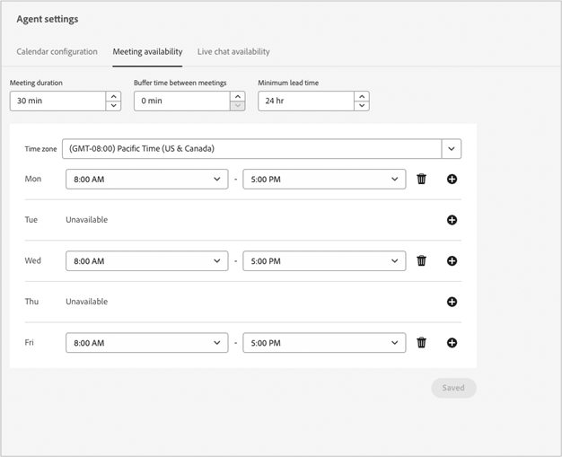

# Notas de versão do Dynamic Chat {#dynamic-chat-release}

As versões do Adobe Dynamic Chat operam em um modelo de entrega contínua que permite uma abordagem mais escalável para a implantação de recursos. Às vezes, há várias versões em um mês, portanto, verifique regularmente para obter as informações mais atualizadas.

A página das Notas de versão padrão do Marketo Engage [pode ser encontrado aqui](/help/marketo/release-notes/current.md){target="_blank"}.

## Versão de abril de 2024 {#april-release}

**Data de lançamento: 16 de abril de 2024**

### Fluxos de conversa agora disponíveis para usuários no pacote Select {#conversational-flows-select-package}

Quando lançamos o Conversational Flows no ano passado, aqueles que estão no pacote Dynamic Chat Select só puderam se beneficiar desse recurso como uma avaliação de 100 contratos vitalícios. Agora, os Fluxos de conversa estão totalmente disponíveis para todos no pacote Select.

Os engajamentos no Fluxo de conversa contarão para o limite mensal de 250 conversas engajadas para usuários no pacote Select.

### Funções de retorno de chamada {#callback-functions}

As funções de retorno de chamada permitem coletar eventos de análise de Dynamic Chat em sistemas externos, como Adobe Analytics ou Google Analytics, conforme os visitantes interagem com conversas de Dynamic Chat. Ative os eventos do Dynamic Chat Analytics registrando um retorno de chamada com a API para ouvir os eventos. Isso permite ter uma visão mais holística do engajamento do Dynamic Chat, pois ele se relaciona a outros dados importantes, como o tráfego da Web.

### Condições de disponibilidade do agente ativo adicionadas à ramificação condicional {#live-agent-availability-conditional-branching}

Além dos campos de Marketo Engage nativos e personalizados, agora é possível usar a ramificação condicional para criar ramificações com base na disponibilidade do agente. Isso é útil se você só quiser oferecer aos visitantes a opção de falar com um agente ativo quando houver agentes ativos disponíveis.

### Condição de lista inteligente adicionada à ramificação condicional {#smart-list-condition}

Com a adição da nova condição de lista inteligente de Marketo Engage na ramificação condicional, você pode criar ramificações com base em públicos pré-existentes que já foram criados no Marketo Engage em vez de definir condições de ramificação de público no Dynamic Chat.

### Ramificação condicional para Fluxos de conversa {#conditional-branching-for-conversational-flows}

Lançamos a ramificação condicional para Diálogos no início deste ano e agora você também pode aproveitar a ramificação condicional em Fluxos de conversa! A ramificação condicional permite criar ramificações no fluxo com base em condições diferentes.

### Bate-papo ao vivo para fluxos de conversa {#live-chat-for-conversational-flows}

Lançamos a funcionalidade de chat ao vivo para Diálogos em 2023, e agora você também pode adicionar envolvimentos de chat ao vivo aos seus Fluxos de conversa. Se você estiver usando Fluxos de conversa com seus formulários Marketo Engage, agora é possível permitir que visitantes qualificados conversem com um agente em tempo real imediatamente após o envio do formulário!

### Atividades recentes de Marketo Engage na Caixa de entrada do agente {#recent-marketo-engage-activities-in-agent-inbox}

Adicionamos atividades Marketo Engage recentes à seção Atividades recentes da Caixa de entrada do agente, para que, quando um visitante do site solicitar o bate-papo com um agente do, o agente possa ver rapidamente se o visitante está envolvido em qualquer uma das seguintes atividades Marketo Engage recentemente (últimas 25 atividades):

* Email aberto
* Página da Web visitada
* Preencheu formulário
* Teve um momento interessante

### Status da conexão do calendário no Gerenciamento de Agentes {#calendar-connection-status-in-agent-management}

Agora, os administradores podem ver facilmente quais agentes com permissões de reserva de reunião conectaram seus calendários no Dynamic Chat. Isso permite garantir que toda a sua equipe de vendas esteja conectada e pronta para aceitar solicitações de reunião do Dynamic Chat.

### Configuração de aviso mínimo na configuração de calendário do agente {#minimum-notice-setting-in-agent-calendar-configuration}

Os usuários relataram que os visitantes da Web estavam agendando reuniões em seus calendários com apenas 10 minutos de aviso prévio. Portanto, introduzimos uma configuração de aviso mínimo na configuração do calendário do agente e definimos o prazo de entrega padrão como 24 horas.

### Adicionar/remover comportamento do usuário atualizado {#add-remove-user-behavior-updated}

Alguns usuários indicaram que estavam com problemas ao adicionar e remover agentes no Dynamic Chat, portanto, fizemos algumas alterações para resolver esses problemas.

Quando um usuário é adicionado ao Admin Console com permissão de chat ao vivo ou reserva de reunião, ele é imediatamente exibido na lista Gerenciamento de agentes e fica disponível para adicionar a caixas de diálogo, Fluxos de conversa, regras de roteamento e equipes.

Quando um usuário com reserva de reunião ou permissões de chat ao vivo for removido do Admin Console, ele será removido imediatamente do Dynamic Chat, não estará mais disponível para bate-papo ao vivo ou roteamento de reunião e não contará mais com limites de licença.

### Melhor desempenho do relatório de nível de conversa {#improved-conversation-level-report-performance}

Os relatórios de nível de Fluxo de diálogo e conversa individuais agora são mais eficientes e precisos. Anteriormente, os relatórios de diálogo levavam vários segundos para serem carregados e os dados ocasionalmente eram inconsistentes com os relatórios de desempenho global. Agora, seus relatórios individuais da caixa de diálogo são carregados em um instante e os dados sempre estarão alinhados aos dados de relatórios globais.

### Atualizações de permissão {#permission-updates}

Limpamos a estrutura de permissões e os nomes no Adobe Admin Console para tornar o gerenciamento de permissões mais intuitivo.

* A categoria &quot;Gerenciamento de conversação&quot; agora é chamada de &quot;Conversas&quot;
* A categoria &quot;Reuniões&quot; agora é chamada de &quot;Atividades&quot;
* A categoria &quot;Configurações do agente&quot; agora é chamada de &quot;Agentes&quot;
* A categoria &quot;Configurações do administrador&quot; agora é chamada de &quot;Configuração&quot;
* A categoria &quot;Chat ao vivo&quot; foi removida e todas as permissões de chat ao vivo foram movidas para a categoria Agentes

### Suporte para hiperlinks na Caixa de entrada do agente {#support-for-hyperlinks-in-agent-inbox}

Agora, quando os agentes de chat ao vivo compartilham URLs com os visitantes no bate-papo, esses URLs são vinculados por hiperlink para que os visitantes possam simplesmente clicar neles para navegar para a página, em vez de precisarem copiar e colar o URL em seu navegador.

### Insira o comportamento-chave atualizado na Caixa de entrada do agente {#enter-key-behavior-updated-in-agent-inbox}

Alternamos o comportamento da tecla de retorno na Caixa de entrada do agente; portanto, pressionar a tecla Return ou Enter enviará sua mensagem e pressionar Shift+Enter criará uma quebra de linha.

### Página de round robin removida {#round-robin-page-removed}

Não se preocupe! O roteamento round robin ainda está totalmente funcional e opera da mesma maneira que sempre funcionou. Acabamos de remover a página que mostrava uma lista frequentemente imprecisa de agentes e sua ordem na fila de roteamento round robin.

Quando lançamos o Dynamic Chat em 2022, não havia suporte para bate-papo ao vivo, apenas agendamento de reuniões, e a página de roteamento de round robin foi projetada tendo apenas em mente as agendamentos de reuniões. Com a introdução do bate-papo ao vivo no ano passado, a página do round robin se tornou obsoleta, pois não refletia com precisão a natureza mais complexa do roteamento round robin entre agentes com reservas de reuniões e permissões de bate-papo ao vivo. Exploramos algumas opções diferentes para resolver isso, mas finalmente decidimos que removê-lo completamente era a melhor opção para minimizar a confusão.

## Versão de fevereiro de 2024 {#february-release}

**Data de lançamento: 22 de fevereiro de 2024**

### Página Conversas {#conversations-page}

A nova página Conversas fornece um ponto único para exibir transcrições de todas as conversas (automatizadas e em tempo real) que ocorreram para sua instância, de leads conhecidos e anônimos, fornecendo melhor visibilidade sobre como seus clientes estão se envolvendo com suas Caixas de diálogo, Fluxos de conversa e agentes em tempo real.

### O intervalo de datas no painel global aumentou de 90 dias para 24 meses {#date-range-in-global-dashboard}

Você pediu e nós entregamos. Agora é possível ver os dados de engajamento do Dynamic Chat por até dois anos em todos os painéis de análise.

### Ramificação condicional nas caixas de diálogo {#conditional-branching-in-dialogues}

A ramificação condicional permite criar ramificações nos fluxos de diálogo com base em condições diferentes. Agora, você pode apresentar conteúdo diferente para pessoas diferentes na mesma caixa de diálogo com base nos atributos do cliente potencial e da empresa no Marketo Engage.

## Versão de janeiro de 2024 {#january-release}

**Data de lançamento: 24 de janeiro de 2024**

### Configuração de limite de chat ao vivo simultâneo no gerenciamento de agente {#Concurrent-live-chat-limit-setting}

Por padrão, cada agente de chat ao vivo na sua instância pode participar de no máximo 5 sessões de chat ao vivo por vez. Introduzimos uma nova configuração no gerenciamento de agentes que permite ajustar esse limite de 1 a 10.

