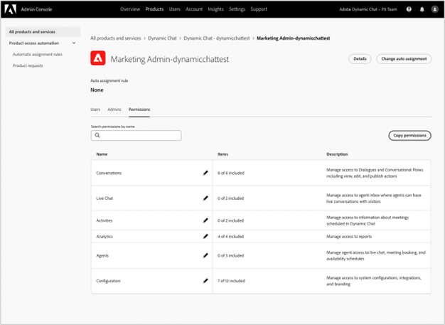

# Notas de versão do Dynamic Chat {#dynamic-chat-release}

As versões do Adobe Dynamic Chat operam em um modelo de entrega contínua, o que permite uma abordagem mais escalável para a implantação de recursos. Às vezes, há vários lançamentos em um mês, portanto, verifique regularmente para obter as informações mais atualizadas.

Para acessar a página de notas de versão padrão do Marketo Engage [clique aqui](/help/marketo/release-notes/current.md){target="_blank"}.

## Versão de junho de 2025 {#june-2025-release}

**Data de lançamento: 30 de junho de 2025**

### Renovação da lógica de roteamento {#routing-logic-revamp}

Renovamos a lógica de roteamento de chat ao vivo no Dynamic Chat para garantir um comportamento de engajamento mais inteligente e previsível em todos os tipos de roteamento (Conta, Personalizado, Equipe e Round Robin). A nova lógica simplifica os fluxos de roteamento e melhora o tratamento de fallback quando os agentes estão indisponíveis.

#### Principais melhorias no comportamento de roteamento

* **Até duas tentativas de engajamento por sessão**

   * O sistema tentará se conectar com até dois agentes (no máximo), mas estritamente dentro da regra de roteamento principal.

   * Se um agente estiver disponível, mas não responder (por exemplo, recusar ou ignorar o chat), o sistema tentará se conectar a um agente diferente do mesmo pool.

   * A lógica de fallback (como Round Robin) só será ativada se nenhum agente elegível for encontrado durante a resolução inicial, para que não seja realizada uma nova tentativa após uma falha no engajamento.

* **Comportamento específico da regra de roteamento**

##### —Roteamento de conta—

Se o domínio de email de um visitante for mapeado para uma conta conhecida, o agente mapeado sempre será priorizado.

Se o agente estiver disponível, o chat será roteado diretamente para ele.

Se o agente não estiver disponível, o sistema:

* Não tenta outro agente, mesmo se Round Robin estiver habilitado como um fallback.

* Em vez disso, ele:

   * Mostrará o calendário de reuniões do agente mapeado (se estiver habilitado),
-ou-
   * Retornará a uma mensagem padrão (pior cenário).

A regra de roteamento no nível do cartão (por exemplo, Equipe, Personalizado) só será considerada se o roteamento de conta não for elegível (nenhum domínio ou agente correspondente).

##### —Roteamento personalizado/de equipe—

Essas regras podem retornar vários agentes elegíveis.

Se o primeiro agente disponível não gera engajamento, o sistema tentará mais um agente da mesma lista.

O fallback Round Robin não é acionado apenas porque um agente não responde.

Se nenhum dos agentes gerar engajamento:

* O sistema mostrará o calendário do agente da primeira tentativa (se habilitado),
-ou-
* Exibirá a mensagem de fallback padrão.

##### —Roteamento Round Robin—

Quando usado como uma regra de roteiro principal, o sistema:

* Tenta engajar o primeiro agente disponível do pool Round Robin.

* Se o primeiro agente não responder, ele tentará novamente com o segundo melhor agente elegível.

Se Round Robin for usado como fallback, ele será ativado somente se nenhum agente for resolvido a partir da regra principal.

##### Fluxo de experiência do visitante

O sistema verifica se o roteamento de conta deve ser aplicado.

* Se sim, e o agente estiver disponível, ele se conectará imediatamente.

* Se o agente não for elegível ou não estiver disponível, ele passará para a regra de roteamento no nível do cartão.

A regra de roteamento no nível do cartão (Personalizada, Equipe, Round Robin) é avaliada.

* A disponibilidade dos agentes elegíveis é verificada (permissões, status).

* O sistema envolve um agente e, se necessário, tenta um segundo agente da mesma regra.

* Se nenhum engajamento for bem-sucedido, a lógica de fallback será aplicada:

   * Fallback de calendário (se habilitado),
-ou-
   * Mensagem padrão.

O fallback de Round Robin só é considerado quando nenhum agente elegível é encontrado na regra de roteamento principal, não quando os agentes individuais não respondem.

##### Casos de uso

_&#x200B;**Roteamento de conta**&#x200B;_

<table><thead>
  <tr>
    <th>Tipo</th>
    <th>Exemplo</th>
    <th>Resultado</th>
  </tr></thead>
<tbody>
  <tr>
    <td>Ideal</td>
    <td>O domínio do visitante é mapeado em uma conta; o agente mapeado tem o chat ao vivo habilitado e disponível</td>
    <td>O chat se conecta diretamente ao agente mapeado</td>
  </tr>
  <tr>
    <td>Fallback (Round Robin)</td>
    <td>O agente mapeado não está disponível; o fallback Round Robin está habilitado</td>
    <td>O sistema seleciona um agente disponível por meio do Round Robin e os envolve </td>
  </tr>
  <tr>
    <td>Nenhum agente de fallback</td>
    <td>O agente mapeado está indisponível, sem fallback de Round Robin; a reserva de reunião está habilitada</td>
    <td>O sistema mostra o calendário do agente mapeado ou uma mensagem de fallback padrão</td>
  </tr>
</tbody></table>

_&#x200B;**Roteamento personalizado**&#x200B;_

<table><thead>
  <tr>
    <th>Tipo</th>
    <th>Exemplo</th>
    <th>Resultado</th>
  </tr></thead>
<tbody>
  <tr>
    <td>Ideal</td>
    <td>A lógica personalizada resolve uma lista de agentes; o primeiro agente está disponível e aceita o chat.</td>
    <td>O chat se conecta ao primeiro agente.</td>
  </tr>
  <tr>
    <td>Fallback (Round Robin)</td>
    <td>A regra personalizada não resolve nenhum agente, o fallback de Round Robin é habilitado.</td>
    <td>O sistema seleciona um agente disponível por meio do Round Robin e os envolve.</td>
  </tr>
  <tr>
    <td>Nenhum agente de fallback</td>
    <td>Dois agentes resolvidos; nenhum aceita o chat, fallback definido como calendário de reuniões.</td>
    <td>O calendário do agente da primeira tentativa é exibido ou a mensagem de fallback padrão é exibida.</td>
  </tr>
</tbody></table>

_&#x200B;**Roteamento de equipe**&#x200B;_

<table><thead>
  <tr>
    <th>Tipo</th>
    <th>Exemplo</th>
    <th>Resultado</th>
  </tr></thead>
<tbody>
  <tr>
    <td>Ideal</td>
    <td>A equipe inclui agentes com chat ao vivo; o primeiro agente disponível aceita o chat.</td>
    <td>O chat se conecta a esse agente.</td>
  </tr>
  <tr>
    <td>Fallback (Round Robin)</td>
    <td>Nenhum agente de equipe disponível, e o recurso de fallback de Round Robin está habilitado.</td>
    <td>O sistema seleciona e se conecta com um agente do pool de Round Robin.</td>
  </tr>
  <tr>
    <td>Nenhum agente de fallback</td>
    <td>Dois agentes disponíveis, mas nenhum gera engajamento; fallback de calendário habilitado.</td>
    <td>O calendário do agente da primeira tentativa é exibido ou a mensagem de fallback é acionada.</td>
  </tr>
</tbody></table>

_&#x200B;**Roteamento Round Robin**&#x200B;_

<table><thead>
  <tr>
    <th>Tipo</th>
    <th>Exemplo</th>
    <th>Resultado</th>
  </tr></thead>
<tbody>
  <tr>
    <td>Ideal</td>
    <td>Round Robin pool tem vários agentes; o segundo agente aceita bate-papo após o primeiro não.</td>
    <td>O chat conecta-se ao segundo agente.</td>
  </tr>
  <tr>
    <td>Fallback (Round Robin)</td>
    <td>Não há agentes disponíveis no pool de Round Robin; o calendário de reuniões está habilitado.</td>
    <td>O calendário é exibido para o primeiro agente na lista (se configurado) ou a mensagem de fallback é exibida.</td>
  </tr>
  <tr>
    <td>Nenhum agente de fallback</td>
    <td>Não há agentes disponíveis; o fallback está desabilitado.</td>
    <td>A mensagem de fallback estática é exibida para o(a) visitante.</td>
  </tr>
</tbody></table>

### Notificação de pulso {#pulse-notification}

Sempre que um(a) visitante solicita conexão com um agente, fornecemos ao agente uma notificação do aplicativo e do navegador. Mas, às vezes, os agentes perdem esses chats.

Com esta versão, o agente ativo pode receber uma notificação por email, pelo Slack, pelo aplicativo ou pelo navegador quando um(a) novo(a) visitante tem interesse em conversar.

1. Na página inicial da Adobe Experience Cloud, clique no ícone Conta e selecione **Preferências**.

   

1. Role a tela para baixo até _Notificações_ e escolha as opções desejadas no Dynamic Chat.

   

>[!NOTE]
>
>O conteúdo de uma notificação de pulso pode ser o mesmo que usamos para notificações do aplicativo e do navegador.

## Versão de abril e maio de 2025 {#apr-may-25-release}

### Som de notificação de mensagem {#message-notification-sound}

Agora há a opção de habilitar um som para o visitante sempre que o chatbot for acionado em uma sessão. Há várias opções de sons para escolher.

### Habilitar mensagens de cutucada em dispositivos móveis {#enable-poke-messages-on-mobile}

A “cutucada”, que exibe a pergunta de abertura ao lado do ícone de chat sem que o visitante precise clicar nele para vê-la, agora pode ser habilitada para visitantes de dispositivos móveis.

### Atualização de fallback padrão {#default-fallback-update}

Para quaisquer regras ou equipes personalizadas como um cartão de chat ao vivo, se nenhum agente estiver disponível (ou o chat não puder se conectar), ele usará o Round Robin para agentes disponíveis (todos que estiverem disponíveis naquele momento, independentemente da lógica/regra de roteamento inserida no fluxo).

### Integração à Demandbase {#demandbase-integration}

Os usuários da Demandbase podem usar atributos de pessoa da Demandbase para direcionamento de diálogo, identidade visual condicional e roteamento personalizado no Dynamic Chat.

## Versão de setembro e outubro de 2024 {#sep-oct-release}

### Análise de chat ao vivo aprimorada {#enhanced-live-chat-analytics}

Vários aprimoramentos foram feitos no painel de análise, incluindo:

* Contagem total de chats ao vivo solicitados: número de visitantes solicitados para um “chat com o agente”

* Total de chats ao vivo conectados: número de visitantes conectados(as) em relação ao total dos que solicitaram um “chat com o agente”

* Total de solicitações de chat em tempo real perdidas: número de visitantes independentes em relação ao total dos que solicitaram um “chat com o agente”

* Duração média do chat em minutos: analise a “duração média do chat” entre visitantes e seus agentes

* Tempo médio de resposta do agente em segundos: analise o “tempo médio gasto” pelos agentes para responder às perguntas e respostas do chat ao vivo.

* Painel diário: solicitações de chat ao vivo conectadas com sucesso e solicitações perdidas, classificar e filtrar atividades recentes de chat ao vivo

### Pontuação de conversa {#conversation-scoring}

Quantifique seus leads com base na qualidade da interação no chat e use essa métrica como um acionador ou filtro nas campanhas inteligentes do Marketo Engage. Use o novo atributo _pontuação de conversa_ nas seguintes atividades:

* Interagiu com um diálogo
* Interagiu com um fluxo de conversa
* Interagiu com um agente

**Itens a se considerar:**

* O valor da pontuação será de 0, 1, 2, 3 (o valor padrão é nulo)

* Quando a conversa é concluída ou descartada, o valor de pontuação não pode ser editado

* Definir uma pontuação:

   * Na caixa de entrada do agente: durante um chat ao vivo, o agente pode atualizar ou definir uma pontuação para a conversa, que é armazenada na atividade da conversa

   * No designer de fluxo: no cartão de meta, o usuário pode atualizar ou definir uma pontuação para a conversa

### Nova lógica de criação de leads {#new-lead-creation-logic}

Se um lead preencher um formulário com o email `abc@test.com` e receber um cookie xyz e, posteriormente, preencher o mesmo formulário com o email `def@test.com`, um novo registro de pessoa será criado, mas o cookie xyz será associado à nova pessoa e removido da pessoa `abc@test.com`.

Assim, quando um(a) visitante com o cookie abc chegar em uma página e fornecer uma ID de email como `abc@test.com`:

<table><thead>
  <tr>
    <th>Visitante</th>
    <th>Cookie</th>
    <th>Email fornecido</th>
    <th>Comportamento esperado</th>
  </tr></thead>
<tbody>
  <tr>
    <td>Anônimo</td>
    <td>abc</td>
    <td>Não existe no banco de dados</td>
    <td>Criar uma nova pessoa</td>
  </tr>
  <tr>
    <td>Anônimo</td>
    <td>abc</td>
    <td>Existe no banco de dados</td>
    <td>Mesclar pessoa</td>
  </tr>
  <tr>
    <td>Anônimo</td>
    <td>xyz</td>
    <td>Existe no banco de dados</td>
    <td>Mesclar pessoa</td>
  </tr>
  <tr>
    <td>Pessoa conhecida</td>
    <td>abc</td>
    <td>Igual à pessoa existente</td>
    <td>Atualizar pessoa</td>
  </tr>
  <tr>
    <td>Pessoa conhecida</td>
    <td>abc</td>
    <td>Diferente da pessoa existente</td>
    <td>Se já existir uma pessoa conhecida, transfira o cookie e resolva esse perfil. Se não houver nenhuma pessoa com esse email, crie um novo registro de pessoa e transfira o cookie</td>
  </tr>
  <tr>
    <td>Pessoa conhecida</td>
    <td>xyz</td>
    <td>Igual à pessoa existente</td>
    <td>Adicionar novo cookie à mesma pessoa</td>
  </tr>
  <tr>
    <td>Pessoa conhecida</td>
    <td>xyz</td>
    <td>Diferente da pessoa existente</td>
    <td>este cenário não é possível como se fosse um novo cookie de   padrão considerado como um novo perfil anônimo</td>
  </tr>
</tbody></table>

### Opção de herdar fonte {#option-to-inherit-font}

Agora você pode habilitar o chatbot para herdar diretamente a fonte da página da web em que ele está sendo hospedado, em vez de gerenciar a fonte da marca no Dynamic Chat. Ao habilitar essa opção, o chatbot utilizará a fonte definida na tag `<body>` da página.

### Integração da Demandbase com o Dynamic Chat {#demandbase-integration-with-dynamic-chat}

Os usuários da Demandbase podem trazer sua própria licença e ativar a integração. Use os atributos de pessoa da Demandbase para obter direcionamento de diálogos, identidade visual condicional e roteamento personalizado.

A resolução desses valores de atributos em relação a uma pessoa seria feita em tempo real e esses valores seriam armazenados no perfil da respectiva pessoa.

### Otimização do tempo de carregamento do fluxo de conversa {#optimized-conversation-flow-load-time}

Para melhorar a experiência do usuário, um carregador brilhante agora é exibido em vez de um espaço em branco enquanto o fluxo de conversa é carregado.

**Antes**

**Depois**

## Versão de agosto de 2024 {#august-release}

**Data de lançamento: 23 de agosto de 2024**

### Formatar mensagens de conversa de maneira personalizada {#custom-format-conversation-messages}

Os designers de fluxo agora oferecem suporte à [inserção de HTML](/help/marketo/product-docs/demand-generation/dynamic-chat/automated-chat/stream-designer.md#create-a-stream){target="_blank"} para personalizar a aparência das suas conversas.

### Rolagem de chatbot para a parte inferior {#chatbot-scroll-to-bottom}

Um ícone foi adicionado ao chatbot para permitir que visitantes da web pulem diretamente para a última mensagem. Isso ajuda a rolar rapidamente pelo texto para voltar à conversa.

### Notificações de pulso principais {#core-pulse-notifications}

Agora os usuários recebem uma [notificação por email](/help/marketo/product-docs/demand-generation/dynamic-chat/live-chat/live-chat-overview.md#failed-action-notifications){target="_blank"} quando uma reunião agendada ou um chat ao vivo apresenta falha.

### Suporte para várias conversas {#support-for-multiple-conversations}

O chatbot agora oferece suporte a várias conversas. Visitantes do site podem participar de conversas diferentes em várias páginas ao mesmo tempo, além de alternar entre elas.

### Classificação padrão de conteúdo {#default-sorting-for-content}

Por padrão, os logs de conversa, as perguntas não respondidas e as tabelas de geração de perguntas são classificadas por data de criação (da mais recente para a mais antiga).

### Resolução de lead em tempo real {#real-time-lead-resolution}

Durante uma conversa com um lead anônimo em que uma ID de email é fornecida, descobrimos se existe um registro de lead conhecido com essa ID de email e usamos esse registro para a personalização em tempo real. Se encontrarmos vários registros, os mesclamos em tempo real. Esse comportamento é implementado para diálogos e fluxos de conversa.

### Sincronização de leads sem cookies do Marketo Engage {#syncing-leads-without-cookies}

Anteriormente, quando a sincronização do Marketo Engage era ativada, o Dynamic Chat só sincronizava leads conhecidos com uma ou mais IDs de cookie do Marketo Engage. Agora, todos os leads conhecidos (com uma ID de cookie presente ou não) serão sincronizados com o Dynamic Chat e poderão ser usados para a personalização de conversas.

### Envio de dados adicionais de visitante para fluxos de conversa {#pass-additional-visitor-data}

Se você estiver capturando informações de visitante por outros canais, como formulários ou detalhes de logon, agora é possível transmitir essas informações diretamente para o Dynamic Chat.

### Dados inferidos atualizados {#refreshed-inferred-data}

A maioria das conversas em um site é com visitantes anônimos. Você ainda pode direcioná-los por meio de dados inferidos, que dependem dos IPs de visitantes. Atualizamos nosso banco de dados de IPs e os respectivos dados inferidos que agora aceitam quatro vezes mais IPs.

### Adição de som à notificação do navegador do agente {#sound-added-to-agent-browser-notification}

Quando um chat ao vivo é atribuído a um agente, ele recebe uma notificação do navegador. Mas, às vezes, eles podem não notá-las. Agora adicionamos um [som de notificação](/help/marketo/product-docs/demand-generation/dynamic-chat/live-chat/live-chat-overview.md#when-a-live-chat-is-routed-to-an-agent){target="_blank"} para ajudar a evitar a perda de notificações.

### Capacidade de atualizar o perfil do lead durante o chat ao vivo {#update-lead-profile-during-live-chat}

Durante um chat ao vivo, os agentes desejam capturar informações sobre o visitante e atualizar o respectivo perfil. Agora há uma opção para atualizar os valores de atributo dos objetos de lead e da empresa.

## Versão de junho de 2024 {#june-release}

**Data de lançamento: 6 de junho de 2024**

### Cartão de fluxo de conversa {#conversational-flow-card}

Simplifique várias etapas em um fluxo de diálogo, aproveitando o cartão de fluxo de conversa.

Exemplo: se a meta fosse direcionar registros para o webinário por meio de vários diálogos, era necessário recriar o mesmo fluxo em todos os diálogos que incluíam essa meta. E se você precisasse atualizar algum detalhe, teria que editar cada diálogo individualmente, um de cada vez. Isso não é mais necessário, graças ao cartão de fluxo de conversa.

Além de redefinir os objetivos dos fluxos em vários diálogos, também é possível usar o mesmo fluxo de transição para acionar por outros canais, como formulários e páginas de destino.

### Limites de uso {#usage-limits}

A página Limites de uso exibe informações importantes, como detalhes do pacote e status do limite de uso.

## Versão de maio de 2024 {#may-release}

**Data de lançamento: 15 de maio de 2024**

### Biblioteca de respostas pré-aprovadas {#pre-approved-response-library}

[Crie uma biblioteca aprovada para marketing](/help/marketo/product-docs/demand-generation/dynamic-chat/generative-ai/response-library.md){target="_blank"} de perguntas e respostas geradas por IA para ajudar a configurar o chat de IA generativa em minutos.

### Perguntas não respondidas {#unanswered-questions}

[Use um repositório de perguntas não respondidas](/help/marketo/product-docs/demand-generation/dynamic-chat/generative-ai/unanswered-questions.md){target="_blank"} de conversas anteriores para gerar novas respostas pré-aprovadas, mantendo a biblioteca de respostas atualizada com as informações mais recentes.

### Resumos de conversa {#conversation-summaries}

[Forneça resumos de conversas aos agentes de vendas](/help/marketo/product-docs/demand-generation/dynamic-chat/live-chat/agent-inbox.md#conversation-summary){target="_blank"}, incluindo insights sobre os principais tópicos de discussão antes de reuniões, para reduzir o tempo de preparação e equipá-los com as informações mais recentes.

### Atalhos de vendas da IA generativa {#genai-sales-shortcuts}

[Forneça métodos mais rápidos para agentes do chat ao vivo](/help/marketo/product-docs/demand-generation/dynamic-chat/live-chat/agent-inbox.md#shortcuts){target="_blank"} acessarem as respostas geradas por IA, editarem as respostas geradas e procurarem conteúdo adicional para enviar a compradores durante a conversa.

### Ajuda da conversa {#conversation-assist}

Ajude agentes de vendas a responder suas dúvidas com precisão durante conversas ao vivo usando respostas pré-aprovadas pela equipe de marketing.

### Sugestões de conversa {#conversation-nudges}

Incentive visitantes da web com uma chamada para ação, a fim de conduzir as conversas a uma conclusão.

## Versão de abril de 2024 {#april-release}

**Data de lançamento: 23 de abril de 2024**

### Os fluxos de conversa agora estão disponíveis para todos os usuários {#conversational-flows-available-to-all-users}

Torne formulários e páginas de destino mais conversacionais e reduza o funil de vendas por permitir que leads qualificados agendem uma reunião ou um chat com o setor de vendas imediatamente após o envio de um formulário com o recurso Formulários de conversa, agora disponívei por completo&#42; para todos os usuários do Dynamic Chat.

_&#42;Disponível anteriormente como um recurso de avaliação com 100 interações vitalícias. As interações do fluxo de conversa agora contarão para o limite mensal de 250 conversas para usuários no pacote Select._

### Funções de retorno de chamada {#callback-functions}

As [funções de retorno de chamada](/help/marketo/product-docs/demand-generation/dynamic-chat/setup-and-configuration/callback-functions.md){target="_blank"} permitem coletar eventos de análise do Dynamic Chat em sistemas externos, como o Adobe Analytics ou o Google Analytics, conforme os visitantes participam de conversas do Dynamic Chat. Habilite os eventos de análise do Dynamic Chat registrando um retorno de chamada na API para monitorar os eventos. Isso permite ter uma visão mais completa do engajamento do Dynamic Chat e sua relação com outros dados importantes, como o tráfego na web. 

### Condições de disponibilidade do agente ativo adicionadas à ramificação condicional {#live-agent-availability-conditional-branching}

Além dos campos nativos e personalizados do Marketo Engage, agora é possível usar a ramificação condicional para criar ramificações com base na disponibilidade do agente. Isso é útil se você quer oferecer aos visitantes a opção de falar com um agente ativo somente quando houver algum disponível.

### Condição de lista inteligente adicionada à ramificação condicional {#smart-list-condition}

Com a adição da nova condição de lista inteligente do Marketo Engage à ramificação condicional, é possível criar ramificações com base em públicos-alvo pré-existentes que você criou no Marketo Engage, em vez de definir condições de ramificação de público-alvo no Dynamic Chat.

### Ramificação condicional para fluxos de conversa {#conditional-branching-for-conversational-flows}

Lançamos a ramificação condicional para diálogos no início deste ano e agora você também pode aproveitá-la em fluxos de conversa. A ramificação condicional permite criar ramificações no fluxo com base em diferentes condições.

### Chat ao vivo para fluxos de conversa {#live-chat-for-conversational-flows}

Lançamos a funcionalidade de chat ao vivo para diálogos em 2023 e agora é possível adicionar interações do chat ao vivo aos fluxos de conversa. Se estiver usando fluxos de conversa com seus formulários do Marketo Engage, agora é possível permitir que visitantes qualificados conversem com um agente ativo imediatamente após o envio do formulário.

### Atividades recentes do Marketo Engage na caixa de entrada do agente {#recent-marketo-engage-activities-in-agent-inbox}

Adicionamos as atividades recentes do Marketo Engage à seção Atividades recentes da caixa de entrada do agente. Dessa forma, quando um(a) visitante do site solicitar para conversar com um agente, o agente poderá ver rapidamente se o(a) visitante interagiu com alguma das seguintes atividades recentes do Marketo Engage (últimas 25 atividades):

* Abriu um email
* Visitou uma página da web
* Preencheu um formulário
* Teve um momento interessante

### Status da conexão do calendário no gerenciamento de agentes {#calendar-connection-status-in-agent-management}

Agora, admins podem ver facilmente quais agentes com permissões para agendamento de reunião conectaram seus calendários no Dynamic Chat. Isso permite garantir que toda a equipe de vendas esteja conectada e pronta para aceitar solicitações de reunião do Dynamic Chat.

### Definição de prazo mínimo para aviso na configuração de calendário do agente {#minimum-notice-setting-in-agent-calendar-configuration}

Os usuários relataram que visitantes da web estavam agendando reuniões em seus calendários com apenas 10 minutos de aviso prévio. Portanto, adicionamos uma definição de prazo mínimo para aviso na configuração de calendário do agente e definimos o prazo padrão como 24 horas.

### Atualização do comportamento de adicionar/remover usuário {#add-remove-user-behavior-updated}

Alguns usuários relataram que estavam tendo problemas ao adicionar e remover agentes no Dynamic Chat, portanto, fizemos algumas alterações para resolver esses problemas.

Ao adicionar um usuário no Admin Console com permissão para chat ao vivo ou agendamento de reunião, essa pessoa é imediatamente exibida na lista Gerenciamento de agentes e fica disponível para ser adicionada a diálogos, fluxos de conversa, regras de roteamento e equipes.

Remover um usuário com permissões de agendamento de reunião ou de chat ao vivo do Admin Console, ele também é removido imediatamente do Dynamic Chat, não estando mais disponível para o chat ao vivo ou o roteamento de reunião e não sendo contabilizado para os limites de licença.

### Aprimoramento do desempenho dos relatórios no nível da conversa {#improved-conversation-level-report-performance}

Os relatórios no nível do fluxo de conversa e do diálogo individual agora são mais eficientes e precisos. Anteriormente, os relatórios de diálogo podiam levar vários segundos para carregar e os dados podiam ser inconsistentes com os relatórios globais de desempenho. Agora os relatórios individuais de diálogo carregam em um instante e os dados estarão sempre alinhados aos dados dos relatórios globais.

### Atualizações de permissão {#permission-updates}

Otimizamos a estrutura de permissões e os nomes no Adobe Admin Console para tornar o gerenciamento de permissões mais intuitivo.

* A categoria “Gerenciamento de conversa” agora é chamada de “Conversas”
* A categoria “Reuniões” agora é chamada de “Atividades”
* A categoria “Configurações do agente” agora é chamada de “Agentes”
* A categoria “Configurações de admin” agora é chamada de “Configuração”
* A categoria “Chat ao vivo” foi removida e todas as permissões de chat ao vivo foram movidas para a categoria Agentes

### Suporte para hiperlinks na caixa de entrada do agente {#support-for-hyperlinks-in-agent-inbox}

Agora, quando os agentes de chat ao vivo compartilham URLs com visitantes no chat, esses URLs recebem um hiperlink para que visitantes possam simplesmente clicar no link e navegar para a página, em vez de precisar copiar e colar o URL no navegador.

### Atualização do comportamento da tecla Enter na caixa de entrada do agente {#enter-key-behavior-updated-in-agent-inbox}

Alteramos o comportamento da tecla Return na caixa de entrada do agente; portanto, pressionar Return ou Enter enviará sua mensagem, e pressionar Shift+Enter adicionará uma quebra de linha.

### Página de Round Robin removida {#round-robin-page-removed}

Não se preocupe. O roteamento round Robin ainda está totalmente funcional e opera da mesma maneira que sempre. Apenas removemos a página que mostrava uma lista frequentemente imprecisa de agentes e sua ordem na fila de roteamento Round Robin.

Quando lançamos o Dynamic Chat em 2022, não havia suporte para chat ao vivo e a página de roteamento Round Robin tinha sido projetada considerando apenas o agendamento de reuniões. Com a introdução do chat ao vivo no ano passado, a página de Round Robin se tornou obsoleta, pois não refletia com precisão a natureza mais complexa do roteamento Round Robin entre agentes com permissões de agendamento de reuniões e chat ao vivo. Exploramos algumas opções diferentes para resolver isso, mas finalmente decidimos que removê-lo completamente era a melhor opção para minimizar a confusão.

## Versão de fevereiro de 2024 {#february-release}

**Data de lançamento: 22 de fevereiro de 2024**

### Página Conversas {#conversations-page}

A nova página Conversas fornece um ponto único para exibir transcrições de todas as conversas (automatizadas e em tempo real) que ocorreram na sua instância, tanto de leads conhecidos quanto de anônimos, fornecendo melhor visibilidade sobre como seus clientes estão interagindo com seus diálogos, fluxos de conversa e agentes ativos.

### O intervalo de datas no painel global aumentou de 90 dias para 24 meses {#date-range-in-global-dashboard}

Você pediu e nós entregamos. Agora é possível ver os dados de engajamento do Dynamic Chat por até dois anos em todos os painéis de análise.

### Ramificação condicional nos diálogos {#conditional-branching-in-dialogues}

A ramificação condicional permite criar ramificações nos fluxos de diálogo com base em diferentes condições. Agora, você pode apresentar conteúdo diferente para pessoas diferentes no mesmo diálogo com base nos atributos do lead e da empresa no Marketo Engage.

## Versão de janeiro de 2024 {#january-release}

**Data de lançamento: 24 de janeiro de 2024**

### Configuração de limite de chats ao vivo simultâneos no gerenciamento de agente {#Concurrent-live-chat-limit-setting}

Por padrão, cada agente de chat ao vivo na sua instância pode participar de no máximo 5 sessões de chat ao vivo por vez. Adicionamos uma nova configuração no gerenciamento de agentes que permite ajustar esse limite de 1 a 10.

