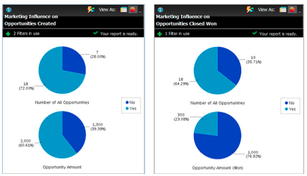

# Notas de versão: dezembro de 2012 {#release-notes-december}

A versão de dezembro inclui o muito esperado recurso **Encaminhar para Amigo**, bem como vários outros utilitários! Observe que os recursos marcados com um asterisco (&#42;) estão disponíveis apenas na Select Edition e no RCA (Revenue Cycle Analytics).

## Encaminhar para amigo {#forward-to-friend}

Habilite o compartilhamento de conteúdo com outras pessoas incluindo o link **Encaminhar para Amigo** nos seus emails. A adição de novos filtros e acionadores ajudará você a identificar seus influenciadores, identificando usuários que encaminharam um email e aqueles que receberam os emails encaminhados.

Para incluir um convite **Encaminhar para Amigo** no email, abra-o no editor e insira o token `{{system.forwardToFriendLink}}`.

Use os disparadores e filtros correspondentes para identificar os usuários que usaram o link **Encaminhar para um Amigo** e aqueles que receberam o email.

## Permissões de administrador granulares {#granular-admin-permissions}

Nossa versão mais recente oferece maior acesso e controle sobre as funções de [!UICONTROL Administrador], controlando o acesso a diferentes funções na área de [!UICONTROL Administrador] do Marketo para cada função. Ao criar uma nova função, você pode atribuir funções específicas de [!UICONTROL Administrador] que a função pode acessar.

>[!NOTE]
>
>Por padrão, as funções existentes com a permissão ‘[!UICONTROL Acessar Administrador]’ têm acesso a todas as funções de [!UICONTROL Administrador] até e a menos que sejam modificadas.

## Adaptador [!UICONTROL BrightTALK] {#brighttalk-adapter}

O adaptador Marketo [!UICONTROL BrightTALK] permite capturar informações de participação de um webcast ao vivo ou sob demanda, diretamente em um evento do Marketo!

## Marketo [!DNL Sales Insight] para [!DNL Microsoft Dynamics] {#marketo-sales-insight-for-microsoft-dynamics}

[!DNL Sales Insight] agora está disponível para [!DNL Microsoft Dynamics] clientes!

## [!DNL Dynamics] Sincronização de oportunidade {#dynamics-opportunity-sync}

Sincronizar dados da oportunidade entre o Marketo e [!DNL Microsoft Dynamics].

## Relatório de Oportunidades Influenciadas por Marketing&#42; {#marketing-influenced-opportunities-report}

Visualize qual porcentagem do pipeline e da receita de sua empresa foi influenciada por seus programas de marketing. No **[!UICONTROL Gerenciador de receita]**, agora é possível criar relatórios personalizados com o novo ponto amarelo &quot;Oportunidade influenciada por marketing&quot; na Análise de oportunidade. Você também pode usar os dois relatórios a seguir na pasta Padrão:

* Influência de marketing nas oportunidades criadas
* Influência de Marketing em Oportunidades Fechadas Ganhas

## Campos de Oportunidade Personalizados na Análise de Oportunidade do Programa&#42; {#custom-opportunity-fields-in-program-opportunity-analysis}

Adicione campos de oportunidade personalizados para enriquecer seus relatórios de Análise de Oportunidade de Programa no [!UICONTROL Gerenciador de Receita].

## Inspetor de campanhas {#campaign-inspector}

Você já se perguntou quais campanhas estão usando uma ação de fluxo específica, como [!UICONTROL Pontuação de alteração] ou [!UICONTROL Solicitar campanha]? Ou onde um determinado filtro está sendo usado? O novo [!UICONTROL Inspetor de Campanha] (disponível no Treasure Chest) permite que você identifique essas campanhas, bem como campanhas ativas e campanhas com erros.

Vá para **[!UICONTROL Admin]** > **[!UICONTROL Treasure Chest]** para habilitar o **[!UICONTROL Inspetor de Campanha]**.

