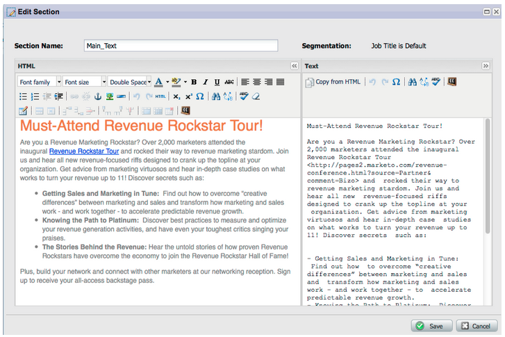

# Notas de versão: janeiro/fevereiro de 2012 {#release-notes-jan-feb}

Os seguintes recursos estão incluídos na versão de janeiro/fevereiro. Verifique a edição do Marketo quanto à disponibilidade de recursos. Volte após a versão para obter links para a documentação detalhada do recurso.

## Conteúdo dinâmico avançado {#advanced-dynamic-content}

_Disponível para versões Pro e Enterprise_

Com conteúdo dinâmico avançado, você pode criar comunicações de email e páginas de aterrissagem envolventes relevantes para o seu público-alvo sem precisar criar vários ativos para a mesma mensagem. Os Visualizadores atualizados permitem exibir cada versão exclusiva em uma única tela.

## Segmentação  {#segmentation}

_Disponível para versões Pro e Enterprise_

Segmentação é um grupo de segmentos, que são um grupo direcionado de indivíduos para os quais você comercializa. Os segmentos são definidos por regras orientadas por critérios de filtro semelhantes às smart lists. Seus segmentos podem ser baseados em dados demográficos, como cargo ou setor, ou baseados em comportamentos, como páginas da Web visitadas ou links clicados.

## Bl. conteúdo {#snippets}

_Disponível para versões Pro e Enterprise_

Armazene conteúdo avançado que pode ser usado várias vezes para criar emails estáticos ou dinâmicos e landing pages.

## PURLs {#purls}

_Disponível para versões Pro e Enterprise_

Agora, os profissionais de marketing que usam URLs personalizados (PURLs) podem criar URLs específicos de contato para impulsionar a personalização, a mensurabilidade e as respostas de lift em programas de marketing multitoque para campanhas de correspondência direta e de email.

## Suporte às diretrizes de privacidade da UE {#eu-privacy-directive-support}

Os novos recursos para respeitar as configurações de &quot;Não rastrear&quot; do navegador incluem a capacidade de desativar o rastreamento de leads anônimos; isso facilita o cumprimento das regras mais rigorosas de rastreamento de privacidade da UE.

## Login único {#single-sign-on}

Agora, as organizações podem oferecer suporte a um logon perfeito no aplicativo da Marketo usando o SAML 2.0 para logon único em um portal corporativo.

## E-mail e editores de página de aterrissagem atualizados {#updated-email-and-landing-page-editors}

Os editores de email e página de aterrissagem foram reprojetados com uma interface mais convidativa, navegação intuitiva e uma experiência do usuário drasticamente aprimorada, que inclui:

Um HTML e uma visualização de texto lado a lado

O Do nome, Do e-mail, Responder para (NOVO) e Assunto são exibidos no editor. Todas as outras configurações podem ser acessadas por meio do botão Editar configurações.

## Suporte ao navegador {#browser-support}

* Mozilla Firefox 9.0
* Google Chrome 16
* Microsoft Internet Explorer 8 e 9
* **Observação**: não há mais suporte para o Internet Explorer 7

## Gerenciamento do programa {#program-management}

O gerenciamento simplificado de programas melhora a usabilidade com a exclusão de tokens e a mais fácil exclusão de programas.

## Cancelar inscrição no relatório de inscrição {#unsubscribe-from-subscription-report}

Agora é possível cancelar a assinatura da assinatura diretamente do relatório.

## Atualizações de Munchkin {#munchkin-updates}

As novas chamadas do Munchkin reduzem o tempo de carregamento da página da Web e fornecem um desempenho mais consistente para eventos de links de cliques.

## Análise de oportunidade do programa (somente RCA) {#program-opportunity-analysis-rca-only}

Entender a contribuição de marketing para a receita de oportunidades individuais

## Análise do estágio de receita do programa {#program-revenue-stage-analysis}

Obter informações sobre a velocidade do lead do programa, entendendo quais programas adquiriram os impulsionadores rápidos

