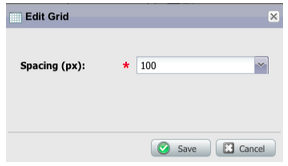
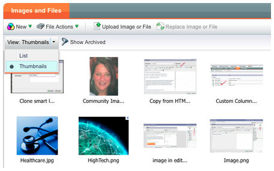
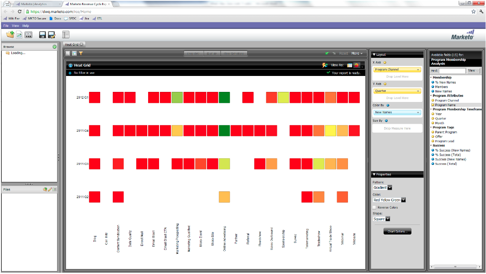

# Notas de versão: junho de 2012 {#release-notes-june}

## Aprimoramentos no gerenciamento líder do Marketo {#marketo-lead-management-enhancements}

### Renomear {#rename}

Você pode renomear suas Smart Lists, listas estáticas e campanhas. Se você estiver usando esses ativos em filtros, acionadores ou fluxos, o nome também será atualizado automaticamente nesse local. Você sempre foi capaz de renomear emails, formulários e pastas.

E, como bônus, melhoramos a inserção e a visualização do texto de descrição para ativos.

## Importar mapeamento de campos {#import-field-mapping}

Tornamos a importação de uma lista para o Marketo muito mais fácil! Durante o processo de importação, é possível mapear o nome do campo do Marketo para o nome do cabeçalho da coluna no arquivo de importação. Além disso, em [!UICONTROL Admin], você pode configurar nomes de alias que são mapeados para o nome do campo no Marketo, garantindo que seus usuários sempre selecionem o campo correto.

À medida que você continua a importar e mapear campos, o Marketo se lembra e exibe os mapeamentos durante a importação, para facilitar o uso. E para facilitar ainda mais a vida, você pode clicar no cabeçalho Valor de exemplo para ver os diferentes valores que seriam preenchidos no campo. Isso ajuda a garantir que você mapeie o campo correto todas as vezes!

## Página [!UICONTROL Resumo] para Smart Lists e Listas Estáticas {#summary-page-for-smart-lists-and-static-lists}

Você já se perguntou onde suas listas estão sendo usadas? Ou quem criou a lista ou a modificou pela última vez? A nova página de resumo, disponível em Smart Lists e listas estáticas, fornecerá esses detalhes importantes.

Nas páginas existentes de resumo do Programa e da Campanha, adicionamos também a Data de criação/usuário e as informações de Data da última modificação/usuário.

## [!UICONTROL Usado por] para o Assets {#used-by-for-assets}

Adicionamos uma nova guia às Páginas de [!UICONTROL Resumo] do nosso ativo, chamada [!UICONTROL Usado por]!

Exemplo: [!UICONTROL Usado por] para Listas Estáticas

## Linhas de grade da página de aterrissagem {#landing-page-gridlines}

A adição de linhas de grade na página de aterrissagem facilita muito o alinhamento de texto, gráficos e formulários na página de aterrissagem. Ligue-o e desligue para qualquer página de aterrissagem e também ajuste a largura entre as linhas!

## Clientes potenciais bloqueados das correspondências {#leads-blocked-from-mailings}

Ao agendar uma campanha, você pode clicar no link para ver a lista de clientes potenciais bloqueados para envio por email.

## Etapa [!UICONTROL Wait] - Token de cliente potencial e Meu Token {#wait-step-lead-token-and-my-token}

Na versão de maio, adicionamos opções avançadas à etapa de fluxo [!UICONTROL Aguardar]. Com essas alterações, você pode especificar um dia, data e hora úteis. Nesta versão, adicionamos a capacidade de usar um token na etapa de espera. Por exemplo, você pode querer usar `{{lead.Birthday}}` para enviar um email no aniversário ou usar `{{my.Event Date}}` para enviar um lembrete final de webinário.

## [!UICONTROL Exibir] como [!UICONTROL Miniaturas] no Design Studio {#view-as-thumbnails-in-design-studio}

Mude sua visualização de uma lista de imagens para uma visualização em miniatura!

Observação: a partir desta versão, a classificação anterior em grades de listas inteligentes não será aplicada à próxima lista inteligente que você visualizar. Por exemplo, se você classificar uma lista inteligente por Nome da empresa, não classificaremos automaticamente a próxima lista inteligente exibida por esse mesmo campo.

Lembrete: a atualização do Relatório de desempenho de email está em andamento!

## Aprimoramentos do Marketo Revenue Cycle Analytics {#marketo-revenue-cycle-analytics-enhancements}

### Novas métricas na análise de oportunidade do programa  {#new-metrics-in-program-opportunity-analysis}

Agora você pode obter insights sobre o número médio de contatos de marketing antes que as oportunidades sejam criadas ou fechadas, bem como o valor médio de um contato de marketing.

## Exibição de Gráficos Múltiplos {#displaying-multi-charts}

O recurso de vários gráficos permite exibir vários gráficos em um único relatório do Gerenciador de ciclo de receita. Por exemplo, você pode usar esse recurso quando quiser exibir os mesmos dados em meses diferentes. Esse recurso também evita que você tenha que criar filtros e relatórios separados.

## Tipo de Gráfico de Grade de Calor  {#heat-grid-chart-type}

As grades de calor permitem visualizar dados para que você possa identificar padrões de desempenho de marketing. Esse tipo de visualização codificará com cores os resultados para que você visualize análises comerciais complexas em uma visualização fácil de entender.

## Tipo de Gráfico de Dispersão  {#scatter-chart-type}

Os gráficos de dispersão ajudam a visualizar dados em várias dimensões em um gráfico. Esse tipo de visualização plotará uma bolha em um gráfico com base nos atributos usados. Em seguida, você pode usar uma medida para codificar por cores a bolha e/ou usar uma medida para especificar o tamanho da bolha.

