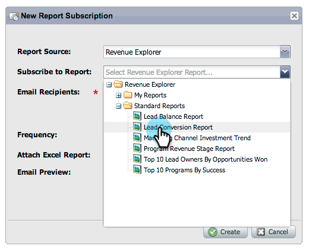

# Notas de versão: outubro de 2012 {#release-notes-october}

A versão de outubro inclui novos recursos mais interessantes! Os recursos sociais estão disponíveis como um complemento ou como parte de pacotes selecionados.

## Importar Programas e Program Exchange {#import-programs-and-program-exchange}

Um programa pode ser importado de uma assinatura do Marketo para outra. Por exemplo, você pode criar um programa em uma sandbox e importá-lo para a sua assinatura em tempo real. Além disso, você pode importar um programa pré-criado da Biblioteca de programas da Marketo.

>[!NOTE]
>
>Somente usuários do Marketo que receberam permissão de um usuário administrador do Marketo podem importar programas.
>
>Entre em contato com o Suporte da Marketo para conectar uma conta de sandbox à sua assinatura live.

## Notificações {#notifications}

As notificações o mantêm atualizado sobre os eventos do sistema que ocorrem na sua assinatura do Marketo. Por exemplo, o sistema vai notificá-lo automaticamente quando uma campanha falhar ou sua sincronização de CRM precisar de atenção. As notificações estão disponíveis na guia Meu Marketo. Além disso, você pode assinar uma notificação para recebê-la em tempo real, por email.

## Pesquisas {#polls}

Crie pesquisas para envolver seus clientes em potencial no conteúdo. Eles podem votar em sua rede favorita ou filme, e depois compartilhar a enquete com os amigos através de suas redes sociais. Você pode coletar análises avançadas sobre em que seus clientes potenciais votaram.

## Rastrear atividades sociais {#track-social-activities}

Descubra quem tem compartilhado seu conteúdo e votado em suas pesquisas criando listas inteligentes com base em atividades sociais específicas. Por exemplo, crie uma campanha inteligente para aumentar a pontuação dos leads que mais estão compartilhando seu conteúdo.

## Perfis sociais {#social-profiles}

Agora é possível coletar informações sobre seus leads ao compartilharem conteúdo ou preencherem formulários usando seus perfis sociais. Isso inclui os manipuladores do Facebook, LinkedIn e Twitter, o número de amigos que eles têm e muito mais.

## Assinaturas de Relatório do Gerenciador de Receita {#revenue-explorer-report-subscriptions}

Crie assinaturas de relatório e envie relatórios do Revenue Explorer periodicamente para suas principais partes interessadas, incluindo usuários não pertencentes à Marketo. O email contém uma pré-visualização da tabela ou dos gráficos de dados do relatório e uma planilha do Excel com todos os dados do relatório.

>[!NOTE]
>
>Disponível somente para usuários que têm o Gerenciador de receita ao adquirir o Revenue Cycle Analytics com o Enterprise ou o Select Edition.
