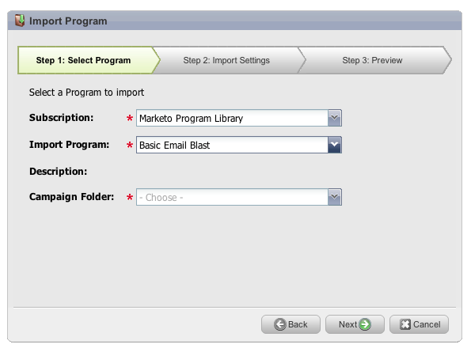

# Notas de versão: Outubro de 2012 {#release-notes-october}

A versão de outubro inclui novos recursos interessantes! Os recursos sociais estão disponíveis como um complemento ou como parte de pacotes selecionados.

## Importar Programas e Intercâmbio de Programas {#import-programs-and-program-exchange}

Um programa pode ser importado de uma assinatura Marketo para outra. Por exemplo, você pode criar um programa em uma sandbox e depois importá-lo para a sua assinatura ativa. Além disso, você pode importar um programa pré-criado da Biblioteca de programas da Marketo.

>[!NOTE]
>
>Somente usuários do Marketo que tenham recebido permissão de um usuário administrador do Marketo podem importar programas.
>
>Entre em contato com o Suporte da Marketo para conectar uma conta sandbox à sua assinatura ativa.

## Notificações {#notifications}

As notificações mantêm você atualizado sobre os eventos do sistema que acontecem na sua assinatura do Marketo. Por exemplo, o sistema notificará você automaticamente quando uma campanha falhar ou a sincronização do CRM precisar de atenção. As notificações estão disponíveis na guia Minha Marketo . Além disso, você pode assinar uma notificação para que possa recebê-las em tempo real, em seu email.

## Pesquisas {#polls}

Crie pesquisas para envolver seus leads em seu conteúdo! Eles podem votar em sua rede ou filme favorito e depois compartilhar a pesquisa com amigos por meio de suas redes sociais. Você pode coletar análises avançadas sobre o que seus leads votaram.

## Rastrear atividades sociais {#track-social-activities}

Descubra quem tem compartilhado seu conteúdo e votado em suas pesquisas criando listas inteligentes com base em atividades sociais específicas. Por exemplo, crie uma campanha inteligente para aumentar a pontuação dos leads que estão compartilhando mais seu conteúdo!

## Perfis sociais {#social-profiles}

Agora é possível coletar informações sobre seus leads quando eles compartilham conteúdo ou preenchem formulários usando seus perfis sociais. Isso inclui Facebook, LinkedIn e identificadores de Twitter, o número de amigos que eles têm e muito mais.

## Subscrições do Relatório do Explorador de Receitas {#revenue-explorer-report-subscriptions}

Crie assinaturas de relatórios e envie relatórios do Revenue Explorer periodicamente para seus principais participantes, incluindo usuários que não são da Marketo. O email contém uma pré-visualização da tabela ou gráficos de dados do relatório e uma planilha do Excel com todos os dados do relatório.

>[!NOTE]
>
>Disponível somente para usuários que têm o Explorador de Receita, comprando o Revenue Cycle Analytics com o Enterprise ou o Select Edition.
