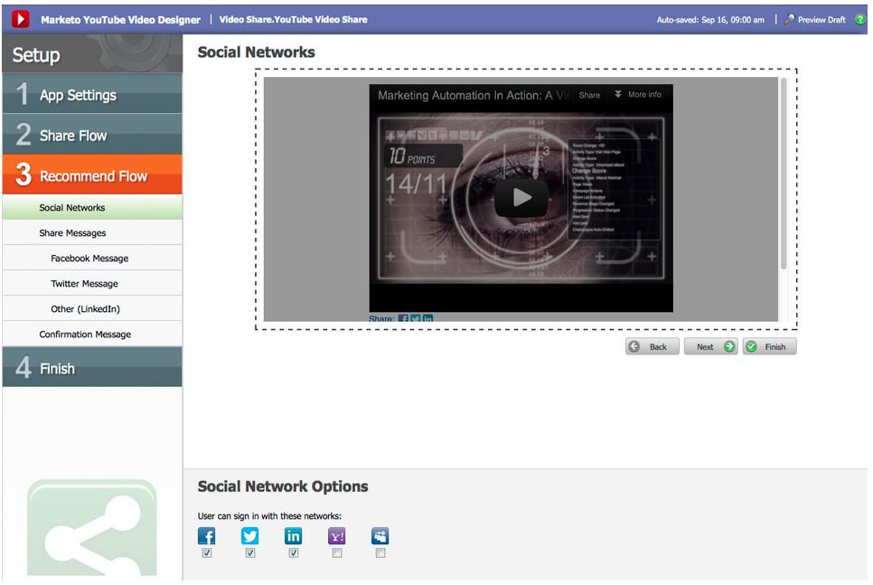

# Notas de versão: setembro de 2012 {#release-notes-september}

Esta versão inclui recursos sociais altamente previstos e integrados, além de utilidades de gerenciamento de clientes potenciais! Observação: os recursos sociais estão disponíveis como um complemento ou como parte de pacotes selecionados.

## Vídeo do Publish a YouTube com compartilhamento em redes sociais {#publish-a-youtube-video-with-social-sharing}

Amplifique o público-alvo de seus vídeos incentivando seus visitantes a compartilhá-los socialmente, usando o novo Compartilhamento de vídeo em suas páginas de aterrissagem.

## Adicionar um botão Compartilhar {#add-a-share-button}

Personalize totalmente as mensagens de compartilhamento e a aparência de um novo conjunto de botões de compartilhamento social. Além disso, capture dados do perfil social enquanto seus clientes em potencial compartilham seu conteúdo.

## Login na rede social {#social-sign-on}

Obter insight e reduzir o atrito, permitindo que os clientes potenciais preencham formulários previamente com informações de suas redes sociais.

## Páginas de aterrissagem do Publish para o Facebook {#publish-landing-pages-to-facebook}

Estenda o alcance das páginas de aterrissagem publicando-as diretamente no Facebook, com aplicativos sociais, formulários e toda a funcionalidade das páginas de aterrissagem do Marketo.

## Adaptador de Eventos ReadyTalk {#readytalk-event-adapter}

Conecte facilmente um evento do Marketo a uma reunião do ReadyTalk. Use um formulário do Marketo para capturar inscritos e registrá-los automaticamente no ReadyTalk. Uma sincronização bidirecional permite que as informações de participação sejam preenchidas no Marketo.

## Microsoft Dynamics No Local {#microsoft-dynamics-on-premise}

Agora oferecemos suporte ao Microsoft Dynamics 2011 no local com uma implantação para a Internet.

## Webhooks (tórax do tesouro) {#webhooks-treasure-chest}

Um Webhook é um retorno de chamada HTTP definido pelo usuário. É uma ótima maneira de enviar dados do Marketo para qualquer outro serviço. No momento, esse recurso está disponível no Treasure Chest e só é compatível com campanhas de acionadores.

Exemplos de como você pode usar Webhooks incluem: publicar informações de nome de usuário e senha em outro sistema para criar uma conta de avaliação; enviar uma mensagem de texto SMS quando você obtém um novo lead.

## Atualização para a API getMultipleLeads {#update-to-getmultipleleads-api}

Adicionamos novos critérios de filtragem à chamada da API getMultipleLeads. Além da filtragem por data, agora há suporte para critérios adicionais:

* Intervalos de datas
* Nomes de lista estáticos
* Matrizes de chaves de lead
