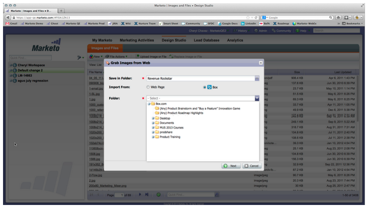
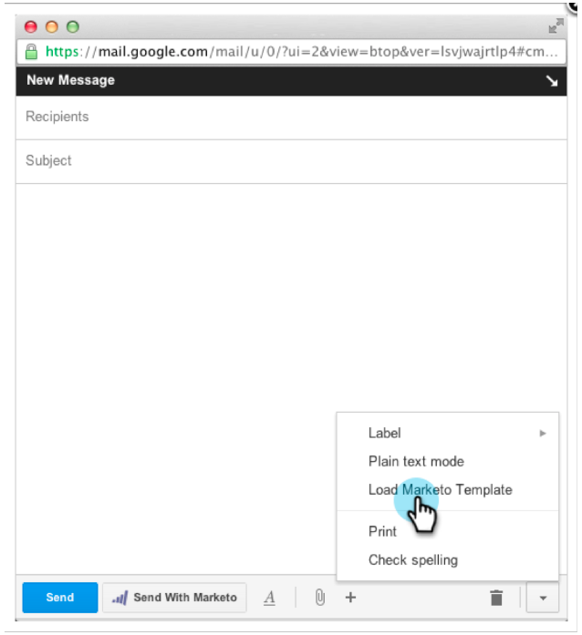

# Notas de versão: abril de 2013 {#release-notes-april}

Os recursos a seguir estão incluídos na versão de abril.

## [!DNL Box] Integração {#box-integration}

Conecte o Marketo com sua conta [!DNL Box] para copiar facilmente arquivos para o design studio.

## Plug-in [!DNL Gmail] {#gmail-plugin}

Se você usa o Marketo [!DNL Sales Insight] e o [!DNL Gmail], é possível instalar nosso novo plug-in [!DNL Gmail] por meio da loja [!DNL Chrome]. O plug-in permite registrar mensagens com o Marketo, carregar modelos de email do Marketo e enviar mensagens com recursos de rastreamento do Marketo.

## Análise de e-mails {#email-analysis}

Crie relatórios de email avançados no [!UICONTROL Revenue Explorer], como o relatório Click Activity Heat Grid. Este relatório informará ao insight o dia e a hora em que as pessoas estão clicando nos links de seus emails.

O recurso Análise de email como um todo será ativado em fases durante abril e maio, à medida que migramos seus dados de email de 2012 e 2013. Em outras palavras, alguns clientes terão acesso a esse recurso mais cedo do que outros.

## APIs de programa {#program-apis}

Suporte para programas na chamada de API do SOAP, incluindo acesso somente leitura a dados de programas, como: contagens de associação de programas, adquiridas por, sucesso, configurações, canais, tags, tokens e custos. Consulte a documentação da API do SOAP para obter mais detalhes.

## Aprimoramento de [!DNL ON24] {#on-enhancement}

O Cargo e o Nome da Empresa serão sincronizados com [!DNL ON24] a partir do formulário de registro do Marketo.
