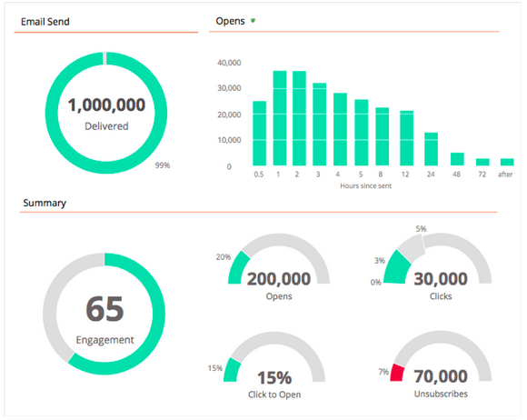

# Notas de versão: dezembro de 2013 {#release-notes-december}

Os recursos a seguir estão incluídos na versão de dezembro.

Após o lançamento, verifique a guia Nova versão na Comunidade para obter artigos detalhados da Base de conhecimento para cada recurso.

## Programa de email {#email-program}

Enviar um email nunca foi tão fácil. Use o novo [programa de email](/help/marketo/product-docs/email-marketing/email-programs/creating-an-email-program/understanding-email-programs.md) para enviar um email em lote, em vez do Programa Padrão. Defina a lista inteligente, envie um e-mail, programe-a e você estará desligado!

Verifique também o novo [Painel de Métricas de email](/help/marketo/product-docs/email-marketing/email-programs/email-program-data/view-the-email-program-dashboard.md) para ver o desempenho do seu email.

## Teste A/B de e-mail {#email-a-b-testing}

No novo Programa de email, execute um [teste A/B](/help/marketo/product-docs/email-marketing/email-programs/email-program-actions/email-test-a-b-test/add-an-a-b-test.md) sobre uma porcentagem da população geral de envio de email. Escolha entre 4 tipos diferentes de testes: Linha de assunto, Endereço do remetente, Data/hora e Email completo. Você pode até mesmo optar por promover manualmente o vencedor ou deixar que o sistema o promova com base em um critério vencedor predefinido. O novo programa de email, incluindo o teste A/B, pode ser aninhado em Eventos e no Programa padrão para tornar o envio desse email tão simples!

## Teste de e-mail Champion/Challenger {#email-champion-challenger-testing}

[O teste Champion/Challenger](/help/marketo/product-docs/email-marketing/general/functions-in-the-editor/email-tests-champion-challenger/add-an-email-champion-challenger.md) é semelhante ao teste A/B, mas a diferença é que ele é usado para emails acionados e você não envia automaticamente um vencedor. Esse teste permite desafiar uma maneira estabelecida de fazer algo, chamada de Campeão, e você testa se ainda é o melhor introduzindo um Desafiador. Além disso, os Testes de e-mail de Especialista/Desafiador podem ser usados nos fluxos do programa Engajamento.

## Detalhes do cliente potencial na [!UICONTROL Análise de email] {#lead-details-in-email-analysis}

Introduzimos atributos adicionais de cliente potencial e empresa na [!UICONTROL Análise de email]. Agora você pode exibir suas estatísticas de email agrupadas por novos atributos, como [!UICONTROL Setor] e [!UICONTROL Source líder].

## Adaptador de Eventos [!DNL BrightTALK] Aprimorado {#enhanced-brighttalk-event-adapter}

Agora é possível transferir inscritos para o Marketo do canal e evento do [!DNL BrightTALK]. Você pode usar essas informações para informar outras campanhas de marketing!
