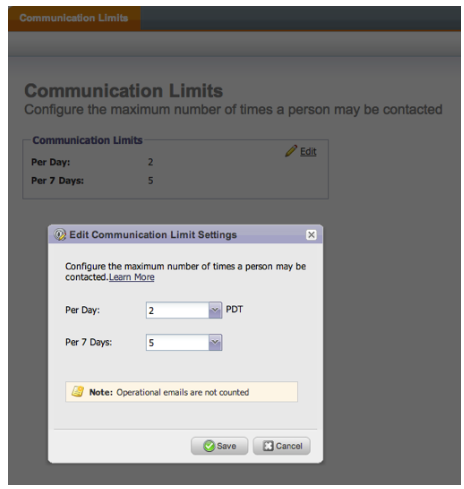

# Notas de versão: julho de 2013 {#release-notes-july}

Os recursos a seguir estão incluídos na versão de julho, programada para ser implantada na sexta-feira, 26 de julho.

## Widget de conteúdo esgotado no painel {#exhausted-content-widget-on-the-dashboard}

Fornece informações sobre quando os clientes potenciais esgotarão o conteúdo no Fluxo. O sistema fornecerá informações sobre quantos leads estão prestes a atingir o conteúdo esgotado ou há quanto tempo.

## Limites de comunicação {#communication-limits}

Deseja parar de enviar clientes em potencial por email? Agora é fácil limitar automaticamente a frequência a cada indivíduo. Basta definir um limite de comunicação diário e semanal, e o sistema fará o resto. Disponível em Select, Enterprise e com o pacote complementar para clientes do Standard.

## Interface do usuário cobalto {#cobalt-user-interface}

Nos próximos meses, você observará mais do nosso novo tema sendo lançado em diferentes partes do aplicativo. Nenhuma funcionalidade será movida ou removida.

## Coluna de Data do Membro do Programa {#program-member-date-column}

Exibir e classificar a grade do membro pela data em que o lead foi adicionado.

## Alterações na verificação ortográfica no editor do WYSIWYG {#changes-to-spell-check-in-wysiwyg-editor}

O serviço usado pelo editor do WYSIWYG para verificação ortográfica foi descontinuado. Removemos o botão Verificação ortográfica do editor até encontrarmos uma substituição.
