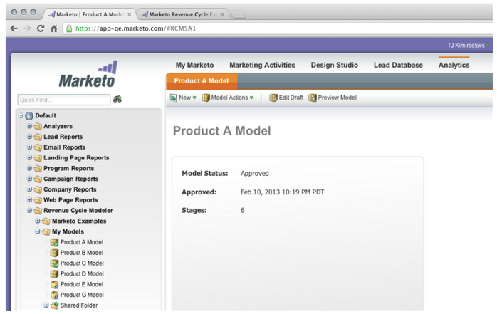

# Notas de versão: junho de 2013 {#release-notes-june}

Os recursos a seguir estão incluídos na versão de junho.

## Idiomas adicionais do usuário {#additional-user-languages}

Veja a interface do Marketo Lead Management no seu idioma preferido, agora com suporte para espanhol e português.

## Interface do usuário cobalto {#cobalt-user-interface}

Nos próximos meses, você observará um novo tema implantado em diferentes partes do aplicativo; afetando as janelas modais, por exemplo.

## Clonagem de subpastas {#subfolder-cloning}

Clonar ativos em subpastas.

## Vários modelos {#multiple-models}

Uma ideia importante do Revenue Cycle Analytics (RCA) na Comunidade, esse recurso permite criar vários modelos para obter uma compreensão mais detalhada do seu funil de receita por linha de produto, unidade de negócios ou região. Os relatórios Leads by Revenue Stage, Success Path Analyzer, Program Analyzer e Revenue Explorer agora oferecem suporte à capacidade de selecionar um modelo específico para relatórios.

Por padrão, dois modelos estão disponíveis para Select SMB Edition e quinze modelos para Enterprise Edition. Você também pode comprar modelos adicionais.

