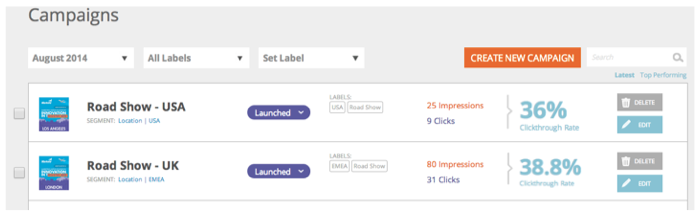

# Notas de versão: agosto de 2014 {#release-notes-august}

Os recursos a seguir estão incluídos na Versão de agosto de 2014. Verifique a edição do Marketo quanto à disponibilidade de recursos. Volte após a versão para obter links para a documentação detalhada do recurso.

## Licenças do Calendário de Marketing {#marketing-calendar-licenses}

Depois de 5 de setembro de 2014, apenas 5 usuários poderão ter acesso gratuito ao calendário de marketing. Certifique-se de [Emitir/Revogar uma Licença do Calendário de marketing](/help/marketo/product-docs/core-marketo-concepts/marketing-calendar/understanding-the-calendar/issue-revoke-a-marketing-calendar-license.md) para os usuários de sua escolha antes para ter acesso ininterrupto.

## Novas permissões de usuário {#new-user-permissions}

As novas permissões de usuário a seguir foram adicionadas:

| Permissão | Descrição |
|---|---|
| Acessar gerenciador de receitas | Se você adquiriu a RCA, agora terá controle sobre quem pode acessá-la. |
| Importar lista | Impedir que usuários importem listas para o banco de dados de clientes potenciais. |
| Importação de lista | Impeça que os usuários importem listas por meio de um programa em atividades de marketing. |
| Ativar campanha com gatilho | Controle quem pode ou não ativar campanhas de acionador. |
| Programar campanha em lote | Controle quem pode ou não programar execuções de campanha em lote. |

## Exportar Usuários e Funções de [!UICONTROL Administrador] {#export-users-and-roles-from-admin}

Agora você pode [Exportar uma Lista de Usuários e Funções](/help/marketo/product-docs/administration/users-and-roles/export-a-list-of-users-and-roles.md) da Marketo. Você também pode incluir um carimbo de data e hora de &quot;Último logon&quot; na exportação.

## Excluir canais e tags {#delete-channels-and-tags}

Agora você pode excluir qualquer canal e status não utilizados. Como sempre, você só pode ocultar um que esteja em uso no momento.

## Automatizado [!DNL DKIM] {#automated-dkim}

Para melhorar a capacidade de entrega, todos os emails de saída serão assinados por [!DNL DKIM] (DomainKeys Identified Mail). Por padrão, os emails usarão a assinatura [!DNL DKIM] compartilhada da Marketo. Você terá a opção de personalizar esta assinatura.

>[!NOTE]
>
>[!DNL DKIM]será implantado lentamente. Talvez você não o veja por algumas semanas.

## Atualizações do Real-Time Personalization {#real-time-personalization-updates}

Adicionamos rótulos à página da campanha para que você possa adicionar tags ao seu conteúdo cardíaco.

## Direcionamento móvel {#mobile-targeting}

Você perguntou sobre a comunidade e nós entregamos! Agora é possível incluir, excluir ou definir uma call to action específica para usuários de dispositivos móveis e tablets.

## Segmentação e direcionamento :1 aprimorados {#enhanced-segmentation-and-targeting}

Agora você pode usar operadores de filtro avançados para direcionar visitantes conhecidos.

## Compartilhamento de campanha {#campaign-sharing}

Agora é possível compartilhar de maneira rápida e fácil um link de visualização de campanha RTP.

## Relatório do mecanismo de recomendação de conteúdo {#content-recommendation-engine-report}

Adicionamos um novo relatório de mecanismo de recomendação de conteúdo para que você veja um bom resumo.

## Administração de usuário aprimorada {#enhanced-user-administration}

Os usuários administradores agora podem bloquear usuários devido a várias tentativas de logon com falha. Também é possível desbloquear esses usuários, se desejado.

## Controle de rastreamento {#tracking-control}

Agora é possível excluir IPs específicos de todos os rastreamentos e relatórios no Real-Time Personalization.

