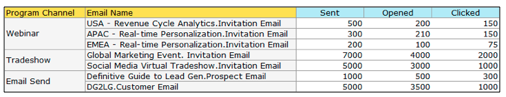

# Notas de versão: Fevereiro de 2014 {#release-notes-february}

Os seguintes recursos foram incluídos na versão de fevereiro de 2014. Verifique sua Marketo Edition para ver a disponibilidade dos recursos. Depois do lançamento, volte para encontrar links para artigos detalhados da Base de conhecimento de cada recurso!

## Pontuação de envolvimento como critérios obtidos {#engagement-score-as-winning-criteria}

[Use a ](/help/marketo/product-docs/email-marketing/email-programs/email-program-actions/email-test-a-b-test/define-the-a-b-test-winner-criteria.md) pontuação de engajamento para determinar a variante vencedora em seu teste A/B de divisão ou no teste de Campeão/Desafiador. O teste deve ser executado por um mínimo de 24 horas, para fornecer uma pontuação de engajamento adequada.

## Guia Resultados do Programa de Email {#email-program-results-tab}

[Visualize os ](/help/marketo/product-docs/email-marketing/email-programs/email-program-data/view-email-program-results.md) resultados e atividades registradas para o programa de email.

## Pessoas/Clientes Potenciais Bloqueados de Correspondência {#people-leads-blocked-from-mailing}

[Clique no número de pessoas/leads bloqueados da ](/help/marketo/product-docs/email-marketing/email-programs/managing-people-in-email-programs/define-an-audience-with-a-smart-list.md) correspondência para ver quem não receberá o email devido à sua unsubscription, inclusão na lista negra, posse de um endereço de email inválido ou em branco ou suspensão de marketing.

## Exportar dados de programa de email {#export-email-program-data}

[Exporte métricas de email para o Excel](/help/marketo/product-docs/email-marketing/email-programs/email-program-data/export-email-program-dashboard-to-excel.md), incluindo dados de variante do Teste AB.

## Pontuação de engajamento no relatório de desempenho do fluxo de engajamento {#engagement-score-in-engagement-stream-performance-report}

Adicionamos a Pontuação de engajamento ao [Relatório de desempenho do fluxo de engajamento](/help/marketo/product-docs/email-marketing/drip-nurturing/reports-and-notifications/engagement-stream-performance-report.md) para ajudá-lo a ver a eficácia do conteúdo em seu programa de engajamento.

## Detalhes do programa na análise de e-mail {#program-details-in-email-analysis}

[Agora é possível agrupar suas métricas de email por Nome do programa, Canal e Tags](/help/marketo/product-docs/reporting/revenue-cycle-analytics/email-analysis/build-an-email-analysis-report-that-shows-program-information.md). O nome do programa é adicionado ao campo Nome de email quando o email é um ativo local do Programa. O novo campo Nome do programa mostra o nome do programa da campanha inteligente que enviou o email. Isso pode ser diferente do programa no campo Nome de email se o email for um ativo local de um programa diferente.

## Atualizar para Cliques Vincular filtros e Acionador {#update-to-clicks-link-filters-and-trigger}

Os seguintes nomes de filtro e acionador foram atualizados:

* Link de cliques para o link de cliques na página da Web
* Link clicado para link clicado na página da Web
* Link não clicado para link não clicado na página da Web

## Melhorias de formulários 2.0 {#forms-enhancements}

Fornecemos ao Forms 2.0 várias atualizações de &quot;qualidade de vida&quot; com esta versão. Além de ativar a criação de perfil progressiva em formulários incorporados, fizemos alterações no fluxo de trabalho e no UX que facilitarão o uso da funcionalidade mais avançada no editor, [incluindo as regras de visibilidade](/help/marketo/product-docs/demand-generation/forms/form-fields/dynamically-toggle-visibility-of-a-form-field.md), páginas avançadas de agradecimento e campos ocultos.

