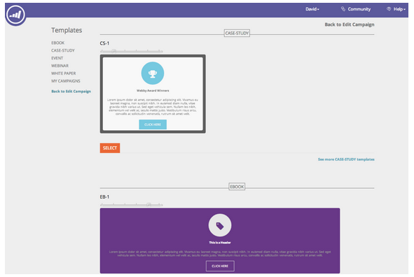

# Notas de versão: julho de 2014 {#release-notes-july}

Os recursos a seguir estão incluídos na versão de julho de 2014. Verifique a disponibilidade de recursos na sua Marketo Edition. Volte após a versão para obter links para a documentação detalhada do recurso.

## Calendário de marketing {#marketing-calendar}

Veja todos os seus eventos, e-mails e muito mais em todos os programas. [Este novo produto](/help/marketo/product-docs/core-marketo-concepts/marketing-calendar/understanding-the-calendar/navigating-the-marketing-calendar.md) estará disponível sem custo para clientes com 10 ou menos usuários do [!DNL Marketo Lead Management] ou do Diálogo.

A documentação do Calendário de marketing estará disponível no momento do lançamento.

## Interface com novo visual {#new-look-and-feel}

O [!DNL Marketo Lead Management] será atualizado com uma nova aparência moderna e elegante, incluindo uma navegação atualizada.

## Operadores de data {#date-operators}

[Filtros avançados](/help/marketo/product-docs/core-marketo-concepts/smart-lists-and-static-lists/creating-a-smart-list/smart-list-filter-operators-glossary.md) para &quot;[!UICONTROL no passado antes]&quot;, &quot;[!UICONTROL no futuro]&quot; e &quot;[!UICONTROL no futuro após]&quot;. Por exemplo, encontre leads com uma data de nascimento nos próximos 3 meses ou um contrato que expira após 6 meses.

## Exibir programação de programas {#program-schedule-view}

Além do calendário de marketing com o qual você gerencia seus eventos e programas padrão, há uma nova visualização de cronograma diretamente no programa.

* Reprogramar todas as datas de uma só vez
* Novas Datas Provisórias - escreva a lápis!
* Tipos de entrada personalizados - ToDo, Press Release, qualquer coisa que você desejar

## Operações de lista na API REST {#list-operations-in-the-rest-api}

Adicionamos as chamadas abaixo relacionadas às operações de lista no ReST. Consulte [https://experienceleague.adobe.com/en/docs/marketo-developer/marketo/rest/rest-api](https://experienceleague.adobe.com/en/docs/marketo-developer/marketo/rest/rest-api) para obter a documentação completa.

* Obter Lista por ID
* Obter Várias Listas
* Importar para a lista
* Obter Status de Importação para Lista

## Importação rápida de lista {#fast-list-import}

Mais de **50x mais rápido**, seus arquivos serão ampliados para o Marketo! As opções de importação antigas &quot;Normal&quot; e &quot;Otimizado para novos clientes em potencial&quot; foram substituídas por &quot;Padrão (Importação rápida)&quot;.

A opção &quot;Ignorar novos clientes em potencial e atualizações&quot; permanece inalterada.

## Novo Munchkin aprimorado! {#new-improved-munchkin}

A implantação será preparada a partir de meados de julho e continuará pelos próximos meses.

* Remove a dependência [!DNL jQuery] para compatibilidade total e futura
* Mais compatível com outros JavaScript no seu site
* Totalmente testado em muitos sites no ano passado!

## RTP: modelos de campanha em tempo real do Personalization {#rtp-real-time-personalization-campaign-templates}

A página RTP Definir Campanha agora [inclui modelos prontos](/help/marketo/product-docs/web-personalization/using-templates/using-templates-to-create-web-campaigns.md). Escolha entre uma variedade de estilos, incluindo webinários, estudos de caso, e-books.

## RTP: melhorias na API do JavaScript {#rtp-javascript-api-enhancements}

Nova chamada de API RTP para obter dados do visitante em tempo real, como organização, setor, localização e correspondência de código de segmento. Além disso, passar o mouse sobre um nome de segmento na página Segmentos revelará uma dica de ferramenta que mostra o código do segmento. Consulte nosso [site de desenvolvedores](https://experienceleague.adobe.com/en/docs/marketo-developer/marketo/javascriptapi/rich-media-recommendation) para obter a documentação completa.

## RTP: suporte ao HTML5 no Editor de conteúdo do Campaign {#rtp-html-support-in-campaign-content-editor}

O editor de conteúdo do WYSIWYG na página Definir campanhas agora tem compatibilidade total com o HTML5. Clique no ícone &quot;HTML&quot; no editor para inserir qualquer código HTML5.
