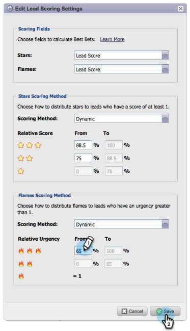

# Notas de versão: junho de 2014 {#release-notes-june}

Os recursos a seguir estão incluídos na versão de junho de 2014. Verifique a disponibilidade de recursos na sua Marketo Edition.

## Interface atualizada - Em breve! {#updated-ui-coming-soon}

Uma nova aparência, incluindo navegação para [!DNL Marketo Lead Management], será lançada em breve em uma versão posterior!

## Plug-in do [!DNL Sales Insight] para [!DNL Outlook] 2013 {#sales-insight-plugin-for-outlook}

Isso exigirá o download do novo plug-in. Você pode baixá-lo de [aqui](/help/marketo/product-docs/marketo-sales-insight/msi-outlook-plugin/install-the-marketo-email-add-in-for-outlook-with-a-registration-code.md).

## Resolução do token {#token-resolution}

Ao enviar um email de teste de [!DNL Sales Insight], os tokens atuais no email não são resolvidos e o valor padrão é enviado. Esse aprimoramento garantirá a resolução dos tokens nos e-mails teste.

## Personalizar porcentagens para estrelas e chamas {#customize-percentages-for-stars-and-flames}

[Defina a porcentagem](/help/marketo/product-docs/marketo-sales-insight/msi-for-salesforce/features/stars-and-flames/customize-stars-and-flames.md) de leads que recebem 1, 2 ou 3 estrelas e chamas.

## API REST do lead {#lead-rest-api}

Crie, leia e atualize leads programaticamente por meio de nossa API ReST. Para começar a usar a ReST, você precisa [criar um serviço personalizado](/help/marketo/product-docs/administration/additional-integrations/create-a-custom-service-for-use-with-rest-api.md) no Marketo. Em seguida, vá para o [site de desenvolvedores](https://experienceleague.adobe.com/pt-br/docs/marketo-developer/marketo/rest/rest-api) para obter detalhes sobre como usar esta API.

## Atualização da página de campanhas de personalização em tempo real (RTP, Real-Time Personalization) do Marketo {#marketo-real-time-personalization-rtp-campaigns-page-update}

As campanhas RTP agora incluem um novo design com exibições de miniaturas e desempenho de campanha. Além disso, você pode [organizar suas campanhas](/help/marketo/product-docs/web-personalization/working-with-web-campaigns/sort-web-campaigns-by-latest-or-top-performing.md) de acordo com a data ou o desempenho principal.

## Integrações do Web Analytics {#web-analytics-integrations}

Anexe todos os dados RTP na plataforma de análise da Web.

A integração com o [Google Analytics](/help/marketo/product-docs/web-personalization/reporting-for-web-personalization/web-analytics-integrations/integrate-rtp-with-google-analytics.md) (GA) agora está habilitada por padrão. Portanto, em Configurações da Conta, ative o comutador para o qual você deseja enviar dados para variáveis e eventos personalizados do GA.

Também concluímos a integração com o [Adobe SiteCatalyst](/help/marketo/product-docs/web-personalization/reporting-for-web-personalization/web-analytics-integrations/integrate-with-adobe-analytics.md).
