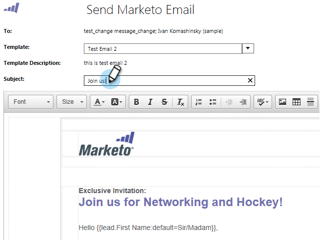

# Notas de versão: outubro de 2014 {#release-notes-october}

Verifique a edição do Marketo quanto à disponibilidade de recursos. A documentação será fornecida no momento do lançamento.

## Foco do programa no calendário de marketing {#program-focus-in-marketing-calendar}

[Crie e edite entradas](/help/marketo/product-docs/core-marketo-concepts/marketing-calendar/understanding-the-calendar/understand-enable-program-focus.md) diretamente do calendário de marketing.

## Novas chamadas da API REST {#new-rest-api-calls}

Use a API para obter novas atividades ou alterações em clientes potenciais:

* Obter alterações de cliente potencial
* Obter atividades de cliente em potencial
* Obter tipos de atividade
* Obter token de paginação

Detalhes completos estarão disponíveis após o lançamento em [https://experienceleague.adobe.com/pt-br/docs/marketo-developer/marketo/rest/rest-api](https://experienceleague.adobe.com/pt-br/docs/marketo-developer/marketo/rest/rest-api).

## MSI - Enviar Email do Marketo para [!DNL Microsoft Dynamics] {#msi-send-marketo-email-for-microsoft-dynamics}

[Enviar e rastrear emails de vendas](/help/marketo/product-docs/marketo-sales-insight/msi-for-microsoft-dynamics/setting-up-and-using/send-a-marketo-sales-email-from-microsoft-dynamics.md) para clientes potenciais e contatos de [!DNL Microsoft Dynamics].

## MSI - Adicionar às Campanhas do Marketo para [!DNL Microsoft Dynamics] {#msi-add-to-marketo-campaigns-for-microsoft-dynamics}

[Adicione clientes em potencial e contatos às campanhas inteligentes](/help/marketo/product-docs/marketo-sales-insight/msi-for-microsoft-dynamics/setting-up-and-using/add-a-lead-contact-to-a-marketo-campaign-from-microsoft-dynamics.md) do Marketo diretamente de [!DNL Microsoft Dynamics]. Marketing pode escolher quais campanhas do Marketo estão disponíveis para vendas.

## Suporte à Entidade Personalizada para Sincronização de [!DNL Microsoft Dynamics] {#custom-entity-support-for-microsoft-dynamics-sync}

[Usar dados do objeto personalizado](/help/marketo/product-docs/crm-sync/microsoft-dynamics-sync/microsoft-dynamics-sync-details/enable-sync-for-a-custom-entity.md) de [!DNL Microsoft Dynamics] para filtrar e acionar listas inteligentes, campanhas inteligentes, programas...

## Suporte de Acionista para a Sincronização [!DNL Microsoft Dynamics] {#shareholder-support-for-microsoft-dynamics-sync}

Sincronizar dados de acionista de oportunidade de [!DNL Dynamics]. Também há suporte para oportunidades conectadas a uma conta usando o campo &quot;Conta principal&quot;, bem como oportunidades conectadas ao contato usando a sincronização &quot;Contato principal&quot;.

## RTP - Melhorias no painel {#rtp-dashboard-enhancements}

O painel de controle agora está aprimorado para incluir mais dados de visualização rápida:

* Total de visitas à organização
* Cinco principais setores de desempenho
* Total de visitantes envolvidos

## RTP - Novos modelos para dispositivos móveis para campanhas {#rtp-new-mobile-templates-for-campaigns}

[Crie campanhas para dispositivos móveis](/help/marketo/product-docs/web-personalization/using-templates/using-templates-to-create-web-campaigns.md) de maneira rápida e fácil com esses novos modelos.

## RTP - API de contexto de usuário {#rtp-user-context-api}

Use uma nova chamada que acompanhe o histórico de visitas anteriores do visitante. Personalize campanhas com base no do visitante:

* Páginas anteriores visualizadas
* Produtos interessados em
* Quais campanhas RTP elas viram

Visite [https://experienceleague.adobe.com/pt-br/docs/marketo-developer/marketo/javascriptapi/rich-media-recommendation](https://experienceleague.adobe.com/pt-br/docs/marketo-developer/marketo/javascriptapi/rich-media-recommendation) para obter os detalhes completos.
