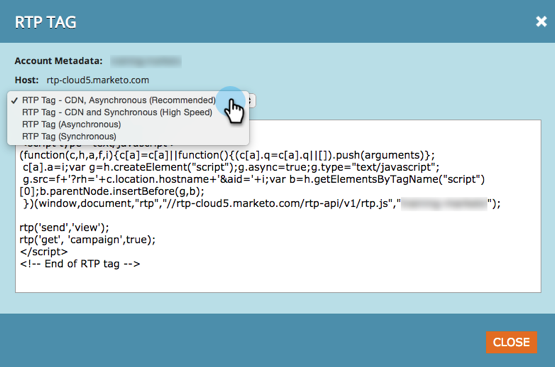

# Notas de versão: janeiro de 2015 {#release-notes-january}

Os recursos a seguir estão incluídos na versão de janeiro de 2015. Verifique a disponibilidade de recursos na sua Marketo Edition. Após o lançamento, não deixe de acessar os links para artigos detalhados de cada recurso.

## Atualizações de automação de marketing {#marketing-automation-updates}

**Landing Pages Para Dispositivos Móveis**

Agora você pode [criar exibições para dispositivos móveis para páginas de aterrissagem](/help/marketo/product-docs/demand-generation/landing-pages/free-form-landing-pages/add-a-mobile-view-for-your-free-form-landing-page.md) de dentro do editor de páginas de aterrissagem. Forneça sua mensagem de maneira eficaz, independentemente do dispositivo, e aumente o engajamento personalizando seu conteúdo para facilitar o consumo em qualquer lugar. Esse recurso será implantado gradualmente durante a semana seguinte ao lançamento.

Vídeo de Apresentação da Página de Aterrissagem [-](https://youtu.be/aPQHlG2X6c0)

**Novas chamadas da API REST**

Três novas chamadas para a API REST de lead e atividade:

* Excluir lead
* Obter clientes em potencial por ID de programa
* Obter Clientes Potenciais Excluídos

Além disso, há uma nova opção para Sincronizar lead, para gravar a alteração do lead de forma assíncrona para uma chamada de API mais rápida. Detalhes completos estarão disponíveis após o lançamento em [https://experienceleague.adobe.com/pt-br/docs/marketo-developer/marketo/home](https://experienceleague.adobe.com/pt-br/docs/marketo-developer/marketo/home)

**Suporte a objeto personalizado de script de e-mail**

Agora acesse objetos personalizados associados ao objeto Conta de dentro de scripts de email!

## Personalização em tempo real {#real-time-personalization}

**Remarketing personalizado para Google e[!DNL Facebook]**

O remarketing mostra anúncios para pessoas que visitaram seu site. Agora você pode personalizar suas campanhas de remarketing no [Google](/help/marketo/product-docs/web-personalization/website-retargeting/personalized-remarketing-in-google.md) e [[!DNL Facebook]](/help/marketo/product-docs/web-personalization/website-retargeting/personalized-remarketing-in-facebook.md) usando dados do Real-Time Personalization. Remarketing para públicos de diferentes setores, listas de contas nomeadas, tamanhos de empresa ou quaisquer dados de clientes potenciais conhecidos.

[Módulo da lista de contas nomeadas](/help/marketo/product-docs/web-personalization/account-based-web-marketing/create-a-new-account-list.md)

As melhorias no módulo Contas nomeadas melhorarão as taxas de correspondência e as validações para os usuários. As adições incluem:

* Organizações correspondentes da sua lista de Contas nomeadas usando o endereço de email do lead (também para clientes somente RTP)
* Suporte para até 100 mil registros por conta
* Modelo de arquivo CSV para exibir e baixar

**Opções de Marca RTP Atualizadas**

As opções de Tag RTP em Configurações da conta foram atualizadas para incluir:

1. CDN e assíncrono (tag recomendada)
1. CDN e síncrono (alta velocidade)
1. Tag assíncrona sem CDN
1. Tag síncrona sem CDN

Para obter o melhor desempenho, é recomendável colocar a marca na parte superior do cabeçalho da página da Web após `<head>`. Todas as marcas permitem o uso da [API RTP](https://experienceleague.adobe.com/pt-br/docs/marketo-developer/marketo/javascriptapi/rich-media-recommendation). Para obter informações sobre como implantar a RTP Tag, consulte [aqui](/help/marketo/product-docs/web-personalization/rtp-tag-implementation/deploy-the-rtp-javascript.md).

