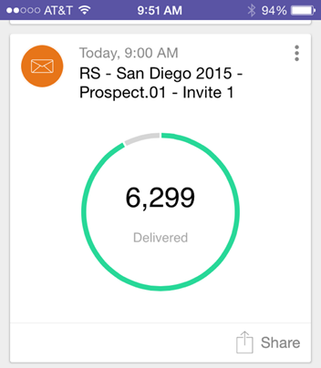

# Notas de versão: julho de 2015 {#release-notes-july}

## [!DNL Marketo Moments] {#marketo-moments}

No almoço, mas precisa reagendar um email? O aplicativo [!DNL Marketo Moments], disponível no App Store ou [!DNL Google Play], permite que você veja o desempenho de suas campanhas de email e eventos em tempo real, bem como o que está por vir no futuro, em seu telefone iPhone, iPad ou Android.

## Atualização do editor de rich text {#rich-text-editor-update}

Editor de texto atualizado com aparência moderna, incluindo formatação de texto simplificada, edição de imagens, inserção de links e edição de HTML. O editor do HTML agora apresenta validação mínima, permitindo uma edição de código menos restritiva.
`<iframe width="420" height="315" src="https://www.youtube.com/embed/LmmBN6IQrII" frameborder="0" allowfullscreen></iframe>` Essa atualização será lançada automaticamente em alguns dias a partir do lançamento de julho. Posteriormente, você poderá alternar entre as versões Nova e Herdada do editor de **[!UICONTROL Admin] > [!UICONTROL Email] > [!UICONTROL Editar configurações do editor]**.

Atualização de caixas de diálogo de link e imagem.

Alternar a versão do editor de texto.

## Login único para envio de e-mails {#email-deliverability-single-sign-on}

Ao clicar no bloco deliverability de email, você não precisa mais fornecer suas credenciais de logon.

## Priorização de campanhas {#campaign-prioritization}

Você configurou várias campanhas RTP personalizadas e notou que algumas delas podem se sobrepor a outras? Vá em frente e defina uma prioridade para qual RTP das campanhas deve ser exibido em relação a outras.

## API da empresa {#company-api}

**Acesso ao objeto da empresa por meio da REST API**: a REST API agora fornece acesso ao objeto da Marketo Company (também conhecida como Account). Isso significa que você pode ler, atualizar e excluir objetos da empresa criados no Marketo e associar clientes em potencial a essas empresas usando a API [!DNL Lead] atualizada.

Saiba [mais]<https://developer.adobe.com/marketo-apis/api/mapi/#tag/Companies>) em nosso guia de referência para a API da empresa.

## Acessar a entregabilidade de email {#access-email-deliverability}

**Acessar Ferramenta de Entrega de Email**: essa nova permissão permite que administradores concedam aos usuários acesso à ferramenta de Entrega de Email.
