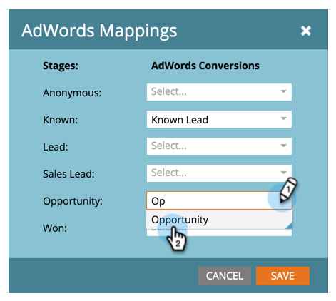

# Notas de versão: março de 2015 {#release-notes-march}

Os recursos a seguir estão incluídos na versão de março de 2015. Verifique a disponibilidade de recursos na sua Marketo Edition. Após o lançamento, não se esqueça de voltar para encontrar links para artigos detalhados para cada recurso.

## Calendário HD {#calendar-hd}

Exiba as atividades de marketing da sua equipe com o novo modo de apresentação do calendário. Estes são ótimos para TVs ou monitores gigantes ao redor do escritório! Definir e exibir metas com base em uma lista inteligente ou em métricas personalizadas.

>[!NOTE]
>
>Este recurso não está disponível para o Spark e as edições [!DNL Standard].

## [!DNL Google Adwords] Integração {#google-adwords-integration}

Vincule sua conta do [[!DNL Google AdWords] ao Marketo](/help/marketo/product-docs/administration/additional-integrations/add-google-adwords-as-a-launchpoint-service.md) para carregar automaticamente dados de conversão offline do Marketo para o [!DNL Google AdWords]. Em seguida, na interface do usuário do [!DNL AdWords], é possível ver facilmente quais cliques resultaram em clientes potenciais qualificados, oportunidades e novos clientes (ou quaisquer estágios de receita que você queira rastrear).

## [!UICONTROL Reformulação do Gerenciador de Receita] {#revenue-explorer-redesign}

O [!UICONTROL Revenue Explorer] tem uma aparência totalmente nova, bem como o novo tipo de gráfico Sunburst! A implementação será realizada nas duas primeiras semanas de abril.

## Novas APIs REST de ativos {#new-asset-rest-apis}

[Novas APIs REST de ativos](https://experienceleague.adobe.com/en/docs/marketo-developer/marketo/rest/assets/assets)

Agora temos suporte para criar e editar emails, modelos, meus tokens, arquivos e trechos [por meio da API](https://developer.adobe.com/marketo-apis/api/asset/)!

## [!DNL Microsoft Dynamics] 2015 No Local {#microsoft-dynamics-on-premise}

Com suporte ao instalador mais recente agora [acessível por meio do aplicativo](/help/marketo/product-docs/crm-sync/microsoft-dynamics-sync/sync-setup/update-the-marketo-solution-for-microsoft-dynamics.md).

## RTP - Envolvimento personalizado na Web com dados de leads {#rtp-personalized-web-engagement-with-lead-data}

Aproveite os [campos de dados de clientes potenciais](/help/marketo/product-docs/web-personalization/using-web-segments/manage-person-data.md) existentes no seu banco de dados de clientes potenciais do Marketo para criar campanhas de segmentação em tempo real e conteúdo personalizado. Gerencie seus campos de dados de cliente potencial no RTP e adicione/exclua campos de cliente potencial relevantes.

## RTP - Personalize o conteúdo on-line por nome de campanha de programa ou e-mail {#rtp-personalize-web-content-by-email-or-program-campaign-name}

Continue a conversa com seu lead em todos os canais, desde o email até a Web. [Personalize o conteúdo de entrada com base no nome da campanha ou do programa de email](/help/marketo/product-docs/web-personalization/using-web-segments/web-segments.md) usado nas Atividades de Marketing da Marketo.
