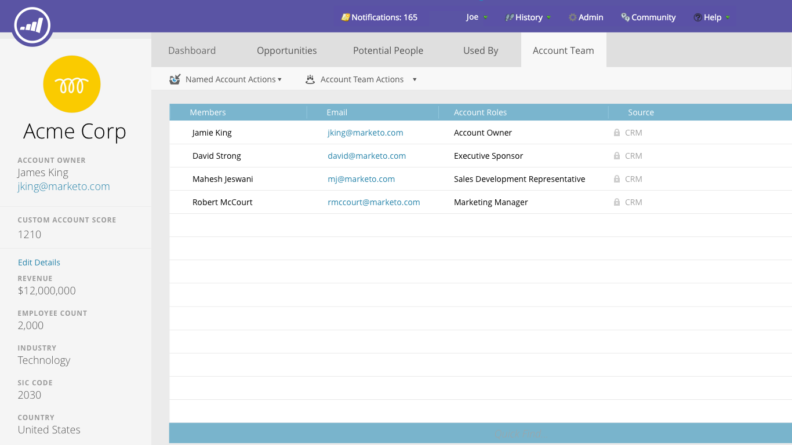

# Notas de versão: outono de 16 {#release-notes-fall}

Os seguintes recursos estão incluídos na versão do último trimestre de 2016. Verifique a edição do Marketo quanto à disponibilidade de recursos. Clique nos links de título para exibir artigos detalhados para cada recurso.

## Conteúdo preditivo no email {#predictive-content-in-email}

Há uma nova experiência de usuário para nosso aplicativo de Conteúdo preditivo rastrear, gerenciar e recomendar seu conteúdo por meio de nossos algoritmos de aprendizado de máquina e preditivo nos canais da Web e de email.

>[!NOTE]
>
>Todos os clientes com o módulo Predictive serão habilitados até 10 de janeiro.

Agora você pode adicionar conteúdo preditivo ao seu email. Quando o email é aberto, o recipient recebe automaticamente conteúdo relevante e recomendado que ajuda a aumentar a participação e as conversões do conteúdo.

## [Conversões off-line do Facebook](/help/marketo/product-docs/demand-generation/facebook/understanding-facebook-offline-conversions.md) {#facebook-offline-conversions}

Com a integração do Facebook Offline Conversions, os dados de conversão no Marketo (para leads de anúncio de lead) são automaticamente enviados de volta para o Facebook para que sua equipe de publicidade possa otimizar melhor seu gasto com anúncios. Neste Relatório do Facebook Ad Manager, as conversões offline são destacadas.

## [ID universal](/help/marketo/product-docs/administration/settings/using-a-universal-id-for-subscription-login.md) {#universal-id}

A Universal ID permite acessar várias assinaturas do Marketo com um único logon e alternar rapidamente entre as assinaturas. Você pode usar um único perfil de comunidade para todas as suas assinaturas.

>[!NOTE]
>
>Entre em contato com o Suporte da Marketo para ativar esse recurso.

## Aprimoramentos de marketing com base em conta do Marketo {#marketo-account-based-marketing-enhancements}

Agora, você pode atribuir equipes de conta a contas nomeadas no ABM (Account Based Marketing), por exemplo, proprietário de conta, representante de desenvolvimento de vendas, representante de desenvolvimento de negócios e gerente de conta. Você também pode criar listas de contas específicas do proprietário da conta e enviar relatórios personalizados semanais do ABM para a equipe da conta.

**REST API**

Essa versão também permite gerenciar atributos de contas nomeadas e pontuações de contas no ABM usando a API REST do Marketo. Para obter mais detalhes sobre as operações da API, visite o [site de desenvolvedores do Marketo](https://experienceleague.adobe.com/en/docs/marketo-developer/marketo/rest/lead-database/named-accounts).

## [Aprimoramentos da Trilha de Auditoria](/help/marketo/product-docs/administration/audit-trail/change-details-in-audit-trail.md) {#audit-trail-enhancements}

A trilha de auditoria fornece um histórico abrangente das alterações feitas na assinatura do Marketo. Adicionamos recursos adicionais de rastreamento para programas, além de identificar detalhes importantes sobre alterações para campanhas inteligentes, listas inteligentes e alterações feitas em usuários e funções.

## [Novas permissões](/help/marketo/product-docs/administration/users-and-roles/descriptions-of-role-permissions.md) {#new-permissions}

**Tornar o Email Operacional**

Longe vão os dias em que você tinha que se preocupar com os usuários que enviaram emails transacionais para pessoas em seu banco de dados que cancelaram a assinatura. Agora você pode especificar quais usuários podem tornar um email operacional ou editar emails operacionais.

**Editar Restrições de Campanha**

Por que definir [restrições de campanha](/help/marketo/product-docs/administration/email-setup/enable-person-restrictions-for-smart-campaigns.md) se não é possível aplicá-las? Ao definir Configurações de limite de campanha para restringir o número de pessoas no banco de dados que podem ser direcionadas com uma única campanha, agora é possível restringir quais usuários podem substituir essas configurações ao agendar uma campanha.

## [Som para notificações por push em dispositivos móveis](/help/marketo/product-docs/mobile-marketing/push-notifications/configure-mobile-push-notification.md) {#sound-for-mobile-push-notifications}

Dê mais riqueza à sua notificação por push do iOS ativando o som. Esse novo recurso permite acionar um som quando a Notificação por push é exibida no dispositivo móvel.

>[!NOTE]
>
>* Os proprietários de dispositivos podem optar por impedir a reprodução de sons nas configurações do dispositivo, e os desenvolvedores de aplicativos podem fornecer opções aos proprietários de dispositivos no aplicativo para impedir a reprodução de sons.
>* Os sons são reproduzidos automaticamente quando uma Notificação por push é exibida em um dispositivo Android.

## [Sales Insight compatível com criptografia do Salesforce](/help/marketo/product-docs/marketo-sales-insight/msi-for-salesforce/installation/install-marketo-sales-insight-package-in-salesforce-appexchange.md) {#sales-insight-compatible-with-salesforce-encryption}

O Market Sales Insight agora é compatível com o Salesforce Shield Encryption. Todos os clientes do Sales Insight devem atualizar para este pacote gerenciado mais recente (versão 1.4359.2), que é [disponível no Appexchange](https://appexchange.salesforce.com/listingDetail?listingId=a0N30000001SVZmEAO).

## [APIs de contas nomeadas](https://experienceleague.adobe.com/en/docs/marketo-developer/marketo/rest/lead-database/named-accounts) {#named-accounts-apis}

Com esta versão, os usuários do Marketo ABM podem gerenciar contas nomeadas por meio da API de contas nomeadas. Os usuários podem criar, atualizar e excluir contas nomeadas, bem como ler e atualizar as pontuações de contas nomeadas ABM.

## [Suporte à API do Editor de Email v2.0](https://experienceleague.adobe.com/en/docs/marketo-developer/marketo/email-scripting) {#email-editor-v-api-support}

Gerencie variáveis e módulos para emails no formato v2.0 usando a API REST do Marketo.

## [Alterações na sincronização do Marketo Salesforce](https://nation.marketo.com/docs/DOC-3840) {#changes-to-marketo-salesforce-sync}

A integração do Salesforce no Marketo está evoluindo para melhorar a maneira como os campos do Marketo são sincronizados com o Salesforce. Agora, em vez de precisar sincronizar um grande grupo de campos que podem ou não ser necessários, você pode escolher quais campos gostaria de incluir. Consulte nossa documentação aqui para obter mais informações: [https://nation.marketo.com/docs/DOC-3840](https://nation.marketo.com/docs/DOC-3840).
