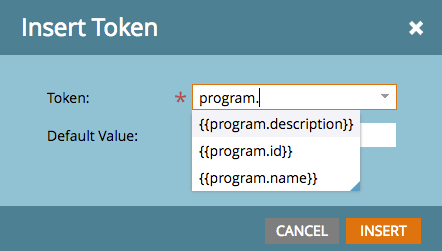

# Notas de versão: Verão de 16 {#release-notes-summer}

Os seguintes recursos estão incluídos na versão do verão de 1916. Verifique a edição do Marketo quanto à disponibilidade de recursos. Clique nos links de título para exibir artigos detalhados para cada recurso.

## [Marketing baseado em conta](https://docs.marketo.com/display/docs/account+based+marketing) {#account-based-marketing}

O Marketing baseado em conta da Marketo oferece tudo o que é essencial em uma plataforma unificada:

* **Target** - Descoberta de Conta, Correspondência entre Lead e Conta e Listas de Contas Nomeadas
* **Envolvimento** - Personalization baseado em conta, Envolvimento entre canais e Fluxos de Trabalho específicos da conta
* **Medida** - Insights de conta e nível de lista, Pontuação de envolvimento de conta e Impacto de pipeline e receita

>[!NOTE]
>
>O ABM está disponível como um complemento para sua assinatura do Marketo, portanto, entre em contato com seu representante de vendas para implementá-lo.

## [Trilha de auditoria](/help/marketo/product-docs/administration/audit-trail/audit-trail-overview.md) {#audit-trail}

A trilha de auditoria fornece um histórico abrangente das alterações feitas na assinatura do Marketo. Ele criará responsabilidade entre usuários e administradores, ajudará a identificar a causa de comportamentos inesperados e fornecerá a segurança de saber quem está fazendo o que e quando. Essas informações estarão disponíveis a qualquer momento e podem ser usadas para responder a perguntas como:

* O que aconteceu com esse ativo ou configuração e quem o atualizou pela última vez?
* O que o usuário X tem feito?
* Quem está entrando em nossa conta?

## Integração do Marketo-Vibes SMS LaunchPoint

Crie facilmente mensagens SMS diretamente no Marketo. Personalize e direcione sua mensagem usando seus dados avançados do Marketo e monitore facilmente o desempenho usando o painel de mensagens SMS.

>[!NOTE]
>
>Este recurso requer uma conta existente do [!DNL Vibes SMS].

## [Aprimoramentos do Email 2.0](/help/marketo/product-docs/email-marketing/general/email-editor-2/email-editor-v2-0-overview.md) {#email-enhancements}

**Variáveis de nível de módulo**

Anteriormente, todas as variáveis especificadas em Modelos de email 2.0 eram &quot;globais&quot; no escopo. Ao usar variáveis em módulos, isso nem sempre é desejável se você planeja usar várias instâncias do módulo. Com esta versão, as variáveis agora podem ser especificadas como &quot;nível do módulo&quot;, o que permite indicar que o usuário deve ser capaz de definir valores únicos para cada módulo em que são usadas.

**Atualizações de sintaxe**

* Agora você pode usar &quot;mktoAddByDefault&quot; em módulos especificados em Modelos de email 2.0 para indicar quais módulos devem ser exibidos em novos emails por padrão. Isso é muito mais conveniente se você estiver criando um template de email com um grande número de módulos.
* Em elementos de imagem, agora é possível especificar se as propriedades &quot;height&quot; e &quot;width&quot; do elemento HTML `` subjacente devem ser bloqueadas ou editáveis para o usuário final. mktoLockImgSize=&quot;true&quot; fará com que a altura/largura seja bloqueada (mesmo se a imagem for alterada). Da mesma forma, mktoLockImgStyle=&quot;true&quot; fará com que a propriedade &quot;style&quot; seja bloqueada.

**Pesquisa de código**

Use a nova funcionalidade de pesquisa para localizar e substituir com eficiência o conteúdo no código do seu email. Essa funcionalidade também está disponível no editor de Modelo de email.

**Suporte a Token em Elementos de Imagem**

Os tokens agora podem ser usados na área &quot;URL externo&quot; da experiência de inserção de imagem! Se você especificou imagens com `{{my.tokens}}`, agora é possível fazer referência a esses tokens no Editor de Email 2.0. Observe que a imagem ainda aparecerá quebrada na tela do Editor de email 2.0. Porém, você os verá renderizados em Visualização e Enviar amostra antes de enviar seu email.

## Vários domínios de marca {#multiple-branding-domains}

Longe vão os dias em que os links de rastreamento de email só podiam ser marcados com um único domínio de marca. Agora é possível adicionar vários domínios de marca para inspirar a confiança do consumidor, criar uma aparência mais simplificada para se concentrar na marca, melhorar a capacidade de entrega de email e escolher, por email, qual domínio de marca usar para cada link de rastreamento de email.

## [Tokens de programa](/help/marketo/product-docs/demand-generation/landing-pages/personalizing-landing-pages/tokens-overview.md) {#program-tokens}

Criamos um novo tipo de token para programas. Agora é possível renderizar o Nome do programa, a Descrição e a ID nas etapas de ativos e fluxo de campanha inteligente.

## [Chave de empresa](/help/marketo/product-docs/marketo-sales-insight/msi-outlook-plugin/authorize-the-marketo-outlook-plugin.md) {#enterprise-key}

Exigir que cada pessoa da sua equipe de vendas instale nosso Plug-in do [!DNL Sales Insight] para o [!DNL Outlook] pode ser entediante. Introduzimos uma nova maneira de instalar o plug-in para [!DNL Outlook] remotamente usando uma chave corporativa. Envie à sua equipe de TI sua chave exclusiva encontrada na seção [!DNL Sales Insight] do Marketo do [!UICONTROL Administrador] e deixe que eles façam o resto.

## [Campanhas de personalização na Web](/help/marketo/product-docs/web-personalization/working-with-web-campaigns/create-a-new-dialog-web-campaign.md) {#web-personalization-campaigns}

Especifique um atraso para que as campanhas da Web reajam no site.

## [Exportação do Content Analytics e do Recommendations](/help/marketo/product-docs/web-personalization/understanding-web-personalization/understanding-content-analytics.md) {#content-analytics-and-recommendations-export}

Exibir dados de análises de conteúdo e recomendações offline.

## [Suporte a API do Editor do E-mail 2.0](https://developers.marketo.com/documentation/asset-api/) {#api-support-for-email-editor}

As APIs de ativos pré-existentes, antes compatíveis apenas com emails e modelos v1.0, agora estão habilitadas para ativos de email v2.0.

## [Site de desenvolvedores do Marketo](https://developers.marketo.com/) {#marketo-developers-site}

Novidades e melhorias!

## [Configurações de privacidade](/help/marketo/product-docs/administration/settings/understanding-privacy-settings.md) {#privacy-settings}

Os profissionais de marketing podem usar as configurações de privacidade para decidir se rastreiam ou não os visitantes que usam os recursos do [!DNL Munchkin] e do Web Personalization. O nível de rastreamento é controlado usando a configuração Não rastrear do navegador, um cookie de opção de não participação ou um IP não específico. Esses métodos podem afetar o valor e a funcionalidade do Marketo em áreas específicas, mas se o profissional de marketing não mudar nada, a funcionalidade do Marketo permanecerá a mesma.

Esse recurso será lançado gradualmente para os clientes ao longo de um período de seis semanas. Se precisar dele imediatamente, entre em contato com o Suporte da Marketo.
