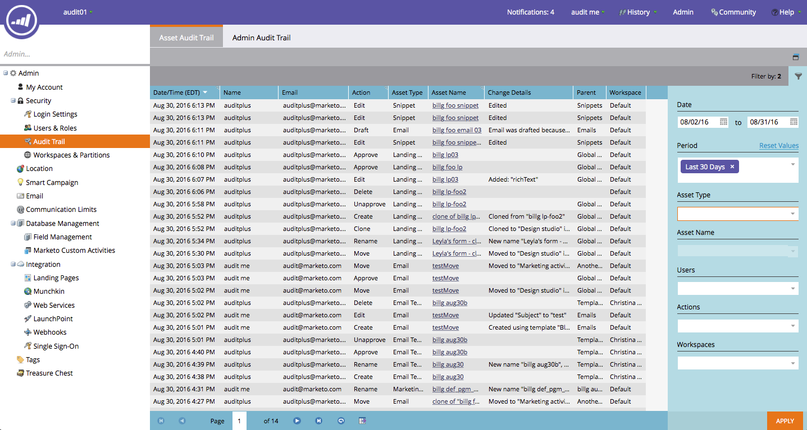

# Notas de versão: Verão de 16 {#release-notes-summer}

Os seguintes recursos estão incluídos na versão do Verão de 16. Verifique sua edição do Marketo para ver a disponibilidade dos recursos. Clique nos links de título para exibir os artigos detalhados de cada recurso.

## [Marketing baseado em conta](https://docs.marketo.com/display/docs/account+based+marketing) {#account-based-marketing}

O Marketo Account Based Marketing (Marketing baseado em conta) fornece todas as informações básicas de uma plataforma unificada:

* **Target**  - Detecção de conta, Correspondência de cliente potencial e Listas de contas nomeadas
* **Envolvimento**  - Personalização baseada em conta, Envolvimento entre canais e Fluxos de trabalho específicos da conta
* **Medida**  - Insights de nível de conta e lista, Pontuação de envolvimento da conta e Impacto do pipeline e receita

>[!NOTE]
>
>O ABM está disponível como um complemento para sua assinatura do Marketo, portanto, entre em contato com seu representante de vendas para implementá-lo.

## [Trilha de auditoria](/help/marketo/product-docs/administration/audit-trail/audit-trail-overview.md) {#audit-trail}

A trilha de auditoria fornece um histórico abrangente das alterações feitas na sua assinatura do Marketo. Isso criará responsabilidade entre usuários e administradores, ajudará a identificar a causa do comportamento inesperado e fornecerá a segurança de saber quem está fazendo o que e quando. Essas informações estarão disponíveis a qualquer momento e poderão ser usadas para responder perguntas como:

* O que aconteceu com esse ativo ou configuração e quem o atualizou pela última vez?
* O que o usuário X está aprontando?
* Quem está fazendo logon em nossa conta?

## [Integração do Marketo-Vibes com o SMS LaunchPoint](/help/marketo/product-docs/mobile-marketing/vibes-sms-messages/create-a-vibes-sms-message.md) {#marketo-vibes-sms-launchpoint-integration}

Crie facilmente mensagens SMS diretamente no Marketo. Personalize e direcione sua mensagem usando seus dados avançados do Marketo e monitore facilmente seu desempenho usando o painel de mensagens SMS.

>[!NOTE]
>
>Esse recurso requer uma conta SMS do Vibes existente.

## [Aprimoramentos do Email 2.0](/help/marketo/product-docs/email-marketing/general/email-editor-2/email-editor-v2-0-overview.md) {#email-enhancements}

**Variáveis no nível do módulo**

Anteriormente, todas as variáveis especificadas em Modelos de email 2.0 eram &quot;globais&quot; no escopo. Ao usar variáveis em módulos, isso nem sempre é desejável se você planeja usar várias instâncias do módulo. Com esta versão, as variáveis agora podem ser especificadas como &quot;nível de módulo&quot;, o que permite indicar que o usuário deve ser capaz de definir valores exclusivos para cada módulo em que são usadas.

**Atualizações de sintaxe**

* Agora você pode usar &quot;mktoAddByDefault&quot; em módulos especificados em Modelos de email 2.0 para indicar quais módulos devem ser exibidos em novos emails por padrão. Isso é muito mais conveniente se você estiver criando um modelo de email com um grande número de módulos.
* Em elementos de imagem, agora você pode especificar se as propriedades subjacentes de &quot;altura&quot; e &quot;largura&quot; do elemento HTML devem ser bloqueadas ou editáveis para o usuário final. `` mktoLockImgSize=&quot;true&quot; fará com que a altura/largura seja bloqueada (mesmo que a imagem seja alterada). Da mesma forma, mktoLockImgStyle=&quot;true&quot; fará com que a propriedade &quot;style&quot; seja bloqueada.

**Pesquisa de código**

Use a nova funcionalidade de pesquisa para encontrar e substituir com eficiência o conteúdo no código do seu email. Essa funcionalidade também está disponível no editor de modelo de email.

**Suporte a token em elementos de imagem**

Agora, os tokens podem ser usados na área &quot;URL externo&quot; da experiência de inserção da imagem! Se você tiver especificado imagens com `{{my.tokens}}`, agora poderá fazer referência a esses tokens no Editor de email 2.0. Observe que a imagem ainda aparecerá quebrada na tela do Editor de email 2.0. Mas, você os verá renderizados em Visualizar e Enviar amostra antes de enviar seu email.

## Vários domínios de marca {#multiple-branding-domains}

Longe são os dias em que os links de rastreamento de email só podem ser marcados com um único domínio de marca. Agora é possível adicionar vários domínios de marca para inspirar a confiança do consumidor, criar uma aparência mais simplificada para se concentrar na marca, melhorar a capacidade de fornecimento de email e escolher, por email, qual domínio de marca usar para cada link de rastreamento de email.

## [Tokens de programa](/help/marketo/product-docs/demand-generation/landing-pages/personalizing-landing-pages/tokens-overview.md) {#program-tokens}

Criamos um novo tipo de token para programas. Agora é possível renderizar o Nome do programa, a Descrição e a ID nos ativos e nas etapas do fluxo da campanha inteligente.

## [Chave de empresa](/help/marketo/product-docs/marketo-sales-insight/msi-outlook-plugin/authorize-the-marketo-outlook-plugin.md) {#enterprise-key}

Exigir que cada pessoa da sua equipe de vendas instale nosso Plug-in de informações de vendas para o Outlook pode ser entediante. Introduzimos uma nova maneira de instalar o plug-in para Outlook remotamente usando uma chave corporativa. Envie à sua equipe de TI sua chave exclusiva encontrada na seção Marketo Sales Insight do Administrador e permita que ela faça o resto.

## [Campanhas de personalização na Web](/help/marketo/product-docs/web-personalization/working-with-web-campaigns/create-a-new-dialog-web-campaign.md) {#web-personalization-campaigns}

Especifique um atraso de tempo para que as campanhas da Web reajam ao seu site.

## [Exportação para o Content Analytics e o Recommendations](/help/marketo/product-docs/web-personalization/understanding-web-personalization/understanding-content-analytics.md) {#content-analytics-and-recommendations-export}

Exibição offline de dados de análises e recomendações de conteúdo.

## [Suporte a API do Editor do E-mail 2.0](https://developers.marketo.com/documentation/asset-api/) {#api-support-for-email-editor}

As APIs de ativos pré-existentes, anteriormente compatíveis apenas com emails e modelos v1.0, agora estão habilitadas para ativos de email v2.0.

## [Site de desenvolvedores do Marketo](https://developers.marketo.com/) {#marketo-developers-site}

Novidades e melhorias!

## [Configurações de privacidade](/help/marketo/product-docs/administration/settings/understanding-privacy-settings.md) {#privacy-settings}

Os profissionais de marketing podem usar as configurações de privacidade para decidir se rastreiam visitantes usando os recursos Munchkin e Personalização da Web. O nível de rastreamento é controlado com o uso da configuração Não rastrear do navegador, um cookie de opção de não participação ou um IP não específico. Esses métodos podem afetar o valor e a funcionalidade da Marketo em áreas específicas, mas se o profissional de marketing não alterar nada, a funcionalidade da Marketo permanecerá a mesma.

Esse recurso será lançado aos clientes gradualmente ao longo de um período de seis semanas. Se precisar imediatamente, entre em contato com o Suporte da Marketo.
