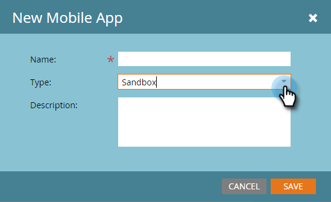

# Notas de versão: inverno de 2016 {#release-notes-winter}

Os seguintes recursos estão incluídos na versão Winter &#39;16. Clique nos links de título para exibir artigos detalhados para cada recurso.

## [É um Filtro Anônimo](/help/marketo/product-docs/administration/additional-integrations/add-munchkin-tracking-code-to-your-website/next-generation-munchkin-tracking-faq.md) {#is-anonymous-filter}

O filtro É Anônimo foi removido para Smart Lists. Consulte o documento [Perguntas frequentes sobre o Rastreamento de Munchkin da Próxima Geração](/help/marketo/product-docs/administration/additional-integrations/add-munchkin-tracking-code-to-your-website/next-generation-munchkin-tracking-faq.md) para obter detalhes. Essa alteração não afeta o Web Personalization (RTP), que continua a identificar visitantes anônimos e conhecidos da Web e personalizar o conteúdo em tempo real para esses visitantes.

## [Painel de Banco de Dados](/help/marketo/product-docs/core-marketo-concepts/smart-lists-and-static-lists/managing-people-in-smart-lists/database-dashboard.md)  {#database-dashboard}

O [!UICONTROL Banco de Dados de Clientes Potenciais] tem um Painel de Resumo atualizado que inclui o tamanho total do banco de dados de pessoas, o número de clientes potenciais comercializáveis e um detalhamento dos clientes potenciais pelas cinco principais fontes.

## [Navegador Microsoft Edge](/help/marketo/product-docs/administration/setup-administration/supported-browsers.md) {#microsoft-edge-browser}

Adicionamos [!DNL Microsoft Edge] à [lista de navegadores](https://docs.marketo.com/display/public/DOCS/Supported+Browsers) com suporte do Marketo.

## [Microsoft Outlook 2016](/help/marketo/product-docs/marketo-sales-insight/msi-outlook-plugin/install-the-marketo-email-add-in-for-outlook-with-a-registration-code.md) {#microsoft-outlook}

Agora há suporte para [[!DNL Microsoft Outlook] 2016](/help/marketo/product-docs/marketo-sales-insight/msi-outlook-plugin/install-the-marketo-email-add-in-for-outlook-with-a-registration-code.md).

## [Programa de e-mail Head Start](/help/marketo/product-docs/email-marketing/email-programs/email-program-actions/head-start-for-email-programs.md) {#email-program-head-start}

Use [!UICONTROL Head Start] para indicar que o processamento do envio deve ocorrer antes do tempo. Em vez de qualificar clientes potenciais e preparar emails no horário agendado do programa, o [!UICONTROL Head Start] garante que essas tarefas sejam realizadas com antecedência. Dessa forma, o público-alvo começará a receber emails no horário agendado.

Para usar esse recurso, o programa de email deve ser agendado com pelo menos 12 horas de antecedência, e a Smart List será bloqueada 12 horas antes do envio.

>[!NOTE]
>
>Esse recurso será lançado gradualmente por uma semana após o lançamento do inverno de 1916. Ele não está disponível para uso com campanhas inteligentes ou com a API.

## [Melhorias do Mobile Marketing](/help/marketo/product-docs/mobile-marketing/admin/add-a-mobile-app.md) {#mobile-marketing-enhancements}

**[!DNL PhoneGap]Suporte:** Agora oferecemos suporte de [!DNL PhoneGap] para seu aplicativo móvel. [Saiba mais](https://developers.marketo.com/documentation/mobile/phonegap-plugin/).

**Suporte para aplicativos de sandbox**:

## [API do programa](https://developers.marketo.com/documentation/programs/) {#program-api}

Crie, atualize e clone programas por meio da REST API. Isso não inclui a criação ou a atualização de smart lists e campanhas inteligentes em um programa.

## [Melhorias do Microsoft Dynamics](/help/marketo/product-docs/crm-sync/microsoft-dynamics-sync/microsoft-dynamics-sync-details/sync-status.md) {#microsoft-dynamics-enhancements}

**[[!UICONTROL Status da Sincronização]](/help/marketo/product-docs/crm-sync/microsoft-dynamics-sync/microsoft-dynamics-sync-details/sync-status.md)**: mantenha as guias na taxa de transferência e na lista de pendências atuais do processo de sincronização. Detalhe pela contagem de inserções e atualizações por objeto.

**[[!UICONTROL Notificações]](/help/marketo/product-docs/core-marketo-concepts/miscellaneous/understanding-notifications/notification-types.md)**: receba notificação sobre erros comuns de sincronização, juntamente com uma lista de clientes potenciais que apresentam esse erro.

## [Melhorias de objetos personalizados](/help/marketo/product-docs/administration/marketo-custom-objects/create-marketo-custom-objects.md) {#custom-objects-enhancements}

Agora é possível criar relações muitos para muitos entre Clientes potenciais/Contas e um objeto personalizado usando um objeto intermediário com vários campos de link.

## [Anúncios de leads do Facebook](/help/marketo/product-docs/demand-generation/facebook/set-up-facebook-lead-ads.md) {#facebook-lead-ads}

[[!UICONTROL Anúncios de cliente potencial do Facebook]](https://www.facebook.com/business/a/lead-ads) são uma maneira mais direta de uma empresa executar campanhas de geração de clientes potenciais em [!DNL Facebook]. As pessoas preenchem um formulário para expressar interesse em um produto ou serviço, para que o negócio possa acompanhá-las. A integração do Marketo com os [!UICONTROL Anúncios de cliente potencial do Facebook] captura automaticamente as informações que um cliente potencial fornece no formulário de Anúncio de cliente potencial. As ações e notificações de acompanhamento podem ser automatizadas usando o novo acionador [!UICONTROL Preenchimentos de anúncios de lead do Facebook].

## [Agendador de Campanhas da Web (Real-Time Personalization)](/help/marketo/product-docs/web-personalization/working-with-web-campaigns/schedule-a-web-campaign.md) {#web-real-time-personalization-campaign-scheduler}

Agende a campanha com antecedência. Configure uma data de início e término para conteúdo personalizado da Web e repita campanhas em dias e horários específicos. Personalize o agendamento para exibir a campanha de acordo com a hora do visitante da Web ou com um fuso horário selecionado.

