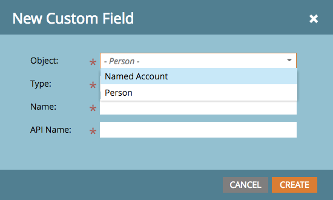

# Notas de versão: aprimoramentos da ABM de abril de 2017 {#release-notes-april-abm-enhancements}

Os recursos a seguir estão incluídos na versão de aprimoramento da ABM de abril de 17. Verifique a edição do Marketo quanto à disponibilidade de recursos.

## Sincronização de campos padrão mapeados para CRM {#synching-of-crm-mapped-standard-fields}

O Marketo ABM está alterando o comportamento relacionado aos CRMs. Além disso, o Marketo ABM estabelece e mantém uma relação um para um entre as contas ABM e as contas no CRM. Isso permite que a Marketo mantenha os campos de conta mapeados sincronizados com o CRM.

## Campos Personalizados para Descoberta de CRM {#custom-fields-for-crm-discovery}

Agora você pode adicionar campos personalizados a contas, mapeá-los ao seu CRM e usá-los para Descoberta de Conta do CRM no Marketo.

## Filtros com base em conta na grade de contas nomeadas {#account-based-filters-in-the-named-account-grid}

Agora é possível filtrar facilmente suas contas nomeadas com base em uma Lista de contas.

