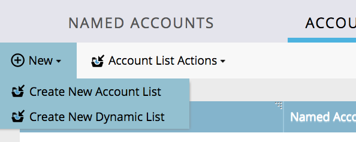

# Notas de versão: aprimoramentos da ABM de agosto de 17 {#release-notes-august-abm-enhancements}

Os recursos a seguir estão incluídos na versão de aprimoramento da ABM de agosto de 2017. Verifique a edição do Marketo quanto à disponibilidade de recursos.

Clique nos links de título para exibir artigos detalhados para cada recurso.

## Account Insight {#account-insight}

O **[Account Insight](/help/marketo/product-docs/target-account-management/setup-tam/account-insight-plug-in-overview.md)** é um plug-in do Google Chrome que revela insights de conta e ABM acionáveis para suas equipes de vendas, permitindo que elas trabalhem em conjunto com o marketing para envolver contas de maneira eficaz. As equipes de vendas terão visibilidade dos dados e insights gerados para cada uma das contas nomeadas que possuem. Isso incluirá percentis de pontuação da conta, uma lista priorizada de suas contas nomeadas, pessoas engajadas nessas contas e um fluxo de atividades online de atividades recentes da conta.

 

## [Listas de Contas Dinâmicas](/help/marketo/product-docs/target-account-management/target/account-lists.md) {#dynamic-account-lists}

Estamos adicionando uma nova maneira de criar listas de contas no ABM. Além das listas de contas existentes, agora é possível criar listas de contas dinâmicas geradas de Exibições de Contas públicas do CRM. Uma Exibição de conta do CRM é um conjunto de regras que atua como filtro ao exibir contas. Por exemplo, você pode usá-lo para encontrar contas em que o setor de saúde seja _e_ a receita seja superior a US$ 100 milhões.

