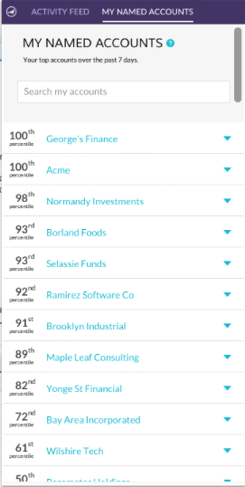

# Notas de versão: Aprimoramentos do ABM em 17 de agosto {#release-notes-august-abm-enhancements}

Os seguintes recursos estão incluídos na versão de aprimoramento do ABM de 17 de agosto. Verifique sua edição do Marketo para ver a disponibilidade dos recursos.

Clique nos links de título para exibir os artigos detalhados de cada recurso.

## Account Insight {#account-insight}

**[O Account](/help/marketo/product-docs/target-account-management/setup-tam/account-insight-plug-in-overview.md)** Insights é um plug-in do Google Chrome que exibe os insights acionáveis do ABM e da conta para suas equipes de vendas, permitindo que elas trabalhem em conjunto com o marketing para envolver as contas de maneira eficaz. As equipes de vendas obterão visibilidade sobre os dados e insights gerados para cada uma das contas nomeadas de sua propriedade. Isso incluirá percentis de pontuação de conta, uma lista priorizada de suas Contas Nomeadas, pessoas envolvidas nessas contas e um fluxo de atividades ativas de atividades recentes da conta.

 

## [Listas dinâmicas de contas](/help/marketo/product-docs/target-account-management/target/account-lists.md) {#dynamic-account-lists}

Estamos adicionando uma nova maneira de criar listas de conta no ABM. Além das listas de contas existentes, agora é possível criar listas de contas dinâmicas que são geradas a partir de Exibições de conta CRM públicas. Uma Exibição de conta do CRM é um conjunto de regras que atua como um filtro ao exibir contas. Por exemplo, você pode usá-lo para encontrar contas em que Setor é Saúde _e_ Receita acima de $100M.

