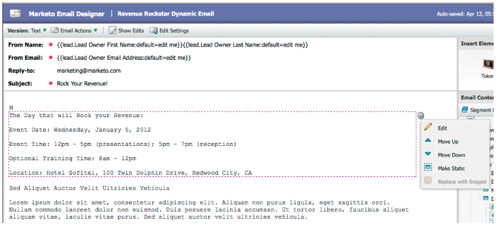
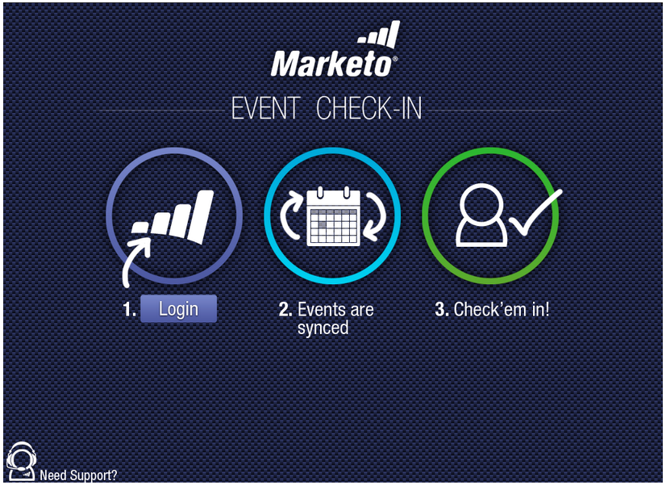
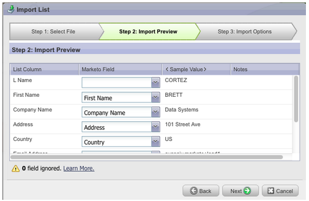
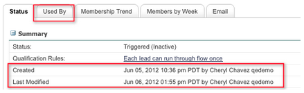
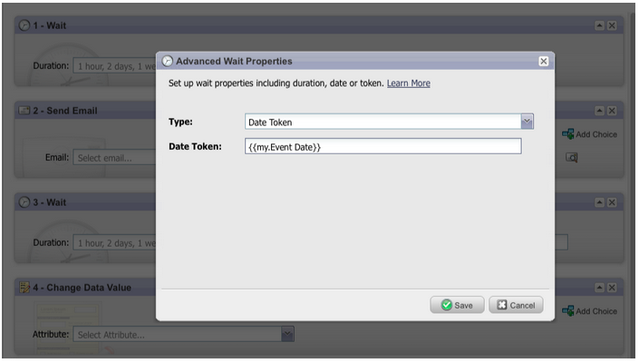
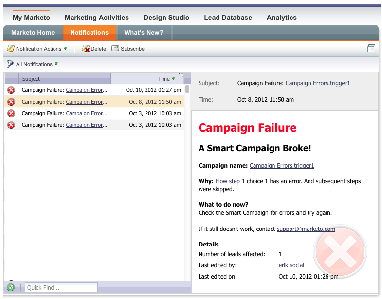

# 2012

## Janeiro/Fevereiro de 2012 {#january-february}

Os seguintes recursos estão incluídos na versão de janeiro/fevereiro. Verifique a edição do Marketo quanto à disponibilidade de recursos. Volte após a versão para obter links para a documentação detalhada do recurso.

## Conteúdo dinâmico avançado {#advanced-dynamic-content}

_Disponível para versões Pro e Enterprise_

Com conteúdo dinâmico avançado, você pode criar comunicações de email e páginas de aterrissagem envolventes relevantes para o seu público-alvo sem precisar criar vários ativos para a mesma mensagem. Os Visualizadores atualizados permitem exibir cada versão exclusiva em uma única tela.

## Segmentação  {#segmentation}

_Disponível para versões Pro e Enterprise_

Segmentação é um grupo de segmentos, que são um grupo direcionado de indivíduos para os quais você comercializa. Os segmentos são definidos por regras orientadas por critérios de filtro semelhantes às smart lists. Seus segmentos podem ser baseados em dados demográficos, como cargo ou setor, ou baseados em comportamentos, como páginas da Web visitadas ou links clicados.

## Snippets {#snippets}

_Disponível para versões Pro e Enterprise_

Armazene conteúdo avançado que pode ser usado várias vezes para criar emails estáticos ou dinâmicos e landing pages.

## PURLs {#purls}

_Disponível para versões Pro e Enterprise_

Agora, os profissionais de marketing que usam URLs personalizados (PURLs) podem criar URLs específicos de contato para impulsionar a personalização, a mensurabilidade e as respostas de lift em programas de marketing multitoque para campanhas de correspondência direta e de email.

## Suporte às diretrizes de privacidade da UE {#eu-privacy-directive-support}

Os novos recursos para respeitar as configurações de &quot;Não rastrear&quot; do navegador incluem a capacidade de desativar o rastreamento de leads anônimos; isso facilita o cumprimento das regras mais rigorosas de rastreamento de privacidade da UE.

## Login único {#single-sign-on}

Agora, as organizações podem oferecer suporte a um logon perfeito no aplicativo da Marketo usando o SAML 2.0 para logon único em um portal corporativo.

## E-mail e editores de página de aterrissagem atualizados {#updated-email-and-landing-page-editors}

Os editores de email e página de aterrissagem foram reprojetados com uma interface mais convidativa, navegação intuitiva e uma experiência do usuário drasticamente aprimorada, que inclui:

Uma visualização lado a lado de HTML e texto

O Do nome, Do e-mail, Responder para (NOVO) e Assunto são exibidos no editor. Todas as outras configurações podem ser acessadas por meio do botão Editar configurações.

## Suporte ao navegador {#browser-support}

* [!DNL Mozilla Firefox] 9.0
* [!DNL Google Chrome] 16
* [!DNL Microsoft Internet Explorer] 8 &amp; 9
* **Observação**: não há mais suporte para [!DNL Internet Explorer] 7

## Gerenciamento do programa {#program-management}

O gerenciamento simplificado de programas melhora a usabilidade com a exclusão de tokens e a mais fácil exclusão de programas.

## Cancelar inscrição no relatório de inscrição {#unsubscribe-from-subscription-report}

Agora é possível cancelar a assinatura da assinatura diretamente do relatório.

## Atualizações de Munchkin {#munchkin-updates}

As novas chamadas do Munchkin reduzem o tempo de carregamento da página da Web e fornecem desempenho mais consistente para eventos de links de cliques.

## Análise de oportunidade do programa (somente RCA) {#program-opportunity-analysis-rca-only}

Entender a contribuição de marketing para a receita de oportunidades individuais

## Análise do estágio de receita do programa {#program-revenue-stage-analysis}

Ganhe insight na velocidade de liderança do programa, entendendo quais programas adquiriram os aceleradores

## Março de 2012 {#march}

## Resolver meus tokens {#resolve-my-tokens}

Meus tokens (tokens de programa) serão resolvidos ao visualizar um email, ao enviar um email de teste e ao enviar um email local por meio de uma única ação de fluxo. Não será mais necessário criar uma campanha inteligente dentro do programa para testar Meus tokens!

## Alternar entre o Visualizador e o Editor em Emails e Landing Pages {#toggle-between-previewer-and-editor-in-emails-and-landing-pages}

Com um clique, vá e volte facilmente entre o Editor e o Pré-visualizador.

Editor para Pré-visualizador:

Pré-visualizador para editor:

## Pré-visualizador de trechos {#snippet-previewer}

Selecionar &quot;Visualizar trecho&quot; no menu permite visualizar um trecho, sem transformá-lo em um rascunho. Além disso, se você tiver acesso somente leitura a um trecho compartilhado (via espaços de trabalho), poderá exibi-lo com esta ação.

## Enviar vários emails de teste {#send-multiple-test-emails}

Com a adição do conteúdo dinâmico, torna-se cada vez mais importante visualizar e testar todas as variações dos emails que podem ser enviados aos seus clientes potenciais. Ao visualizar usando Exibir por detalhes do lead, você tem a opção de enviar um teste para as variações da lista de leads (até 100 emails de teste).

## Páginas iniciais dinâmicas com base no parâmetro de URL {#dynamic-landing-pages-based-on-url-parameter}

Clientes potenciais anônimos compõem uma quantidade significativa de visitas às páginas de aterrissagem do. Com a adição de conteúdo dinâmico e a capacidade de colocar a segmentação no URL como parâmetro, você pode exibir dinamicamente o conteúdo da página de aterrissagem quando um lead anônimo ou conhecido clicar no link.

## Abril de 2012 {#april}

## Filtros e acionadores de segmentação {#segmentation-filters-and-triggers}

Você segmenta o mesmo grupo de clientes em potencial de maneira consistente? Em caso afirmativo, use a segmentação nas listas inteligentes para direcionar clientes potenciais. Com a segmentação, todo o banco de dados de clientes potenciais é sempre segmentado e pode ser reutilizado em seus programas para fins de consistência. Os resultados da segmentação são obtidos rapidamente porque eles não exigem a lista inteligente para serem executados no momento da solicitação.

## Inserir valores externos no conteúdo de email e em outras etapas de fluxo, por meio dos recursos expandidos da API {#insert-external-values-into-email-content-and-other-flow-steps-through-expanded-api-capabilities}

* A API Solicitar campanha agora permite enviar valores para Meus tokens para essa execução específica da campanha - isso é particularmente útil para preencher conteúdo de email por meio da API
* As novas APIs de campanha Fazer upload para listar e agendar oferecem suporte ao exposto acima para listas de leads e campanhas em lote.

## Emails de confirmação mais fáceis para [!DNL GoToWebinar] e [!DNL WebEx] (Adobe Connect e [!DNL ON24] em breve!) {#easier-confirmation-emails-for-gotowebinar-and-webex-adobe-connect-and-on-coming-soon}

Simplificamos o URL de confirmação criando um token de membro que exibe o URL de confirmação de registro exclusivo para cada lead. Não será mais necessário criar esse URL usando tokens diferentes. Atualmente, ele está disponível para clientes do [!DNL GoToWebinar] e do [!DNL WebEx] e estará disponível para o Adobe Connect e o [!DNL ON24] na próxima versão.

## Carregue várias imagens e arquivos com um único clique! {#upload-multiple-images-and-files-with-a-single-click}

Economize tempo e seja mais eficiente ao importar imagens e arquivos para o Marketo! Se você usa o [!DNL Firefox] ou o [!DNL Google Chrome], é possível selecionar vários arquivos e carregá-los todos de uma só vez. Embora não haja limite para o número de arquivos que você pode carregar, o limite de tamanho individual por arquivo é de 50 MB.

Observação: no momento, este recurso não tem suporte no [!DNL Internet Explorer], devido às limitações do navegador.

## Mover texto em um e-mail {#move-text-in-an-email}

Você pode reordenar blocos de texto em um email. No editor de texto, selecione um bloco de texto. Ao clicar no ícone de edição, você verá a opção para mover o bloco para cima ou para baixo.

## [!DNL Salesforce] Referências removidas para usuários que não são [!DNL Salesforce] {#salesforce-references-removed-for-non-salesforce-users}

Se você não estiver sincronizando sua assinatura com [!DNL Salesforce], perceberá que todas as pastas e ações de fluxo que fazem referência a [!DNL Salesforce] serão removidas.

## Análise do ciclo de receita do Marketo {#marketo-revenue-cycle-analytics}

**Estágios de portal aprimorados no Modeler de ciclo de receita**

Permite que os usuários definam uma ordem para suas regras de transição.

## Maio de 2012 {#may}

## Reformulação do Relatório de desempenho de email {#email-performance-report-redesign}

Observação: esta será uma implantação em etapas, a partir da versão de maio

Fizemos com que os relatórios de Desempenho de email do Campaign e de Desempenho de email fossem executados mais rapidamente. Também aprimoramos as definições de determinadas métricas e consolidamos as métricas &quot;Mensagens enviadas&quot; e &quot;Clientes potenciais enviados&quot; em uma única métrica, &quot;Enviados&quot;. Mesclamos &quot;Mensagens Entregues&quot; e &quot;Clientes Potenciais Entregues&quot; com &quot;Entregues&quot;.

## Aprimoramentos da etapa de espera {#wait-step-enhancements}

Usando as novas propriedades de Espera Avançada, você pode configurar a etapa de espera em uma ação de Fluxo de Campanha Inteligente para &quot;aguardar até&quot; um dia da semana específico, o próximo dia útil, uma data ou hora específica. Essas melhorias garantem que seus emails de criação cheguem à Caixa de entrada durante o horário comercial!

Figura 1. Especificar a Etapa de Espera que terminará em um Dia Útil

## Assets arquivado oculto {#archived-assets-hidden}

Os ativos arquivados são automaticamente filtrados de sugestão automática, listas suspensas e relatórios, facilitando a localização do que você está procurando!

Figura 2. Exemplo do filtro de e-mails arquivados

## Novo aplicativo de check-in de evento para o iPad {#new-event-check-in-app-for-ipad}

Simplifique o processo de check-in do evento usando nosso novo aplicativo iPad. O aplicativo Event Check-in é sincronizado com o programa Marketo e permite que você faça inscrições em um evento com facilidade, bem como adicione novos leads dinamicamente.

Exige o iOS 5.1 ou posterior; somente iPad.

Figura 3. Página inicial de check-in do evento

Figura 4. Check-in do evento: Selecione seu evento!

Figura 5. Fazer check-in

## URL de confirmação do webinário aprimorado {#enhanced-webinar-confirmation-url}

Agora disponível para [!DNL ON24] e Adobe Connect! Inclua um link exclusivo no email de confirmação para cada participante registrado usando o novo token `{{member.webinar URL}}`. Os aprimoramentos do Adobe Connect também incluem a capacidade de ativar/desativar o email de informações da conta do Adobe que inclui a ID de logon e a senha do usuário.

Figura 6. Levar pessoas ao seu webinário

## Visualização de modelo {#template-preview}

Procurando um modelo específico ao criar seu email ou landing page, mas não tem certeza de como ele se parece? Com o novo recurso de visualização de modelo, é possível verificar o modelo selecionado antes de salvar um novo ativo!

Figura 7. Visualize o modelo escolhido

## Preenchimento prévio do formulário configurável {#configurable-form-prefill}

Controle o pré-preenchimento de dados de formulário no nível de assinatura e a substituição no nível da página de destino. Sem o preenchimento prévio, é possível garantir que o lead forneça as informações mais atualizadas.

Figura 8. Configuração de preenchimento prévio de formulário no administrador

Figura 9. Editar configuração de preenchimento prévio de formulário em uma página de aterrissagem

## Marketo Treasure Chest {#marketo-treasure-chest}

Obtenha acesso aos recursos experimentais desenvolvidos pelos engenheiros da Marketo para aprimorar sua experiência de usuário. Esta versão inclui Desfazer email, além da capacidade de inserir comentários e colaborar com outros usuários em suas landing pages.

\

Figura 10. Recursos do tórax do tesoureiro do gerente no administrador

## Integração do CRM do [!DNL Microsoft Dynamics]® {#microsoft-dynamics-crm-integration}

Sincronizar Contas, Contatos e Clientes Potenciais entre o Marketo e o [!DNL Microsoft Dynamics] CRM Online usando nossa nova integração pré-criada!

Figura 11. Configuração de [!DNL Microsoft Dynamics]

## Aprimoramentos do Marketo [!DNL Sales Insight] {#marketo-sales-insight-enhancements}

**Opções de Cancelamento de Inscrição do Rodapé**

Configure quando e se o rodapé de cancelamento de inscrição é exibido para emails enviados pelo [!DNL Sales Insight].

Figura 12. [!DNL Sales Insight] Configurações no Administrador

## Pastas para Modelos de email de vendas {#folders-for-sales-email-templates}

Agora é possível organizar os modelos de email compartilhados com o Marketo [!DNL Sales Insight] em pastas especificadas, facilitando para seus representantes de vendas encontrar o email correto.

Figura 13. Escolha uma pasta para seus emails

## Acessar o Analisador de Oportunidades de [!DNL Sales Insight] {#access-opportunity-analyzer-from-sales-insight}

Forneça aos seus Representantes de vendas a insight para a qual as atividades de marketing estão impulsionando o envolvimento, usando o acesso direto ao Analisador de oportunidades da Marketo [!DNL Sales Insight]. Observação. Exige uma licença do Revenue Cycle Analytics.

## Campo personalizado para Status do contato {#custom-field-for-contact-status}

Agora você pode mapear um campo personalizado em [!DNL Salesforce] para preencher o campo Status para Contatos nas Minhas Melhores Opções, Melhores Opções da Minha Equipe e exibições personalizadas.

Figura 14. Mapear um campo personalizado para Contatos

Consulte Páginas visitadas por clientes em potencial anônimos

Detalhe as páginas visualizadas por um cliente potencial anônimo na exibição [!UICONTROL Atividade Anônima na Web].

Figura 15. Consulte Atividade da Web anônima

## Assinatura de Cliente Potencial e de Contato Aprimorada {#enhanced-lead-and-contact-subscribe}

Siga um cliente potencial ou contato a qualquer momento usando o novo botão Assinar na página de detalhes do registro.

## Junho de 2012 {#june}

## Aprimoramentos no gerenciamento líder do Marketo {#marketo-lead-management-enhancements}

### Renomear {#rename}

Você pode renomear suas Smart Lists, listas estáticas e campanhas. Se você estiver usando esses ativos em filtros, acionadores ou fluxos, o nome também será atualizado automaticamente nesse local. Você sempre foi capaz de renomear emails, formulários e pastas.

E, como bônus, melhoramos a inserção e a visualização do texto de descrição para ativos.

## Importar mapeamento de campos {#import-field-mapping}

Tornamos a importação de uma lista para o Marketo muito mais fácil! Durante o processo de importação, é possível mapear o nome do campo do Marketo para o nome do cabeçalho da coluna no arquivo de importação. Além disso, em [!UICONTROL Admin], você pode configurar nomes de alias que são mapeados para o nome do campo no Marketo, garantindo que seus usuários sempre selecionem o campo correto.

À medida que você continua a importar e mapear campos, o Marketo se lembra e exibe os mapeamentos durante a importação, para facilitar o uso. E para facilitar ainda mais a vida, você pode clicar no cabeçalho Valor de exemplo para ver os diferentes valores que seriam preenchidos no campo. Isso ajuda a garantir que você mapeie o campo correto todas as vezes!

## Página [!UICONTROL Resumo] para Smart Lists e Listas Estáticas {#summary-page-for-smart-lists-and-static-lists}

Você já se perguntou onde suas listas estão sendo usadas? Ou quem criou a lista ou a modificou pela última vez? A nova página de resumo, disponível em Smart Lists e listas estáticas, fornecerá esses detalhes importantes.

Nas páginas existentes de resumo do Programa e da Campanha, adicionamos também a Data de criação/usuário e as informações de Data da última modificação/usuário.

## [!UICONTROL Usado por] para o Assets {#used-by-for-assets}

Adicionamos uma nova guia às Páginas de [!UICONTROL Resumo] do nosso ativo, chamada [!UICONTROL Usado por]!

Exemplo: [!UICONTROL Usado por] para Listas Estáticas

## Linhas de grade da página de aterrissagem {#landing-page-gridlines}

A adição de linhas de grade na página de aterrissagem facilita muito o alinhamento de texto, gráficos e formulários na página de aterrissagem. Ligue-o e desligue para qualquer página de aterrissagem e também ajuste a largura entre as linhas!

## Clientes potenciais bloqueados das correspondências {#leads-blocked-from-mailings}

Ao agendar uma campanha, você pode clicar no link para ver a lista de clientes potenciais bloqueados para envio por email.

## Etapa [!UICONTROL Wait] - Token de cliente potencial e Meu Token {#wait-step-lead-token-and-my-token}

Na versão de maio, adicionamos opções avançadas à etapa de fluxo [!UICONTROL Aguardar]. Com essas alterações, você pode especificar um dia, data e hora úteis. Nesta versão, adicionamos a capacidade de usar um token na etapa de espera. Por exemplo, você pode querer usar `{{lead.Birthday}}` para enviar um email no aniversário ou usar `{{my.Event Date}}` para enviar um lembrete final de webinário.

## [!UICONTROL Exibir] como [!UICONTROL Miniaturas] no Design Studio {#view-as-thumbnails-in-design-studio}

Mude sua visualização de uma lista de imagens para uma visualização em miniatura!

Observação: a partir desta versão, a classificação anterior em grades de listas inteligentes não será aplicada à próxima lista inteligente que você visualizar. Por exemplo, se você classificar uma lista inteligente por Nome da empresa, não classificaremos automaticamente a próxima lista inteligente exibida por esse mesmo campo.

Lembrete: a atualização do Relatório de desempenho de email está em andamento!

## Aprimoramentos do Marketo Revenue Cycle Analytics {#marketo-revenue-cycle-analytics-enhancements}

### Novas métricas na análise de oportunidade do programa  {#new-metrics-in-program-opportunity-analysis}

Agora você pode obter insights sobre o número médio de contatos de marketing antes que as oportunidades sejam criadas ou fechadas, bem como o valor médio de um contato de marketing.

## Exibição de Gráficos Múltiplos {#displaying-multi-charts}

O recurso de vários gráficos permite exibir vários gráficos em um único relatório do Gerenciador de ciclo de receita. Por exemplo, você pode usar esse recurso quando quiser exibir os mesmos dados em meses diferentes. Esse recurso também evita que você tenha que criar filtros e relatórios separados.

## Tipo de Gráfico de Grade de Calor  {#heat-grid-chart-type}

As grades de calor permitem visualizar dados para que você possa identificar padrões de desempenho de marketing. Esse tipo de visualização codificará com cores os resultados para que você visualize análises comerciais complexas em uma visualização fácil de entender.

## Tipo de Gráfico de Dispersão  {#scatter-chart-type}

Os gráficos de dispersão ajudam a visualizar dados em várias dimensões em um gráfico. Esse tipo de visualização plotará uma bolha em um gráfico com base nos atributos usados. Em seguida, você pode usar uma medida para codificar por cores a bolha e/ou usar uma medida para especificar o tamanho da bolha.

## Setembro de 2012 {#september}

Esta versão inclui recursos sociais altamente previstos e integrados, além de utilidades de gerenciamento de clientes potenciais! Observação: os recursos sociais estão disponíveis como um complemento ou como parte de pacotes selecionados.

## Publicar um vídeo do YouTube com compartilhamento em redes sociais {#publish-a-youtube-video-with-social-sharing}

Amplifique o público-alvo de seus vídeos incentivando seus visitantes a compartilhá-los socialmente, usando o novo Compartilhamento de vídeo em suas páginas de aterrissagem.

## Adicionar um botão Compartilhar {#add-a-share-button}

Personalize totalmente as mensagens de compartilhamento e a aparência de um novo conjunto de botões de compartilhamento social. Além disso, capture dados do perfil social enquanto seus clientes em potencial compartilham seu conteúdo.

## Login na rede social {#social-sign-on}

Ganhe insight e reduza o atrito permitindo que os clientes potenciais preencham previamente os formulários com informações de suas redes sociais.

## Publicar páginas de aterrissagem em [!DNL Facebook] {#publish-landing-pages-to-facebook}

Estenda o alcance das suas páginas de aterrissagem publicando-as diretamente no [!DNL Facebook], com aplicativos sociais, formulários e toda a funcionalidade das páginas de aterrissagem do Marketo.

## [!DNL ReadyTalk] Adaptador de eventos {#readytalk-event-adapter}

Conecte facilmente um evento do Marketo a uma reunião do [!DNL ReadyTalk]. Use um formulário do Marketo para capturar inscritos e registrá-los automaticamente em [!DNL ReadyTalk]. Uma sincronização bidirecional permite que as informações de participação sejam preenchidas no Marketo.

## Microsoft [!DNL Dynamics] No Local {#microsoft-dynamics-on-premise}

Agora oferecemos suporte ao Microsoft [!DNL Dynamics] 2011 no local com uma implantação para a Internet.

## Webhooks (tórax do tesouro) {#webhooks-treasure-chest}

Um Webhook é um retorno de chamada HTTP definido pelo usuário. É uma ótima maneira de enviar dados do Marketo para qualquer outro serviço. No momento, esse recurso está disponível no Treasure Chest e só é compatível com campanhas de acionadores.

Exemplos de como você pode usar Webhooks incluem: publicar informações de nome de usuário e senha em outro sistema para criar uma conta de avaliação; enviar uma mensagem de texto SMS quando você obtém um novo lead.

## Atualização para a API getMultipleLeads {#update-to-getmultipleleads-api}

Adicionamos novos critérios de filtragem à chamada da API getMultipleLeads. Além da filtragem por data, agora há suporte para critérios adicionais:

* Intervalos de datas
* Nomes de lista estáticos
* Matrizes de chaves de lead

## Outubro de 2012 {#october}

A versão de outubro inclui novos recursos mais interessantes! Os recursos sociais estão disponíveis como um complemento ou como parte de pacotes selecionados.

## Importar Programas e Program Exchange {#import-programs-and-program-exchange}

Um programa pode ser importado de uma assinatura do Marketo para outra. Por exemplo, você pode criar um programa em uma sandbox e importá-lo para a sua assinatura em tempo real. Além disso, você pode importar um programa pré-criado da Biblioteca de programas da Marketo.

>[!NOTE]
>
>Somente usuários do Marketo que receberam permissão de um usuário administrador do Marketo podem importar programas.
>
>Entre em contato com o Suporte da Marketo para conectar uma conta de sandbox à sua assinatura live.

## Notificações {#notifications}

As notificações o mantêm atualizado sobre os eventos do sistema que ocorrem na sua assinatura do Marketo. Por exemplo, o sistema vai notificá-lo automaticamente quando uma campanha falhar ou sua sincronização de CRM precisar de atenção. As notificações estão disponíveis na guia Meu Marketo. Além disso, você pode assinar uma notificação para recebê-la em tempo real, por email.

## Pesquisas {#polls}

Crie pesquisas para envolver seus clientes em potencial no conteúdo. Eles podem votar em sua rede favorita ou filme, e depois compartilhar a enquete com os amigos através de suas redes sociais. Você pode coletar análises avançadas sobre em que seus clientes potenciais votaram.

## Rastrear atividades sociais {#track-social-activities}

Descubra quem tem compartilhado seu conteúdo e votado em suas pesquisas criando listas inteligentes com base em atividades sociais específicas. Por exemplo, crie uma campanha inteligente para aumentar a pontuação dos leads que mais estão compartilhando seu conteúdo.

## Perfis sociais {#social-profiles}

Agora é possível coletar informações sobre seus leads ao compartilharem conteúdo ou preencherem formulários usando seus perfis sociais. Isso inclui os identificadores [!DNL Facebook], [!DNL LinkedIn] e [!DNL Twitter], o número de amigos que eles têm e muito mais.

## [!UICONTROL Assinaturas de Relatório do Gerenciador de Receita] {#revenue-explorer-report-subscriptions}

Crie assinaturas de relatório e envie relatórios do [!UICONTROL Revenue Explorer] periodicamente para suas principais partes interessadas, incluindo usuários que não são da Marketo. O email contém uma visualização da tabela ou dos gráficos de dados do relatório e uma planilha do [!DNL Excel] com todos os dados do relatório.

>[!NOTE]
>
>Disponível somente para usuários que têm o [!UICONTROL Explorador de receita] ao adquirir o Revenue Cycle Analytics com a Enterprise ou Select Edition.

## Dezembro de 2012 {#december}

A versão de dezembro inclui o muito esperado recurso **Encaminhar para Amigo**, bem como vários outros utilitários! Observe que os recursos marcados com um asterisco (&#42;) estão disponíveis apenas na Select Edition e no RCA (Revenue Cycle Analytics).

## Encaminhar para amigo {#forward-to-friend}

Habilite o compartilhamento de conteúdo com outras pessoas incluindo o link **Encaminhar para Amigo** nos seus emails. A adição de novos filtros e acionadores ajudará você a identificar seus influenciadores, identificando usuários que encaminharam um email e aqueles que receberam os emails encaminhados.

Para incluir um convite **Encaminhar para Amigo** no email, abra-o no editor e insira o token `{{system.forwardToFriendLink}}`.

Use os disparadores e filtros correspondentes para identificar os usuários que usaram o link **Encaminhar para um Amigo** e aqueles que receberam o email.

## Permissões de administrador granulares {#granular-admin-permissions}

Nossa versão mais recente oferece maior acesso e controle sobre as funções de [!UICONTROL Administrador], controlando o acesso a diferentes funções na área de [!UICONTROL Administrador] do Marketo para cada função. Ao criar uma nova função, você pode atribuir funções específicas de [!UICONTROL Administrador] que a função pode acessar.

>[!NOTE]
>
>Por padrão, as funções existentes com a permissão &#39;[!UICONTROL Acessar Administrador]&#39; têm acesso a todas as funções de [!UICONTROL Administrador] até e a menos que sejam modificadas.

## Adaptador [!UICONTROL BrightTALK] {#brighttalk-adapter}

O adaptador Marketo [!UICONTROL BrightTALK] permite capturar informações de participação de um webcast ao vivo ou sob demanda, diretamente em um evento do Marketo!

## Marketo [!DNL Sales Insight] para [!DNL Microsoft Dynamics] {#marketo-sales-insight-for-microsoft-dynamics}

[!DNL Sales Insight] agora está disponível para [!DNL Microsoft Dynamics] clientes!

## [!DNL Dynamics] Sincronização de oportunidade {#dynamics-opportunity-sync}

Sincronizar dados da oportunidade entre o Marketo e [!DNL Microsoft Dynamics].

## Relatório de Oportunidades Influenciadas por Marketing&#42; {#marketing-influenced-opportunities-report}

Veja qual porcentagem do pipeline e da receita de sua empresa foi influenciada por seus programas de marketing. No **[!UICONTROL Explorador de receita]**, agora é possível criar relatórios personalizados com o novo ponto amarelo &quot;Oportunidade influenciada por marketing&quot; na Análise de oportunidade. Você também pode usar os dois relatórios a seguir na pasta Padrão:

* Influência de marketing nas oportunidades criadas
* Influência de Marketing em Oportunidades Fechadas Ganhas

## Campos de Oportunidade Personalizados na Análise de Oportunidade do Programa&#42; {#custom-opportunity-fields-in-program-opportunity-analysis}

Adicione campos de oportunidade personalizados para enriquecer seus relatórios de Análise de Oportunidade de Programa no [!UICONTROL Gerenciador de Receita].

## Inspetor de campanhas {#campaign-inspector}

Você já se perguntou quais campanhas estão usando uma ação de fluxo específica, como [!UICONTROL Pontuação de alteração] ou [!UICONTROL Solicitar campanha]? Ou onde um determinado filtro está sendo usado? O novo [!UICONTROL Inspetor de Campanha] (disponível no Treasure Chest) permite que você identifique essas campanhas, bem como campanhas ativas e campanhas com erros.

Vá para **[!UICONTROL Admin]** > **[!UICONTROL Treasure Chest]** para habilitar o **[!UICONTROL Inspetor de Campanha]**.

