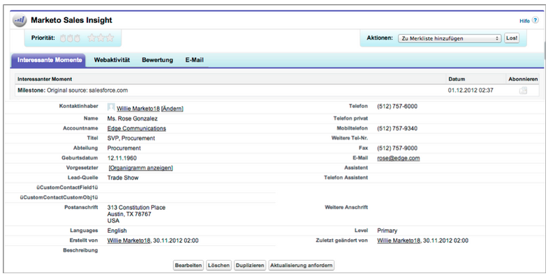
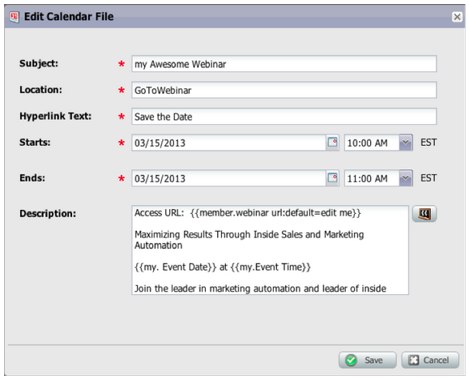
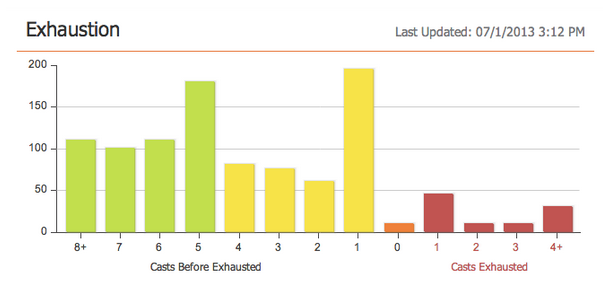

# 2013

## Janeiro de 2013 {#january}

A versão de janeiro expande nossa oferta social com **Ofertas de indicação**. Além disso, [!DNL Marketo Lead Management] usuários podem definir suas preferências de fuso horário, idioma e localidade. Observe que os recursos marcados com um &#42; estão disponíveis somente em Selecionar Edição.

## Ofertas com indicação {#referral-offers}

Uma **Oferta de indicação** incentiva seus clientes em potencial a encaminhar seus amigos. Crie metas e recompensas para indicações bem-sucedidas. Você pode usá-lo em landing pages, em seu site e até no Facebook.

## Preferência de Fuso Horário {#time-zone-preference}

Você pode alterar o fuso horário padrão de sua conta pessoal da Marketo. Por exemplo, mesmo que o padrão para a assinatura seja Hora do Pacífico, você pode alterá-la para Hora do Leste por conta própria.

## Selecione seu idioma [!DNL Marketo Lead Management] {#select-your-marketo-lead-management-language}

Você pode alterar o idioma padrão da sua conta de usuário do Marketo. Mesmo que o padrão da assinatura seja em inglês, você pode alterá-la para alemão ou francês para uso próprio.

## Mensagens de erro de formulário multilíngue {#multi-lingual-form-error-messages}

Quando um cliente potencial preenche um formulário do Marketo, algumas mensagens de validação são automaticamente integradas. Talvez você queira selecionar um idioma de exibição diferente para essas mensagens de erro. Agora oferecemos suporte a inglês, alemão e francês.

Um exemplo de um formulário em francês:

## Selecione seu Idioma do [!DNL Sales Insight] ([!DNL Salesforce] somente) {#select-your-sales-insight-language-salesforce-only}

Se a sua preferência de idioma [!DNL Salesforce] estiver definida como francês ou alemão, o Marketo [!DNL Sales Insight] seguirá essa preferência. Baixe o pacote MSI mais recente para obter essa funcionalidade (disponível na semana de 14 de janeiro).

## Nome de exibição do campo {#field-display-name}

Os nomes de exibição de campo podem exibir texto em diferentes idiomas (por exemplo, caracteres multibyte são suportados).

## Alterar dados do programa {#change-program-data}

A etapa de fluxo [!UICONTROL Alterar Dados do Programa] permite alterar o status de [!UICONTROL Sucesso] e a [!UICONTROL Data de Sucesso] de um membro do programa manualmente por meio de uma campanha. Você pode usar essa etapa de fluxo para corrigir um erro ou alterar manualmente um membro que talvez não tenha participado do programa conforme pretendido.

## Fevereiro de 2013 {#february}

A versão de fevereiro inclui um recurso altamente solicitado, suporte para [!DNL Apple Safari] e outras pequenas melhorias.

## Suporte Oficial para [!DNL Apple Safari] {#official-support-for-apple-safari}

As versões mais recentes do [!DNL Apple Safari] para Mac e [!DNL Windows] são totalmente compatíveis com o uso com o Gerenciamento de Cliente Potencial da Marketo. Observação: [!DNL Safari] no iOS não é totalmente compatível.

## Aprimoramentos do Webhooks {#webhooks-enhancements}

Os Webhooks são aprimorados para evitar tokens na URL/carga útil e também podem atualizar campos de clientes potenciais do Marketo analisando respostas XML/JSON de sistemas de terceiros (não disponível no [!DNL Spark SMB Edition]).

## Ponto de extremidade de API do SOAP atualizado {#updated-soap-api-endpoint}

O ponto de extremidade de API preferencial do SOAP foi atualizado, mostrado em [!UICONTROL Admin] -> API do SOAP. Atualize suas chamadas para usar este novo ponto de extremidade. As chamadas de API para o endpoint antigo foram descontinuadas, mas continuarão funcionando. (API do SOAP não disponível no [!DNL Spark SMB Edition])

## Suporte móvel para [!DNL Facebook] guias {#mobile-support-for-facebook-tabs}

[!DNL Facebook] guias publicadas do Marketo detectarão dispositivos móveis e os rotearão para uma página de aterrissagem. Isso garantirá que o usuário obtenha o conteúdo correto em dispositivos móveis nos quais não há suporte para guias [!DNL Facebook] (disponíveis em [!DNL Spark], [!DNL Standard], [!DNL Select SMB Editions] e [!DNL Marketo Social Marketing]).

## Em breve: suporte para vários modelos {#coming-soon-support-for-multiple-models}

Estamos preparando o terreno para dar suporte a vários modelos de ciclo de receita, votou a ideia #1 para a RCA na Comunidade, em uma versão futura. Nesta versão, você observará algumas alterações, incluindo filtros de Smart List e Adicionar opções em Etapas de fluxo para suportar a seleção de um modelo e estágio. Também estamos removendo os campos Estágio da Receita Principal e Modelo de Ciclo de Receita Principal da guia de grade de Cliente Potencial da Smart List.

## Março de 2013 {#march}

Os recursos a seguir estão incluídos na versão de março.

## Arquivos de calendário do Marketo {#marketo-calendar-files}

Crie um arquivo de calendário como um **Meu token** para ser usado em seus emails de confirmação e lembrete de eventos. Esse arquivo de calendário integrado (por exemplo, arquivo .ics) renderizará todos os tokens, incluindo Meus Tokens e o token `{{member.webinar URL}}`.

## Aguardar até +/- {#wait-until}

Crie Etapas de espera que possam executar um número especificado de dias antes ou depois de um token de data. Por exemplo, você pode criar uma etapa de espera que aguardará 3 dias antes da data do evento e enviar um lembrete!

Você pode criar uma etapa de espera que aguardará 14 dias antes do aniversário do lead. Ao selecionar &quot;usar o próximo aniversário desta data&quot;, o sistema ignorará automaticamente o ano associado à data e usará o ano atual ou o próximo ano civil.

## Sorteios sociais {#social-sweepstakes}

Um sorteio dá aos seus clientes potenciais a chance de ganhar um prêmio e contar aos amigos sobre você. Você seleciona vencedores aleatórios dos participantes e os envia por email.

## Idiomas de [!UICONTROL Mensagem de Erro] do Formulário Adicional {#additional-form-error-message-languages}

Mais de uma dúzia de idiomas foram adicionados às mensagens de erro de formulário!

## Notícias e alertas de suporte {#support-news-and-alerts}

Mantenha-se conectado ao Suporte ao cliente da Marketo inscrevendo-se em Notícias e alertas de suporte para alertas P1, problemas conhecidos, dicas e sugestões de nossos especialistas em suporte e atualizações do Suporte ao cliente da Marketo.

## Abril de 2013 {#april}

Os recursos a seguir estão incluídos na versão de abril.

## [!DNL Box] Integração {#box-integration}

Conecte o Marketo com sua conta [!DNL Box] para copiar facilmente arquivos para o design studio.

## Plug-in [!DNL Gmail] {#gmail-plugin}

Se você usa o Marketo [!DNL Sales Insight] e o [!DNL Gmail], é possível instalar nosso novo plug-in [!DNL Gmail] por meio da loja [!DNL Chrome]. O plug-in permite registrar mensagens com o Marketo, carregar modelos de email do Marketo e enviar mensagens com recursos de rastreamento do Marketo.

## Análise de emails {#email-analysis}

Crie relatórios de email avançados no [!UICONTROL Revenue Explorer], como o relatório Click Activity Heat Grid. Este relatório informará ao insight o dia e a hora em que as pessoas estão clicando nos links de seus emails.

O recurso Análise de email como um todo será ativado em fases durante abril e maio, à medida que migramos seus dados de email de 2012 e 2013. Em outras palavras, alguns clientes terão acesso a esse recurso mais cedo do que outros.

## APIs de programa {#program-apis}

Suporte para programas na chamada de API do SOAP, incluindo acesso somente leitura a dados de programas, como: contagens de associação de programas, adquiridas por, sucesso, configurações, canais, tags, tokens e custos. Consulte a documentação da API do SOAP para obter mais detalhes.

## Aprimoramento de [!DNL ON24] {#on-enhancement}

O Cargo e o Nome da Empresa serão sincronizados com [!DNL ON24] a partir do formulário de registro do Marketo.

## Maio de 2013 {#may}

Os recursos a seguir estão incluídos na versão de maio.

## Arquivos de calendário para páginas iniciais {#calendar-files-for-landing-pages}

Crie um arquivo de calendário como um Meu token que possa ser adicionado à sua página inicial. Esse arquivo de calendário integrado (por exemplo, arquivo .ics) renderizará todos os tokens, incluindo Meus tokens em páginas de aterrissagem de ativos locais.

## Guia de associação em modelo {#model-membership-tab}

Visualize todos os dados do membro do modelo em um local para monitorar e solucionar problemas facilmente. A nova Guia [!UICONTROL Membros] é uma exibição somente leitura disponível ao selecionar um Modelo de Ciclo de Receita aprovado.

## Árvore de Ação de Fluxo Reorganizada {#reorganized-flow-action-tree}

Encontre ações de fluxo mais rapidamente com a árvore de ação de fluxo recém-reorganizada.

## Ações de fluxo renomeadas {#renamed-flow-actions}

Alterar Status da Progressão agora é [!UICONTROL Alterar Status do Programa]. Alterar Dados do Programa agora é [!UICONTROL Alterar Êxito do Programa].

## Junho de 2013 {#june}

Os recursos a seguir estão incluídos na versão de junho.

## Idiomas adicionais do usuário {#additional-user-languages}

Veja a interface do Marketo Lead Management no seu idioma preferido, agora com suporte para espanhol e português.

## Interface do usuário cobalto {#cobalt-user-interface}

Nos próximos meses, você observará um novo tema implantado em diferentes partes do aplicativo; afetando as janelas modais, por exemplo.

## Clonagem de subpastas {#subfolder-cloning}

Clonar ativos em subpastas.

## Vários modelos {#multiple-models}

Uma ideia importante do Revenue Cycle Analytics (RCA) na Comunidade, esse recurso permite criar vários modelos para obter uma compreensão mais detalhada da sua receita do funnel por linha de produto, unidade de negócios ou região. Os relatórios Leads by Revenue Stage, Success Path Analyzer, Program Analyzer e Revenue Explorer agora oferecem suporte à capacidade de selecionar um modelo específico para relatórios.

Por padrão, dois modelos estão disponíveis para Select SMB Edition e quinze modelos para Enterprise Edition. Você também pode comprar modelos adicionais.

## Julho de 2013 {#july}

Os recursos a seguir estão incluídos na versão de julho, programada para ser implantada na sexta-feira, 26 de julho.

## Widget de conteúdo esgotado no painel {#exhausted-content-widget-on-the-dashboard}

Fornece informações sobre quando os clientes potenciais esgotarão o conteúdo no Fluxo. O sistema fornecerá informações sobre quantos leads estão prestes a atingir o conteúdo esgotado ou há quanto tempo.

## Limites de comunicação {#communication-limits}

Deseja parar de enviar clientes em potencial por email? Agora é fácil limitar automaticamente a frequência a cada indivíduo. Basta definir um limite de comunicação diário e semanal, e o sistema fará o resto. Disponível em Select, Enterprise e com o pacote complementar para clientes do Standard.

## Interface do usuário cobalto {#cobalt-user-interface-july}

Nos próximos meses, você observará mais do nosso novo tema sendo lançado em diferentes partes do aplicativo. Nenhuma funcionalidade será movida ou removida.

## Coluna de Data do Membro do Programa {#program-member-date-column}

Exibir e classificar a grade do membro pela data em que o lead foi adicionado.

## Alterações na verificação ortográfica no editor do WYSIWYG {#changes-to-spell-check-in-wysiwyg-editor}

O serviço usado pelo editor do WYSIWYG para verificação ortográfica foi descontinuado. Removemos o botão Verificação ortográfica do editor até encontrarmos uma substituição.

## Agosto de 2013 {#august}

Os recursos a seguir estão incluídos na versão de agosto de 2013.

**Emails Somente Texto**

Agora você pode enviar [apenas a versão de texto](/help/marketo/product-docs/email-marketing/general/creating-an-email/create-a-text-only-email.md) de um email. Lembre-se, os links não serão decorados ao usar essa opção.

## Aprimoramentos do mecanismo de engajamento do cliente {#customer-engagement-engine-enhancements}

### Ignorar conteúdo esgotado {#ignore-exhausted-content}

Configure o programa de engajamento para [ignorar a exaustão](/help/marketo/product-docs/email-marketing/drip-nurturing/using-engagement-programs/disable-and-enable-exhausted-content-notifications.md), incluindo a supressão de qualquer notificação.

## Teste de fluxo de engajamento {#engagement-stream-testing}

Use o [novo recurso de teste](/help/marketo/product-docs/email-marketing/drip-nurturing/engagement-program-streams/test-an-engagement-stream.md) para simular uma conversão e testar o conteúdo recém-adicionado em um fluxo ao vivo.

## Enviar teste personalizado {#personalized-send-test}

Ao enviar um teste de email, você pode selecionar o nome de um cliente potencial para personalizar o email de teste.

## &quot;Exibir email como página da Web&quot; e &quot;Cancelar inscrição&quot; nos tokens do sistema {#view-email-as-web-page-and-unsubscribe-system-tokens}

Utilize esses [novos tokens](/help/marketo/product-docs/email-marketing/general/using-tokens/system-tokens-glossary.md) para fornecer maior controle sobre seu posicionamento em emails.

## Limpeza de campanha com acionamento automático {#automatic-trigger-campaign-cleanup}

Agora, a Marketo vai notificá-lo periodicamente e [desativar automaticamente campanhas de acionadores](/help/marketo/product-docs/core-marketo-concepts/smart-campaigns/using-smart-campaigns/automatic-trigger-campaign-cleanup.md) que não foram executadas nos últimos seis meses.

## Aprimoramento do Marketo Financial Management {#marketo-financial-management-enhancement}

### Atualização de Custo do Programa  {#program-cost-update}

A sincronização de custo do programa permite rastrear o custo do programa em várias plataformas.

### Interface do usuário cobalto {#cobalt-user-interface-august}

Estamos continuando a implantação da nossa nova interface Cobalt. Este projeto vai fazer tudo no Marketo super rápido! A atualização continuará até o final do ano.

## Setembro de 2013 {#september}

Os seguintes recursos estão incluídos na versão de setembro.

## URLs mais curtas {#shorter-urls}

As URLs de e-mails foram encurtadas para que o destinatário possa clicar nelas com mais facilidade, preservando a funcionalidade de acompanhamento

>[!CAUTION]
>
>À medida que mudamos para URLs curtos, os links em emails enviados antes da versão de setembro expirarão 90 dias após esta versão.

Use dados de objetos personalizados do Marketo ou adicione lógica condicional ao seu conteúdo de email usando a linguagem de modelo do Velocity.

## Alterar envio de teste para enviar amostra {#change-send-test-to-send-sample}

Renomeamos a ação Enviar teste como Enviar amostra

## Personalizado [!UICONTROL Enviar Email de Exemplo] {#personalized-send-sample-email}

Ao enviar uma amostra de email, você pode selecionar o nome de um lead para personalizar a amostra de email.

## Sincronização de Campo Adicional para [!DNL GoToWebinar] {#additional-field-sync-for-gotowebinar}

Você pode sincronizar o Nome da Empresa e o Cargo do seu formulário do Marketo para [!DNL GoToWebinar]. Para habilitar esses campos adicionais, vá para Parceiros de evento e marque &quot;Habilitar campos adicionais&quot;.

## Restringir o logon do usuário somente ao SSO {#restrict-user-login-to-sso-only}

Configure assinaturas para permitir que apenas os usuários do Marketo façam logon por meio do SSO, e não pela tela de logon normal

## Varredura de vírus em arquivos carregados {#virus-scan-of-uploaded-files}

Os arquivos carregados no Estúdio de desenvolvimento são automaticamente examinados e bloqueados caso contenham vírus

## Exportação do analisador de influência da oportunidade {#export-opportunity-influence-analyzer}

Agora você pode exportar os dados do Opportunity Influence Analyzer para [!DNL Excel]. Cada arquivo [!DNL Excel] exportado contém todas as interações de marketing para todos os clientes potenciais (incluindo aqueles sem uma função na oportunidade), bem como todas as oportunidades na conta selecionada no analisador. As linhas de oportunidade são destacadas em verde. Você pode usar os recursos nativos de filtragem de dados do [!DNL Excel] se precisar se concentrar em clientes potenciais específicos ou atividades de marketing.

## Configurações de atribuição de programa {#program-attribution-settings}

Você pode alterar a maneira como a Marketo vincula contatos e oportunidades para métricas de atribuição de primeiro e de vários contatos, incluindo a capacidade de fazer atribuição baseada em conta. Essas configurações afetarão as métricas de atribuição nos relatórios do [!UICONTROL Explorador de Receita] na área Análise de Oportunidade de Programa e na área Análise de Oportunidade. Isso também afetará as métricas de atribuição no Program Analyzer.

Você pode alterar as configurações de atribuição do programa para uma das três opções. A alteração dessa configuração não modifica dados do Marketo ou do CRM; ela simplesmente altera a forma como seus relatórios são executados e podem ser revertidos a qualquer momento.

A configuração Explícito examinará somente os contatos com funções (comportamento atual). Implícito examinará todos os contatos associados à conta, independentemente da função. É altamente recomendável usar o modo Explicit, se possível. Usar Implícito pode criar falsos positivos, pessoas com crédito por uma oportunidade apesar de não terem influência real na oportunidade.

## [!UICONTROL Sales Insight] disponível em francês e alemão (somente [!DNL Salesforce]) {#sales-insight-available-in-french-and-german-salesforce-only}

Baixe a versão mais recente do Marketo Lead Management e do Marketo [!UICONTROL Sales Insight] do [!DNL AppExchange] para que os seus vendedores em francês e alemão possam ver o conteúdo do [!UICONTROL Sales Insight] no seu idioma preferido.

## Interface do usuário cobalto {#cobalt-user-interface-september}

Nos próximos meses, um novo tema será lançado em diferentes partes do aplicativo. Este mês, você pode notar mais novas janelas modais azuis.

## Outubro de 2013 {#october}

Os seguintes recursos estão incluídos na versão de outubro de 2013.

## templates.marketo.com {#templates-marketo-com}

[Templates.marketo.com](/help/marketo/product-docs/demand-generation/landing-pages/landing-page-templates/guided-landing-page-template-list.md) mostra modelos de email e de páginas de aterrissagem (incluindo modelos de email responsivos para dispositivos móveis) que você pode baixar do [!DNL Marketo Program Library]. Adicionaremos modelos mensalmente. Verifique com frequência.

## developers.marketo.com {#developers-marketo-com}

[Developer.adobe.com](https://experienceleague.adobe.com/pt-br/docs/marketo-developer/marketo/home) é para desenvolvedores que desejam criar integrações com o Marketo. Você pode consultar diferentes opções de integração, incluindo APIs do Munchkin JavaScript, exemplos de código da API do SOAP, Webhooks e scripts de email. Um Java SDK também está disponível no [GitHub](https://github.com/Marketo/SOAP-API-Java-Client).

## Adaptador de Eventos [!DNL BrightTALK] Atualizado {#updated-brighttalk-event-adapter}

Sincronizar campos adicionais de [!DNL BrightTALK] com a Marketo, incluindo Nome da Empresa, Cargo, Setor e Tamanho da Empresa.

## Aplicativo de check-in de eventos do Android Tablet {#android-tablet-event-check-in-app}

Inclua inscritos em seu evento usando nosso novo aplicativo de check-in baseado em Android, disponível na Google Play.

## Dezembro de 2013 {#december}

Os recursos a seguir estão incluídos na versão de dezembro.

Após o lançamento, verifique a guia Nova versão na Comunidade para obter artigos detalhados da Base de conhecimento para cada recurso.

## Programa de email {#email-program}

Enviar um email nunca foi tão fácil. Use o novo [programa de email](/help/marketo/product-docs/email-marketing/email-programs/creating-an-email-program/understanding-email-programs.md) para enviar um email em lote, em vez do Programa Padrão. Defina a lista inteligente, envie um e-mail, programe-a e você estará desligado!

Verifique também o novo [Painel de Métricas de email](/help/marketo/product-docs/email-marketing/email-programs/email-program-data/view-the-email-program-dashboard.md) para ver o desempenho do seu email.

## Teste A/B de e-mail {#email-a-b-testing}

No novo Programa de email, execute um [teste A/B](/help/marketo/product-docs/email-marketing/email-programs/email-program-actions/email-test-a-b-test/add-an-a-b-test.md) sobre uma porcentagem da população geral de envio de email. Escolha entre 4 tipos diferentes de testes: Linha de assunto, Endereço do remetente, Data/hora e Email completo. Você pode até mesmo optar por promover manualmente o vencedor ou deixar que o sistema o promova com base em um critério vencedor predefinido. O novo programa de email, incluindo o teste A/B, pode ser aninhado em Eventos e no Programa padrão para tornar o envio desse email tão simples!

## Teste de e-mail Champion/Challenger {#email-champion-challenger-testing}

[Teste Champion/Challenger](/help/marketo/product-docs/email-marketing/general/functions-in-the-editor/email-tests-champion-challenger/add-an-email-champion-challenger.md) é semelhante ao teste A/B, mas a diferença é que ele é usado para emails acionados e você não envia automaticamente um vencedor. Esse teste permite desafiar uma maneira estabelecida de fazer algo, chamada de Campeão, e você testa se ainda é o melhor introduzindo um Desafiador. Além disso, os Testes de e-mail de Especialista/Desafiador podem ser usados nos fluxos do programa Engajamento.

## Detalhes do cliente potencial na [!UICONTROL Análise de email] {#lead-details-in-email-analysis}

Introduzimos atributos adicionais de cliente potencial e empresa na [!UICONTROL Análise de email]. Agora você pode exibir suas estatísticas de email agrupadas por novos atributos, como [!UICONTROL Setor] e [!UICONTROL Source líder].

## Adaptador de Eventos [!DNL BrightTALK] Aprimorado {#enhanced-brighttalk-event-adapter}

Agora é possível transferir inscritos para o Marketo do canal e evento do [!DNL BrightTALK]. Você pode usar essas informações para informar outras campanhas de marketing!

