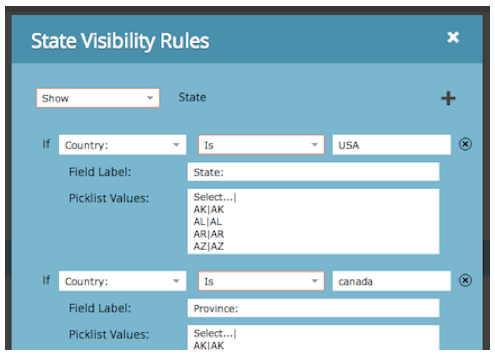
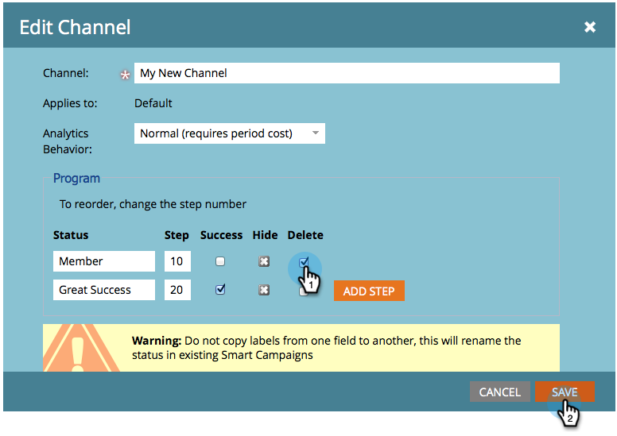
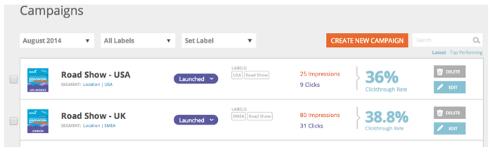
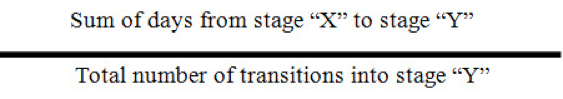

# 2014

## Janeiro de 2014 {#january}

Os recursos a seguir estão incluídos na versão de janeiro de 2014. Verifique sua [Marketo Edition](https://www.marketo.com/pricing/) para a disponibilidade de recursos.

## Forms 2.0 {#forms}

Atenção: a documentação do Forms 2.0 será adicionada em breve.

Assuma o controle do processo de criação de formulários e interrompa os desenvolvedores da Web. O Forms 2.0 foi projetado para capacitar os profissionais de marketing a criar formulários visualmente e funcionalmente robustos sem precisar de conhecimento de programação.

**Dê ao seu Forms a transformação visual que ele merece:**

Os designs de tema, a personalização de botões e os layouts flexíveis permitem que você crie formulários de aparência moderna que se encaixem perfeitamente na aparência do site.

**Visibilidade condicional e Lógica da página de acompanhamento:**

Deseja que o &quot;Estado&quot; seja exibido somente se um usuário selecionar EUA como seu &quot;País&quot;? Que tal apresentar diferentes whitepapers aos clientes com base em como eles respondem perguntas em seu formulário? Crie lógica condicional em seus formulários diretamente do editor. [!DNL javascript] não é necessário.

**Incorpore facilmente o Forms em suas próprias páginas de aterrissagem:**

Longe vão os dias de retirar o código html de formulários colocados em páginas de aterrissagem do Marketo e soltá-los em um [!DNL iFrame]. Basta pegar o código incorporado e colocá-lo na página de aterrissagem onde deseja que o formulário seja renderizado. Dois modos - normal e lightbox - fornecem ainda mais flexibilidade com o Marketo Forms em seu site.

## Limites de comunicação para o programa de email {#communication-limits-for-email-program}

[Defina Limites de Comunicação em um programa de email](/help/marketo/product-docs/email-marketing/email-programs/email-program-actions/enable-disable-communication-limits-in-an-email-program.md) para garantir que você não se comunique excessivamente com o banco de dados. Se uma pessoa ultrapassar o limite definido, ela não receberá o email.

## Campos adicionais na análise de associação de programa {#additional-fields-in-program-membership-analysis}

Agora é possível adicionar e agrupar suas métricas de Análise de participação no programa por atributos de cliente potencial e de empresa. Por exemplo, é possível adicionar o campo Setor para ver a divisão dos membros e os sucessos do programa.

## Fevereiro de 2014 {#february}

Os seguintes recursos estão incluídos na versão de fevereiro de 2014. Verifique a disponibilidade de recursos na sua Marketo Edition. Após o lançamento, não deixe de encontrar links para artigos detalhados da Base de conhecimento para cada recurso.

## [!UICONTROL Pontuação de engajamento] como critério vencedor {#engagement-score-as-winning-criteria}

[Use a pontuação de envolvimento](/help/marketo/product-docs/email-marketing/email-programs/email-program-actions/email-test-a-b-test/define-the-a-b-test-winner-criteria.md) para determinar a variante vencedora no teste A/B split ou no teste Champion/Challenger. O teste deve ser executado por um mínimo de 24 horas, para fornecer uma pontuação de engajamento adequada.

## Guia [!UICONTROL Resultados] do programa de email {#email-program-results-tab}

[Exibir os resultados](/help/marketo/product-docs/email-marketing/email-programs/email-program-data/view-email-program-results.md) e as atividades registradas para o programa de email.

## Pessoas/[!UICONTROL Clientes Potenciais] Bloqueados para Endereçamento {#people-leads-blocked-from-mailing}

[Clique no número de pessoas/clientes potenciais impedidos de enviar](/help/marketo/product-docs/email-marketing/email-programs/managing-people-in-email-programs/define-an-audience-with-a-smart-list.md) para ver quem não receberá o email por ter sua assinatura cancelada, lista de bloqueios, email inválido ou em branco ou suspensão de marketing.

## Exportar dados do programa de email {#export-email-program-data}

[Exportar métricas de email para [!DNL Excel]](/help/marketo/product-docs/email-marketing/email-programs/email-program-data/export-email-program-dashboard-to-excel.md), incluindo dados de variantes de Teste AB.

## [!UICONTROL Pontuação de engajamento] no relatório [!UICONTROL Desempenho do fluxo de engajamento] {#engagement-score-in-engagement-stream-performance-report}

Adicionamos a Pontuação de engajamento ao [[!UICONTROL Relatório de desempenho da transmissão de engajamento]](/help/marketo/product-docs/email-marketing/drip-nurturing/reports-and-notifications/engagement-stream-performance-report.md) para ajudar você a ver a eficiência do conteúdo em seu programa de engajamento.

## Detalhes do programa na análise de e-mail {#program-details-in-email-analysis}

Agora é possível agrupar suas métricas de email por Nome do programa, Canal e Tags. O nome do programa é adicionado ao campo Nome do email quando o email é um ativo local do Programa. O novo campo Nome do programa mostra o nome do programa da campanha inteligente que enviou o email. Isso pode ser diferente do programa no campo Nome do email se o email for um ativo local de um programa diferente.

## Atualização para filtros e acionador do link de cliques {#update-to-clicks-link-filters-and-trigger}

Os seguintes nomes de filtro e acionador foram atualizados:

* Link de Cliques para [!UICONTROL Link de Cliques na Página da Web]
* Link clicado para [!UICONTROL Link clicado na Página da Web]
* Link Não Clicado para [!UICONTROL Link Não Clicado na Página da Web]

## Melhorias de formulários 2.0 {#forms-enhancements}

Fornecemos ao Forms 2.0 várias atualizações de &quot;qualidade de vida&quot; com esta versão. Além de ativar a criação progressiva de perfis em formulários inseridos, fizemos alterações no fluxo de trabalho e no UX que facilitarão o uso de funcionalidades mais avançadas no editor, [incluindo as regras de visibilidade](/help/marketo/product-docs/demand-generation/forms/form-fields/dynamically-toggle-visibility-of-a-form-field.md), páginas de agradecimento avançadas e campos ocultos.

## Março de 2014 {#march}

Os recursos a seguir estão incluídos na versão de março de 2014. Verifique a disponibilidade de recursos na sua Marketo Edition. Após o lançamento, não deixe de consultar os links para artigos da base de conhecimento referentes a cada recurso.

## Botão Atualizar do painel do programa de email {#email-program-dashboard-refresh-button}

Use o [botão Atualizar](/help/marketo/product-docs/email-marketing/email-programs/email-program-data/use-the-email-program-dashboard.md) para obter métricas de email atualizadas sobre seu envio de email ou seu teste AB!

## Desfazer/Refazer no Editor de email e no Editor de trechos {#undo-redo-in-the-email-editor-and-snippet-editor}

[Desfazer ou refazer](/help/marketo/product-docs/email-marketing/general/email-editor-2/edit-elements-in-an-email.md) até 50 ações para a sessão atual.

## Colunas de status do programa do relatório de desempenho do programa {#program-status-columns-in-program-performance-report}

Ao usar o [relatório de desempenho do programa](/help/marketo/product-docs/core-marketo-concepts/programs/program-performance-report/add-program-status-columns-to-a-program-report.md), você pode ver quantas pessoas estão com os status do programa.

## Programas inclusivos e operacionais para análises {#inclusive-and-operational-programs-for-analytics}

Agora é possível incluir programas sem custos de período no [!UICONTROL Explorador de receita] e nos Analisadores definindo a opção Comportamento do Analytics como &quot;Inclusivo&quot; ao editar Canais de programa. Você também pode excluir programas operacionais de gerar relatórios por completo, escolhendo &quot;Operacional&quot;.

## Opções híbridas e implícitas para conversão de leads {#hybrid-and-implicit-options-for-lead-conversion}

Você pode alterar a maneira como a Marketo vincula contatos e oportunidades para as métricas de conversão de clientes potenciais na Análise de clientes potenciais. Você pode [alterar a configuração de atribuição](/help/marketo/product-docs/administration/settings/change-attribution-settings-for-analytics.md) para uma das três opções. A alteração dessa configuração não modifica dados do Marketo ou do CRM; ela simplesmente altera a forma como seus relatórios são executados e podem ser revertidos a qualquer momento.

A configuração Explícito somente tratará os contatos com funções em uma oportunidade como clientes potenciais convertidos (comportamento padrão). Implícito tratará todos os contatos associados à conta na oportunidade, independentemente da função, como convertidos. O Hybrid tratará os contatos com funções como convertidos se estiverem disponíveis; se não houver nenhum, trataremos todos os contatos na conta como convertidos.

Lembrando que essa configuração também altera as métricas de atribuição do programa.

## Idioma adicional do usuário {#additional-user-language}

Selecione Seu [Idioma Do Aplicativo Marketo](/help/marketo/product-docs/administration/settings/change-time-zone.md). Veja a interface do Marketo Lead Management no seu idioma preferido — agora com suporte para japonês.

## Blog de desenvolvedores do Marketo {#marketo-developer-blog}

O [blog do Marketo Developer](https://developers.marketo.com/blog/) é dedicado aos desenvolvedores da Web e engenheiros de software que oferecem suporte às necessidades em rápida evolução do profissional de marketing moderno. Você pode assinar anúncios sobre novas opções de integração, atualizações de versão da API e uma nova série de artigos explicativos que incluem amostras de código e práticas recomendadas para a integração com a plataforma Marketo.

O [primeiro artigo](https://developers.marketo.com/blog/retrieving-customer-and-prospect-information-from-marketo-using-the-api/) desta série mostra como recuperar com eficiência as informações sobre as pessoas (clientes/contatos/clientes potenciais) armazenadas no Marketo usando a API.

## Maio de 2014 {#may}

Os seguintes recursos estão incluídos na versão de maio de 2014. Verifique a disponibilidade de recursos na sua Marketo Edition. Após o lançamento, não deixe de encontrar links para artigos detalhados da Base de conhecimento para cada recurso.

## Excluir área de trabalho {#delete-workspace}

Agora você pode [excluir um espaço de trabalho não utilizado](/help/marketo/product-docs/administration/workspaces-and-person-partitions/delete-a-workspace.md). Certifique-se de mover todos os ativos para outro espaço de trabalho antes de tentar excluí-lo.

## Agendar primeira conversão {#schedule-first-cast}

Em programas de engajamento, você pode agendar a data de execução de [primeira conversão](/help/marketo/product-docs/email-marketing/drip-nurturing/engagement-program-streams/set-stream-cadence.md). Por exemplo, especifique a cadência a cada 2 semanas e selecione a data da primeira conversão.

## Programas de envolvimento aprimorados {#enhanced-engagement-programs}

Agora todos têm vários programas, transmissões e limites de comunicação.

## Rastreamento de link em emails de texto {#link-tracking-in-text-emails}

[Adicione colchetes duplos](/help/marketo/product-docs/email-marketing/general/functions-in-the-editor/add-tracked-links-to-a-text-email.md) sobre URLs na versão em texto de seus emails para indicar quando os links devem ser convertidos em links de rastreamento de Marketo redirecionados

>[!NOTE]
>
>**Exemplo**
>
>`[[https://www.marketo.com]]`

Por padrão, nenhum link será rastreado na versão de texto dos emails. Adicione essa nova sintaxe para indicar quando um link deve ser convertido em um link de rastreamento. O comportamento dos links do HTML não é alterado.  Para adicionar links rastreados aos emails:

* **Versão do HTML:** basta inserir seu link. Ele será rastreado por padrão.
* **Versão do texto:** Insira a URL cercada por colchetes duplos.

Para adicionar links não rastreados aos emails:

* **Versão do HTML:** insira seu link e adicione a classe &quot;mktNoTrack&quot; ao link.
* **Versão do texto:** Basta inserir a URL. Ele não será rastreado por padrão.

## Marcação de link em emails de amostra {#link-markup-in-sample-emails}

Veja como seus links se comportarão em emails antecipadamente. Os emails de amostra agora exibem links exatamente como aparecem para seus clientes potenciais. Visualize quais links foram convertidos em links de rastreamento, fornecendo uma melhor noção de como a mensagem realmente aparecerá para os recipients.

## [!UICONTROL Anular campanha] {#abort-campaign}

Não entre em pânico! Se você encontrar um erro, use o novo botão [abortar campanha](/help/marketo/product-docs/core-marketo-concepts/smart-campaigns/using-smart-campaigns/abort-a-smart-campaign.md) para interromper imediatamente as campanhas em suas faixas. Você receberá uma notificação descrevendo quantos leads estavam pendentes em cada etapa do fluxo quando a campanha foi interrompida.

## [!UICONTROL Sales Insight] em japonês, português e espanhol {#sales-insight-in-japanese-portuguese-and-spanish}

Baixe a última versão do [!UICONTROL Sales Insight] da AppExchange para que seus agentes de vendas que falam japonês, português e espanhol vejam o conteúdo do [!UICONTROL Sales Insight] no idioma de sua preferência.

## Status do Programa e Período de Sucesso na Análise de Associação ao Programa {#program-status-and-success-timeframe-in-program-membership-analysis}

Veja quantos membros estão em cada Status do Programa e quando eles foram alterados para cada status, incluindo a data em que obtiveram êxito no Programa.

## Emails de Teste A/B na [!UICONTROL Análise de email] {#a-b-test-emails-in-email-analysis}

Relate cada uma das variantes de email de teste A/B na [!UICONTROL Análise de email].

## Alterações de empacotamento do Analytics {#analytics-packaging-changes}

O Revenue Cycle Modeler e o Success Path Analyzer agora estão incluídos no MA Standard Edition.

## Informações da plataforma móvel {#mobile-platform-info}

[Segmente e acione](/help/marketo/product-docs/reporting/basic-reporting/report-activity/build-a-people-performance-report-with-mobile-platform-columns.md) sem clientes potenciais abrindo e clicando nos emails de seus dispositivos móveis.

## Junho de 2014 {#june}

Os recursos a seguir estão incluídos na versão de junho de 2014. Verifique a disponibilidade de recursos na sua Marketo Edition.

## Interface atualizada - Em breve! {#updated-ui-coming-soon}

Uma nova aparência, incluindo navegação para [!DNL Marketo Lead Management], será lançada em breve em uma versão posterior!

## Plug-in do [!DNL Sales Insight] para [!DNL Outlook] 2013 {#sales-insight-plugin-for-outlook}

Isso exigirá o download do novo plug-in. Você pode baixá-lo de [aqui](/help/marketo/product-docs/marketo-sales-insight/msi-outlook-plugin/install-the-marketo-email-add-in-for-outlook-with-a-registration-code.md).

## Resolução do token {#token-resolution}

Ao enviar um email de teste de [!DNL Sales Insight], os tokens atuais no email não são resolvidos e o valor padrão é enviado. Esse aprimoramento garantirá a resolução dos tokens nos e-mails teste.

## Personalizar porcentagens para estrelas e chamas {#customize-percentages-for-stars-and-flames}

[Defina a porcentagem](/help/marketo/product-docs/marketo-sales-insight/msi-for-salesforce/features/stars-and-flames/customize-stars-and-flames.md) de leads que recebem 1, 2 ou 3 estrelas e chamas.

## API REST do lead {#lead-rest-api}

Crie, leia e atualize leads programaticamente por meio de nossa API ReST. Para começar a usar a ReST, você precisa [criar um serviço personalizado](/help/marketo/product-docs/administration/additional-integrations/create-a-custom-service-for-use-with-rest-api.md) no Marketo. Em seguida, vá para o [site de desenvolvedores](https://experienceleague.adobe.com/pt-br/docs/marketo-developer/marketo/rest/rest-api) para obter detalhes sobre como usar esta API.

## Atualização da página de campanhas de personalização em tempo real (RTP, Real-Time Personalization) do Marketo {#marketo-real-time-personalization-rtp-campaigns-page-update}

As campanhas RTP agora incluem um novo design com exibições de miniaturas e desempenho de campanha. Além disso, você pode [organizar suas campanhas](/help/marketo/product-docs/web-personalization/working-with-web-campaigns/sort-web-campaigns-by-latest-or-top-performing.md) de acordo com a data ou o desempenho principal.

## Integrações de análise da web {#web-analytics-integrations}

Anexe todos os dados RTP na plataforma de análise da Web.

A integração com o [Google Analytics](/help/marketo/product-docs/web-personalization/reporting-for-web-personalization/web-analytics-integrations/integrate-rtp-with-google-analytics.md) (GA) agora está habilitada por padrão. Portanto, em Configurações da Conta, ative o comutador para o qual você deseja enviar dados para variáveis e eventos personalizados do GA.

Também concluímos a integração com o [Adobe SiteCatalyst](/help/marketo/product-docs/web-personalization/reporting-for-web-personalization/web-analytics-integrations/integrate-with-adobe-analytics.md).

## Julho de 2014 {#july}

Os recursos a seguir estão incluídos na versão de julho de 2014. Verifique a disponibilidade de recursos na sua Marketo Edition. Volte após a versão para obter links para a documentação detalhada do recurso.

## Calendário de marketing {#marketing-calendar}

Veja todos os seus eventos, e-mails e muito mais em todos os programas. [Este novo produto](/help/marketo/product-docs/core-marketo-concepts/marketing-calendar/understanding-the-calendar/navigating-the-marketing-calendar.md) estará disponível sem custo para clientes com 10 ou menos usuários do [!DNL Marketo Lead Management] ou do Diálogo.

A documentação do Calendário de marketing estará disponível no momento do lançamento.

## Interface com novo visual {#new-look-and-feel}

O [!DNL Marketo Lead Management] será atualizado com uma nova aparência moderna e elegante, incluindo uma navegação atualizada.

## Operadores de data {#date-operators}

[Filtros avançados](/help/marketo/product-docs/core-marketo-concepts/smart-lists-and-static-lists/creating-a-smart-list/smart-list-filter-operators-glossary.md) para &quot;[!UICONTROL no passado antes]&quot;, &quot;[!UICONTROL no futuro]&quot; e &quot;[!UICONTROL no futuro após]&quot;. Por exemplo, encontre leads com uma data de nascimento nos próximos 3 meses ou um contrato que expira após 6 meses.

## Exibir cronograma do programa {#program-schedule-view}

Além do calendário de marketing com o qual você gerencia seus eventos e programas padrão, há uma nova visualização de cronograma diretamente no programa.

* Reprogramar todas as datas de uma só vez
* Novas Datas Provisórias - escreva a lápis!
* Tipos de entrada personalizados - ToDo, Press Release, qualquer coisa que você desejar

## Operações de lista na API REST {#list-operations-in-the-rest-api}

Adicionamos as chamadas abaixo relacionadas às operações de lista no ReST. Consulte [https://experienceleague.adobe.com/en/docs/marketo-developer/marketo/rest/rest-api](https://experienceleague.adobe.com/pt-br/docs/marketo-developer/marketo/rest/rest-api) para obter a documentação completa.

* Obter Lista por ID
* Obter Várias Listas
* Importar para a lista
* Obter Status de Importação para Lista

## Importação rápida de lista {#fast-list-import}

Mais de **50x mais rápido**, seus arquivos serão ampliados para o Marketo! As opções de importação antigas &quot;Normal&quot; e &quot;Otimizado para novos clientes em potencial&quot; foram substituídas por &quot;Padrão (Importação rápida)&quot;.

A opção &quot;Ignorar novos clientes em potencial e atualizações&quot; permanece inalterada.

## Novo Munchkin aprimorado! {#new-improved-munchkin}

A implantação será preparada a partir de meados de julho e continuará pelos próximos meses.

* Remove a dependência [!DNL jQuery] para compatibilidade total e futura
* Mais compatível com outros JavaScript no seu site
* Totalmente testado em muitos sites no ano passado!

## RTP: modelos de campanha em tempo real do Personalization {#rtp-real-time-personalization-campaign-templates}

A página RTP Definir Campanha agora [inclui modelos prontos](/help/marketo/product-docs/web-personalization/using-templates/using-templates-to-create-web-campaigns.md). Escolha entre uma variedade de estilos, incluindo webinários, estudos de caso, e-books.

## RTP: melhorias na API do JavaScript {#rtp-javascript-api-enhancements}

Nova chamada de API RTP para obter dados do visitante em tempo real, como organização, setor, localização e correspondência de código de segmento. Além disso, passar o mouse sobre um nome de segmento na página Segmentos revelará uma dica de ferramenta que mostra o código do segmento. Consulte nosso [site de desenvolvedores](https://experienceleague.adobe.com/en/docs/marketo-developer/marketo/javascriptapi/rich-media-recommendation) para obter a documentação completa.

## RTP: suporte ao HTML5 no Editor de conteúdo do Campaign {#rtp-html-support-in-campaign-content-editor}

O editor de conteúdo do WYSIWYG na página Definir campanhas agora tem compatibilidade total com o HTML5. Clique no ícone &quot;HTML&quot; no editor para inserir qualquer código HTML5.

## Agosto de 2014 {#august}

Os recursos a seguir estão incluídos na Versão de agosto de 2014. Verifique a edição do Marketo quanto à disponibilidade de recursos. Volte após a versão para obter links para a documentação detalhada do recurso.

## Licenças do Calendário de Marketing {#marketing-calendar-licenses}

Depois de 5 de setembro de 2014, apenas 5 usuários poderão ter acesso gratuito ao calendário de marketing. Certifique-se de [Emitir/Revogar uma Licença do Calendário de marketing](/help/marketo/product-docs/core-marketo-concepts/marketing-calendar/understanding-the-calendar/issue-revoke-a-marketing-calendar-license.md) para os usuários de sua escolha antes para ter acesso ininterrupto.

## Novas permissões de usuário {#new-user-permissions}

As novas permissões de usuário a seguir foram adicionadas:

| Permissão | Descrição |
|---|---|
| Acessar gerenciador de receitas | Se você adquiriu a RCA, agora terá controle sobre quem pode acessá-la. |
| Importar lista | Impedir que usuários importem listas para o banco de dados de clientes potenciais. |
| Importação de lista | Impeça que os usuários importem listas por meio de um programa em atividades de marketing. |
| Ativar campanha com gatilho | Controle quem pode ou não ativar campanhas de acionador. |
| Programar campanha em lote | Controle quem pode ou não programar execuções de campanha em lote. |

## Exportar Usuários e Funções de [!UICONTROL Administrador] {#export-users-and-roles-from-admin}

Agora você pode [Exportar uma Lista de Usuários e Funções](/help/marketo/product-docs/administration/users-and-roles/export-a-list-of-users-and-roles.md) da Marketo. Você também pode incluir um carimbo de data e hora de &quot;Último logon&quot; na exportação.

## Excluir canais e tags {#delete-channels-and-tags}

Agora você pode excluir qualquer canal e status não utilizados. Como sempre, você só pode ocultar um que esteja em uso no momento.

## Automatizado [!DNL DKIM] {#automated-dkim}

Para melhorar a capacidade de entrega, todos os emails de saída serão assinados por [!DNL DKIM] (DomainKeys Identified Mail). Por padrão, os emails usarão a assinatura [!DNL DKIM] compartilhada da Marketo. Você terá a opção de personalizar esta assinatura.

>[!NOTE]
>
>[!DNL DKIM]será implantado lentamente. Talvez você não o veja por algumas semanas.

## Atualizações do Real-Time Personalization {#real-time-personalization-updates}

Adicionamos rótulos à página da campanha para que você possa adicionar tags ao seu conteúdo cardíaco.

## Direcionamento móvel {#mobile-targeting}

Você perguntou sobre a comunidade e nós entregamos! Agora é possível incluir, excluir ou definir uma call to action específica para usuários de dispositivos móveis e tablets.

## Segmentação e direcionamento :1 aprimorados {#enhanced-segmentation-and-targeting}

Agora você pode usar operadores de filtro avançados para direcionar visitantes conhecidos.

## Compartilhamento de campanha {#campaign-sharing}

Agora é possível compartilhar de maneira rápida e fácil um link de visualização de campanha RTP.

## Relatório do mecanismo de recomendação de conteúdo {#content-recommendation-engine-report}

Adicionamos um novo relatório de mecanismo de recomendação de conteúdo para que você veja um bom resumo.

## Administração de usuário aprimorada {#enhanced-user-administration}

Os usuários administradores agora podem bloquear usuários devido a várias tentativas de logon com falha. Também é possível desbloquear esses usuários, se desejado.

## Controle de rastreamento {#tracking-control}

Agora é possível excluir IPs específicos de todos os rastreamentos e relatórios no Real-Time Personalization.

## Outubro de 2014 {#october}

Verifique a edição do Marketo quanto à disponibilidade de recursos. A documentação será fornecida no momento do lançamento.

## Foco do programa no calendário de marketing {#program-focus-in-marketing-calendar}

[Crie e edite entradas](/help/marketo/product-docs/core-marketo-concepts/marketing-calendar/understanding-the-calendar/understand-enable-program-focus.md) diretamente do calendário de marketing.

## Novas chamadas da API REST {#new-rest-api-calls}

Use a API para obter novas atividades ou alterações em clientes potenciais:

* Obter alterações de cliente potencial
* Obter atividades de cliente em potencial
* Obter tipos de atividade
* Obter token de paginação

Detalhes completos estarão disponíveis após o lançamento em [https://experienceleague.adobe.com/en/docs/marketo-developer/marketo/rest/rest-api](https://experienceleague.adobe.com/pt-br/docs/marketo-developer/marketo/rest/rest-api).

## MSI - Enviar Email do Marketo para [!DNL Microsoft Dynamics] {#msi-send-marketo-email-for-microsoft-dynamics}

[Enviar e rastrear emails de vendas](/help/marketo/product-docs/marketo-sales-insight/msi-for-microsoft-dynamics/setting-up-and-using/send-a-marketo-sales-email-from-microsoft-dynamics.md) para clientes potenciais e contatos de [!DNL Microsoft Dynamics].

## MSI - Adicionar às Campanhas do Marketo para [!DNL Microsoft Dynamics] {#msi-add-to-marketo-campaigns-for-microsoft-dynamics}

[Adicione clientes em potencial e contatos às campanhas inteligentes](/help/marketo/product-docs/marketo-sales-insight/msi-for-microsoft-dynamics/setting-up-and-using/add-a-lead-contact-to-a-marketo-campaign-from-microsoft-dynamics.md) do Marketo diretamente de [!DNL Microsoft Dynamics]. Marketing pode escolher quais campanhas do Marketo estão disponíveis para vendas.

## Suporte à Entidade Personalizada para Sincronização de [!DNL Microsoft Dynamics] {#custom-entity-support-for-microsoft-dynamics-sync}

[Usar dados do objeto personalizado](/help/marketo/product-docs/crm-sync/microsoft-dynamics-sync/microsoft-dynamics-sync-details/enable-sync-for-a-custom-entity.md) de [!DNL Microsoft Dynamics] para filtrar e acionar listas inteligentes, campanhas inteligentes, programas...

## Suporte de Acionista para a Sincronização [!DNL Microsoft Dynamics] {#shareholder-support-for-microsoft-dynamics-sync}

Sincronizar dados de acionista de oportunidade de [!DNL Dynamics]. Também há suporte para oportunidades conectadas a uma conta usando o campo &quot;Conta principal&quot;, bem como oportunidades conectadas ao contato usando a sincronização &quot;Contato principal&quot;.

## RTP - Melhorias no painel {#rtp-dashboard-enhancements}

O painel de controle agora está aprimorado para incluir mais dados de visualização rápida:

* Total de visitas à organização
* Cinco principais setores de desempenho
* Total de visitantes envolvidos

## RTP - Novos modelos para dispositivos móveis para campanhas {#rtp-new-mobile-templates-for-campaigns}

[Crie campanhas para dispositivos móveis](/help/marketo/product-docs/web-personalization/using-templates/using-templates-to-create-web-campaigns.md) de maneira rápida e fácil com esses novos modelos.

## RTP - API de contexto de usuário {#rtp-user-context-api}

Use uma nova chamada que acompanhe o histórico de visitas anteriores do visitante. Personalize campanhas com base no do visitante:

* Páginas anteriores visualizadas
* Produtos interessados em
* Quais campanhas RTP elas viram

Visite [https://experienceleague.adobe.com/en/docs/marketo-developer/marketo/javascriptapi/rich-media-recommendation](https://experienceleague.adobe.com/en/docs/marketo-developer/marketo/javascriptapi/rich-media-recommendation) para obter os detalhes completos.

## Dezembro de 2014 {#december}

Os recursos a seguir estão incluídos na versão de dezembro de 2014. Verifique a disponibilidade de recursos na sua Marketo Edition. Após o lançamento, não deixe de acessar os links para artigos detalhados de cada recurso.

## [!DNL Sales Insight] Relatórios {#sales-insight-reports}

O [[!DNL Sales Insight] Relatório de Desempenho de Email](/help/marketo/product-docs/marketo-sales-insight/msi-for-salesforce/features/performance-reports/sales-insight-email-performance-report.md) permite que você veja as métricas de email por email e Representante de Vendas. Ela aceita emails enviados através do [!DNL Salesforce], [!DNL Microsoft Dynamics], do plug-in [!DNL Outlook] e do plug-in [!DNL Gmail].

## [!DNL Facebook] públicos-alvo personalizados {#facebook-custom-audiences}

Depois que o administrador do Marketo tiver adicionado [[!DNL Facebook] via [!UICONTROL Admin] > [!UICONTROL LaunchPoint]](/help/marketo/product-docs/demand-generation/ad-network-integrations/add-facebook-custom-audiences-as-a-launchpoint-service.md), você poderá criar, atualizar ou [substituir facilmente um [!DNL Facebook] Público-alvo personalizado por clientes potenciais de uma lista estática ou inteligente do Marketo](/help/marketo/product-docs/demand-generation/facebook/create-a-custom-audience-in-facebook.md). Procure o novo ícone [!DNL Facebook] na parte inferior da grade de clientes potenciais de qualquer lista estática ou inteligente.

## Clonagem aprimorada em espaços de trabalho  {#improved-cloning-across-workspaces}

[Clonar um programa](/help/marketo/product-docs/core-marketo-concepts/programs/working-with-programs/clone-a-program.md) para outro espaço de trabalho nunca foi tão fácil! Ao clicar em clonar, você seleciona o espaço de trabalho de destino. Não é mais necessário clonar em uma pasta e depois movê-la!

>[!NOTE]
>
>No momento, esse novo recurso de clone só está disponível para programas.

## Lista inteligente de referência {#reference-smart-list}

[As listas inteligentes compartilhadas com outro espaço de trabalho podem ser referenciadas](/help/marketo/product-docs/core-marketo-concepts/smart-lists-and-static-lists/using-smart-lists/reference-a-list-or-smart-list-across-workspaces.md) ao criar uma lista inteligente ou fluxo.

## Aprimoramentos na importação de listas {#list-import-improvements}

[Importar arquivos](/help/marketo/getting-started/quick-wins/import-a-list-of-people.md) codificados em UTF-16, Shift-JIS ou EUC-JP. Continuamos a suportar arquivos codificados UTF-8.

## Rastreamento de link no script de email {#link-tracking-in-email-scripting}

Os links nos scripts de email agora serão rastreados e disponibilizados no relatório de Desempenho do link de email.

## Configuração de codificação de token {#token-encoding-setting}

Lançamos um novo recurso de segurança para codificar tokens automaticamente no HTML, que será ativado por padrão em março de 2015. Até lá, alterne essa funcionalidade no Gerenciamento de campo para testar o comportamento antecipadamente. Todos os tokens de cliente potencial e de empresa serão codificados quando inseridos em emails ou landing pages. As opções também estarão disponíveis para campos individuais.

## Novas chamadas da API REST {#new-rest-api-calls-december}

Três novas chamadas para a API REST de lead e atividade:

· Obter partições de clientes potenciais

· Associar lead

· Mesclar lead

Detalhes completos estarão disponíveis após o lançamento em [https://experienceleague.adobe.com/en/docs/marketo-developer/marketo/home](https://experienceleague.adobe.com/pt-br/docs/marketo-developer/marketo/home)

## Aprimoramentos de Compatibilidade do [!DNL Munchkin Javascript] {#munchkin-javascript-compatibility-enhancements}

Fizemos várias melhorias no [!DNL Munchkin] para garantir que ele continue a ser carregado rapidamente e a funcionar conforme desejado em casos com outras JavaScript na página.

A implantação será preparada a partir de meados de dezembro e continuará pelos próximos meses.

## [!UICONTROL Aparência e funcionalidade atualizadas do Gerenciador de Receita] {#revenue-explorer-upgraded-look-and-feel}

## RTP: Módulo de Lista de Contas Nomeadas {#rtp-named-account-list-module}

Gerencie e monitore suas principais contas de alto rendimento na nova página [!UICONTROL Contas nomeadas]. Faça upload de novas listas de contas nomeadas para identificar e direcionar essas organizações. Automatizamos o processo, fornecendo mais controle e flexibilidade para implementar seus planos de marketing baseados em conta e direcionar suas contas principais em diferentes canais (Web e publicidade).

## RTP: efeito deslizante para campanhas na região {#rtp-sliding-effect-for-in-zone-campaigns}

Adicionamos um novo efeito Deslizante para campanhas na zona para permitir que seu conteúdo personalizado entre no local no carregamento da página.

