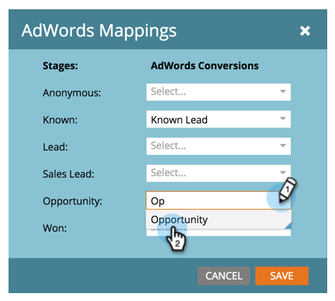
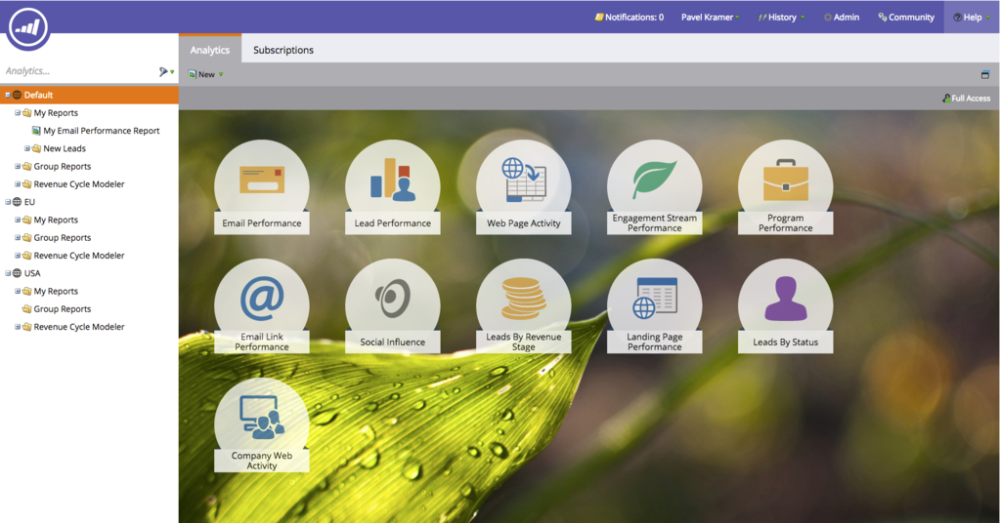
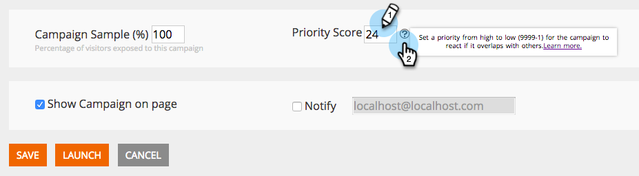
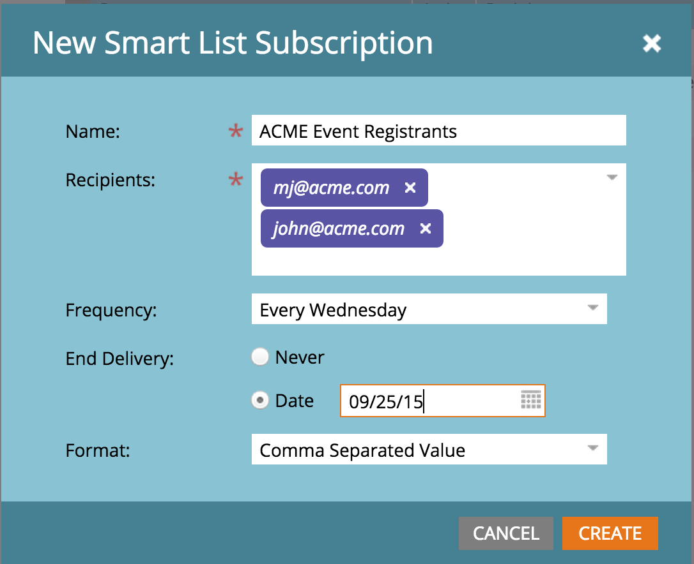
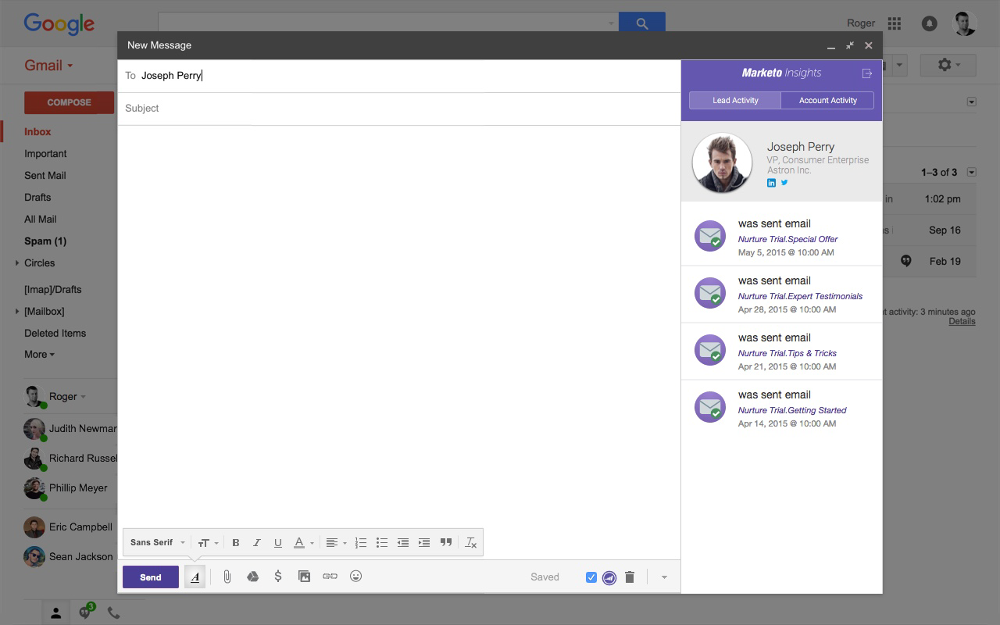
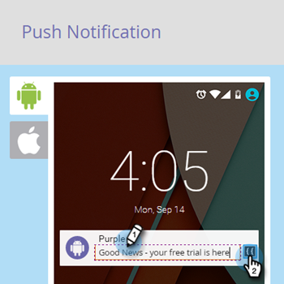
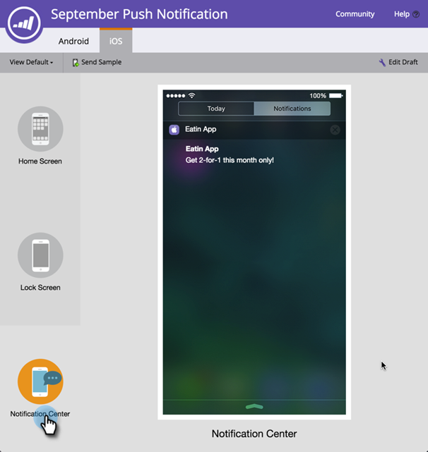

# 2015

## Janeiro de 2015 {#january}

Os recursos a seguir estão incluídos na versão de janeiro de 2015. Verifique a disponibilidade de recursos na sua Marketo Edition. Após o lançamento, não deixe de acessar os links para artigos detalhados de cada recurso.

## Atualizações de automação de marketing {#marketing-automation-updates}

**Landing Pages Para Dispositivos Móveis**

Agora você pode [criar exibições para dispositivos móveis para páginas de aterrissagem](/help/marketo/product-docs/demand-generation/landing-pages/free-form-landing-pages/add-a-mobile-view-for-your-free-form-landing-page.md) de dentro do editor de páginas de aterrissagem. Forneça sua mensagem de maneira eficaz, independentemente do dispositivo, e aumente o engajamento personalizando seu conteúdo para facilitar o consumo em qualquer lugar. Esse recurso será implantado gradualmente durante a semana seguinte ao lançamento.

[-Vídeo passo a passo da página inicial-](https://youtu.be/aPQHlG2X6c0)

**Novas chamadas da API REST**

Três novas chamadas para a API REST de lead e atividade:

* Excluir lead
* Obter clientes em potencial por ID de programa
* Obter Clientes Potenciais Excluídos

Além disso, há uma nova opção para Sincronizar lead, para gravar a alteração do lead de forma assíncrona para uma chamada de API mais rápida. Detalhes completos estarão disponíveis após o lançamento em [https://experienceleague.adobe.com/en/docs/marketo-developer/marketo/home](https://experienceleague.adobe.com/pt-br/docs/marketo-developer/marketo/home)

**Suporte a objeto personalizado de script de e-mail**

Agora acesse objetos personalizados associados ao objeto Conta de dentro de scripts de email!

## Personalização em tempo real {#real-time-personalization}

**Remarketing personalizado para Google e[!DNL Facebook]**

O remarketing mostra anúncios para pessoas que visitaram seu site. Agora você pode personalizar suas campanhas de remarketing no [Google](/help/marketo/product-docs/web-personalization/website-retargeting/personalized-remarketing-in-google.md) e [[!DNL Facebook]](/help/marketo/product-docs/web-personalization/website-retargeting/personalized-remarketing-in-facebook.md) usando dados do Real-Time Personalization. Remarketing para públicos de diferentes setores, listas de contas nomeadas, tamanhos de empresa ou quaisquer dados de clientes potenciais conhecidos.

[Módulo da lista de contas nomeadas](/help/marketo/product-docs/web-personalization/account-based-web-marketing/create-a-new-account-list.md)

As melhorias no módulo Contas nomeadas melhorarão as taxas de correspondência e as validações para os usuários. As adições incluem:

* Organizações correspondentes da sua lista de Contas nomeadas usando o endereço de email do lead (também para clientes somente RTP)
* Suporte para até 100 mil registros por conta
* Modelo de arquivo CSV para exibir e baixar


**Opções de Marca RTP Atualizadas**

As opções de Tag RTP em Configurações da conta foram atualizadas para incluir:

1. CDN e assíncrono (tag recomendada)
1. CDN e síncrono (alta velocidade)
1. Tag assíncrona sem CDN
1. Tag síncrona sem CDN

Para obter o melhor desempenho, é recomendável colocar a marca na parte superior do cabeçalho da página da Web após `<head>`. Todas as marcas permitem o uso da [API RTP](https://experienceleague.adobe.com/en/docs/marketo-developer/marketo/javascriptapi/rich-media-recommendation). Para obter informações sobre como implantar a RTP Tag, consulte [aqui](/help/marketo/product-docs/web-personalization/rtp-tag-implementation/deploy-the-rtp-javascript.md).


## Fevereiro de 2015 {#february}

Os seguintes recursos estão incluídos na versão de fevereiro de 2015. Verifique a disponibilidade de recursos na sua Marketo Edition. Após o lançamento, não se esqueça de voltar para encontrar links para artigos detalhados para cada recurso. Rolo de tambor...

## Aprimoramentos de automação de marketing {#marketing-automation-enhancements}

**[Mover campanha inteligente](/help/marketo/product-docs/core-marketo-concepts/smart-campaigns/using-smart-campaigns/move-a-smart-campaign.md)**

Alegre-se! Agora você pode arrastar e soltar ou usar o recurso Mover, da árvore, para incluir ou retirar campanhas inteligentes de programas.

**[[!DNL Dynamics] 2015 (Online)](https://docs.marketo.com/display/docs/microsoft+dynamics+2013+on-premises)** - com suporte!

**Alterações no Certificado HTTPS**

Para proteger a confidencialidade e a integridade dos dados do cliente e dos serviços SaaS, a Marketo segue as práticas recomendadas do setor de SaaS

e substituirá os protocolos de segurança atualmente usados (SHA-1 e SSL) por versões mais seguras (SHA-2 (também conhecido como SHA-256) e TLS) para os seguintes domínios:

* marketo.net (tráfego [!DNL Munchkin] criptografado)

* [marketo.com](https://marketo.com) (principais aplicativos SaaS)

Isso ocorrerá logo após essa versão. O protocolo SHA-1 terá suporte temporário no domínio [mktoapi.com](https://mktoapi.com) até dezembro de 2015 para permitir que os proprietários de sistemas e aplicativos herdados atualizem seus sistemas com compatibilidade SHA-2.

**Seguro[!DNL Munchkin]**

Estamos removendo nosso suporte para SSL3. Mantivemos o SSL3 até agora para manter o suporte para navegadores antigos, mas em 2015 não estamos mais vendo tráfego significativo da Web desses navegadores. Isso só afetaria o [!DNL Munchkin] quando usado em páginas seguras e será implantado lentamente após o lançamento de fevereiro.

## Aprimoramentos do Real-Time Personalization {#real-time-personalization-enhancements}

**[URL de Destino para Campanhas](/help/marketo/product-docs/web-personalization/working-with-web-campaigns/adding-a-target-url-to-a-web-campaign.md)**

Selecione as páginas nas quais você deseja que sua campanha em tempo real seja exibida usando &quot;Adicionar um URL de direcionamento&quot;. Esse recurso funciona com todos os tipos de campanha (caixa de diálogo, na zona, widgets), mas é especialmente valioso para campanhas na zona, onde uma campanha será renderizada na ID da zona somente para o URL de destino selecionado. Ela é compatível com a adição de vários URLs para direcionar páginas da Web diferentes.


**País e Estado adicionados ao direcionamento baseado em conta**

Agora é possível adicionar país e estado a Listas de contas nomeadas. Direcionar potenciais contas chave de locais específicos.

## Março de 2015 {#march}

Os recursos a seguir estão incluídos na versão de março de 2015. Verifique a disponibilidade de recursos na sua Marketo Edition. Após o lançamento, não se esqueça de voltar para encontrar links para artigos detalhados para cada recurso.

## Calendário HD {#calendar-hd}

Exiba as atividades de marketing da sua equipe com o novo modo de apresentação do calendário. Estes são ótimos para TVs ou monitores gigantes ao redor do escritório! Definir e exibir metas com base em uma lista inteligente ou em métricas personalizadas.

>[!NOTE]
>
>Este recurso não está disponível para o Spark e as edições [!DNL Standard].


## [!DNL Google Adwords] Integração {#google-adwords-integration}

Vincule sua conta do [[!DNL Google AdWords] ao Marketo](/help/marketo/product-docs/administration/additional-integrations/add-google-adwords-as-a-launchpoint-service.md) para carregar automaticamente dados de conversão offline do Marketo para o [!DNL Google AdWords]. Em seguida, na interface do usuário do [!DNL AdWords], é possível ver facilmente quais cliques resultaram em clientes potenciais qualificados, oportunidades e novos clientes (ou quaisquer estágios de receita que você queira rastrear).



## [!UICONTROL Reformulação do Gerenciador de Receita] {#revenue-explorer-redesign}

O [!UICONTROL Revenue Explorer] tem uma aparência totalmente nova, bem como o novo tipo de gráfico Sunburst! A implementação será realizada nas duas primeiras semanas de abril.

## Novas APIs REST de ativos {#new-asset-rest-apis}

[Novas APIs REST de ativos](https://experienceleague.adobe.com/en/docs/marketo-developer/marketo/rest/assets/assets)

Agora temos suporte para criar e editar emails, modelos, meus tokens, arquivos e trechos [por meio da API](https://developer.adobe.com/marketo-apis/api/asset/)!

## [!DNL Microsoft Dynamics] 2015 No Local {#microsoft-dynamics-on-premise}

Com suporte ao instalador mais recente agora [acessível por meio do aplicativo](/help/marketo/product-docs/crm-sync/microsoft-dynamics-sync/sync-setup/update-the-marketo-solution-for-microsoft-dynamics.md).


## RTP - Envolvimento personalizado na Web com dados de leads {#rtp-personalized-web-engagement-with-lead-data}

Aproveite os [campos de dados de clientes potenciais](/help/marketo/product-docs/web-personalization/using-web-segments/manage-person-data.md) existentes no seu banco de dados de clientes potenciais do Marketo para criar campanhas de segmentação em tempo real e conteúdo personalizado. Gerencie seus campos de dados de cliente potencial no RTP e adicione/exclua campos de cliente potencial relevantes.

## RTP - Personalize o conteúdo on-line por nome de campanha de programa ou e-mail {#rtp-personalize-web-content-by-email-or-program-campaign-name}

Continue a conversa com seu lead em todos os canais, desde o email até a Web. [Personalize o conteúdo de entrada com base no nome da campanha ou do programa de email](/help/marketo/product-docs/web-personalization/using-web-segments/web-segments.md) usado nas Atividades de Marketing da Marketo.

## Abril de 2015 {#april}

Os recursos a seguir estão incluídos na versão de abril de 2015. Verifique a disponibilidade de recursos na sua Marketo Edition. Após o lançamento, não deixe de acessar os links para artigos detalhados de cada recurso.

## Novo design do início de análise

[Novo design do início de análise](/help/marketo/product-docs/reporting/basic-reporting/creating-reports/navigating-the-analytics-home-page.md)

>[!NOTE]
>
>Esse recurso será lançado na terça-feira, 28 de abril.

A nova página inicial [[!UICONTROL Analytics]](/help/marketo/product-docs/reporting/basic-reporting/creating-reports/navigating-the-analytics-home-page.md) habilita o acesso rápido para executar relatórios ad hoc em tipos de relatórios disponíveis.



Além disso, a organização de relatórios privada versus compartilhada agora está disponível. Crie ou arraste relatórios para sua pasta [!UICONTROL Meus Relatórios] para impedir que eles sejam exibidos, editados ou excluídos por outros usuários. [!UICONTROL Relatórios de Grupo] compartilhados entre todos os usuários.

## Marketo Mobile Engagement {#marketo-mobile-engagement}

**Marketo Mobile Engagement**

Com o Marketo Mobile Engagement, oferecer experiências móveis atraentes é fácil. Crie campanhas altamente personalizadas que fornecem conteúdo atraente sem precisar depender de uma equipe de desenvolvimento de aplicativos. Novos filtros e acionadores permitem que você escute e responda no canal móvel por meio de notificações por push.


## Integração do acelerador principal do [!DNL LinkedIn]

[Integração do acelerador principal do [!DNL LinkedIn]](/help/marketo/product-docs/demand-generation/social/social-functions/use-a-marketo-list-or-smart-list-as-a-linkedin-audience-segment.md)

Estenda sua estratégia de criação de clientes potenciais para exibição paga e anúncios sociais. A [integração da rede de anúncios](/help/marketo/product-docs/demand-generation/ad-network-integrations/add-linkedin-matched-audiences-as-a-launchpoint-service.md) com o [!DNL LinkedIn] Lead Accelerator permite criar com segurança um segmento de público-alvo no [!DNL LinkedIn] com base nos membros de qualquer lista inteligente ou estática. Os membros de um segmento de público-alvo [!DNL LinkedIn] podem ser estimulados com uma sequência de anúncios relevantes.


## Marketo [!DNL Sales Insight] para [!DNL Salesforce1] {#marketo-sales-insight-for-salesforce}

Seus recursos favoritos do [!DNL Sales Insight] - lead feed, melhores opções, momentos interessantes e adicionar ao Marketo Campaign - todos disponíveis no aplicativo [!DNL Salesforce1].

 

## RTP - Análise de marketing baseada em conta {#rtp-account-based-marketing-analytics}

**RTP - Análise de marketing baseada em conta**

Obtenha visibilidade instantânea do desempenho de suas listas de contas nomeadas com base em cada estágio do ciclo de compras, com o novo gráfico de desempenho para suas listas de contas nomeadas. O gráfico mostra o estágio da visita da organização principal, partindo da percepção até a ação, com base no número de visitas e no status do visitante.

## Maio de 2015 {#may}

Os seguintes recursos estão incluídos na versão de maio de 2015. Verifique a disponibilidade de recursos na sua Marketo Edition. Após o lançamento, não deixe de acessar os links para artigos detalhados de cada recurso.

## Páginas de aterrissagem totalmente responsivas

[Páginas de aterrissagem totalmente responsivas](/help/marketo/product-docs/demand-generation/landing-pages/guided-landing-pages/create-a-guided-landing-page.md)

Estamos lançando um novo modo de edição de página de aterrissagem e sintaxe de modelo. Ao contrário do nosso editor de página de aterrissagem de forma &quot;livre&quot;, o novo editor de página de aterrissagem &quot;guiado&quot; fornecerá uma experiência de edição estruturada para páginas de aterrissagem totalmente responsivas.


## Anular programa de email

[Anular programa de email](/help/marketo/product-docs/email-marketing/email-programs/email-program-actions/abort-email-program.md)

Você pressionou Enviar antes que um programa de email estivesse pronto para ser enviado? Puxe os freios com o novo botão abort email program. Isso interromperá os programas de email em andamento.

## Possibilidade de entrega de e-mails  {#email-deliverability}

O Marketo agora executará verificações semanais automatizadas do [!DNL SPF] e do [!DNL DKIM] nos domínios adicionados. Fique por dentro disso verificando suas notificações.

## Mudança de comportamento de modelos de e-mail {#email-template-behavior-change}

A partir desta versão, comentários válidos do HTML agora são permitidos e não removidos ao criar novos emails.

## RTP: editor de segmentos do tipo arrastar e soltar {#rtp-drag-and-drop-segment-editor}

RTP: [Editor de Segmentos de Arrastar e Soltar](/help/marketo/product-docs/web-personalization/using-web-segments/web-segments.md)

Arraste e solte seus critérios no construtor de segmentos, defina o valor e você está prestes a criar um segmento em tempo real.

## RTP: recomendações de conteúdo previsível {#rtp-predictive-content-recommendations}

[Recomendações de conteúdo preditivo](/help/marketo/product-docs/predictive-content/enabling-predictive-content/enable-predictive-content-for-web-rich-media.md)

Use os algoritmos de aprendizado de máquina e análise preditiva da RTP para recomendar o conteúdo certo ao cliente potencial certo. Melhore visualmente seus ativos de conteúdo com imagens e descrições de texto e recomende mais de um ativo de conteúdo.

## Junho de 2015 {#june}

Os recursos a seguir estão incluídos na versão de junho de 2015. Verifique a disponibilidade de recursos na sua Marketo Edition. Após o lançamento, não deixe de acessar os links para artigos detalhados de cada recurso.

## [Relatório de email de atribuição](/help/marketo/product-docs/web-personalization/reporting-for-web-personalization/email-reports.md) {#attribution-email-report}

Consulte o valor que a personalização e o conteúdo recomendado fornecem às suas atividades de marketing. [O Relatório de Email de Atribuição](/help/marketo/product-docs/web-personalization/reporting-for-web-personalization/email-reports.md) exibe os clientes em potencial diretos e assistidos atribuídos pelas campanhas de personalização e conteúdo recomendado da RTP. No RTP, Configurações do usuário e Relatório de email, adicione o Relatório de email de atribuição para receber emails mensais ou trimestrais.

## Julho de 2015 {#july}

## [!DNL Marketo Moments] {#marketo-moments}

No almoço, mas precisa reagendar um email? O aplicativo [!DNL Marketo Moments], disponível no App Store ou [!DNL Google Play], permite que você veja o desempenho de suas campanhas de email e eventos em tempo real, bem como o que está por vir no futuro, em seu telefone iPhone, iPad ou Android.


## Atualização do editor de rich text {#rich-text-editor-update}

Editor de texto atualizado com aparência moderna, incluindo formatação de texto simplificada, edição de imagens, inserção de links e edição de HTML. O editor do HTML agora apresenta validação mínima, permitindo uma edição de código menos restritiva.
`<iframe width="420" height="315" src="https://www.youtube.com/embed/LmmBN6IQrII" frameborder="0" allowfullscreen></iframe>` Essa atualização será lançada automaticamente em alguns dias a partir do lançamento de julho. Posteriormente, você poderá alternar entre as versões Nova e Herdada do editor de **[!UICONTROL Admin] > [!UICONTROL Email] > [!UICONTROL Editar configurações do editor]**.


Atualização de caixas de diálogo de link e imagem.


Alternar a versão do editor de texto.


## Login único para envio de e-mails {#email-deliverability-single-sign-on}

Ao clicar no bloco deliverability de email, você não precisa mais fornecer suas credenciais de logon.

## Priorização de campanhas {#campaign-prioritization}

Você configurou várias campanhas RTP personalizadas e notou que algumas delas podem se sobrepor a outras? Vá em frente e defina uma prioridade para qual RTP das campanhas deve ser exibido em relação a outras.



## API da empresa {#company-api}

**Acesso ao objeto da empresa por meio da REST API**: a REST API agora fornece acesso ao objeto da Marketo Company (também conhecida como Account). Isso significa que você pode ler, atualizar e excluir objetos da empresa criados no Marketo e associar clientes em potencial a essas empresas usando a API [!DNL Lead] atualizada.

Saiba [mais]<https://developer.adobe.com/marketo-apis/api/mapi/#tag/Companies>) em nosso guia de referência para a API da empresa.

## Acessar a entregabilidade de email {#access-email-deliverability}

**Acessar Ferramenta de Entrega de Email**: essa nova permissão permite que administradores concedam aos usuários acesso à ferramenta de Entrega de Email.

## Outono de 2015 {#fall}

Os seguintes recursos estão incluídos na versão do último trimestre de 2015. Verifique a disponibilidade de recursos na sua Marketo Edition.

## Assinar uma lista inteligente {#subscribe-to-a-smart-list}

[Assinar uma lista inteligente](/help/marketo/product-docs/reporting/basic-reporting/report-subscriptions/subscribe-to-a-smart-list.md)

Assinar a Smart List permite que os profissionais de marketing exportem uma smart list e a enviem por email para as partes interessadas que não estão usando o Marketo, por exemplo, equipes de Vendas ou de Telemarketing.

A exportação pode ser agendada diariamente, semanalmente ou mensalmente, pode ter uma data de entrega final e pode ser personalizada para compartilhar um número limitado de colunas.



Várias assinaturas podem ser criadas em uma lista inteligente. Há uma limitação de 100 assinaturas com 100 mil clientes em potencial por assinatura, em espaços de trabalho, por instância do Marketo.


## Objetos personalizados do Marketo {#marketo-custom-objects}

[Objetos personalizados do Marketo](/help/marketo/product-docs/administration/marketo-custom-objects/understanding-marketo-custom-objects.md)

Crie facilmente objetos personalizados na interface do usuário do administrador. Atualmente, oferecemos suporte à capacidade de criar um objeto personalizado do :N no Marketo e conectá-lo a um cliente potencial ou a uma empresa.

>[!NOTE]
>
>Os objetos personalizados do Marketo não estão disponíveis para o Spark.


## Marketo Insights para [!DNL Google Chrome] {#marketo-insights-for-google-chrome}

[Marketo Insights para  [!DNL Google Chrome]](/help/marketo/product-docs/marketo-sales-insight/msi-chrome-plugin/using-marketo-insights-for-google-chrome.md)

Estamos animados em anunciar o lançamento de uma atualização para nossa extensão [!DNL Google Mail] [!DNL Sales Insight]! Exiba no [[!DNL Chrome Store]](https://chrome.google.com/webstore/detail/marketo-insights-for-goog/jjkfbhajlmoeegbjgjipliamplidmbjb).

Essa atualização inclui muitos novos recursos e funcionalidades:

* Antes de participar, os vendedores podem ver informações relevantes sobre seus clientes potenciais diretamente no [!DNL Google Mail], incluindo títulos de trabalho, perfis do Twitter, informações da empresa, fotos e muito mais.
* Os vendedores podem ver em tempo real com o que os prospetos de conteúdo estão se envolvendo em todos os canais, como emails abertos ou clicados, eventos online ou presenciais assistidos, páginas da Web visitadas, eBooks baixados e muito mais.
* Emails enviados através do [!DNL Google Mail] são registrados no Marketo e rastreados em tempo real. Isso permite que os vendedores vejam quando os prospetos estão visualizando seus emails para que possam acompanhar na hora certa. O Marketo [!DNL Sales Insight] for [!DNL Google Mail] também facilita para os vendedores a utilização dos modelos criados por marketing para enviar belos convites, ofertas e outros tipos de conteúdo.



## Marketo Mobile Engagement - Tokens, Enviar amostra e Visualização {#marketo-mobile-engagement-tokens-send-sample-preview}

* [Tokens](/help/marketo/product-docs/mobile-marketing/push-notifications/configure-mobile-push-notification.md)
* [Enviar exemplo](/help/marketo/product-docs/mobile-marketing/push-notifications/send-a-push-notification-sample.md)
* [Visualização](/help/marketo/product-docs/mobile-marketing/push-notifications/preview-a-push-notification.md)

Personalize facilmente as notificações por push com [tokens](/help/marketo/product-docs/mobile-marketing/push-notifications/configure-mobile-push-notification.md).



Você também pode [visualizar](/help/marketo/product-docs/mobile-marketing/push-notifications/preview-a-push-notification.md) ou enviar uma notificação por push de [amostra](/help/marketo/product-docs/mobile-marketing/push-notifications/send-a-push-notification-sample.md) antes de implantá-la nos clientes.




## Campanhas inteligentes em momentos {#smart-campaigns-in-moments}

[Campanhas inteligentes em momentos](/help/marketo/product-docs/core-marketo-concepts/mobile-apps/marketo-moments/understanding-moments/understanding-smart-campaign-cards.md)

As estatísticas nos emails enviados por meio de Campanhas inteligentes agora estão disponíveis em Momentos. Outros recursos nesta atualização incluem:

* Passar para o final. Você tem muitos cartões no seu stream? Agora você pode deslizá-los para fora!
* Enviar uma amostra diretamente da tela de visualização
* Detalhes da lista inteligente adicionados aos cartões do Programa de email
* Adição de suporte para o status Anulado para Programas de email


## RTP - Content Analytics e Recommendations {#rtp-content-analytics-and-recommendations}

[Content Analytics](/help/marketo/product-docs/web-personalization/understanding-web-personalization/understanding-content-analytics.md) e Recommendations

O RTP Content Analytics mostra o desempenho de seus ativos de conteúdo da Web a partir de visitas regulares à Web e também visitas geradas pelo mecanismo de recomendação de conteúdo da RTP.

* Veja qual conteúdo tem melhor desempenho e traz a maioria dos leads
* Aumente seu consumo de conteúdo ativando o conteúdo no mecanismo de conteúdo preditivo do RTP para recomendar automaticamente o melhor conteúdo aos visitantes certos
* Detalhe cada ativo de conteúdo para ver métricas, gráficos e desempenho mais detalhados

A página Assets da RTP agora está dividida em Content Analytics e Recomendações de conteúdo.

* **Content Analytics:** mostra as exibições e os clientes potenciais diretos de todo o conteúdo da Web descoberto e definido, ajudando você a analisar o conteúdo com melhor desempenho
* **Recomendações de Conteúdo:** mostra impressões e cliques do conteúdo recomendado da RTP e da atribuição de lead associada. Você também pode editar e habilitar recomendações de conteúdo desta página para as recomendações da [barra](/help/marketo/product-docs/predictive-content/enabling-predictive-content/enable-the-content-recommendation-bar.md) e da [mídia avançada](/help/marketo/product-docs/predictive-content/enabling-predictive-content/enable-predictive-content-for-web-rich-media.md).

* Todos os dados de clientes potenciais diretos nessas duas páginas foram atualizados retrospectivamente desde o início do ano (1º de janeiro de 2015).

## RTP - Clonar uma campanha RTP {#rtp-clone-an-rtp-campaign}

[RTP - Clonar uma campanha RTP](/help/marketo/product-docs/web-personalization/working-with-web-campaigns/clone-a-web-campaign.md)

A clonagem de uma campanha RTP torna mais rápido e eficiente a criação de campanhas da Web mais personalizadas. Use o recurso de clonagem na página de campanha do RTP para copiar as configurações da campanha e alterar o conteúdo para otimização de testes de divisão ou clonar uma campanha com o mesmo conteúdo e direcioná-la para um segmento diferente. Crie campanhas em segundos!


## Melhorias no editor de rich text {#rich-text-editor-improvements}

Estamos fazendo várias melhorias no editor de rich text. Depois que lançamos o editor atualizado em julho, recebemos ótimos comentários e conseguimos integrar essas alterações a essa atualização. Há muito mais por vir nos próximos meses. Veja a seguir uma lista das novidades do 4º trimestre:

* O VML agora é compatível com o código HTML:

```
<v:background xmlns:v="urn:schemas-microsoft-com:vml" fill="t">
<v:fill type="tile" src="<a href="https://i.imgur.com/YJOX1PC.png" rel="nofollow">https://i.imgur.com/YJOX1PC.png</a>" color="#7bceeb"/>
</v:background>
```

* Qualquer item agora pode ser inserido em um comentário válido do HTML (determinadas sintaxes, como as vistas abaixo, foram removidas anteriormente):

`<!--[if gte mso 9]> <![endif]-->`

* Não preencher células de tabela vazias com `&nbsp;`

* Adição do botão Maximizar/minimizar ao editor de origem do HTML
* As propriedades de tabela pré-existentes agora são identificadas e exibidas na caixa de diálogo Propriedades da tabela
* Agora, ambas as linhas de botões são exibidas por padrão.
* O editor agora aceitará qualquer elemento (mesmo elementos obsoletos ou não padrão):

`<myCustomElement>Hello World!</myCustomElement>`

* O editor agora aceitará qualquer atributo (mesmo atributos obsoletos ou não padrão):

```
<myCustomElement myCustomAttribute="foo">Hello World!</myCustomElement>
<td background="someImage.png">
```

## [!DNL Microsoft Dynamics] - Validar sincronização {#microsoft-dynamics-validate-sync}

[[!DNL Microsoft Dynamics] - Validar sincronização](/help/marketo/product-docs/crm-sync/microsoft-dynamics-sync/sync-setup/validate-microsoft-dynamics-sync.md)

Essa nova ferramenta de administração executa uma série de verificações para ver se as configurações de sincronização foram configuradas corretamente.


## Adicionar Campos à Sincronização de Objeto Personalizado do CRM {#add-fields-to-crm-custom-object-sync}

Adicione facilmente novos campos a objetos personalizados sincronizados de [!DNL Salesforce] e [!DNL Dynamics]. Agora é possível adicionar novos campos à sincronização de objetos personalizados sem desativar e ativar todo o objeto personalizado.

## Alterações nos recursos de segurança {#changes-to-security-features}

* As tentativas de senha são limitadas a 5. Após a quinta tentativa, o usuário será bloqueado.
* O tempo limite de sessão inativa agora pode ser configurado para a assinatura.


## Suporte para IE 11 (e suporte obsoleto para IE 9) {#ie-support-and-deprecating-support-for-ie}

Agora oferecemos suporte oficial ao navegador [!DNL Microsoft Internet Explorer] 11 e removemos o suporte ao navegador [!DNL Microsoft Internet Explorer] 9.

## Suporte à interface do usuário do Lightning para MSI {#lightning-ui-support-for-msi}

O pacote MSI mais recente na troca de aplicativos funciona com as versões Lightning e Legacy da interface do usuário [!DNL Salesforce].

## Novo plug-in [!DNL Dynamics] {#new-dynamics-plug-in}

Esse novo plug-in executa várias ações em um modo assíncrono para ajudar a aumentar o desempenho.

## Pesquisar por URL da página de aterrissagem no Design Studio {#search-by-url-of-landing-page-in-design-studio}

Na grade da página de aterrissagem do Design Studio, agora é possível pesquisar por URL da página para encontrar suas páginas de aterrissagem. Também é exportável.

