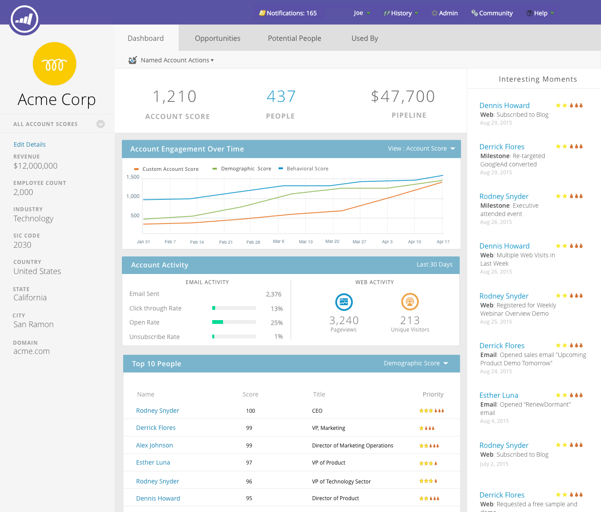
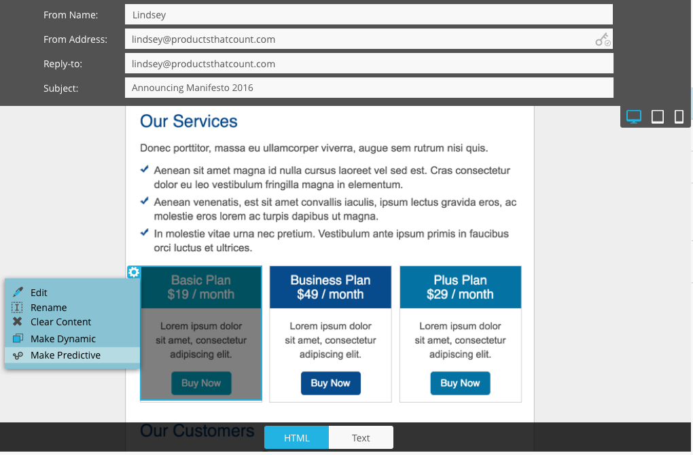

# 2016

## Inverno de 2016 {#winter}

Os seguintes recursos estão incluídos na versão Winter &#39;16. Clique nos links de título para exibir artigos detalhados para cada recurso.

## É Filtro Anônimo {#is-anonymous-filter}

[É Filtro Anônimo](/help/marketo/product-docs/administration/additional-integrations/add-munchkin-tracking-code-to-your-website/next-generation-munchkin-tracking-faq.md)

O filtro É Anônimo foi removido para Smart Lists. Consulte o documento [Perguntas frequentes sobre o Rastreamento de Munchkin da Próxima Geração](/help/marketo/product-docs/administration/additional-integrations/add-munchkin-tracking-code-to-your-website/next-generation-munchkin-tracking-faq.md) para obter detalhes. Essa alteração não afeta o Web Personalization (RTP), que continua a identificar visitantes anônimos e conhecidos da Web e personalizar o conteúdo em tempo real para esses visitantes.

## Painel de banco de dados {#database-dashboard}

[Painel de banco de dados](/help/marketo/product-docs/core-marketo-concepts/smart-lists-and-static-lists/managing-people-in-smart-lists/database-dashboard.md)

O [!UICONTROL Banco de Dados de Clientes Potenciais] tem um Painel de Resumo atualizado que inclui o tamanho total do banco de dados de pessoas, o número de clientes potenciais comercializáveis e um detalhamento dos clientes potenciais pelas cinco principais fontes.

## Navegador Microsoft Edge {#microsoft-edge-browser}

[Navegador Microsoft Edge](/help/marketo/product-docs/administration/setup-administration/supported-browsers.md)

Adicionamos [!DNL Microsoft Edge] à [lista de navegadores](https://docs.marketo.com/display/public/DOCS/Supported+Browsers) com suporte do Marketo.

## Microsoft Outlook 2016 {#microsoft-outlook}

[Microsoft Outlook 2016](/help/marketo/product-docs/marketo-sales-insight/msi-outlook-plugin/install-the-marketo-email-add-in-for-outlook-with-a-registration-code.md)

Agora há suporte para [[!DNL Microsoft Outlook] 2016](/help/marketo/product-docs/marketo-sales-insight/msi-outlook-plugin/install-the-marketo-email-add-in-for-outlook-with-a-registration-code.md).

## Início do programa de e-mail {#email-program-head-start}

[Início do programa de e-mail](/help/marketo/product-docs/email-marketing/email-programs/email-program-actions/head-start-for-email-programs.md)

Use [!UICONTROL Head Start] para indicar que o processamento do envio deve ocorrer antes do tempo. Em vez de qualificar clientes potenciais e preparar emails no horário agendado do programa, o [!UICONTROL Head Start] garante que essas tarefas sejam realizadas com antecedência. Dessa forma, o público-alvo começará a receber emails no horário agendado.

Para usar esse recurso, o programa de email deve ser agendado com pelo menos 12 horas de antecedência, e a Smart List será bloqueada 12 horas antes do envio.

>[!NOTE]
>
>Esse recurso será lançado gradualmente por uma semana após o lançamento do inverno de 1916. Ele não está disponível para uso com campanhas inteligentes ou com a API.

## Aprimoramentos de marketing para dispositivos móveis {#mobile-marketing-enhancements}

[Aprimoramentos de marketing para dispositivos móveis](/help/marketo/product-docs/mobile-marketing/admin/add-a-mobile-app.md)

**[!DNL PhoneGap]Suporte:** Agora oferecemos suporte de [!DNL PhoneGap] para seu aplicativo móvel. [Saiba mais](https://developers.marketo.com/documentation/mobile/phonegap-plugin/).

**Suporte para aplicativos de sandbox**:

## API do programa {#program-api}

[API do programa](https://developers.marketo.com/documentation/programs/)

Crie, atualize e clone programas por meio da REST API. Isso não inclui a criação ou a atualização de smart lists e campanhas inteligentes em um programa.

## Aprimoramentos do Microsoft Dynamics {#microsoft-dynamics-enhancements}

[Aprimoramentos do Microsoft Dynamics](/help/marketo/product-docs/crm-sync/microsoft-dynamics-sync/microsoft-dynamics-sync-details/sync-status.md)

**[[!UICONTROL Status da Sincronização]](/help/marketo/product-docs/crm-sync/microsoft-dynamics-sync/microsoft-dynamics-sync-details/sync-status.md)**: mantenha as guias na taxa de transferência e na lista de pendências atuais do processo de sincronização. Detalhe pela contagem de inserções e atualizações por objeto.

**[[!UICONTROL Notificações]](/help/marketo/product-docs/core-marketo-concepts/miscellaneous/understanding-notifications/notification-types.md)**: receba notificação sobre erros comuns de sincronização, juntamente com uma lista de clientes potenciais que apresentam esse erro.

## Aprimoramentos de objetos personalizados {#custom-objects-enhancements}

[Aprimoramentos de objetos personalizados](/help/marketo/product-docs/administration/marketo-custom-objects/create-marketo-custom-objects.md)

Agora é possível criar relações muitos para muitos entre Clientes potenciais/Contas e um objeto personalizado usando um objeto intermediário com vários campos de link.

## Anúncios do Facebook Lead {#facebook-lead-ads}

[Anúncios do Facebook Lead](/help/marketo/product-docs/demand-generation/facebook/set-up-facebook-lead-ads.md)

[[!UICONTROL Anúncios de cliente potencial do Facebook]](https://www.facebook.com/business/a/lead-ads) são uma maneira mais direta de uma empresa executar campanhas de geração de clientes potenciais em [!DNL Facebook]. As pessoas preenchem um formulário para expressar interesse em um produto ou serviço, para que o negócio possa acompanhá-las. A integração do Marketo com os [!UICONTROL Anúncios de cliente potencial do Facebook] captura automaticamente as informações que um cliente potencial fornece no formulário de Anúncio de cliente potencial. As ações e notificações de acompanhamento podem ser automatizadas usando o novo acionador [!UICONTROL Preenchimentos de anúncios de lead do Facebook].

## Agendador de campanhas da Web (Real-Time Personalization) {#web-real-time-personalization-campaign-scheduler}

[Agendador de campanhas da Web (Real-Time Personalization)](/help/marketo/product-docs/web-personalization/working-with-web-campaigns/schedule-a-web-campaign.md)

Agende a campanha com antecedência. Configure uma data de início e término para conteúdo personalizado da Web e repita campanhas em dias e horários específicos. Personalize o agendamento para exibir a campanha de acordo com a hora do visitante da Web ou com um fuso horário selecionado.

## Segundo trimestre de 2016 {#spring}

Os seguintes recursos estão incluídos na versão da primavera de 16. Clique nos links de título para exibir artigos detalhados para cada recurso.

## Insights de email {#email-insights}

[Insights de email](/help/marketo/product-docs/reporting/email-insights/email-insights-overview.md)

Email Insights é uma experiência totalmente nova e histórica de análise de email de dados agregados - reprojetada para proporcionar um desempenho ultrarrápido. Ele apresenta um design de interface do usuário completamente novo otimizado para atender às necessidades e ao fluxo de trabalho dos profissionais de marketing por email.

>[!NOTE]
>
>Estamos lançando o Email Insights para clientes em lotes, a partir de 3 de junho. Nosso objetivo é completar isso nos próximos meses. Você será notificado por email quando estiver habilitado.

## Seletor de modelos de email {#email-template-picker}

[Seletor de modelos de email](/help/marketo/product-docs/email-marketing/general/email-editor-2/email-template-picker-overview.md)

Crie belos emails usando nossos novos Modelos iniciais! Além disso, localize rapidamente seus modelos a partir das miniaturas em tempo real.

>[!NOTE]
>
>O Editor de email 2.0 (com o Seletor de modelos) será lançado gradualmente a partir de 3 de junho. Concluiremos a implantação até 30 de junho. Ao contrário do Email Insights, você não será notificado quando tiver acesso. Para ver se você o faz, siga as etapas em [este artigo](/help/marketo/product-docs/email-marketing/general/email-editor-2/transitioning-to-email-editor-2-0.md).

## Edição de email - recriado {#email-editing-re-imagined}

[Edição de email - recriado](/help/marketo/product-docs/email-marketing/general/email-editor-2/email-editor-v2-0-overview.md)

Isso mesmo, um novo editor de email! Use a funcionalidade leve de arrastar e soltar para adicionar e reordenar o conteúdo. Novos elementos, incluindo imagens, vídeos, variáveis e módulos, certamente melhorarão sua experiência de edição. Verifique também o editor de código, o pré-visualizador e o suporte de pré-cabeçalho atualizados.

## Mensagens no aplicativo móvel {#mobile-in-app-messages}

[Mensagens no aplicativo móvel](/help/marketo/product-docs/mobile-marketing/in-app-messages/understanding-in-app-messages.md)

Crie mensagens impressionantes no aplicativo para seu aplicativo diretamente no Marketo. Defina exatamente quem deve vê-la e quando com o programa de mensagens no aplicativo. Monitore facilmente seu desempenho com o painel do programa.

## Nenhum trecho de rascunho {#no-draft-snippets}

[Nenhum trecho de rascunho](/help/marketo/product-docs/administration/users-and-roles/enable-no-draft-for-snippets.md)

Foram-se os dias em que você precisa reaprovar tudo sempre que um trecho for atualizado! Com o Sem rascunho, todos os emails e landing pages que usam um trecho receberão as atualizações do trecho e manterão seus status anteriores. Cada vez que aprovar um trecho, você terá a opção de executar Sem rascunho e atualizar tudo ou criar rascunhos. Depende de você! O recurso Sem rascunho estará disponível para todos os clientes e será controlado por uma nova permissão no Administrador.

## Página de aterrissagem, modelo de página de aterrissagem e APIs de formulário {#landing-page-landing-page-template-and-form-apis}

[Página de aterrissagem, modelo de página de aterrissagem e APIs de formulário](https://developers.marketo.com/blog/spring-2016-updates/)

As APIs REST do Marketo agora oferecem suporte ao controle sobre páginas de aterrissagem, modelos de páginas de aterrissagem e formulários do Marketo. Agora os usuários podem criar, atualizar conteúdo, aprovar e excluir esses ativos diretamente por meio da API REST do Marketo.

## INCLUIR NA LISTA DE PERMISSÕES IP para acesso à API {#ip-allowlisting-for-api-access}

[INCLUIR NA LISTA DE PERMISSÕES IP para acesso à API](/help/marketo/product-docs/administration/additional-integrations/create-an-allowlist-for-ip-based-api-access.md)

Semelhante ao recurso de incluir na lista de permissões de IP para logons de usuário do Marketo, os administradores do Marketo agora podem configurar um incluo na lista de permissões de endereços IP que podem acessar as APIs do Marketo SOAP e REST, bloqueando o acesso de endereços IP não autorizados. Isso fornece uma camada adicional de segurança para a instância do Marketo e garante que o acesso à API só possa ocorrer de dentro da rede da organização. Detalhes sobre como configurar esta opção estão disponíveis no [site de documentação do Marketo](/help/marketo/product-docs/administration/additional-integrations/create-an-allowlist-for-ip-based-api-access.md).

## Novo conector de sincronização Microsoft Dynamics de alta velocidade {#new-high-speed-microsoft-dynamics-sync-connector}

[Novo conector de sincronização Microsoft Dynamics de alta velocidade](/help/marketo/product-docs/crm-sync/microsoft-dynamics-sync/microsoft-dynamics-sync-details/sync-status.md)

O novo conector Dynamics de alta velocidade fornece velocidades até 20 vezes mais rápidas para a sincronização inicial e até 5 vezes mais rápidas para a sincronização incremental. Todos os novos clientes serão integrados a esse conector na data de lançamento e, gradualmente, o implantaremos para os clientes existentes durante o período de lançamento do verão.

**Atualizar dados para novos campos**: agora você pode habilitar novos campos de sincronização a qualquer momento, e todos os valores de dados para esse campo serão atualizados do [!DNL Dynamics] CRM para o Marketo. Não há mais preocupações sobre a necessidade de selecionar todos os campos durante a configuração inicial. Se você desabilitar um campo de sincronização existente e reabilitá-lo posteriormente, todos os valores de dados para esse campo serão atualizados do CRM [!DNL Dynamics] para o Marketo.

**Sincronizar Cliente Potencial como Contato**: a ação de fluxo [!UICONTROL Sincronizar Cliente Potencial com Microsoft] tem uma nova opção para sincronizar como um cliente potencial ou um contato.

**Guia de Administração de Erros de Sincronização**: Procurar, pesquisar ou exportar clientes em potencial (e outros objetos) que não foram sincronizados com detalhes como operação, direção, código de erro e mensagem de erro.

**[!DNL Microsoft Dynamics]2016**: Conector totalmente certificado para as versões [!DNL Dynamics] 2016 [!DNL Online] e [!DNL On-premise].

**As Atualizações do Plug-in agora estão documentadas:** Consulte o [artigo sobre documentos de atualizações do plug-in](/help/marketo/product-docs/crm-sync/microsoft-dynamics-sync/marketo-plugin-releases-for-microsoft-dynamics.md).

## Nome amigável da instância {#friendly-instance-name}

[Nome amigável da instância](/help/marketo/product-docs/administration/settings/edit-subscription-settings.md)

Hoje, é difícil diferenciar entre instâncias do Marketo, por exemplo, instâncias de sandbox e produção. Esse recurso permite saber em quais instâncias você está trabalhando atualmente.

## Acesso limitado por tempo para assinaturas {#limited-time-access-for-subscriptions}

Hoje, os usuários são convidados a assinar o Marketo por um período indefinido. Esse recurso permite que administradores convidem usuários para assinaturas por um período de tempo limitado, por exemplo, 2 semanas ou 1 mês.

## Grade de Objetos Personalizados {#custom-objects-grid}

[Grade de Objetos Personalizados](/help/marketo/product-docs/administration/marketo-custom-objects/understanding-marketo-custom-objects.md)

Agora é possível exibir o número de registros e campos de todos os objetos personalizados publicados.

## Atividades personalizadas {#custom-activities}

Agora, os administradores do Marketo podem definir e gerenciar seus tipos de atividades personalizadas por meio do Marketo Custom Activity Definition Modeler. Semelhante (e em conjunto com) o Marketo Custom Object Modeler, os administradores agora podem estender o modelo de dados para atender às suas necessidades comerciais exatas. Detalhes sobre como usar esta funcionalidade estão disponíveis no [site de documentação do Marketo](/help/marketo/product-docs/administration/marketo-custom-activities/understanding-custom-activities.md).

## Verão de 2016 {#summer}

Os seguintes recursos estão incluídos na versão do verão de 1916. Verifique a edição do Marketo quanto à disponibilidade de recursos. Clique nos links de título para exibir artigos detalhados para cada recurso.

## Marketing baseado em conta {#account-based-marketing}

[Marketing baseado em conta](https://docs.marketo.com/display/docs/account+based+marketing)

O Marketing baseado em conta da Marketo oferece tudo o que é essencial em uma plataforma unificada:

* **Target** - Descoberta de Conta, Correspondência entre Lead e Conta e Listas de Contas Nomeadas
* **Envolvimento** - Personalization baseado em conta, Envolvimento entre canais e Fluxos de Trabalho específicos da conta
* **Medida** - Insights de conta e nível de lista, Pontuação de envolvimento de conta e Impacto de pipeline e receita

>[!NOTE]
>
>O ABM está disponível como um complemento para sua assinatura do Marketo, portanto, entre em contato com seu representante de vendas para implementá-lo.

## Trilha de auditoria {#audit-trail}

[Trilha de auditoria](/help/marketo/product-docs/administration/audit-trail/audit-trail-overview.md)

A trilha de auditoria fornece um histórico abrangente das alterações feitas na assinatura do Marketo. Ele criará responsabilidade entre usuários e administradores, ajudará a identificar a causa de comportamentos inesperados e fornecerá a segurança de saber quem está fazendo o que e quando. Essas informações estarão disponíveis a qualquer momento e podem ser usadas para responder a perguntas como:

* O que aconteceu com esse ativo ou configuração e quem o atualizou pela última vez?
* O que o usuário X tem feito?
* Quem está entrando em nossa conta?

## Integração do Marketo-Vibes SMS LaunchPoint

Crie facilmente mensagens SMS diretamente no Marketo. Personalize e direcione sua mensagem usando seus dados avançados do Marketo e monitore facilmente o desempenho usando o painel de mensagens SMS.

>[!NOTE]
>
>Este recurso requer uma conta existente do [!DNL Vibes SMS].

## Aprimoramentos do Email 2.0 {#email-enhancements}

[Aprimoramentos do Email 2.0](/help/marketo/product-docs/email-marketing/general/email-editor-2/email-editor-v2-0-overview.md)

**Variáveis de nível de módulo**

Anteriormente, todas as variáveis especificadas em Modelos de email 2.0 eram &quot;globais&quot; no escopo. Ao usar variáveis em módulos, isso nem sempre é desejável se você planeja usar várias instâncias do módulo. Com esta versão, as variáveis agora podem ser especificadas como &quot;nível do módulo&quot;, o que permite indicar que o usuário deve ser capaz de definir valores únicos para cada módulo em que são usadas.

**Atualizações de sintaxe**

* Agora você pode usar &quot;mktoAddByDefault&quot; em módulos especificados em Modelos de email 2.0 para indicar quais módulos devem ser exibidos em novos emails por padrão. Isso é muito mais conveniente se você estiver criando um template de email com um grande número de módulos.
* Em elementos de imagem, agora é possível especificar se as propriedades &quot;height&quot; e &quot;width&quot; do elemento HTML `` subjacente devem ser bloqueadas ou editáveis para o usuário final. mktoLockImgSize=&quot;true&quot; fará com que a altura/largura seja bloqueada (mesmo se a imagem for alterada). Da mesma forma, mktoLockImgStyle=&quot;true&quot; fará com que a propriedade &quot;style&quot; seja bloqueada.

**Pesquisa de código**

Use a nova funcionalidade de pesquisa para localizar e substituir com eficiência o conteúdo no código do seu email. Essa funcionalidade também está disponível no editor de Modelo de email.

**Suporte a Token em Elementos de Imagem**

Os tokens agora podem ser usados na área &quot;URL externo&quot; da experiência de inserção de imagem! Se você especificou imagens com `{{my.tokens}}`, agora é possível fazer referência a esses tokens no Editor de Email 2.0. Observe que a imagem ainda aparecerá quebrada na tela do Editor de email 2.0. Porém, você os verá renderizados em Visualização e Enviar amostra antes de enviar seu email.

## Vários domínios de marca {#multiple-branding-domains}

Longe vão os dias em que os links de rastreamento de email só podiam ser marcados com um único domínio de marca. Agora é possível adicionar vários domínios de marca para inspirar a confiança do consumidor, criar uma aparência mais simplificada para se concentrar na marca, melhorar a capacidade de entrega de email e escolher, por email, qual domínio de marca usar para cada link de rastreamento de email.

## Tokens de programa {#program-tokens}

[Tokens de programa](/help/marketo/product-docs/demand-generation/landing-pages/personalizing-landing-pages/tokens-overview.md)

Criamos um novo tipo de token para programas. Agora é possível renderizar o Nome do programa, a Descrição e a ID nas etapas de ativos e fluxo de campanha inteligente.

## Chave da empresa {#enterprise-key}

[Chave da empresa](/help/marketo/product-docs/marketo-sales-insight/msi-outlook-plugin/authorize-the-marketo-outlook-plugin.md)

Exigir que cada pessoa da sua equipe de vendas instale nosso Plug-in do [!DNL Sales Insight] para o [!DNL Outlook] pode ser entediante. Introduzimos uma nova maneira de instalar o plug-in para [!DNL Outlook] remotamente usando uma chave corporativa. Envie à sua equipe de TI sua chave exclusiva encontrada na seção [!DNL Sales Insight] do Marketo do [!UICONTROL Administrador] e deixe que eles façam o resto.

## Campanhas do Web Personalization {#web-personalization-campaigns}

[Campanhas do Web Personalization](/help/marketo/product-docs/web-personalization/working-with-web-campaigns/create-a-new-dialog-web-campaign.md)

Especifique um atraso para que as campanhas da Web reajam no site.

## Exportação do Content Analytics e do Recommendations {#content-analytics-and-recommendations-export}

[Exportação do Content Analytics e do Recommendations](/help/marketo/product-docs/web-personalization/understanding-web-personalization/understanding-content-analytics.md)

Exibir dados de análises de conteúdo e recomendações offline.

## Suporte de API para o Editor de email 2.0 {#api-support-for-email-editor}

[Suporte de API para o Editor de email 2.0](https://developers.marketo.com/documentation/asset-api/)

As APIs de ativos pré-existentes, antes compatíveis apenas com emails e modelos v1.0, agora estão habilitadas para ativos de email v2.0.

## Site de desenvolvedores do Marketo {#marketo-developers-site}

[Site de desenvolvedores do Marketo](https://developers.marketo.com/)

Novidades e melhorias!

## Configurações de privacidade {#privacy-settings}

[Configurações de privacidade](/help/marketo/product-docs/administration/settings/understanding-privacy-settings.md)

Os profissionais de marketing podem usar as configurações de privacidade para decidir se rastreiam ou não os visitantes que usam os recursos do [!DNL Munchkin] e do Web Personalization. O nível de rastreamento é controlado usando a configuração Não rastrear do navegador, um cookie de opção de não participação ou um IP não específico. Esses métodos podem afetar o valor e a funcionalidade do Marketo em áreas específicas, mas se o profissional de marketing não mudar nada, a funcionalidade do Marketo permanecerá a mesma.

Esse recurso será lançado gradualmente para os clientes ao longo de um período de seis semanas. Se precisar dele imediatamente, entre em contato com o Suporte da Marketo.

## Outono de 2016 {#fall}

Os seguintes recursos estão incluídos na versão do último trimestre de 2016. Verifique a edição do Marketo quanto à disponibilidade de recursos. Clique nos links de título para exibir artigos detalhados para cada recurso.

## [!UICONTROL Conteúdo preditivo] em email {#predictive-content-in-email}

Há uma nova experiência de usuário para o nosso aplicativo [!UICONTROL Conteúdo preditivo] para rastrear, gerenciar e recomendar o seu conteúdo através dos nossos algoritmos de aprendizado de máquina e preditivo nos canais da Web e de email.

>[!NOTE]
>
>Todos os clientes com o módulo Predictive serão habilitados até 10 de janeiro.

Agora você pode adicionar conteúdo preditivo ao seu email. Quando o email é aberto, o recipient recebe automaticamente conteúdo relevante e recomendado que ajuda a aumentar a participação e as conversões do conteúdo.

## Conversões offline do Facebook {#facebook-offline-conversions}

[Conversões offline do Facebook](/help/marketo/product-docs/demand-generation/facebook/understanding-facebook-offline-conversions.md)

Com a integração do [!DNL Facebook] Conversões offline, os dados de conversão na Marketo (para clientes potenciais de anúncios em potencial) são automaticamente enviados de volta para o [!DNL Facebook] para que sua equipe de publicidade possa otimizar melhor seu investimento em anúncios. Neste [!DNL Facebook] Relatório do Gerenciador de Anúncios, as conversões offline são realçadas.

## ID universal {#universal-id}

A Universal ID permite acessar várias assinaturas do Marketo com um único logon e alternar rapidamente entre as assinaturas. Você pode usar um único perfil de comunidade para todas as suas assinaturas.

>[!NOTE]
>
>Entre em contato com o Suporte da Marketo para ativar esse recurso.

## Aprimoramentos de marketing com base em conta do Marketo {#marketo-account-based-marketing-enhancements}

Agora, você pode atribuir equipes de conta a contas nomeadas no ABM (Account Based Marketing), por exemplo, proprietário de conta, representante de desenvolvimento de vendas, representante de desenvolvimento de negócios e gerente de sucesso de clientes. Você também pode criar listas de contas específicas do proprietário da conta e enviar relatórios personalizados semanais do ABM para a equipe da conta.

**REST API**

Essa versão também permite gerenciar atributos de contas nomeadas e pontuações de contas no ABM usando a API REST do Marketo. Para obter mais detalhes sobre as operações da API, visite o [site de desenvolvedores do Marketo](https://developers.marketo.com/rest-api/lead-database/named-accounts).

## Aprimoramentos da trilha de auditoria {#audit-trail-enhancements}

[Aprimoramentos da trilha de auditoria](/help/marketo/product-docs/administration/audit-trail/change-details-in-audit-trail.md)

A trilha de auditoria fornece um histórico abrangente das alterações feitas na assinatura do Marketo. Adicionamos recursos adicionais de rastreamento para programas, além de identificar detalhes importantes sobre alterações para campanhas inteligentes, listas inteligentes e alterações feitas em usuários e funções.

## Novas permissões

**Tornar o Email Operacional**

Longe vão os dias em que você tinha que se preocupar com os usuários que enviaram emails transacionais para pessoas em seu banco de dados que cancelaram a assinatura. Agora você pode especificar quais usuários podem tornar um email operacional ou editar emails operacionais.

**Editar Restrições de Campanha**

Por que definir [restrições de campanha](/help/marketo/product-docs/administration/email-setup/enable-person-restrictions-for-smart-campaigns.md) se não é possível aplicá-las? Ao definir Configurações de limite de campanha para restringir o número de pessoas no banco de dados que podem ser direcionadas com uma única campanha, agora é possível restringir quais usuários podem substituir essas configurações ao agendar uma campanha.

## Som para notificações por push em dispositivos móveis {#sound-for-mobile-push-notifications}

[Som para notificações por push em dispositivos móveis](/help/marketo/product-docs/mobile-marketing/push-notifications/configure-mobile-push-notification.md)

Dê mais riqueza à sua notificação por push do iOS ativando o som. Esse novo recurso permite acionar um som quando a Notificação por push é exibida no dispositivo móvel.

>[!NOTE]
>
>* Os proprietários de dispositivos podem optar por impedir a reprodução de sons nas configurações do dispositivo, e os desenvolvedores de aplicativos podem fornecer opções aos proprietários de dispositivos no aplicativo para impedir a reprodução de sons.
>* Os sons são reproduzidos automaticamente quando uma Notificação por push é exibida em um dispositivo Android.

## Insight de vendas compatível com criptografia Salesforce {#sales-insight-compatible-with-salesforce-encryption}

[Insight de vendas compatível com criptografia Salesforce](/help/marketo/product-docs/marketo-sales-insight/msi-for-salesforce/installation/install-marketo-sales-insight-package-in-salesforce-appexchange.md)

O mercado [!DNL Sales Insight] agora é compatível com a [!DNL Salesforce] Shield Encryption. Todos os clientes do [!DNL Sales Insight] devem atualizar para este pacote gerenciado mais recente (versão 1.4359.2), que é [disponível no [!DNL Appexchange]](https://appexchange.salesforce.com/listingDetail?listingId=a0N30000001SVZmEAO).

## APIs de contas nomeadas {#named-accounts-apis}

[APIs de contas nomeadas](https://developers.marketo.com/rest-api/lead-database/named-accounts/)

Com esta versão, os usuários do Marketo ABM podem gerenciar contas nomeadas por meio da API de contas nomeadas. Os usuários podem criar, atualizar e excluir contas nomeadas, bem como ler e atualizar as pontuações de contas nomeadas ABM.

## Suporte à API do Editor de email v2.0 {#email-editor-v-api-support}

[Suporte à API do Editor de email v2.0](https://developers.marketo.com/rest-api/assets/emails/)

Gerencie variáveis e módulos para emails no formato v2.0 usando a API REST do Marketo.

## Alterações na sincronização do Marketo Salesforce {#changes-to-marketo-salesforce-sync}

[Alterações na sincronização do Marketo Salesforce](https://nation.marketo.com/docs/DOC-3840)

A integração do [!DNL Salesforce] da Marketo está evoluindo para melhorar a maneira como os campos do Marketo são sincronizados com o [!DNL Salesforce]. Agora, em vez de precisar sincronizar um grande grupo de campos que podem ou não ser necessários, você pode escolher quais campos gostaria de incluir. Consulte nossa documentação aqui para obter mais informações: [https://nation.marketo.com/docs/DOC-3840](https://nation.marketo.com/docs/DOC-3840).

