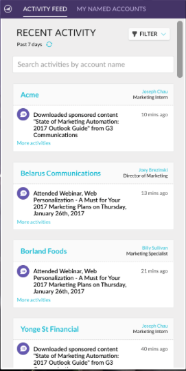

# 2017

## Inverno de 2017 {#winter}

Os seguintes recursos estão incluídos na versão Winter &#39;17. Verifique a edição do Marketo quanto à disponibilidade de recursos.

Clique nos links de título para exibir artigos detalhados para cada recurso.

>[!NOTE]
>
>Se um tópico tiver vários subtítulos, os links serão colocados lá.

## [Correspondência avançada para públicos personalizados do Facebook](/help/marketo/product-docs/demand-generation/ad-network-integrations/add-facebook-custom-audiences-as-a-launchpoint-service.md) {#advanced-matching-for-facebook-custom-audiences}

A Correspondência básica usa apenas endereços de email, mas a nova Correspondência avançada usa sete campos adicionais, aumentando a taxa de correspondência para mais conversão.

## [API de importação de objeto personalizado](https://developers.marketo.com/rest-api/lead-database/custom-objects/) {#custom-object-import-api}

Essa API fornece uma interface mais rápida para sincronizar objetos personalizados no Marketo. Você pode importar arquivos de planilha CSV, TSV ou SSV para o Marketo como objetos personalizados.

## [Exportação de Campanhas do Web Personalization](/help/marketo/product-docs/web-personalization/working-with-web-campaigns/export-web-campaign-data.md) {#web-personalization-campaigns-export}

Exporte todos os detalhes e análises do Web Campaign em um formato CSV. Em seguida, é possível visualizar os dados em um layout conveniente.

## Localização {#localization}

Os aplicativos Web Personalization, [!UICONTROL Conteúdo preditivo] e Insights de email agora estão disponíveis em japonês, alemão e espanhol. Você [seleciona seu idioma e localidade](/help/marketo/product-docs/administration/settings/change-time-zone.md) para exibir seu conteúdo nesses idiomas.

## Aprimoramentos de marketing com base em conta {#account-based-marketing-enhancements}

**[Importar contas nomeadas](/help/marketo/product-docs/target-account-management/target/named-accounts/import-named-accounts.md)**

Com a opção de importação [!UICONTROL Conta Nomeada], crie ou atualize vários registros de uma só vez por meio do carregamento CSV.

**[Suporte a insights de email](/help/marketo/product-docs/reporting/email-insights/filtering-in-email-insights.md)**

Use a [!UICONTROL Conta nomeada] ou a [!UICONTROL Lista de Contas] como dimensões no Email Insights.

## [!UICONTROL Aprimoramentos de conteúdo preditivo] {#predictive-content-enhancements}

**[Filtrar por [!UICONTROL Source Habilitada]](/help/marketo/product-docs/predictive-content/working-with-predictive-content/understanding-predictive-content.md)**

Filtre [!UICONTROL Conteúdo Preditivo] partes habilitadas para [!UICONTROL Email], [!UICONTROL Mídia Avançada] ou a [!UICONTROL Barra de Recomendações].

**[Filtrar [!UICONTROL Análises por Source]](/help/marketo/product-docs/predictive-content/working-with-predictive-content/understanding-predictive-content.md)**

Filtre [!UICONTROL Análises de conteúdo preditivo] para fontes específicas — [!UICONTROL Email], [!UICONTROL Mídia avançada] ou [!UICONTROL Barra de recomendações].

**[!UICONTROL Editor de Conteúdo Preditivo]**

Há uma experiência de edição e um layout aprimorados que dividem a preparação do conteúdo por origem — [!UICONTROL Email], [!UICONTROL Mídia Avançada] ou [!UICONTROL Barra de Recomendações].

**[Conteúdo de autodescoberta para previsão](/help/marketo/product-docs/predictive-content/getting-started/enable-content-discovery.md)**

O URL da imagem e os metadados agora são usados no processo de descoberta automática de conteúdo.

## [Aprimoramentos do SDK](https://developers.marketo.com/mobile/) {#sdk-enhancements}

Os desenvolvedores agora têm controle adicional sobre a entrega de notificações por push, com a adição de uma nova chamada de API do SDK que permite aos desenvolvedores remover tokens de push.

## Integração do Vibes SMS LaunchPoint

Melhore seu direcionamento com uma nova opção de filtro, &quot;Membro da lista de vibrações&quot;.

## [Descontinuação do Editor de Rich Text e do Editor de Formulário 1.0 herdados](https://nation.marketo.com/docs/DOC-4315) {#legacy-rich-text-editor-and-form-editor-deprecation}

A partir de 1º de agosto de 2017, os clientes que ainda usam o Editor de Rich Text e o Editor de formulário 1.0 herdados passarão automaticamente para a nova experiência.

## [APIs de atividades do Marketo](https://developers.marketo.com/blog/important-change-activity-records-marketo-apis/) {#marketo-activity-apis}

Uma mudança importante vai acontecer nas APIs de atividades do Marketo. Você está preparado?

## Segundo trimestre de 2017 {#spring}

Os seguintes recursos estão incluídos na versão da primavera de 17. Verifique a edição do Marketo quanto à disponibilidade de recursos.

Clique nos links de título para exibir artigos detalhados para cada recurso. **Observação**: se um tópico tiver vários subtítulos, os links serão colocados lá.

## [Forms da Geração Principal do LinkedIn](/help/marketo/product-docs/demand-generation/social/social-functions/set-up-linkedin-lead-gen-forms.md) {#linkedin-lead-gen-forms}

[[!UICONTROL LinkedIn Lead Gen] Forms](https://business.linkedin.com/marketing-solutions/native-advertising/lead-gen-ads) são uma maneira mais direta de uma empresa executar campanhas de geração de leads em [!DNL LinkedIn]. As pessoas podem preencher formulários para expressar interesse em um produto ou serviço, permitindo que a empresa capture os detalhes da pessoa e sincronize-os com o Marketo, onde podem ocorrer processos de acompanhamento automatizados e atividades de roteamento de clientes potenciais.

A integração do Marketo com o [!UICONTROL LinkedIn Lead Gen] Forms captura automaticamente as informações que um lead fornece no formulário Lead Gen. As ações e notificações de acompanhamento podem ser automatizadas usando o novo acionador e filtro **Preencher Formulário [!DNL LinkedIn Lead Gen]**.

## [Expirar modelo do MSI](/help/marketo/product-docs/marketo-sales-insight/msi-for-salesforce/features/actions-in-the-msi-panel/send-marketo-email/publish-an-email-to-sales-insight.md) {#expire-msi-template}

Foram-se os dias de limpeza de modelos desatualizados em [!DNL Sales Insight]. Defina uma data de expiração ao publicar seu email e cuidaremos do cancelamento da publicação para você quando a data de expiração for acumulada.

>[!NOTE]
>
>Definir a data de expiração para 31/5/17 significa que o modelo será removido de [!DNL Sales Insight] no final do dia 31/5/17.

## [APIs de Extração em Massa para Pessoas e Atividades](https://developers.marketo.com/rest-api/bulk-extract/) {#bulk-extract-apis-for-people-and-activities}

Transfira facilmente grandes quantidades de dados pessoais e de atividades do Marketo para seus sistemas externos.

## Aprimoramentos de ABM {#abm-enhancements}

**[Campos Personalizados em Contas com Nome ABM](https://docs.marketo.com/x/1wnG)**

O Marketo ABM agora permite criar até 10 campos personalizados em suas Contas nomeadas. Você pode mapear esses Campos personalizados para campos no seu objeto Conta do CRM e o Marketo ABM sincronizará os dados, permitindo estender suas Contas nomeadas ABM e ajudar a impulsionar seu marketing.

**[Pontuação de percentil em contas ABM nomeadas](https://docs.marketo.com/display/docs/assets/abmpercentiles.png)**

As pontuações de contas nomeadas podem variar muito. O Marketo ABM agora calcula automaticamente um percentil para cada uma de suas pontuações, para que você possa ver de perto onde cada conta nomeada está entre suas outras contas nomeadas.

**[APIs da Lista de Contas ABM](https://developers.marketo.com/rest-api/lead-database/named-account-lists/)**

Aproveite as vantagens das integrações avançadas e robustas de parceiros ABM com o suporte aprimorado à API para Listas de contas nomeadas.

## Aprimoramentos de personalização da web {#web-personalization-enhancements}

**[Campanha Da Web Na Rolagem](/help/marketo/product-docs/web-personalization/working-with-web-campaigns/set-how-your-web-campaign-displays.md)**

Os novos efeitos do Web Campaign fornecem aos visitantes da Web uma experiência mais personalizada. Defina as [!UICONTROL Campanhas da Web] personalizadas para serem exibidas somente quando um visitante da Web rolar para baixo em sua página da Web. Você pode definir que suas [!UICONTROL Campanhas da Web] de diálogo sejam exibidas ao rolar com base em:

* porcentagem da página rolada
* pixel atingido
* rolagem abaixo da dobra da página

**[Campanha da Web ao sair da intenção](/help/marketo/product-docs/web-personalization/working-with-web-campaigns/set-how-your-web-campaign-displays.md)**

Chame a atenção do visitante antes que ele feche a página. Defina as [!UICONTROL Campanhas da Web] personalizadas para serem exibidas somente quando um gesto do mouse indicar que o visitante está saindo da página.

**[Efeitos de Animação para [!UICONTROL Campanhas da Web]](/help/marketo/product-docs/web-personalization/working-with-web-campaigns/create-a-new-dialog-web-campaign.md)**

Defina os efeitos de animação para sua caixa de diálogo Campanha da Web para personalizar como uma campanha aparece ao entrar ou sair da página da Web. Você pode selecionar entre 6 efeitos diferentes e controlar o tempo e a direção do diálogo.

**[Personalização do botão de fechamento de diálogo](/help/marketo/product-docs/web-personalization/working-with-web-campaigns/create-a-new-dialog-web-campaign.md)**

Personalizar o botão Fechar para caixas de diálogo. Selecione de um intervalo de opções usadas no Estilo de Caixa de Diálogo Transparente [!UICONTROL Campanhas da Web]. Selecione o ícone, cor e posicionamento do Botão Fechar. Você também pode adicionar sua própria imagem de botão.

**[Arquivar campanhas da Web](/help/marketo/product-docs/web-personalization/working-with-web-campaigns/archive-a-web-campaign.md)**

O arquivamento é um novo status do Web Campaign que permite arquivar [!UICONTROL Campanhas da Web] e ocultá-las da exibição padrão do Web Campaign. Isso permite que você se concentre em suas campanhas ativas mais relevantes e recupere campanhas arquivadas mais antigas sob demanda.

**[Localização](/help/marketo/product-docs/administration/settings/change-time-zone.md)**

O Web Personalization agora é oferecido em todos os idiomas suportados pela Marketo (inglês, japonês, alemão, espanhol, francês e português).

## Melhorias preditivas {#predictive-enhancements}

**[Localização](/help/marketo/product-docs/administration/settings/change-time-zone.md)**

O conteúdo preditivo agora é oferecido em todos os idiomas suportados pela Marketo (inglês, japonês, alemão, espanhol, francês e português).

## [Descontinuação do Editor de Rich Text e do Editor de Formulário 1.0 herdados](https://nation.marketo.com/docs/DOC-4315) {#legacy-rich-text-editor-and-form-editor-deprecation}

A partir de 1º de agosto de 2017, os clientes que ainda usam o Editor de Rich Text e o Editor de formulário 1.0 herdados passarão automaticamente para a nova experiência.

## Verão de 2017 {#summer}

Os seguintes recursos estão incluídos na versão do verão de 1917. Verifique a edição do Marketo quanto à disponibilidade de recursos.

Clique nos links de título para exibir artigos detalhados para cada recurso. Observação: alguns dos recursos incluídos nesta versão não têm artigos associados. Se um tópico tiver vários subtítulos, os links serão colocados lá.

## [Estágios de Conversão Offline Adicionais do Facebook](/help/marketo/product-docs/demand-generation/facebook/set-up-facebook-offline-conversions.md) {#additional-facebook-offline-conversion-stages}

Escolha até 7 estágios de conversão offline adicionais para mapear para os estágios do ciclo de vida do Marketo (além dos 3 disponíveis atualmente). Otimize seu investimento em anúncios do [!DNL Facebook] com base em conversões na jornada do cliente para obter um ROI melhor.

## [Bloquear Modelo de Insight de Vendas](/help/marketo/product-docs/marketo-sales-insight/msi-for-salesforce/features/actions-in-the-msi-panel/send-marketo-email/lock-sales-template.md) {#lock-sales-insight-template}

Garanta a consistência da mensagem e do conteúdo, impedindo edições em seus modelos de vendas. Isso ajuda a padronizar modelos e manter comunicações profissionais.

## Aprimoramentos de ABM {#abm-enhancements}

**Fonte de dados para pesquisa de empresa japonesa**

Corresponder nomes de empresas japonesas no idioma local.

**[ABM e Integração de LeanData](https://docs.marketo.com/x/pKmt)**

A integração do [!DNL LeanData] agora permite a correspondência entre lead e conta no Marketo. Mantenha o marketing e as vendas alinhadas tendo os mesmos clientes potenciais associados às contas nos sistemas de vendas e marketing do registro. Opções mais flexíveis oferecem às operações de marketing e vendas mais controle sobre as regras de correspondência entre lead e conta, para que possam atingir o nível desejado de precisão.

## Aprimoramentos de personalização da web {#web-personalization-enhancements}

**[Aprimoramentos de visualização de campanha](/help/marketo/product-docs/web-personalization/working-with-web-campaigns/preview-and-test-a-web-campaign.md)**

Os profissionais de marketing agora podem garantir que suas campanhas da Web tenham uma ótima aparência em qualquer dispositivo *antes* de iniciá-las. Com esses aprimoramentos, veja como suas campanhas da Web serão renderizadas em desktops, dispositivos móveis e tablets. O novo plug-in para [!DNL Chrome] também oferece visualizações mais consistentes e precisas.

**[Aprimoramentos de campanha de widget](/help/marketo/product-docs/web-personalization/working-with-web-campaigns/create-a-new-widget-web-campaign.md)**

Novas opções para Campanhas de widget estão disponíveis, incluindo:

* Acionar campanhas (atraso, rolagem)
* Exibir campanhas (qualquer posição na tela)
* Alterar a seta de expansão/minimização para qualquer texto do CTA

## IA de conteúdo {#contentai}

**[Análises e Sugestões de ContentAI](/help/marketo/product-docs/predictive-content/predictive-content-analytics-overview.md)**

Aumente o retorno sobre o marketing de conteúdo com análises mais profundas e sugestões de conteúdo alimentadas por IA para aumentar o engajamento. Análises eficientes mostram o desempenho do conteúdo recomendado, incluindo visualizações populares, de tendências e baseadas em público-alvo. Você também verá sugestões de conteúdo adicional a ser incluído.

## Analytics {#analytics}

**[!UICONTROL Insights de email] Aprimoramentos**

Obtenha ainda mais da sua experiência de [!UICONTROL Email Insights] com novas maneiras de preparar e compartilhar dados. Agora você pode baixar os [!UICONTROL resultados de Insights de Email] em [!DNL Microsoft Excel] e [!DNL PowerPoint] para trabalhar com dados fora do Marketo.

## Suporte de contatado de identidade federada {#federated-identity-configuration-support}

Mantenha a autenticação (Ative Diretory) atrás do firewall localmente enquanto continua usando o [!DNL Microsoft Dynamics] CRM na nuvem.

## Outono de 2017 {#fall}

Os seguintes recursos estão incluídos na versão do último trimestre de 2017. Verifique a edição do Marketo quanto à disponibilidade de recursos.

Clique nos links de título para exibir artigos detalhados para cada recurso. Observação: alguns dos recursos incluídos nesta versão não têm artigos associados. Se um tópico tiver vários subtítulos, os links serão colocados lá.

## Confiabilidade do sistema {#system-reliability}

Melhoramos ainda mais a infraestrutura principal do Marketo, incluindo melhor sequenciamento, menos incompatibilidades e a estabilidade do [!DNL Munchkin].

## Carimbo de sincronização SFDC {#sfdc-sync-performance}

Aproveite a sincronização mais avançada e rápida entre o Marketo e o [!DNL Salesforce]. As alterações de dados que exigem atualizações em massa em contas ou leads podem ser divididas em filas paralelas para evitar backlogs. Agora, os eventos e as tarefas também são sincronizados até 50% mais rápido.

## Melhorias no desempenho de análises {#analytics-performance-improvements}

As melhorias recentes na infraestrutura oferecem maior tempo de atividade e estabilidade nas ferramentas de análise e relatórios do Marketo, permitindo criar relatórios ad hoc mais rapidamente.

## [Fuso horário do destinatário](/help/marketo/product-docs/email-marketing/email-programs/email-program-actions/scheduling-with-recipient-time-zone/understanding-recipient-time-zone.md) {#recipient-time-zone}

Com esse novo recurso, agora é possível reter e entregar emails de acordo com fusos horários locais. Os programas de email e de engajamento podem ser configurados para serem entregues nos fusos horários dos destinatários, eliminando a necessidade de criar vários programas. Envie uma vez e a Marketo manterá o email automaticamente até o horário local correto. Erga as métricas de email, observe as práticas locais e economize tempo usando um único programa globalmente.

>[!NOTE]
>
>Se você ainda não conseguir ativar o Fuso horário do destinatário em seus programas de email e engajamento, não entre em pânico! Estamos gradualmente habilitando esse recurso para todos os clientes.

## [Analisar Emails de Exemplo por Segmento](/help/marketo/product-docs/email-marketing/general/creating-an-email/send-a-sample-email.md) {#review-sample-emails-by-segment}

O Marketo tem uma nova opção para escolher um segmento ao enviar emails de amostra para revisão. Não é mais necessário determinar manualmente a qual segmento um lead pertence, facilitando o envio de emails com conteúdo dinâmico para segmentos diferentes.

## [Perguntas Personalizadas sobre a Geração de Clientes Potenciais do LinkedIn](/help/marketo/product-docs/demand-generation/social/social-functions/set-up-linkedin-lead-gen-forms.md) {#linkedin-lead-gen-custom-questions}

Personalize seus formulários do [!UICONTROL LinkedIn Lead Gen] para coletar atributos de lead personalizados. Agora é possível fazer até três perguntas personalizadas por formulário, escolher entre uma entrada de texto de linha única ou perguntas de múltipla escolha e mapear de volta aos campos de cliente potencial do Marketo.

## Integração do Slack {#slack-integration}

Lançamos dois recursos como parte de nossa nova integração com o Slack:

* Notificações do sistema: receba notificações do Slack sobre eventos importantes na sua instância do Marketo, como alertas sobre status atuais da campanha e qualquer problema que exija atenção imediata.
* Momentos interessantes: quando um Insight do Marketo é acionado por um indivíduo conhecido de uma conta de vendas, os proprietários principais podem ser notificados por meio do Slack. As notificações incluem informações de cliente potencial, bem como detalhes sobre a conta de vendas.

## Aprimoramentos de ABM {#abm-enhancements}

**[Mostrar Contas sem Contatos](https://docs.marketo.com/x/fKCt)**

O Marketo ABM agora sincroniza e exibe contas do CRM sem contatos. Inclua novas contas sem histórico de vendas ou marketing anterior e rastreie o progresso correspondendo clientes em potencial subsequentes às contas.

## Análises do ContentAI {#contentai-analytics}

**[Novo Filtro de Lista de Contas ABM](https://docs.marketo.com/x/1BPG)**

Visualize e compare o desempenho do conteúdo nas Listas de contas do ABM para otimizar o conteúdo existente. A IA de conteúdo mostra:

* principal conteúdo exibido
* principais conteúdos convertidos
* Conteúdo sugerido habilitado por IA para atividades de marketing

## Aprimoramentos de personalização da web {#web-personalization-enhancements}

**[Tokens para campanhas on-line](/help/marketo/product-docs/web-personalization/working-with-web-campaigns/using-the-web-personalization-rich-text-editor.md)**

Os tokens agora estão disponíveis para uso em campanhas da Web. Aproveite os tokens para fornecer mensagens e conteúdo personalizados para aumentar a participação em suas campanhas da Web.

**[Imagens do estúdio de desenvolvimento no editor de campanhas on-line](/help/marketo/product-docs/web-personalization/working-with-web-campaigns/using-the-web-personalization-rich-text-editor.md)**

Economize tempo reutilizando ativos criativos e imagens em vários canais no Marketo.

## Integração  {#integration}

**[API de Visualização de Email](https://experienceleague.adobe.com/en/docs/marketo-developer/marketo/email-scripting)**

Agora você pode visualizar remotamente emails fora do Marketo, simplificando o processo de localização de conteúdo de email e reduzindo erros.

**[Substituir API do HTML](https://experienceleague.adobe.com/en/docs/marketo-developer/marketo/email-scripting)**

Os desenvolvedores podem atualizar o conteúdo do HTML de ativos de email remotamente, permitindo que trabalhem em um único sistema para manter os ativos.

## Aprimoramentos da ABM de abril {#april-abm}

Os recursos a seguir estão incluídos na versão de aprimoramento da ABM de abril de 17. Verifique a edição do Marketo quanto à disponibilidade de recursos.

## Sincronização de campos padrão mapeados para CRM {#synching-of-crm-mapped-standard-fields}

O Marketo ABM está alterando o comportamento relacionado aos CRMs. Além disso, o Marketo ABM estabelece e mantém uma relação um para um entre as contas ABM e as contas no CRM. Isso permite que a Marketo mantenha os campos de conta mapeados sincronizados com o CRM.

## Campos Personalizados para Descoberta de CRM {#custom-fields-for-crm-discovery}

Agora você pode adicionar campos personalizados a contas, mapeá-los ao seu CRM e usá-los para Descoberta de Conta do CRM no Marketo.

## Filtros com base em conta na grade de contas nomeadas {#account-based-filters-in-the-named-account-grid}

Agora é possível filtrar facilmente suas contas nomeadas com base em uma Lista de contas.

## Aprimoramentos do ABM de agosto {#august-abm}

Os recursos a seguir estão incluídos na versão de aprimoramento da ABM de agosto de 2017. Verifique a edição do Marketo quanto à disponibilidade de recursos.

Clique nos links de título para exibir artigos detalhados para cada recurso.

## [!DNL Account Insight] {#account-insight}

O **[[!DNL Account Insight]](/help/marketo/product-docs/target-account-management/setup-tam/account-insight-plug-in-overview.md)** é um plug-in do [!DNL Google Chrome] que exibe ABM acionável e insights de conta para suas equipes de vendas, permitindo que elas trabalhem em conjunto com o marketing para envolver contas de maneira eficaz. As equipes de vendas terão visibilidade dos dados e insights gerados para cada uma das contas nomeadas que possuem. Isso incluirá percentis de pontuação da conta, uma lista priorizada de suas contas nomeadas, pessoas engajadas nessas contas e um fluxo de atividades online de atividades recentes da conta.

 

## [Listas de Contas Dinâmicas](/help/marketo/product-docs/target-account-management/target/account-lists.md) {#dynamic-account-lists}

Estamos adicionando uma nova maneira de criar listas de contas no ABM. Além das listas de contas existentes, agora é possível criar listas de contas dinâmicas geradas de Exibições de Contas públicas do CRM. Uma Exibição de conta do CRM é um conjunto de regras que atua como filtro ao exibir contas. Por exemplo, você pode usá-lo para encontrar contas em que o setor de saúde seja _e_ a receita seja superior a US$ 100 milhões.

